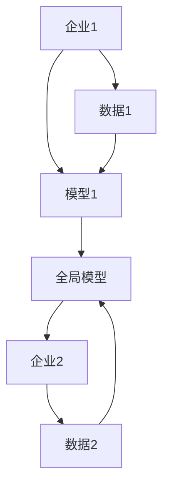
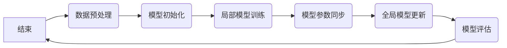
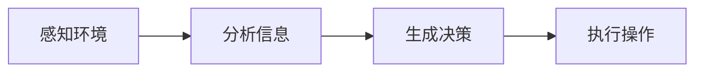
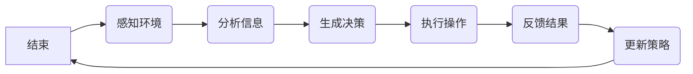
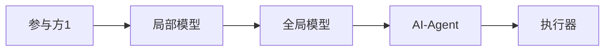
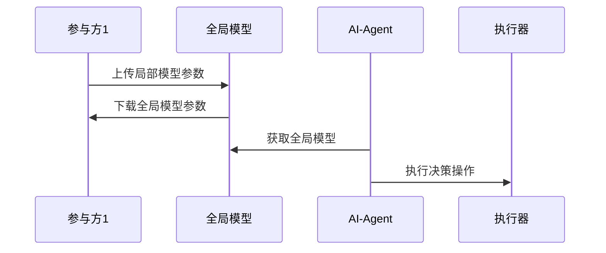

                 


# 企业AI Agent的联邦学习在跨企业数据协作中的实践

> **关键词**：企业AI Agent，联邦学习，跨企业数据协作，数据隐私保护，分布式计算

> **摘要**：本文将深入探讨企业AI Agent在联邦学习中的应用，特别是在跨企业数据协作中的实践。通过分析联邦学习的核心原理、AI Agent的智能化决策机制，以及两者的结合在数据协作中的优势，本文将详细阐述如何通过联邦学习实现跨企业数据的安全共享与高效利用。同时，本文还将结合实际案例，探讨联邦学习在系统设计、算法实现和项目实战中的具体应用，为读者提供全面的技术指导。

---

# 第一部分: 背景介绍

## 第1章: 企业AI Agent的联邦学习概述

### 1.1 联邦学习的基本概念
#### 1.1.1 联邦学习的定义
联邦学习（Federated Learning）是一种分布式机器学习技术，允许多个参与方在不共享原始数据的情况下，协作训练一个全局模型。其核心思想是通过数据局部建模和模型参数同步，实现数据可用性与隐私保护的平衡。

#### 1.1.2 联邦学习的核心特点
- **数据本地化**：数据无需离开原始设备或服务器，仅传输模型参数。
- **隐私保护**：通过加密通信和差分隐私技术，确保数据不被泄露。
- **分布式协作**：多个参与方协作训练，共同优化全局模型。

#### 1.1.3 联邦学习与传统机器学习的对比
| 特性                | 联邦学习                              | 传统机器学习                          |
|---------------------|--------------------------------------|---------------------------------------|
| 数据共享方式        | 分享模型参数，不分享原始数据          | 分享原始数据                            |
| 隐私保护            | 强化隐私保护                          | 隐私保护较弱                            |
| 应用场景            | 跨企业协作、边缘计算                  | 单一机构内部数据集                      |

### 1.2 AI Agent的定义与特点
#### 1.2.1 AI Agent的定义
AI Agent（人工智能代理）是一种能够感知环境、自主决策并执行任务的智能体。它能够通过传感器获取信息，利用算法进行分析，并通过执行器完成操作。

#### 1.2.2 AI Agent的核心属性
- **自主性**：能够在没有外部干预的情况下自主决策。
- **反应性**：能够实时感知环境变化并做出反应。
- **学习能力**：能够通过经验或数据不断优化自身的决策策略。

#### 1.2.3 AI Agent与传统算法的差异
| 特性                | AI Agent                            | 传统算法                              |
|---------------------|--------------------------------------|---------------------------------------|
| 决策方式            | 基于感知和学习                      | 基于预定义规则或经验                   |
| 环境适应能力        | 高                                  | 低                                    |
| 数据需求            | 高，需要实时反馈和环境数据          | 低，依赖训练数据                       |

### 1.3 跨企业数据协作的背景
#### 1.3.1 数据孤岛问题的现状
随着数据量的爆炸式增长，企业之间的数据孤岛现象日益严重，导致数据无法高效利用，限制了跨企业协作的可能性。

#### 1.3.2 跨企业数据协作的需求
企业希望通过共享数据和模型，提升数据分析能力，优化业务流程，同时保护数据隐私。

#### 1.3.3 联邦学习在跨企业协作中的作用
联邦学习通过数据本地化和模型协作，解决了跨企业数据协作中的隐私和数据孤岛问题，为AI Agent提供了高效的数据支持。

### 1.4 本章小结
本章介绍了联邦学习和AI Agent的基本概念，并分析了它们在跨企业数据协作中的重要作用。通过对比联邦学习与传统机器学习的差异，以及AI Agent与传统算法的差异，我们明确了联邦学习和AI Agent的核心特点及其在跨企业协作中的潜在价值。

---

# 第二部分: 核心概念与联系

## 第2章: 联邦学习与AI Agent的核心原理

### 2.1 联邦学习的原理
#### 2.1.1 联邦学习的数学模型
联邦学习的核心是通过多个参与方协作训练一个全局模型，同时保护数据隐私。其数学模型可以表示为：

$$ \text{损失函数} = \sum_{i=1}^{n} \text{损失函数}_i(\theta) $$

其中，$\theta$ 是模型参数，$n$ 是参与方的数量。

#### 2.1.2 联邦学习的通信机制
联邦学习通过加密通信技术（如同态加密）和差分隐私技术，确保模型参数的传输过程中的数据隐私。

#### 2.1.3 联邦学习的隐私保护机制
通过差分隐私技术，联邦学习可以在模型更新过程中添加噪声，确保单个参与方的数据无法被逆向推断。

### 2.2 AI Agent的原理
#### 2.2.1 AI Agent的感知与决策机制
AI Agent通过感知环境获取信息，利用算法进行分析，生成决策策略，并通过执行器执行任务。

#### 2.2.2 AI Agent的自主学习能力
AI Agent能够通过强化学习等方法，不断优化自身的决策策略，适应环境的变化。

#### 2.2.3 AI Agent的协作与通信机制
AI Agent之间可以通过联邦学习框架进行协作，共享模型参数，提升整体的决策能力。

### 2.3 联邦学习与AI Agent的关系
#### 2.3.1 联邦学习为AI Agent提供数据支持
通过联邦学习，AI Agent可以在不共享原始数据的情况下，获取全局模型的参数，提升决策能力。

#### 2.3.2 AI Agent为联邦学习提供智能化决策
AI Agent可以根据环境反馈，动态调整联邦学习的参数，优化模型训练过程。

#### 2.3.3 两者的结合在跨企业协作中的应用
联邦学习与AI Agent的结合，可以在跨企业数据协作中实现高效的数据共享与智能决策。

## 第3章: 核心概念对比与系统架构

### 3.1 联邦学习与AI Agent的核心属性对比
| 特性                | 联邦学习                              | AI Agent                              |
|---------------------|--------------------------------------|---------------------------------------|
| 核心目标            | 协作训练全局模型                      | 实现智能决策                           |
| 数据需求            | 需要多参与方的数据                   | 需要环境数据和反馈                     |
| 技术特点            | 分布式计算、隐私保护                 | 自主性、反应性、学习能力               |

### 3.2 系统架构设计
#### 3.2.1 实体关系图（ER图）


#### 3.2.2 系统架构图（Mermaid）


---

# 第三部分: 算法原理讲解

## 第4章: 联邦学习的算法原理

### 4.1 联邦学习的算法流程


#### 4.1.2 联邦学习的数学模型
$$ L(\theta) = \frac{1}{n} \sum_{i=1}^{n} L_i(\theta) $$

其中，$L_i(\theta)$ 是第$i$个参与方的损失函数，$\theta$ 是模型参数，$n$ 是参与方的数量。

#### 4.1.3 联邦学习的代码实现
```python
import numpy as np
from sklearn.linear_model import SGDClassifier

# 初始化模型参数
theta = np.random.randn(2, 1)

# 模型训练
for _ in range(epochs):
    # 部分参与方进行局部训练
    for i in range(n_parties):
        # 获取参与方$i$的数据
        X_i, y_i = get_data(i)
        # 更新模型参数
        model = SGDClassifier().fit(X_i, y_i)
        theta = theta + (model.coef_ - theta) / n_parties

# 模型评估
X_test, y_test = get_test_data()
accuracy = model.score(X_test, y_test)
print(f"模型准确率：{accuracy}")
```

### 4.2 AI Agent的算法原理
#### 4.2.1 AI Agent的感知与决策流程


#### 4.2.2 AI Agent的数学模型
$$ Q(s, a) = r + \gamma \max_{a'} Q(s', a') $$

其中，$Q(s, a)$ 是状态-动作对的价值，$r$ 是奖励，$\gamma$ 是折扣因子，$s'$ 是下一个状态。

---

## 第5章: AI Agent的算法原理

### 5.1 AI Agent的算法流程


#### 5.1.2 AI Agent的代码实现
```python
class AI-Agent:
    def __init__(self, environment):
        self.environment = environment
        self.model = self._initialize_model()
    
    def _initialize_model(self):
        # 初始化模型
        return SGDClassifier()
    
    def perceive(self):
        # 感知环境
        return self.environment.get_state()
    
    def decide(self, state):
        # 分析信息并生成决策
        return self.model.predict(state)
    
    def act(self, action):
        # 执行操作
        self.environment.execute_action(action)
```

### 5.2 联邦学习与AI Agent的结合
通过联邦学习框架，AI Agent可以在不共享原始数据的情况下，协作训练全局模型，提升决策能力。

---

# 第四部分: 系统分析与架构设计

## 第6章: 系统分析与架构设计

### 6.1 问题场景介绍
本章将介绍一个跨企业数据协作的场景，例如多个企业通过联邦学习协作训练一个预测模型。

### 6.2 系统功能设计
#### 6.2.1 领域模型（Mermaid类图）
```mermaid
classDiagram
    class Party:
        data: 数据
        model: 模型
        theta: 参数

    class GlobalModel:
        theta: 参数
        accuracy: 准确率

    class AI-Agent:
        perceive: 感知
        decide: 决策
        act: 执行

    Party --> GlobalModel: 上传参数
    GlobalModel --> AI-Agent: 提供模型
```

### 6.3 系统架构设计
#### 6.3.1 系统架构图（Mermaid）


### 6.4 系统接口设计
#### 6.4.1 系统接口设计
- 数据接口：获取参与方数据，上传模型参数。
- 模型接口：训练模型，更新全局模型。
- 通信接口：通过加密通信技术实现模型参数同步。

#### 6.4.2 系统交互序列图（Mermaid）


---

# 第五部分: 项目实战

## 第7章: 项目实战

### 7.1 环境安装
#### 7.1.1 安装必要的库
```bash
pip install numpy scikit-learn
```

### 7.2 核心代码实现
#### 7.2.1 联邦学习的代码实现
```python
import numpy as np
from sklearn.linear_model import SGDClassifier

def train_local_model(X, y):
    model = SGDClassifier()
    model.fit(X, y)
    return model.coef_

def aggregate_models(models, n_parties):
    return np.mean(models, axis=0)

# 示例数据
X = np.random.randn(100, 2)
y = np.random.randint(0, 2, 100)

# 多个参与方的数据
n_parties = 2
X_parties = [X[:50], X[50:]]
y_parties = [y[:50], y[50:]]

# 训练局部模型
models = [train_local_model(X_parties[i], y_parties[i]) for i in range(n_parties)]

# 聚合模型
global_model = aggregate_models(models, n_parties)

print("全局模型参数：", global_model)
```

#### 7.2.2 AI Agent的代码实现
```python
class AI-Agent:
    def __init__(self, environment):
        self.environment = environment
        self.model = self._initialize_model()
    
    def _initialize_model(self):
        return SGDClassifier()
    
    def perceive(self):
        return self.environment.get_state()
    
    def decide(self, state):
        return self.model.predict(state)
    
    def act(self, action):
        self.environment.execute_action(action)
```

### 7.3 代码解读与分析
#### 7.3.1 联邦学习代码解读
- `train_local_model`：训练局部模型，返回模型参数。
- `aggregate_models`：聚合多个参与方的模型参数，得到全局模型参数。

#### 7.3.2 AI Agent代码解读
- `AI-Agent`类：初始化环境和模型，感知环境，生成决策，执行操作。

### 7.4 实际案例分析
#### 7.4.1 实际案例
假设我们有两家银行，希望通过联邦学习协作训练一个客户违约预测模型，同时保护各自的客户数据隐私。

#### 7.4.2 详细讲解
- 两家银行分别拥有自己的客户数据，通过联邦学习框架协作训练全局模型。
- 每家银行在本地训练模型，上传模型参数到全局模型中。
- 全局模型通过聚合多个参与方的模型参数，得到一个全局预测模型。
- AI Agent利用全局模型进行客户风险评估，动态调整决策策略。

### 7.5 项目小结
本章通过实际案例，详细讲解了联邦学习和AI Agent的代码实现，并分析了它们在跨企业数据协作中的具体应用。

---

# 第六部分: 总结与展望

## 第8章: 总结与展望

### 8.1 本章小结
本文深入探讨了企业AI Agent的联邦学习在跨企业数据协作中的实践，分析了联邦学习的核心原理、AI Agent的智能化决策机制，以及两者的结合在数据协作中的优势。

### 8.2 最佳实践 tips
- 在实际应用中，建议采用差分隐私技术保护数据隐私。
- 确保参与方之间的通信安全，防止模型参数泄露。
- 定期评估模型性能，优化模型参数。

### 8.3 注意事项
- 数据隐私保护是联邦学习的核心，必须严格遵守相关法律法规。
- AI Agent的决策机制需要结合具体场景进行优化，避免过度依赖模型。

### 8.4 拓展阅读
- 《Federated Learning: Challenges, Mathematics, and Future Directions》
- 《Artificial Intelligence: A Modern Approach》

---

# 结语

企业AI Agent的联邦学习在跨企业数据协作中的实践，不仅为数据共享提供了新的思路，也为AI技术在实际应用中的发展提供了重要参考。未来，随着技术的不断进步，联邦学习和AI Agent将在更多领域发挥重要作用。

