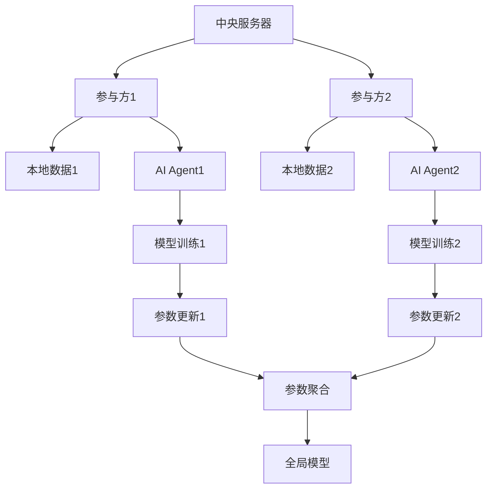

                 


# 《企业AI Agent的联邦学习在跨部门数据协作中的实践》

> 关键词：企业AI Agent，联邦学习，跨部门数据协作，数据隐私，AI协作

> 摘要：本文深入探讨了企业AI Agent在联邦学习中的应用，分析了跨部门数据协作的核心挑战，并提出了基于联邦学习的AI Agent解决方案。通过详细讲解联邦学习的算法原理、系统架构设计以及实际项目案例，本文为读者提供了从理论到实践的全面指导，展示了如何通过AI Agent实现高效、安全的跨部门数据协作。

---

## 第一章: 企业AI Agent与联邦学习的背景

### 1.1 什么是联邦学习
联邦学习（Federated Learning）是一种分布式机器学习技术，允许多个参与方在不共享原始数据的情况下，通过交换模型参数来共同训练一个全局模型。其核心思想是“数据不动，模型动”，有效解决了数据隐私和安全问题。

### 1.2 AI Agent的定义
AI Agent（人工智能代理）是指能够感知环境、自主决策并执行任务的智能实体。它可以是一个软件程序，也可以是一个物理设备，具备以下特点：
- **自主性**：能够自主决策，无需人工干预。
- **反应性**：能够实时感知环境并做出反应。
- **社会性**：能够与其他系统或人类进行交互协作。

### 1.3 跨部门数据协作的挑战
在企业中，跨部门协作常常面临以下挑战：
- **数据孤岛**：各部门数据分散，难以统一利用。
- **数据隐私**：数据敏感，不能随意共享。
- **协作效率**：传统协作方式效率低下，难以快速响应。

### 1.4 联邦学习在跨部门协作中的作用
联邦学习通过以下方式解决了跨部门协作的挑战：
- **数据隐私保护**：通过局部模型训练和参数交换，避免了原始数据的共享。
- **高效协作**：通过AI Agent实现模型同步和参数共享，提升了协作效率。

---

## 第二章: 联邦学习的核心概念与原理

### 2.1 联邦学习的原理
联邦学习的核心流程包括以下步骤：
1. **初始化**：各个参与方本地初始化模型参数。
2. **局部训练**：各参与方在本地数据上训练模型，更新本地参数。
3. **参数聚合**：通过通信机制将各参与方的模型参数聚合，生成全局模型。
4. **模型分发**：将全局模型分发给各参与方，更新本地模型。

### 2.2 AI Agent的原理
AI Agent通过以下机制实现跨部门协作：
1. **感知环境**：AI Agent能够感知外部环境的状态，例如数据更新情况。
2. **决策与行动**：基于感知到的信息，AI Agent做出决策并执行相应的操作，例如触发模型训练或参数同步。
3. **协作与通信**：AI Agent与其他系统或AI Agent进行通信，交换必要的信息和模型参数。

### 2.3 联邦学习与AI Agent的结合
AI Agent在联邦学习中的作用可以分为以下几个方面：
1. **数据管理**：AI Agent负责本地数据的管理，确保数据的安全性和隐私性。
2. **模型训练**：AI Agent负责本地模型的训练，并将训练结果发送到中央服务器。
3. **参数聚合**：AI Agent参与参数聚合过程，确保全局模型的准确性和一致性。

---

## 第三章: 联邦学习的算法原理

### 3.1 联邦学习的算法概述
联邦学习的典型算法包括：
- **联邦平均（FedAvg）**：通过加权平均的方式聚合各参与方的模型参数。
- **联邦聚合（FedProx）**：在FedAvg的基础上，引入正则化项，防止参数更新过大。

### 3.2 AI Agent的算法实现
AI Agent的算法实现主要体现在以下几个方面：
1. **感知算法**：通过传感器或API感知外部环境的状态。
2. **决策算法**：基于感知到的信息，使用强化学习或监督学习算法做出决策。
3. **协作算法**：通过通信协议与其它系统或AI Agent进行协作，例如交换模型参数。

### 3.3 联邦学习算法的数学模型
以下是联邦学习中常用的数学模型：

#### 联邦平均（FedAvg）算法
全局模型参数的更新公式为：
$$ \theta_{\text{server}} \leftarrow \frac{1}{K} \sum_{k=1}^{K} \theta_{\text{client}}^{(k)} $$
其中，$K$ 是参与方的数量，$\theta_{\text{client}}^{(k)}$ 是第 $k$ 个参与方的模型参数。

#### 联邦聚合（FedProx）算法
在FedAvg的基础上，引入正则化项：
$$ \theta_{\text{server}} \leftarrow \arg \min_{\theta} \sum_{k=1}^{K} \left( L_k(\theta) + \lambda \|\theta - \theta_{\text{prev}}\|^2 \right) $$
其中，$\lambda$ 是正则化系数，$\theta_{\text{prev}}$ 是前一轮的模型参数。

---

## 第四章: 系统分析与架构设计

### 4.1 问题场景分析
在企业中，跨部门协作常常面临以下问题：
- 数据分散在不同的部门，无法统一利用。
- 数据隐私和安全问题，导致数据共享困难。
- 缺乏高效的协作机制，导致协作效率低下。

### 4.2 系统功能设计
为了实现基于联邦学习的跨部门协作，系统需要具备以下功能：
1. **数据管理模块**：负责数据的采集、存储和管理。
2. **模型训练模块**：负责本地模型的训练和参数更新。
3. **参数聚合模块**：负责全局模型的参数聚合和分发。
4. **AI Agent模块**：负责感知环境、决策和协作。

### 4.3 系统架构设计
以下是系统架构的Mermaid图：



### 4.4 接口设计与交互流程
系统的接口设计包括：
1. **数据接口**：用于数据的读取和写入。
2. **模型接口**：用于模型的训练和参数更新。
3. **通信接口**：用于与其它系统或AI Agent进行通信。

---

## 第五章: 项目实战

### 5.1 环境安装
以下是项目所需的环境配置：
- **操作系统**：Linux/Windows/MacOS
- **编程语言**：Python 3.6+
- **深度学习框架**：TensorFlow/PyTorch
- **其他依赖**：Flask（用于Web服务）、gRPC（用于通信）

### 5.2 核心实现
以下是AI Agent的核心实现代码：

```python
class AI_Agent:
    def __init__(self, data_source, model):
        self.data_source = data_source
        self.model = model
        self.client_id = None

    def感知环境(self):
        # 获取环境数据
        data = self.data_source.get_data()
        return data

    def 决策(self, data):
        # 使用模型进行决策
        prediction = self.model.predict(data)
        return prediction

    def 行动(self, prediction):
        # 根据预测结果执行操作
        action = self.decide_action(prediction)
        return action

    def 协作(self, other_agents):
        # 与其它AI Agent协作
        for agent in other_agents:
            self.exchange_info(agent)

    def exchange_info(self, agent):
        # 交换信息
        self.send_info(agent)
        self.receive_info(agent)
```

### 5.3 代码解读与分析
上述代码展示了AI Agent的基本功能：
1. **感知环境**：AI Agent通过数据源获取环境数据。
2. **决策**：使用模型对数据进行预测。
3. **行动**：根据预测结果执行相应的操作。
4. **协作**：与其他AI Agent交换信息，实现数据共享和模型参数同步。

### 5.4 实际案例分析
假设我们有一个跨部门的数据协作项目，各部门需要共同训练一个客户画像模型。通过AI Agent和联邦学习，各部门可以在不共享原始数据的情况下，共同训练出一个全局模型。

---

## 第六章: 总结与展望

### 6.1 最佳实践
1. **数据隐私保护**：在实际应用中，需要严格遵守数据隐私法规，确保数据的安全性。
2. **模型优化**：通过优化联邦学习算法，提升模型的准确性和训练效率。
3. **协作机制**：设计高效的协作机制，确保各参与方能够快速响应和协作。

### 6.2 小结
本文详细介绍了企业AI Agent在联邦学习中的应用，分析了跨部门数据协作的核心挑战，并提出了基于联邦学习的AI Agent解决方案。通过实际案例和代码示例，展示了如何在实际项目中应用这些技术。

### 6.3 注意事项
1. **数据隐私**：在实际应用中，需要特别注意数据隐私和安全问题。
2. **模型收敛性**：需要通过实验验证模型的收敛性和稳定性。
3. **系统性能**：需要优化系统性能，确保协作效率。

### 6.4 拓展阅读
1. **《联邦学习：隐私保护下的分布式机器学习》**：深入讲解联邦学习的原理和应用。
2. **《AI Agent：智能系统的构建与实践》**：详细介绍AI Agent的设计与实现。

---

通过本文的深入分析和实践，读者可以全面理解企业AI Agent在联邦学习中的应用，掌握跨部门数据协作的核心技术，并能够在实际项目中应用这些知识。

