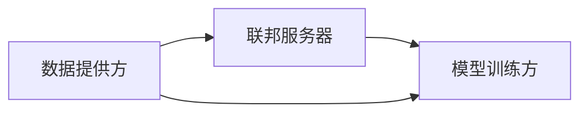
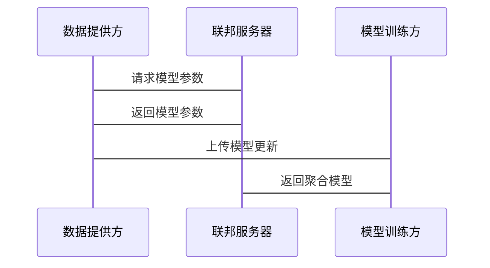

                 


# 企业AI Agent的联邦学习在跨部门数据协作中的实践与挑战

> 关键词：联邦学习、AI Agent、跨部门协作、数据隐私、企业应用

> 摘要：随着企业数字化转型的深入，跨部门数据协作的重要性日益凸显。然而，传统的数据共享方式常常面临数据隐私泄露、数据孤岛等挑战。联邦学习作为一种新兴的分布式学习技术，能够在不共享原始数据的前提下，实现跨部门的数据协作。本文将探讨企业AI Agent如何利用联邦学习技术，在跨部门数据协作中实现高效的数据共享与模型训练，并分析在实践中可能遇到的挑战及解决方案。

---

# 第一部分: 企业AI Agent的联邦学习背景与概念

## 第1章: 联邦学习与AI Agent概述

### 1.1 联邦学习的定义与特点
- **联邦学习的定义**：联邦学习（Federated Learning）是一种分布式机器学习技术，允许多个参与方在不共享原始数据的情况下，协作训练共享的模型。
- **联邦学习的核心特点**：
  - 数据本地化：数据不出本地，仅传输模型更新。
  - 联合优化：通过模型聚合实现全局优化。
  - 隐私保护：确保数据隐私不被泄露。
- **联邦学习与传统数据共享的区别**：
  | 对比维度 | 联邦学习 | 传统数据共享 |
  |----------|----------|---------------|
  | 数据传输 | 只传输模型更新 | 传输原始数据 |
  | 数据隐私 | 高 | 低 |
  | 跨部門協作 | 支持 | 依赖数据共享协议 |

### 1.2 AI Agent的基本概念
- **AI Agent的定义**：AI Agent是一种能够感知环境、自主决策并执行任务的智能体。
- **AI Agent的核心功能**：
  - 数据采集与处理：从多源数据中提取有用信息。
  - 模型训练与优化：基于联邦学习技术训练模型。
  - 任务执行与反馈：根据模型结果执行任务并提供反馈。
- **AI Agent与传统AI的区别**：
  - **AI Agent**：具备自主性和交互性，能够独立完成任务。
  - **传统AI**：依赖人工干预，不具备自主决策能力。

### 1.3 联邦学习在企业中的应用背景
- **企业数据协作的现状与问题**：
  - 数据孤岛：各部门数据分散，难以整合。
  - 数据隐私：共享数据存在泄露风险。
  - 数据安全：传统数据共享方式易被攻击。
- **联邦学习在企业数据协作中的优势**：
  - 数据不出域：确保数据隐私。
  - 联合建模：提升模型泛化能力。
  - 实时协作：支持动态数据更新。
- **联邦学习与企业AI Agent的结合**：
  - AI Agent作为联邦学习的执行者，能够协调各部门的数据协作。
  - 联邦学习为AI Agent提供高效的跨部门协作能力。

### 1.4 本章小结
本章介绍了联邦学习和AI Agent的基本概念，探讨了联邦学习在企业数据协作中的优势，并分析了两者结合的必要性。

---

# 第二部分: 联邦学习与AI Agent的核心概念与联系

## 第2章: 联邦学习的核心原理

### 2.1 联邦学习的原理
- **联邦学习的基本原理**：
  - 数据提供方（Data Provider）本地训练模型，仅上传梯度或模型更新。
  - 联邦服务器（Federated Server）负责聚合各数据提供方的模型更新，形成全局模型。
- **联邦学习的数学模型**：
  - **损失函数**：$L_i(w) = \frac{1}{n_i}\sum_{j=1}^{n_i} \ell(w, x_j, y_j)$
  - **全局优化目标**：$\min_w \sum_{i=1}^N L_i(w)$
  - **模型聚合**：$w_{t+1} = \frac{1}{N} \sum_{i=1}^N w_i^{(t)}$
- **联邦学习的算法流程**：
  ```mermaid
  graph TD
      A[数据提供方] --> B[联邦服务器]
      B --> C[模型训练方]
      A --> C
  ```

### 2.2 联邦学习的分类
- **横向联邦学习**：数据按横向分布（如不同用户的同一特征），适用于相同特征但不同数据集的情况。
- **纵向联邦学习**：数据按纵向分布（如同一用户的多个特征），适用于不同数据集的不同特征。
- **混合联邦学习**：结合横向和纵向联邦学习的特性。

### 2.3 联邦学习的优缺点
- **优点**：
  - 数据隐私保护。
  - 支持跨部门协作。
  - 增强模型泛化能力。
- **缺点**：
  - 网络延迟：数据提供方和联邦服务器之间的通信可能带来延迟。
  - 模型收敛速度：联邦学习的模型收敛速度可能慢于集中式学习。
  - 安全性：需要防范恶意数据提供方的攻击。

### 2.4 联邦学习的实体关系图


### 2.5 本章小结
本章详细讲解了联邦学习的核心原理、分类及其优缺点，并通过实体关系图展示了联邦学习的基本架构。

---

## 第3章: AI Agent的结构与功能

### 3.1 AI Agent的结构
- **感知层**：负责数据的采集与初步处理。
- **决策层**：基于联邦学习技术进行模型训练与优化。
- **执行层**：根据模型结果执行具体任务并提供反馈。

### 3.2 AI Agent的功能
- **数据采集与处理**：从多源数据中提取有用信息。
- **模型训练与优化**：利用联邦学习技术训练共享模型。
- **任务执行与反馈**：根据模型结果执行任务并提供反馈。

### 3.3 AI Agent与联邦学习的结合
- **AI Agent在联邦学习中的角色**：
  - 作为数据提供方，参与模型训练。
  - 作为模型训练方，协调各部门数据协作。
- **联邦学习对AI Agent能力的提升**：
  - 提升跨部门协作能力。
  - 增强数据隐私保护。
- **AI Agent在跨部门协作中的应用**：
  - 协调各部门数据共享。
  - 实现跨部门模型联合优化。

### 3.4 本章小结
本章分析了AI Agent的结构与功能，并探讨了其与联邦学习的结合方式，强调了联邦学习对AI Agent能力的提升。

---

# 第三部分: 联邦学习与AI Agent的算法原理

## 第4章: 联邦学习的算法原理

### 4.1 联邦学习的算法流程
- **数据预处理**：对数据进行清洗、归一化等处理。
- **模型初始化**：初始化全局模型参数。
- **联邦训练过程**：
  ```mermaid
  graph TD
      A[数据提供方] --> B[联邦服务器]
      B --> C[模型训练方]
      A --> C
  ```
- **模型聚合**：将各数据提供方的模型更新聚合，形成全局模型。

### 4.2 联邦学习的数学模型
- **模型参数更新公式**：
  $$w_{t+1} = w_t + \eta \cdot \sum_{i=1}^{n} \Delta w_i$$
- **模型聚合公式**：
  $$\theta = \frac{1}{N} \sum_{i=1}^N \theta_i$$

### 4.3 联邦学习的实现步骤
1. 初始化全局模型参数。
2. 各数据提供方下载当前全局模型参数。
3. 各数据提供方在本地数据上训练模型，生成梯度或模型更新。
4. 将模型更新上传至联邦服务器。
5. 联邦服务器聚合各数据提供方的模型更新，更新全局模型。

### 4.4 本章小结
本章详细讲解了联邦学习的算法原理及实现流程，强调了模型聚合的重要性。

---

## 第5章: AI Agent的算法实现

### 5.1 AI Agent的算法实现
- **感知层实现**：
  ```python
  def感知层处理(data):
      # 数据清洗
      cleaned_data = data.dropna()
      # 数据归一化
      normalized_data = (cleaned_data - cleaned_data.mean()) / cleaned_data.std()
      return normalized_data
  ```
- **决策层实现**：
  ```python
  def联邦学习训练(normalized_data):
      # 初始化模型
      model = Model()
      # 模型训练
      model.train(normalized_data)
      # 返回模型更新
      return model.updates
  ```
- **执行层实现**：
  ```python
  def任务执行(updates):
      # 更新全局模型
      global_model.update(updates)
      # 执行任务
      result = global_model.predict(task)
      return result
  ```

### 5.2 联邦学习的代码实现
- **数据预处理**：
  ```python
  import pandas as pd
  data = pd.read_csv('data.csv')
  cleaned_data = data.dropna()
  ```
- **模型训练**：
  ```python
  class Model:
      def __init__(self):
          self.weights = initial_weights
      def train(self, data):
          # 在本地数据上训练模型
          self.weights = self.weights + learning_rate * gradient(data)
          return self.weights
  ```

### 5.3 本章小结
本章通过代码示例详细讲解了AI Agent的算法实现，展示了如何在联邦学习框架下实现跨部门数据协作。

---

# 第四部分: 联邦学习与AI Agent的系统架构设计

## 第6章: 系统分析与架构设计

### 6.1 系统功能设计
- **数据采集与处理**：从各部门数据源中采集数据并进行预处理。
- **模型训练与优化**：基于联邦学习技术训练共享模型。
- **任务执行与反馈**：根据模型结果执行任务并提供反馈。

### 6.2 系统架构设计


### 6.3 系统接口设计
- **数据接口**：
  - 数据获取接口：`GET /data`
  - 数据上传接口：`POST /update`
- **模型接口**：
  - 模型训练接口：`POST /train`
  - 模型聚合接口：`POST /aggregate`

### 6.4 系统交互流程


### 6.5 本章小结
本章通过系统架构设计展示了联邦学习与AI Agent结合的具体实现，强调了系统接口设计的重要性。

---

## 第7章: 项目实战与挑战

### 7.1 环境安装
- **安装Python环境**：`python --version`
- **安装依赖库**：`pip install numpy pandas scikit-learn`

### 7.2 系统核心实现
- **数据预处理**：
  ```python
  import pandas as pd
  data = pd.read_csv('data.csv')
  cleaned_data = data.dropna()
  ```
- **模型训练**：
  ```python
  class Model:
      def __init__(self):
          self.weights = initial_weights
      def train(self, data):
          # 在本地数据上训练模型
          self.weights = self.weights + learning_rate * gradient(data)
          return self.weights
  ```

### 7.3 案例分析
- **案例背景**：某企业需要在跨部门数据协作中应用联邦学习技术。
- **案例实现**：
  ```python
  # 初始化全局模型
  global_model = Model()
  # 联邦训练
  for _ in range(epochs):
      for data_provider in data_providers:
          updates = data_provider.train(global_model.weights)
          global_model.update(updates)
  ```

### 7.4 项目总结
- **项目成果**：实现了跨部门数据协作，提升了模型泛化能力。
- **项目经验**：强调了数据隐私保护的重要性，以及系统设计的合理性。

### 7.5 本章小结
本章通过项目实战展示了联邦学习与AI Agent结合的具体实现，总结了项目经验与挑战。

---

# 第五部分: 最佳实践与未来展望

## 第8章: 最佳实践与未来展望

### 8.1 最佳实践
- **数据隐私保护**：采用同态加密或差分隐私技术。
- **系统性能优化**：优化通信协议，减少网络延迟。
- **模型可解释性**：提升模型的可解释性，便于调试与优化。

### 8.2 小结
联邦学习与AI Agent的结合为企业跨部门数据协作提供了新的可能性，但仍需在数据隐私保护、系统性能优化等方面进行深入研究。

### 8.3 注意事项
- 数据隐私保护是关键，需严格遵守相关法律法规。
- 系统设计需充分考虑可扩展性与可维护性。
- 模型训练需注重收敛速度与模型精度的平衡。

### 8.4 拓展阅读
- 推荐书籍：《Federated Learning: Challenges, Mathematics, and Perspectives》
- 推荐论文：《Communication-Efficient Learning of Deep Networks from Distributed Datasets》

### 8.5 本章小结
本章总结了联邦学习与AI Agent结合的最佳实践，并展望了未来的研究方向。

---

# 总结

通过本文的详细讲解，我们了解了联邦学习与AI Agent结合在跨部门数据协作中的实践与挑战。联邦学习作为一种分布式学习技术，能够在不共享原始数据的前提下，实现跨部门的数据协作，为企业AI Agent提供了高效的数据共享与模型训练能力。然而，联邦学习的实现也面临诸多挑战，如数据隐私保护、系统性能优化等，需要在未来的实践中进一步研究与探索。

---

**感谢您的阅读！**

