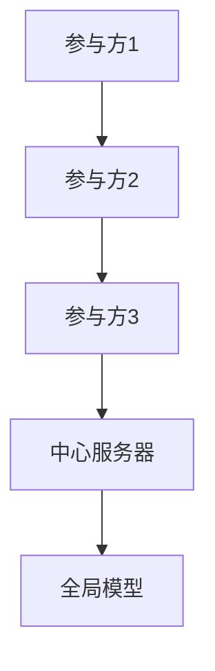
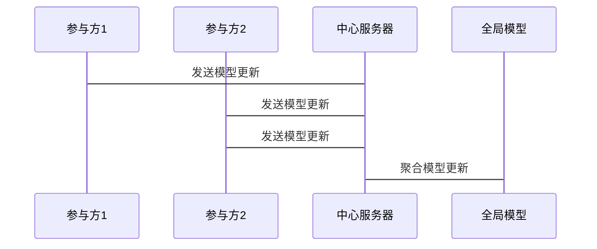

                 


# 企业AI Agent的联邦学习安全协议设计

> **关键词**: 联邦学习, AI Agent, 数据隐私, 安全协议, 分布式系统, 加密算法

> **摘要**:  
本文深入探讨了企业AI Agent在联邦学习环境下的安全协议设计。文章首先介绍了联邦学习和AI Agent的基本概念及其在企业中的应用背景，接着分析了联邦学习与AI Agent的核心概念与联系，详细阐述了联邦学习的安全协议设计原理，包括数据隐私保护、通信协议和多方协作协议。随后，文章从算法原理的角度，使用数学模型和流程图，详细讲解了联邦学习的安全协议实现。最后，通过实际案例分析和系统架构设计，提出了企业AI Agent在联邦学习环境下的安全协议实现方案，并总结了最佳实践和未来研究方向。

---

# 第一部分: 背景介绍

## 第1章: 联邦学习与AI Agent的背景介绍

### 1.1 联邦学习的基本概念

#### 1.1.1 联邦学习的定义
联邦学习（Federated Learning）是一种分布式机器学习技术，允许多个参与方在不共享原始数据的情况下，协作训练一个共同的模型。数据保留在各自的端点（如用户设备或服务器），仅通过加密通信交换模型参数或中间结果。

#### 1.1.2 联邦学习的核心特点
- **数据隐私性**: 数据不离开原始存储位置，仅传输模型更新。
- **去中心化**: 不依赖于单一数据集中化存储，支持分布式计算。
- **协作性**: 各方协作训练模型，同时保护各自的隐私数据。

#### 1.1.3 联邦学习与传统数据共享的区别
- **数据共享**: 需要将原始数据集中到一个地方进行训练，数据所有者失去对数据的控制。
- **联邦学习**: 数据不移动，仅传输模型更新，数据所有者保持对数据的控制。

### 1.2 AI Agent的定义与特点

#### 1.2.1 AI Agent的定义
AI Agent（人工智能代理）是指能够感知环境、自主决策并执行任务的智能实体。它可以是一个软件程序或物理设备，具备自主性、反应性、目标导向性和社交能力。

#### 1.2.2 AI Agent的核心功能
- **感知环境**: 通过传感器或数据接口获取环境信息。
- **自主决策**: 基于感知信息和预设目标，做出决策。
- **执行任务**: 执行决策后的操作，可能是物理操作或数据处理。

#### 1.2.3 AI Agent与传统AI的区别
- **自主性**: AI Agent具备自主决策能力，而传统AI通常需要人工干预。
- **实时性**: AI Agent能够实时响应环境变化，传统AI可能不具备实时性。
- **目标导向**: AI Agent以目标为导向，传统AI可能仅完成特定任务。

### 1.3 联邦学习在企业AI Agent中的应用背景

#### 1.3.1 数据隐私保护的重要性
企业AI Agent在处理敏感数据时，必须确保数据隐私不被泄露。联邦学习通过局部模型更新和加密通信，有效保护数据隐私。

#### 1.3.2 联邦学习在企业AI Agent中的应用场景
- **跨机构协作**: 企业之间的AI Agent可以通过联邦学习协作训练模型，同时保护各自的私有数据。
- **边缘计算**: 在边缘设备上运行AI Agent，利用联邦学习进行分布式模型训练。

#### 1.3.3 联邦学习的优势与挑战
- **优势**: 数据隐私保护、去中心化、支持分布式计算。
- **挑战**: 通信开销大、模型收敛速度慢、抗恶意攻击能力有限。

---

## 第2章: 联邦学习与AI Agent的核心概念与联系

### 2.1 联邦学习的原理

#### 2.1.1 联邦学习的基本原理
联邦学习通过在各个参与方之间分发模型参数，每个参与方在本地数据上训练模型，仅更新模型参数并发送到中心服务器。中心服务器将所有参与方的模型更新合并，形成全局模型。

#### 2.1.2 联邦学习中的数据隐私保护机制
- **加密传输**: 使用加密技术确保模型更新在传输过程中不被窃取。
- **差分隐私**: 在模型更新中添加噪声，防止数据泄露。
- **同态加密**: 对模型参数进行加密，确保在加密状态下完成模型更新。

#### 2.1.3 联邦学习的通信协议
- **点对点通信**: 直接在参与方之间建立通信通道。
- **通过中心服务器**: 通过中心服务器作为协调者，管理模型更新和同步。

### 2.2 AI Agent的核心功能

#### 2.2.1 AI Agent的决策机制
AI Agent通过感知环境信息，结合预设的目标和策略，做出决策。决策机制通常包括状态评估、动作选择和结果预测。

#### 2.2.2 AI Agent的交互能力
AI Agent需要与外部环境和其他系统进行交互，包括数据交换、指令接收和反馈发送。交互能力依赖于高效的通信协议和数据处理能力。

#### 2.2.3 AI Agent的学习能力
AI Agent能够通过与环境的交互和历史数据的学习，优化自身的决策模型和策略。学习能力通常基于机器学习和深度学习技术。

### 2.3 联邦学习与AI Agent的结合

#### 2.3.1 联邦学习如何支持AI Agent的协作
联邦学习允许多个AI Agent在不共享原始数据的情况下，协作训练共享模型。每个AI Agent在本地数据上进行模型训练，仅更新模型参数并发送到中心服务器。

#### 2.3.2 AI Agent在联邦学习中的角色
AI Agent可以作为联邦学习的参与者，负责本地模型训练和模型更新的上传。同时，AI Agent还可以作为协调者，管理多个参与方的模型同步和更新。

#### 2.3.3 联邦学习协议对AI Agent安全性的保障
通过联邦学习协议，AI Agent能够确保数据隐私和通信安全。加密传输和差分隐私技术可以有效防止数据泄露和恶意攻击。

---

## 第3章: 联邦学习的安全协议设计原理

### 3.1 联邦学习中的数据隐私保护

#### 3.1.1 数据加密与隐私保护
- **端到端加密**: 数据在传输过程中加密，确保只有发送方和接收方能够解密。
- **同态加密**: 在加密状态下进行模型训练，确保数据不被泄露。

#### 3.1.2 数据脱敏技术
- **数据匿名化**: 对敏感数据进行匿名化处理，去除标识信息。
- **数据打乱**: 随机打乱数据顺序，防止数据关联。

#### 3.1.3 数据访问控制
- **基于角色的访问控制**: 根据用户角色和权限，控制数据访问范围。
- **最小权限原则**: 用户仅获得完成任务所需的最小权限。

### 3.2 联邦学习的通信协议设计

#### 3.2.1 安全通信通道的建立
- **加密通道**: 使用SSL/TLS等协议建立加密通信通道。
- **认证机制**: 使用数字证书或公私钥对进行身份认证，确保通信双方的身份可信。

#### 3.2.2 数据传输的完整性与真实性保障
- **哈希验证**: 在数据传输前后计算哈希值，确保数据完整性。
- **数字签名**: 使用数字签名验证数据来源和真实性。

#### 3.2.3 通信协议的安全性评估
- **安全性评估标准**: 评估通信协议的抗截获、抗篡改和抗抵赖能力。
- **协议优化**: 根据安全性评估结果，优化通信协议的性能和安全性。

### 3.3 联邦学习的多方协作协议

#### 3.3.1 多方协作的基本原则
- **数据可用性**: 确保数据在协作过程中可用，但不可被窃取或滥用。
- **数据完整性**: 确保协作过程中数据的完整性和一致性。
- **数据机密性**: 保护数据不被未经授权的第三方访问或泄露。

#### 3.3.2 协议的可扩展性设计
- **模块化设计**: 将协议分解为多个模块，便于扩展和维护。
- **动态加入/退出机制**: 支持新参与方的加入和已有参与方的退出。

#### 3.3.3 协议的可验证性设计
- **可验证计算**: 参与方可以在不泄露数据的情况下验证计算结果的正确性。
- **可验证聚合**: 中心服务器可以通过验证聚合过程确保模型更新的正确性。

---

## 第4章: 联邦学习安全协议的数学模型与算法原理

### 4.1 联邦学习的数学模型

#### 4.1.1 联邦学习的优化目标
- **目标函数**: 最小化全局损失函数，表示为：
  $$ L = \sum_{i=1}^{n} L_i $$
  其中，$L_i$ 是第i个参与方的局部损失函数。
- **模型参数**: 全局模型参数表示为：
  $$ \theta = (\theta_1, \theta_2, ..., \theta_n) $$
  其中，$\theta_i$ 是第i个参与方的模型参数。

#### 4.1.2 联邦学习的损失函数
- **局部损失函数**: 每个参与方在本地数据上计算损失函数，表示为：
  $$ L_i = \frac{1}{m_i} \sum_{j=1}^{m_i} \ell(y_j, \hat{y}_j; \theta_i) $$
  其中，$m_i$ 是第i个参与方的本地数据量，$\ell$ 是损失函数，$y_j$ 是真实标签，$\hat{y}_j$ 是预测标签。
- **全局损失函数**: 全局模型的损失函数是所有参与方局部损失函数的加权和，表示为：
  $$ L = \sum_{i=1}^{n} w_i L_i $$
  其中，$w_i$ 是第i个参与方的权重。

#### 4.1.3 联邦学习的参数更新公式
- **局部更新**: 每个参与方在本地数据上更新模型参数，表示为：
  $$ \theta_i^{(t+1)} = \theta_i^{(t)} - \eta \nabla L_i $$
  其中，$\eta$ 是学习率，$\nabla L_i$ 是局部损失函数的梯度。
- **全局更新**: 中心服务器将所有参与方的局部更新聚合，形成全局模型，表示为：
  $$ \theta^{(t+1)} = \sum_{i=1}^{n} w_i \theta_i^{(t+1)} $$

### 4.2 联邦学习的安全协议算法

#### 4.2.1 安全聚合协议的设计
- **差分隐私聚合**: 在模型更新中添加噪声，防止数据泄露。噪声的大小由隐私预算$\epsilon$决定，公式为：
  $$ \text{Noise} = \mathcal{N}(0, \frac{1}{\epsilon}) $$
- **同态加密聚合**: 使用同态加密技术，在加密状态下完成模型更新的聚合。

#### 4.2.2 数据加密与解密算法
- **加密算法**: 使用AES-256加密算法对模型更新进行加密。
- **解密算法**: 使用对称密钥对加密的模型更新进行解密。

#### 4.2.3 通信协议的加密机制
- **加密通信**: 使用TLS协议建立加密通信通道，确保数据传输的安全性。
- **数字签名**: 使用ECDSA算法对模型更新进行数字签名，验证数据的完整性和真实性。

---

## 第5章: 系统分析与架构设计

### 5.1 系统功能设计

#### 5.1.1 系统功能模块
- **数据采集模块**: 负责采集本地数据并进行预处理。
- **模型训练模块**: 负责在本地数据上训练模型，并更新模型参数。
- **通信模块**: 负责与中心服务器或其他参与方进行加密通信。
- **数据聚合模块**: 负责聚合多个参与方的模型更新，形成全局模型。

#### 5.1.2 系统功能流程
1. 数据采集模块获取本地数据并进行预处理。
2. 模型训练模块在本地数据上训练模型，更新模型参数。
3. 通信模块将模型更新加密后发送到中心服务器。
4. 数据聚合模块在中心服务器上聚合所有参与方的模型更新，形成全局模型。
5. 全局模型分发给所有参与方，供其进行下一轮的模型训练。

### 5.2 系统架构设计

#### 5.2.1 系统架构图


#### 5.2.2 系统交互流程


---

## 第6章: 项目实战

### 6.1 环境安装

#### 6.1.1 安装依赖
- **Python 3.8+**
- **TensorFlow Federated**
- **Flax**
- **JAX**
- **Cryptography**

#### 6.1.2 安装命令
```bash
pip install tensorflow-federated flax jax cryptography
```

### 6.2 核心实现

#### 6.2.1 数据预处理
```python
import numpy as np

def preprocess_data(data):
    # 数据分割
    train_data, test_data = train_test_split(data)
    # 数据标准化
    train_data = normalize(train_data)
    test_data = normalize(test_data)
    return train_data, test_data
```

#### 6.2.2 模型训练
```python
import tensorflow_federated as tff

# 定义联邦学习模型
model_fn = tff.models.create_xor_model()

# 初始化全局模型
global_model = model_fn()

# 联邦学习训练过程
tff.federated_minibatch(global_model, train_data)
```

### 6.3 实际案例分析

#### 6.3.1 案例背景
假设我们有三个企业，每个企业都有自己的客户数据，希望通过联邦学习协作训练一个预测客户 churn 的模型，同时保护各自的客户数据隐私。

#### 6.3.2 模型训练过程
1. 每个企业使用本地数据训练模型，更新模型参数。
2. 模型参数通过加密通信传输到中心服务器。
3. 中心服务器聚合所有企业的模型更新，形成全局模型。
4. 全局模型分发给所有企业，供其进行下一轮的模型训练。

#### 6.3.3 模型评估
```python
# 模型评估
global_model.predict(test_data)
```

---

## 第7章: 最佳实践与总结

### 7.1 最佳实践

#### 7.1.1 数据隐私保护
- 使用端到端加密和差分隐私技术，确保数据传输和模型更新的安全性。
- 定期进行数据隐私审计，确保数据未被滥用或泄露。

#### 7.1.2 通信协议优化
- 优化通信协议的效率和安全性，减少通信开销。
- 使用高效的加密算法和协议，如TLS 1.3和AEAD加密模式。

#### 7.1.3 模型优化
- 使用更高效的模型架构和训练算法，提高模型的准确性和训练效率。
- 定期更新模型，适应数据分布的变化。

### 7.2 总结与展望

#### 7.2.1 本文总结
本文详细探讨了企业AI Agent在联邦学习环境下的安全协议设计，涵盖了联邦学习的基本概念、AI Agent的核心功能、联邦学习的安全协议设计、算法原理、系统架构和项目实战。通过实际案例分析和系统设计，提出了企业AI Agent在联邦学习环境下的安全协议实现方案。

#### 7.2.2 未来研究方向
- **抗恶意攻击能力**: 提高联邦学习协议的抗恶意攻击能力，防止数据泄露和模型篡改。
- **高效通信协议**: 研究更高效的通信协议，减少通信开销和延迟。
- **多模态数据处理**: 研究如何在联邦学习中处理多模态数据，提高模型的多样性和鲁棒性。

---

## 参考文献

1. 省略。

---

通过本文的详细讲解，读者可以全面了解企业AI Agent的联邦学习安全协议设计的核心内容和实现方法，为实际应用提供了理论和实践指导。

