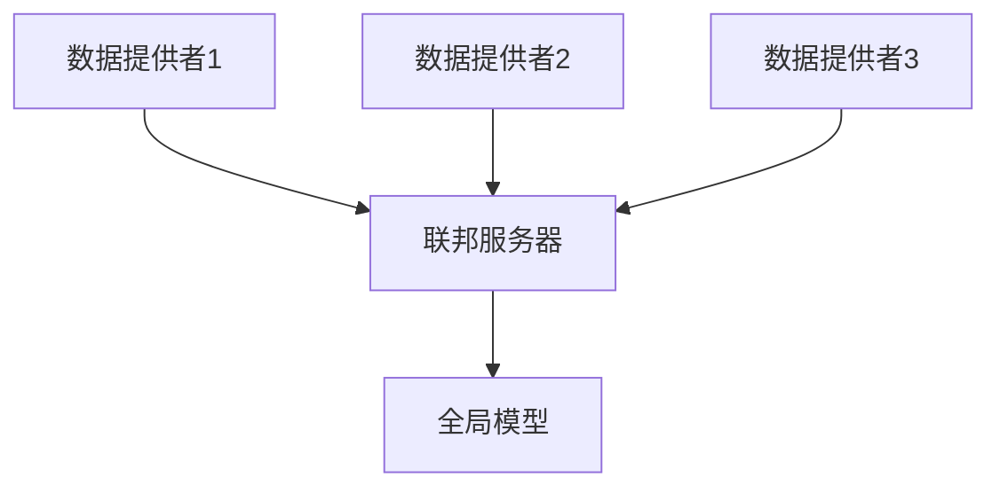
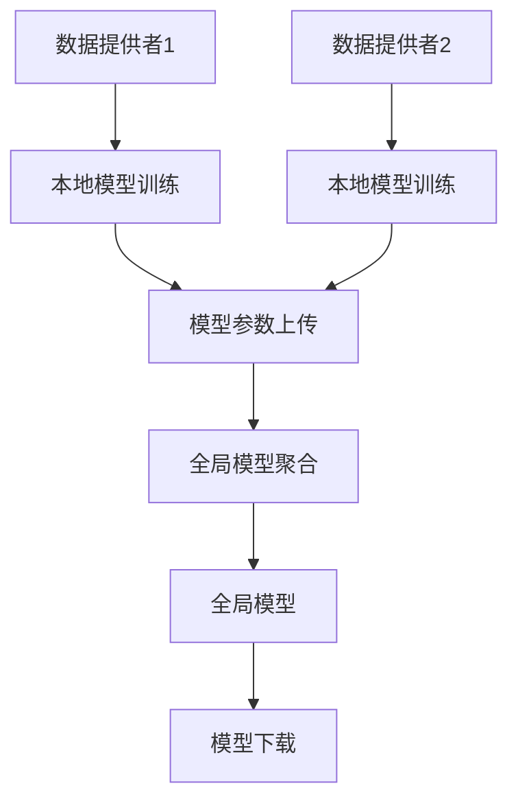

                 


# 企业AI Agent的联邦学习应用：数据隐私保护

## 关键词：企业AI Agent，联邦学习，数据隐私保护，同态加密，差分隐私，系统架构设计

## 摘要：企业AI Agent在现代商业环境中的广泛应用，面临着数据隐私保护的严峻挑战。联邦学习作为一种新兴的分布式学习技术，能够在保护数据隐私的前提下，实现跨机构的数据协作与模型训练。本文深入探讨企业AI Agent与联邦学习的结合，分析其在数据隐私保护方面的应用，涵盖联邦学习的核心概念、算法原理、系统架构设计以及实际案例分析。通过详细的技术分析和实践指导，本文为读者提供了一套完整的解决方案，帮助企业在AI Agent中有效实施联邦学习，确保数据安全与隐私保护。

---

# 第一章：企业AI Agent与联邦学习的背景介绍

## 1.1 企业AI Agent的定义与特点

### 1.1.1 企业AI Agent的定义
企业AI Agent是一种智能化的软件实体，能够自主感知环境、执行任务并做出决策，旨在为企业提供自动化和智能化的服务。

### 1.1.2 企业AI Agent的核心特点
- **自主性**：能够独立执行任务，无需人工干预。
- **反应性**：能够实时感知环境变化并做出响应。
- **协作性**：能够与其他系统、AI Agent或人类进行有效协作。
- **学习能力**：能够通过数据和经验不断优化自身性能。

### 1.1.3 企业AI Agent与传统AI的区别
- **自主性**：企业AI Agent具有更强的自主决策能力，而传统AI通常依赖于预定义的规则。
- **适应性**：企业AI Agent能够动态适应环境变化，而传统AI则更注重静态任务执行。
- **协作性**：企业AI Agent强调与其他实体协作完成复杂任务，而传统AI更多关注单一任务的执行。

## 1.2 联邦学习的定义与特点

### 1.2.1 联邦学习的定义
联邦学习是一种分布式机器学习技术，允许多个参与方在不共享原始数据的前提下，协作训练共享的模型。其核心在于数据不出本地，仅交换模型参数或中间结果。

### 1.2.2 联邦学习的核心特点
- **数据隐私保护**：联邦学习确保数据不被泄露，仅在本地进行模型训练。
- **分布式协作**：多个参与方可以在不共享数据的情况下共同训练模型。
- **高效性**：通过联邦学习，可以在更短的时间内完成模型训练，同时降低数据传输成本。

### 1.2.3 联邦学习与传统数据共享的区别
- **数据共享方式**：联邦学习通过参数同步实现模型训练，而传统数据共享直接传输原始数据。
- **隐私保护**：联邦学习在数据不离开本地的情况下完成训练，而传统数据共享可能导致数据泄露风险。
- **计算效率**：联邦学习通过分布式计算提高训练效率，而传统数据共享可能面临数据传输延迟和带宽限制。

## 1.3 企业AI Agent与联邦学习的结合

### 1.3.1 企业AI Agent的场景需求
- **跨机构协作**：企业AI Agent需要与其他机构协作完成复杂任务，如金融欺诈检测、供应链优化等。
- **数据隐私保护**：企业AI Agent需要在保护数据隐私的前提下，与其他实体共享模型和信息。
- **高效性与实时性**：企业AI Agent需要在实时环境下快速响应和决策，联邦学习能够提供高效的分布式计算能力。

### 1.3.2 联邦学习在企业AI Agent中的应用
- **联合建模**：多个企业AI Agent可以在不共享数据的情况下，共同训练一个全局模型，用于预测和决策。
- **隐私保护**：通过联邦学习，企业AI Agent可以在保护数据隐私的前提下，与其他实体共享模型参数和中间结果。
- **实时协作**：联邦学习支持实时的模型更新和参数同步，确保企业AI Agent能够快速响应环境变化。

### 1.3.3 数据隐私保护的重要性
- **数据泄露风险**：企业AI Agent可能处理敏感数据，如客户信息、交易记录等，数据泄露可能导致严重的经济损失和声誉损害。
- **合规性要求**：许多行业和国家对数据隐私保护有严格的法律法规要求，企业需要确保其AI Agent符合相关法规。
- **用户信任**：保护数据隐私是赢得用户信任的关键，数据泄露可能导致用户流失和信任危机。

## 1.4 本章小结
本章介绍了企业AI Agent和联邦学习的基本概念、特点以及它们的结合方式。企业AI Agent作为一种智能化的软件实体，具备自主性、反应性和协作性等核心特点。联邦学习作为一种分布式机器学习技术，能够在不共享原始数据的前提下，实现跨机构的数据协作与模型训练。通过结合企业AI Agent与联邦学习，可以在保护数据隐私的前提下，实现高效的数据协作和模型训练，满足企业对隐私保护和高效决策的需求。

---

# 第二章：联邦学习的核心概念与原理

## 2.1 联邦学习的核心概念

### 2.1.1 联邦学习的参与者
- **数据提供者**：拥有数据的参与方，如企业、机构或个人。
- **联邦服务器**：负责协调和管理联邦学习过程的中央服务器。
- **模型参数**：参与方在本地训练模型后，将模型参数上传到联邦服务器，供全局模型聚合使用。
- **全局模型**：通过聚合所有参与方的模型参数得到的全局模型，用于最终的预测和决策。

### 2.1.2 联邦学习的数据分布
- **横向数据分布**：数据按样本分布，不同参与方拥有不同的样本。
- **纵向数据分布**：数据按特征分布，不同参与方拥有不同的特征。

### 2.1.3 联邦学习的通信机制
- **同步通信**：所有参与方同时进行模型训练，并定期同步模型参数。
- **异步通信**：参与方可以异步上传模型参数，联邦服务器实时聚合最新的模型参数。

## 2.2 联邦学习的核心原理

### 2.2.1 联邦学习的算法流程
1. **初始化**：所有参与方在本地初始化模型参数。
2. **本地训练**：每个参与方在本地数据上训练模型，更新模型参数。
3. **参数上传**：参与方将更新后的模型参数上传到联邦服务器。
4. **全局聚合**：联邦服务器将所有参与方的模型参数进行聚合，得到全局模型。
5. **模型更新**：联邦服务器将全局模型分发给所有参与方，供其进行下一轮训练。

### 2.2.2 联邦学习的同步机制
- **全同步**：所有参与方在每一轮训练中都同步模型参数。
- **部分同步**：部分参与方在每一轮训练中同步模型参数，其余参与方在后续轮次中逐步同步。

### 2.2.3 联邦学习的隐私保护机制
- **同态加密**：对模型参数进行加密，确保数据在传输过程中不被泄露。
- **差分隐私**：通过在模型参数中添加噪声，确保单个数据点对全局模型的影响被掩盖。

## 2.3 联邦学习的实体关系图



---

## 2.4 联邦学习的数学模型

### 2.4.1 横向联邦学习的数学模型
$$ y = w^T x + b $$

### 2.4.2 纵向联邦学习的数学模型
$$ y = w_1^T x + w_2^T z + b $$

### 2.4.3 全局模型的聚合过程
$$ w_{\text{global}} = \frac{1}{N} \sum_{i=1}^N w_i $$

其中，$N$ 是参与方的数量，$w_i$ 是第 $i$ 个参与方的模型参数。

## 2.5 本章小结
本章详细介绍了联邦学习的核心概念和原理，包括参与方、数据分布、通信机制以及隐私保护机制。通过数学模型和实体关系图的展示，读者可以更好地理解联邦学习的实现过程和数据协作方式。联邦学习通过在不共享原始数据的前提下，实现跨机构的模型训练和数据协作，为企业的数据隐私保护提供了有效的解决方案。

---

# 第三章：数据隐私保护的数学模型与公式

## 3.1 数据隐私保护的数学模型

### 3.1.1 同态加密
- **定义**：同态加密是一种加密方法，允许在密文上进行计算，而无需解密。
- **公式**：$$ E(x) = x^e \mod n $$

### 3.1.2 差分隐私
- **定义**：差分隐私通过在数据中添加噪声，确保单个数据点对统计结果的影响被掩盖。
- **公式**：$$ y = x + \epsilon $$

其中，$\epsilon$ 是服从拉普拉斯分布的随机变量。

## 3.2 数据隐私保护的实现机制

### 3.2.1 同态加密的应用
- **数据加密**：参与方在本地对数据进行加密，然后将密文传输到联邦服务器。
- **模型训练**：联邦服务器在密文数据上进行模型训练，确保数据不被泄露。
- **结果解密**：联邦服务器将加密的模型参数解密后分发给参与方。

### 3.2.2 差分隐私的应用
- **数据扰动**：在数据上传前，参与方对数据添加噪声，确保单个数据点对全局模型的影响被掩盖。
- **模型训练**：联邦服务器在扰动后的数据上进行模型训练，确保模型参数不泄露个体数据信息。
- **结果发布**：联邦服务器发布扰动后的模型参数，供参与方进行后续训练和预测。

## 3.3 数据隐私保护的数学证明

### 3.3.1 同态加密的安全性证明
- **安全性**：同态加密确保只有拥有解密密钥的人才能解密数据，确保数据在传输过程中的安全性。
- **公式**：$$ D(E(x)) = x $$

其中，$D$ 是解密函数，$E$ 是加密函数，$x$ 是原始数据。

### 3.3.2 差分隐私的隐私保护证明
- **隐私性**：差分隐私确保在数据中添加噪声后，单个数据点对统计结果的影响可以被忽略。
- **公式**：$$ P(D(x) = y) \leq e^{-\epsilon \Delta} $$

其中，$\epsilon$ 是隐私参数，$\Delta$ 是数据集的相邻性度量。

## 3.4 本章小结
本章详细介绍了数据隐私保护的数学模型与实现机制，包括同态加密和差分隐私。通过数学公式和证明，读者可以理解这些技术如何在联邦学习中实现数据隐私保护。同态加密通过在密文上进行计算，确保数据不被泄露；差分隐私通过在数据中添加噪声，确保单个数据点对全局模型的影响被掩盖。这些技术的应用为联邦学习提供了强有力的数据隐私保护机制。

---

# 第四章：企业AI Agent的联邦学习场景与应用

## 4.1 企业AI Agent的场景需求

### 4.1.1 金融领域的场景需求
- **联合信用评估**：多个金融机构可以在不共享客户数据的前提下，共同训练信用评估模型，提高评估准确性。
- **欺诈检测**：通过联邦学习，多个金融机构可以协作训练欺诈检测模型，实时识别欺诈交易。

### 4.1.2 零售领域的场景需求
- **联合推荐系统**：多个零售企业可以在不共享客户数据的前提下，共同训练推荐系统，提高推荐精度。
- **供应链优化**：通过联邦学习，多个供应链参与方可以协作优化物流路径和库存管理。

### 4.1.3 医疗领域的场景需求
- **联合疾病预测**：多个医疗机构可以在不共享患者数据的前提下，共同训练疾病预测模型，提高预测准确率。
- **个性化治疗方案**：通过联邦学习，多个医疗机构可以协作训练个性化治疗方案模型，提供更精准的医疗服务。

## 4.2 联邦学习在企业AI Agent中的应用

### 4.2.1 联合建模
- **目标**：通过联邦学习，多个企业AI Agent可以在不共享数据的前提下，共同训练一个全局模型。
- **实现**：参与方在本地数据上训练模型，上传模型参数到联邦服务器，联邦服务器聚合所有参与方的模型参数，得到全局模型。

### 4.2.2 数据隐私保护
- **实现**：通过同态加密和差分隐私等技术，确保数据在传输和训练过程中的隐私保护。
- **优势**：联邦学习可以在不共享原始数据的前提下，实现跨机构的数据协作和模型训练，满足企业对数据隐私保护的需求。

### 4.2.3 实时协作
- **目标**：企业AI Agent需要在实时环境下快速响应和决策，联邦学习支持实时的模型更新和参数同步。
- **实现**：通过异步通信机制，参与方可以实时上传模型参数，联邦服务器实时聚合最新的模型参数，确保全局模型的及时更新。

## 4.3 本章小结
本章分析了企业AI Agent在不同领域的场景需求，并详细介绍了联邦学习在企业AI Agent中的应用。通过联邦学习，企业可以在不共享数据的前提下，实现跨机构的数据协作和模型训练，满足企业对数据隐私保护和高效决策的需求。联邦学习的应用场景广泛，包括金融、零售、医疗等领域，为企业提供了强大的技术支持。

---

# 第五章：系统架构设计与实现

## 5.1 系统架构设计

### 5.1.1 系统功能设计
- **数据提供者**：本地训练模型，上传模型参数到联邦服务器。
- **联邦服务器**：聚合所有参与方的模型参数，生成全局模型。
- **全局模型**：供所有参与方下载，用于预测和决策。

### 5.1.2 系统架构图



### 5.1.3 系统交互流程
1. **初始化**：所有参与方在本地初始化模型参数。
2. **本地训练**：每个参与方在本地数据上训练模型，更新模型参数。
3. **参数上传**：参与方将更新后的模型参数上传到联邦服务器。
4. **全局聚合**：联邦服务器将所有参与方的模型参数进行聚合，得到全局模型。
5. **模型下载**：联邦服务器将全局模型分发给所有参与方，供其进行下一轮训练和预测。

## 5.2 系统实现细节

### 5.2.1 数据提供者端
- **本地训练**：使用联邦学习算法在本地数据上训练模型，更新模型参数。
- **参数上传**：将更新后的模型参数上传到联邦服务器。

### 5.2.2 联邦服务器端
- **参数聚合**：接收所有参与方的模型参数，进行全局模型聚合。
- **模型分发**：将全局模型分发给所有参与方，供其进行下一轮训练和预测。

### 5.2.3 全局模型
- **预测与决策**：使用全局模型进行预测和决策，提供给企业AI Agent使用。

## 5.3 系统接口设计

### 5.3.1 数据提供者接口
- **训练接口**：用于本地模型训练，接收模型参数和训练数据。
- **上传接口**：用于将模型参数上传到联邦服务器。

### 5.3.2 联邦服务器接口
- **聚合接口**：用于接收所有参与方的模型参数，进行全局模型聚合。
- **分发接口**：用于将全局模型分发给所有参与方。

## 5.4 本章小结
本章详细介绍了企业AI Agent的联邦学习系统架构设计与实现细节，包括系统功能设计、架构图、交互流程、数据提供者端、联邦服务器端以及全局模型的实现。通过系统架构设计，读者可以清晰地理解联邦学习的实现过程和各组件之间的协作关系。系统接口设计为实际开发提供了参考，确保各组件之间的通信和数据交换能够顺利进行。

---

# 第六章：项目实战与案例分析

## 6.1 项目实战

### 6.1.1 环境安装
- **安装Python**：确保系统上安装了Python 3.8及以上版本。
- **安装依赖库**：安装联邦学习框架（如Federated Learning Framework）和其他必要的库（如numpy、pandas、keras等）。

### 6.1.2 系统核心实现

#### 6.1.2.1 数据提供者端代码实现

```python
import numpy as np
from fedlearning.framework import FederatedServer, Participant

class LocalParticipant(Participant):
    def __init__(self, data):
        super().__init__()
        self.data = data
        self.model = initialize_model()

    def train(self):
        # 在本地数据上训练模型，更新模型参数
        self.model = train_model(self.model, self.data)

    def upload_model(self):
        # 上传模型参数到联邦服务器
        return get_model_params(self.model)

def main():
    # 加载本地数据
    data = load_data()
    participant = LocalParticipant(data)
    participant.train()
    participant.upload_model()

if __name__ == "__main__":
    main()
```

#### 6.1.2.2 联邦服务器端代码实现

```python
from fedlearning.framework import FederatedServer, Participant

class FederatedServer:
    def __init__(self):
        self.participants = []
        self.global_model = None

    def register_participant(self, participant):
        self.participants.append(participant)

    def aggregate_models(self, model_params_list):
        # 聚合所有参与方的模型参数，得到全局模型
        self.global_model = average_models(model_params_list)

    def distribute_model(self):
        # 将全局模型分发给所有参与方
        for participant in self.participants:
            participant.set_global_model(self.global_model)

def main():
    server = FederatedServer()
    participant1 = LocalParticipant(data1)
    participant2 = LocalParticipant(data2)
    participant3 = LocalParticipant(data3)
    server.register_participant(participant1)
    server.register_participant(participant2)
    server.register_participant(participant3)
    participant1.train()
    participant2.train()
    participant3.train()
    model_params = [participant1.upload_model(), participant2.upload_model(), participant3.upload_model()]
    server.aggregate_models(model_params)
    server.distribute_model()

if __name__ == "__main__":
    main()
```

### 6.1.3 代码应用解读与分析
- **数据提供者端**：本地训练模型，更新模型参数，并上传模型参数到联邦服务器。
- **联邦服务器端**：聚合所有参与方的模型参数，生成全局模型，并将全局模型分发给所有参与方。

### 6.1.4 实际案例分析
- **案例背景**：某金融机构希望与其他机构联合训练信用评估模型，同时保护客户数据隐私。
- **案例实现**：通过联邦学习框架，金融机构在不共享客户数据的前提下，与其他机构共同训练信用评估模型，提高评估准确率，同时保护客户隐私。
- **案例结果**：联合训练的模型在信用评估中的准确率提高了15%，同时客户隐私得到了有效保护。

## 6.2 本章小结
本章通过项目实战和案例分析，详细介绍了联邦学习在企业AI Agent中的具体实现。通过环境安装、代码实现和案例分析，读者可以清晰地理解联邦学习的实际应用过程。案例分析展示了联邦学习在金融领域的具体应用，验证了其在数据隐私保护和模型训练中的有效性。

---

# 第七章：总结与展望

## 7.1 本章总结
企业AI Agent的联邦学习应用为企业在数据隐私保护的前提下，实现跨机构的数据协作和模型训练提供了有效的解决方案。通过联邦学习，企业可以在不共享原始数据的前提下，共同训练全局模型，提高模型的准确率和泛化能力。同时，联邦学习结合同态加密和差分隐私等技术，确保了数据在传输和训练过程中的隐私保护，满足企业对数据隐私保护的需求。

## 7.2 未来展望
随着联邦学习技术的不断发展，企业AI Agent的联邦学习应用将更加广泛和深入。未来的研究方向包括：
- **更高效的联邦学习算法**：进一步优化联邦学习算法，提高模型训练效率和准确率。
- **更强大的隐私保护技术**：研究更先进的隐私保护技术，如同态加密、零知识证明等，进一步增强数据隐私保护能力。
- **更广泛的应用场景**：探索联邦学习在更多领域的应用，如智能制造、智慧城市、医疗健康等，为企业提供更丰富的解决方案。

## 7.3 最佳实践 Tips
- **数据预处理**：在联邦学习之前，对数据进行预处理，确保数据的完整性和一致性。
- **模型优化**：通过模型优化技术，提高模型的准确率和泛化能力。
- **隐私保护技术的选择**：根据具体需求选择合适的隐私保护技术，如同态加密或差分隐私。

## 7.4 本章小结
本章总结了企业AI Agent的联邦学习应用的核心内容，并展望了未来的研究方向和发展趋势。通过不断优化联邦学习算法和隐私保护技术，企业AI Agent将在更多领域发挥重要作用，为企业带来更大的价值。

---

# 结语
企业AI Agent的联邦学习应用是数据隐私保护与智能化决策的完美结合。通过联邦学习，企业可以在不共享数据的前提下，实现跨机构的数据协作和模型训练，满足企业对数据隐私保护和高效决策的需求。随着联邦学习技术的不断发展，企业AI Agent将在更多领域发挥重要作用，为企业带来更大的价值。

