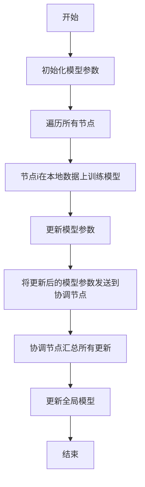
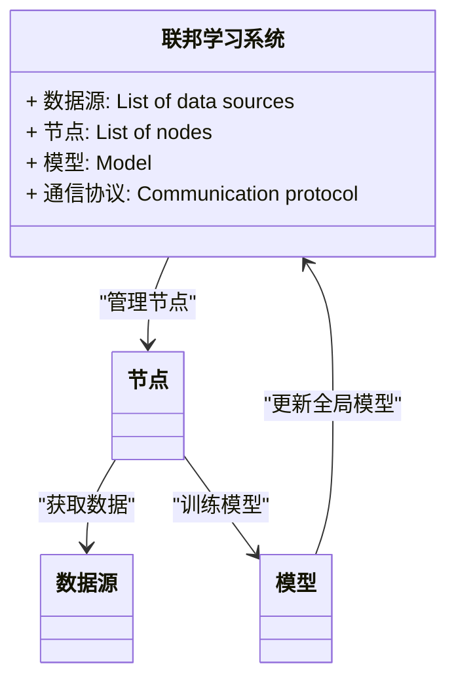
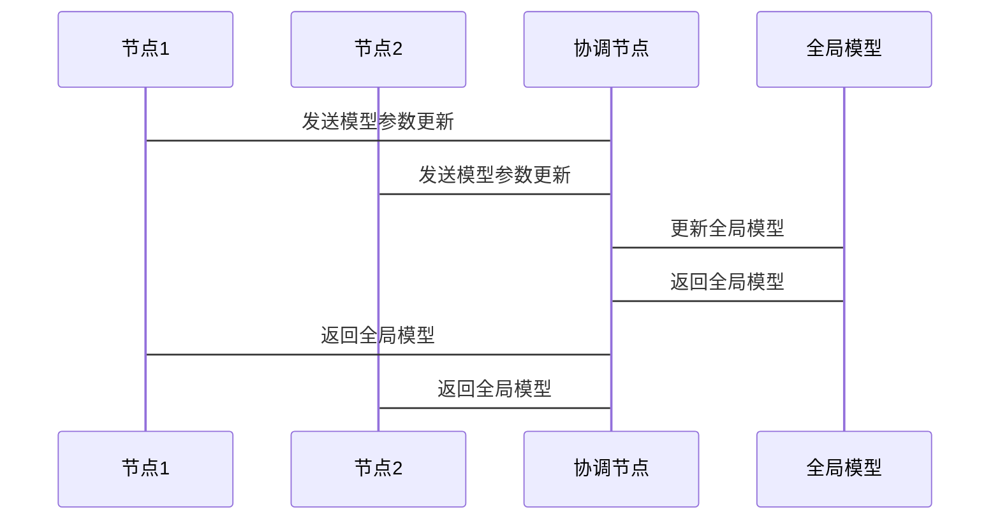

                 


# 企业AI Agent的联邦学习性能优化策略

> 关键词：企业AI Agent, 联邦学习, 性能优化, 数据隐私, 分布式学习, 机器学习模型

> 摘要：本文深入探讨了企业AI Agent在联邦学习中的性能优化策略，从联邦学习的背景与核心概念出发，分析了其算法原理、系统架构设计、项目实战及优化策略，旨在为企业AI Agent的高效应用提供理论支持与实践指导。

---

# 第一部分: 企业AI Agent的联邦学习背景与基础

## 第1章: 联邦学习的背景与核心概念

### 1.1 联邦学习的背景

#### 1.1.1 数据孤岛问题的提出
随着企业数字化转型的推进，数据成为企业的重要资产。然而，数据孤岛问题日益凸显：数据分散在不同的部门、系统或企业中，无法有效共享和利用。例如，零售企业可能在不同的门店收集了大量用户行为数据，但由于数据孤岛，这些数据难以整合用于全局优化。

#### 1.1.2 联邦学习的定义与目标
联邦学习（Federated Learning）是一种分布式机器学习技术，旨在在不共享原始数据的情况下，通过加密通信和分布式计算，共同训练一个全局模型。其目标是在保护数据隐私的前提下，实现跨机构、跨系统的协作学习。

#### 1.1.3 企业AI Agent的应用场景
企业AI Agent（Artificial Intelligence Agent）是一种能够感知环境、自主决策并执行任务的智能体。在联邦学习的框架下，企业AI Agent可以作为数据提供者或模型参与者，与其他Agent协作完成分布式任务，例如跨机构的客户画像构建、联合推荐系统等。

### 1.2 联邦学习的核心概念

#### 1.2.1 数据联邦的定义
数据联邦是一种通过联邦学习技术，在分布式数据源上构建统一模型的方法。它允许多个数据源在不共享数据的情况下，协作训练一个全局模型。

#### 1.2.2 联邦学习的特性
- **数据局部性**：数据保留在原始来源，仅共享模型参数或中间结果。
- **隐私保护**：通过加密和隐私计算技术，确保数据在传输和计算过程中的安全性。
- **分布式协作**：多个参与方协作训练，形成全局模型。

#### 1.2.3 企业AI Agent与联邦学习的关系
企业AI Agent作为联邦学习的参与者，负责提供数据、参与模型训练或执行特定任务。联邦学习为AI Agent提供了协作环境，使其能够在全球范围内高效利用数据，同时保护数据隐私。

### 1.3 联邦学习的技术特点

#### 1.3.1 分布式数据管理
联邦学习通过分布式数据管理技术，将数据源分布在不同节点，每个节点仅处理本地数据，通过通信协议交换模型参数。

#### 1.3.2 联邦模型的构建与更新
联邦模型通过迭代更新，逐步优化全局模型。每个节点在本地数据上训练模型，并将更新的模型参数发送到协调节点，最终生成全局模型。

#### 1.3.3 联邦学习的通信机制
联邦学习需要高效的通信机制，确保模型参数的安全传输和同步。常见的通信机制包括基于区块链的联邦学习和点对点网络。

---

## 第2章: 联邦学习的核心概念与联系

### 2.1 联邦学习的核心原理

#### 2.1.1 联邦学习的数学模型
联邦学习的数学模型可以表示为：  
$$\min_{\theta} \sum_{i=1}^{n} f_i(\theta)$$  
其中，$\theta$是模型参数，$f_i(\theta)$是第$i$个节点的损失函数。

#### 2.1.2 联邦学习的通信协议
联邦学习通过加密通信技术（如同态加密和差分隐私）确保数据传输的安全性。

#### 2.1.3 联邦学习的隐私保护机制
差分隐私通过在数据中加入噪声，确保单个数据点对全局模型的影响有限。

### 2.2 联邦学习的核心概念对比

#### 2.2.1 数据联邦与模型联邦的对比
| 特性         | 数据联邦                   | 模型联邦                   |
|--------------|---------------------------|---------------------------|
| 数据处理方式 | 分散在不同节点，仅传输模型参数 | 数据集中在一个节点，多个模型参数在不同节点训练 |
| 适用场景     | 数据无法集中，需要保护隐私 | 数据可以部分集中，但模型需要分布式训练 |

#### 2.2.2 同态加密与差分隐私的对比
| 特性         | 同态加密                   | 差分隐私                   |
|--------------|---------------------------|---------------------------|
| 适用场景     | 对加密数据进行计算         | 对数据进行隐私保护         |
| 优势         | 支持加密计算，保护数据隐私 | 通过噪声确保数据隐私       |
| 常见应用     | 金融、医疗领域             | 数据挖掘、推荐系统等         |

#### 2.2.3 联邦学习与其他分布式学习方法的对比
| 特性         | 联邦学习                   | 分布式学习                 |
|--------------|---------------------------|---------------------------|
| 数据共享方式 | 不共享数据，仅共享模型参数 | 数据共享                   |
| 隐私保护     | 强调隐私保护               | 数据共享过程中可能不强调隐私保护 |

### 2.3 联邦学习的ER实体关系图

```mermaid
erd
    entity 联邦学习系统 {
        key 用户ID
        属性 用户特征
        属性 用户行为
    }
    entity 联邦模型 {
        key 模型ID
        属性 模型参数
        属性 模型版本
    }
    entity 联邦节点 {
        key 节点ID
        属性 数据源
        属性 通信协议
    }
    联邦学习系统 --> 联邦模型: "训练"
    联邦节点 --> 联邦模型: "更新"
    联邦模型 --> 联邦学习系统: "优化"
```

---

## 第3章: 联邦学习的算法原理

### 3.1 联邦学习的算法流程



### 3.2 联邦学习的数学模型

假设我们有$n$个节点，每个节点$i$有数据集$D_i$，模型参数$\theta$，损失函数$f_i(\theta)$。全局模型的目标是最小化以下损失函数：

$$\min_{\theta} \sum_{i=1}^{n} f_i(\theta)$$

### 3.3 联邦学习的实现代码

```python
import numpy as np
from sklearn.linear_model import SGDClassifier

# 初始化模型参数
model = SGDClassifier()
global_model = model.copy()

# 联邦学习过程
for node in nodes:
    # 节点i在本地数据上训练模型
    node_model = model.copy()
    node_model.fit(node_data, node_labels)
    # 更新模型参数
    global_model = global_model.coef_ * (1 - learning_rate) + node_model.coef_ * learning_rate
    global_model.fit(global_data, global_labels)

print("全局模型训练完成")
```

---

## 第4章: 联邦学习的系统架构设计

### 4.1 系统功能设计



### 4.2 系统交互设计



---

## 第5章: 企业AI Agent的联邦学习项目实战

### 5.1 项目背景与目标

项目目标是通过联邦学习技术，构建一个跨机构的客户画像系统，保护各机构的数据隐私，同时提高客户画像的准确性。

### 5.2 项目实现步骤

#### 5.2.1 环境搭建
安装必要的库：TensorFlow、Flask、加密库等。

#### 5.2.2 数据预处理
将数据分割到不同节点，确保数据隐私。

#### 5.2.3 模型训练
在每个节点上训练本地模型，并将更新后的模型参数发送到协调节点。

#### 5.2.4 通信模块
实现安全的通信协议，确保模型参数的传输安全。

#### 5.2.5 结果分析
分析全局模型的效果，评估联邦学习的性能优化效果。

### 5.3 项目代码实现

```python
import numpy as np
from sklearn.datasets import make_classification
from sklearn.linear_model import LogisticRegression
from sklearn.metrics import accuracy_score

# 模拟联邦学习环境
nodes = 3
data = make_classification(n_samples=1000, n_features=20, random_state=42)
models = [LogisticRegression() for _ in range(nodes)]

# 初始化全局模型
global_model = LogisticRegression()

# 联邦学习过程
for _ in range(10):
    for node in range(nodes):
        # 节点i训练本地模型
        models[node].fit(data[0], data[1])
        # 更新全局模型
        global_model.coef_ += models[node].coef_
    # 汇总全局模型
    global_model.coef_ = global_model.coef_ / nodes

print("全局模型训练完成，准确率:", accuracy_score(data[1], global_model.predict(data[0])))
```

---

## 第6章: 联邦学习的性能优化策略

### 6.1 数据预处理优化

对数据进行特征选择和归一化处理，减少数据冗余，提高模型训练效率。

### 6.2 模型优化策略

使用更高效的优化算法（如Adam、Adagrad）替代传统的SGD，加速模型收敛。

### 6.3 通信优化

通过压缩模型参数、减少通信频率等方式，降低通信成本。

### 6.4 资源分配优化

根据节点的计算能力和网络带宽，动态分配模型参数更新的任务，提高整体效率。

### 6.5 安全增强

通过同态加密和差分隐私技术，进一步增强数据传输和模型训练的安全性。

---

## 第7章: 总结与展望

### 7.1 总结

本文系统地探讨了企业AI Agent在联邦学习中的性能优化策略，从背景、核心概念、算法原理到系统设计和项目实战，为企业AI Agent的高效应用提供了理论支持与实践指导。

### 7.2 展望

未来的研究方向包括更高效的通信协议设计、更强大的隐私保护技术以及更智能的资源分配策略。随着技术的不断发展，企业AI Agent在联邦学习中的应用将更加广泛，性能也将进一步优化。

---

以上是《企业AI Agent的联邦学习性能优化策略》的完整目录和内容概要，涵盖了从理论到实践的各个方面，为企业AI Agent的高效应用提供了全面的技术指导。

