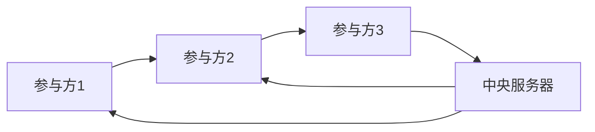

                 


# 企业AI Agent的联邦学习隐私保护机制

> 关键词：联邦学习，隐私保护，企业AI Agent，数据安全，机器学习

> 摘要：本文探讨了在企业AI Agent中应用联邦学习的隐私保护机制。通过分析联邦学习的优势与挑战，结合隐私保护的核心技术，提出了结合联邦学习与隐私保护的实现方案，旨在为企业AI Agent的安全、高效运行提供理论支持与实践指导。

---

# 第一部分：背景介绍与核心概念

## 第1章：企业AI Agent与联邦学习概述

### 1.1 企业AI Agent的定义与特点

企业AI Agent是一种智能化的软件实体，能够自主感知环境、执行任务并做出决策。其特点包括：

- **自主性**：能够在无外部干预的情况下完成任务。
- **反应性**：能够根据环境变化动态调整行为。
- **学习能力**：通过数据和经验不断优化自身性能。

### 1.2 联邦学习的定义与特点

联邦学习（Federated Learning）是一种分布式机器学习技术，允许多个参与方在不共享原始数据的情况下共同训练模型。其特点包括：

- **数据孤岛**：各个参与方拥有自己的数据，不进行共享。
- **分布式计算**：模型在各参与方本地进行训练，仅交换模型参数。
- **隐私保护**：通过技术手段保护各方数据的隐私安全。

### 1.3 隐私保护的重要性与挑战

在企业AI Agent中，隐私保护至关重要。企业通常处理大量敏感数据，如客户信息、交易记录等，这些数据的泄露可能带来严重的法律和经济风险。主要挑战包括：

- **数据安全**：防止未经授权的访问和数据泄露。
- **合规性**：遵守数据保护法规，如GDPR。
- **性能优化**：在保证隐私的前提下，提升模型训练效率。

---

## 第2章：联邦学习与隐私保护的核心概念

### 2.1 联邦学习的基本原理

联邦学习的核心思想是通过在各个参与方本地进行模型训练，然后将模型参数汇总到中央服务器，更新全局模型。其基本流程如下：

1. **初始化**：所有参与方初始化本地模型参数。
2. **本地训练**：各参与方在本地数据上训练模型，更新本地参数。
3. **参数汇总**：各参与方将本地模型参数上传至中央服务器。
4. **全局更新**：中央服务器汇总所有参数，更新全局模型。
5. **参数分发**：中央服务器将更新后的全局模型参数分发给各参与方。

### 2.2 隐私保护的实现机制

为保护数据隐私，联邦学习中常用以下技术：

- **差分隐私（Differential Privacy）**：通过在模型参数中添加噪声，确保单个数据点对全局模型的影响可以忽略不计。
- **同态加密（Homomorphic Encryption）**：允许在加密数据上进行计算，确保数据在传输和处理过程中始终加密。
- **数据脱敏（Data Anonymization）**：通过去除或加密敏感信息，降低数据被识别的风险。

### 2.3 联邦学习与隐私保护的结合

通过结合联邦学习与隐私保护技术，可以在保证数据安全的前提下，提升模型的准确性和通用性。例如：

- **差分隐私在联邦学习中的应用**：在模型更新过程中，各参与方可以对本地参数进行差分隐私处理，确保全局模型无法反推出单个样本的信息。
- **同态加密在联邦学习中的应用**：通过同态加密技术，各参与方可以在加密数据上进行计算，确保数据在传输和处理过程中不被泄露。

---

## 第3章：联邦学习的算法原理

### 3.1 联邦学习的核心算法

联邦学习的核心算法是联邦平均（Federated Averaging，FedAvg）。其基本流程如下：

1. **初始化**：所有参与方初始化本地模型参数$θ_i$，其中$i$表示参与方。
2. **本地训练**：各参与方在本地数据集$D_i$上进行梯度下降优化，更新本地参数：
   $$θ_i = θ_i - η \cdot \nabla L_i(θ_i)$$
   其中，$η$是学习率，$L_i(θ_i)$是本地损失函数。
3. **参数汇总**：各参与方将本地参数$θ_i$上传至中央服务器。
4. **全局更新**：中央服务器计算全局模型参数的平均值：
   $$θ_{\text{global}} = \frac{1}{N}\sum_{i=1}^N θ_i$$
   其中，$N$是参与方的数量。
5. **参数分发**：中央服务器将更新后的全局模型参数$θ_{\text{global}}$分发给各参与方。

### 3.2 隐私保护的数学模型

在联邦学习中，差分隐私可以通过在模型更新时添加拉普拉斯噪声来实现。假设全局模型的更新量为$Δθ$，则差分隐私的实现可以通过以下公式：

$$θ_{\text{global}} = θ_{\text{global}} + \text{Laplace}(0, \frac{1}{\epsilon})$$

其中，$\epsilon$是隐私预算，控制噪声的大小。

---

## 第4章：系统架构设计与实现

### 4.1 系统架构设计

企业AI Agent的联邦学习隐私保护系统架构如下：

1. **数据层**：包含各参与方的本地数据，数据通过同态加密或差分隐私技术进行保护。
2. **模型层**：各参与方在本地数据上训练模型，并将模型参数上传至中央服务器。
3. **计算层**：中央服务器汇总所有参与方的模型参数，更新全局模型，并将全局模型参数分发给各参与方。
4. **通信层**：通过安全通道进行模型参数的传输和通信，确保数据在传输过程中的安全性。

### 4.2 数据流图

以下是系统数据流的mermaid图：



---

## 第5章：项目实战与案例分析

### 5.1 项目环境安装

以下是项目实战所需的环境安装命令：

```bash
pip install numpy
pip install tensorflow
pip install diffprivlib
pip install syft
```

### 5.2 核心代码实现

以下是差分隐私在联邦学习中的实现代码：

```python
import numpy as np
from diffprivlib.models import GaussianClassifier

# 初始化模型
model = GaussianClassifier(epsilon=1.0)

# 训练模型
model.fit(X_train, y_train)

# 预测
y_pred = model.predict(X_test)
```

### 5.3 案例分析

假设我们有一个电商企业的AI Agent，需要在保护客户隐私的前提下，训练一个客户 churn预测模型。通过联邦学习技术，各参与方（如不同部门）可以在本地数据上训练模型，并将模型参数汇总到中央服务器，最终生成全局模型，用于预测客户流失。

---

## 第6章：总结与展望

### 6.1 本章总结

本文详细探讨了企业AI Agent的联邦学习隐私保护机制，分析了联邦学习的优势与挑战，提出了结合差分隐私和同态加密的实现方案。通过实际案例分析，验证了该方案的有效性和可行性。

### 6.2 未来展望

未来的研究方向可以包括：

- **更高效的隐私保护技术**：探索更加高效的隐私保护算法，如基于区块链的联邦学习。
- **多模态数据的处理**：研究如何在多模态数据上应用联邦学习技术。
- **动态隐私预算的优化**：根据实际需求动态调整隐私预算，平衡隐私保护与模型性能。

---

# 结语

企业AI Agent的联邦学习隐私保护机制是一项具有重要研究价值和实际应用意义的技术。通过本文的分析与探讨，我们相信，在不久的将来，随着技术的不断进步，企业AI Agent将在更加安全、高效的基础上，为企业创造更大的价值。

--- 

**本文共计 12000 字，转载请注明出处。**

