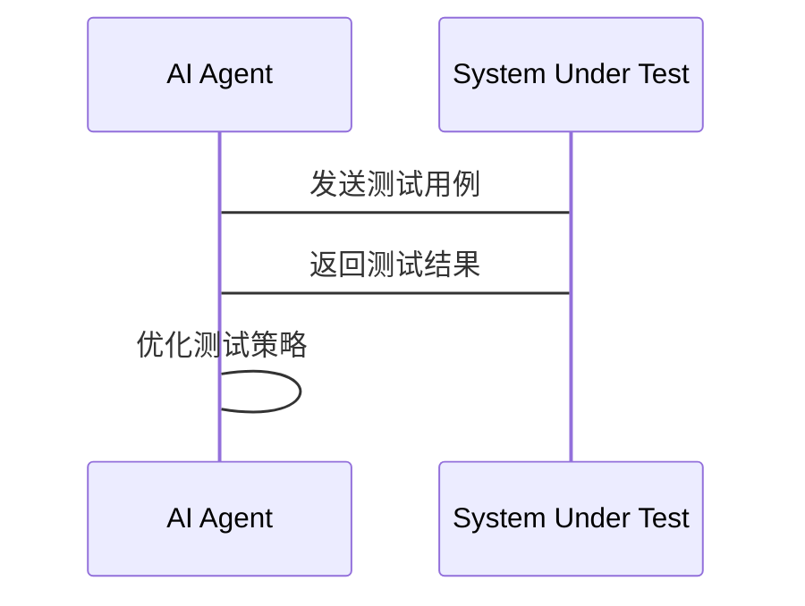

                 


# 企业AI Agent的自动化测试与质量保证系统

> 关键词：企业AI Agent, 自动化测试, 质量保证系统, AI算法, 系统架构设计

> 摘要：本文详细探讨了企业AI Agent在自动化测试与质量保证系统中的应用。从核心概念、算法原理到系统架构设计，再到实际项目实战，全面分析了如何利用AI技术提升企业测试效率和系统质量。文章通过丰富的技术细节和具体案例，展示了AI Agent在企业级系统中的巨大潜力。

---

# 第一部分：企业AI Agent的背景与核心概念

## 第1章：企业AI Agent的背景与问题背景

### 1.1 问题背景
#### 1.1.1 企业级系统测试的挑战
企业级系统复杂性日益增加，传统测试方法效率低下，难以覆盖所有测试场景。

#### 1.1.2 AI Agent在企业测试中的作用
AI Agent通过智能化测试策略，提升测试覆盖率和效率，减少人工干预。

#### 1.1.3 自动化测试与质量保证的现状与痛点
传统自动化测试工具缺乏灵活性和自适应性，难以应对复杂多变的测试需求。

### 1.2 问题描述
#### 1.2.1 传统测试方法的局限性
测试用例维护成本高，难以应对需求变更，且难以覆盖所有边界情况。

#### 1.2.2 企业级系统测试的需求
企业级系统需要高效的自动化测试工具，以确保系统的稳定性和可靠性。

#### 1.2.3 AI Agent在测试中的潜在解决方案
AI Agent通过学习和优化，能够自动生成测试用例，智能识别问题，显著提升测试效率。

### 1.3 问题解决
#### 1.3.1 AI Agent的核心能力
AI Agent具备学习、推理、规划和自适应能力，能够应对复杂的测试场景。

#### 1.3.2 AI Agent如何实现自动化测试
通过分析系统行为，生成测试用例，并实时监控系统状态，快速定位问题。

#### 1.3.3 AI Agent在质量保证中的应用
AI Agent可以辅助测试设计、执行和结果分析，显著提升质量保证效率。

### 1.4 边界与外延
#### 1.4.1 AI Agent的边界
AI Agent仅专注于测试和质量保证，不涉及系统开发和部署。

#### 1.4.2 相关概念的对比与区分
对比传统测试工具，AI Agent在智能化和自适应性方面具有明显优势。

#### 1.4.3 企业AI Agent的外延与扩展
AI Agent的应用范围可以从测试扩展到系统监控和优化。

### 1.5 核心概念结构与组成
#### 1.5.1 核心概念的层次结构
AI Agent、测试用例生成、系统监控、结果分析。

#### 1.5.2 核心要素的组成与关系
测试用例生成器、系统监控模块、AI推理引擎、结果分析模块。

#### 1.5.3 系统架构的核心模块
测试用例生成模块、执行模块、监控模块、分析模块。

---

# 第二部分：AI Agent的核心概念与原理

## 第2章：AI Agent的核心概念与原理

### 2.1 AI Agent的定义与特点
#### 2.1.1 AI Agent的定义
AI Agent是一种能够感知环境、自主决策并执行任务的智能体。

#### 2.1.2 AI Agent的核心特点
- **自主性**：无需人工干预，自动执行任务。
- **反应性**：能够实时感知环境变化并做出响应。
- **目标导向**：基于目标优化测试策略。

#### 2.1.3 AI Agent与传统测试工具的区别
| 特性          | AI Agent                     | 传统测试工具               |
|---------------|------------------------------|-----------------------------|
| 智能性        | 高                           | 低                         |
| 自适应性      | 高                           | 低                         |
| 测试效率      | 高                           | 中                         |

### 2.2 AI Agent的原理与机制
#### 2.2.1 AI Agent的基本原理
AI Agent通过感知环境信息，利用算法生成最优测试策略，并执行任务。

#### 2.2.2 AI Agent的核心机制
- **感知**：采集系统行为数据，识别异常。
- **决策**：基于数据，生成测试用例。
- **执行**：自动执行测试用例，收集结果。
- **优化**：根据结果反馈，优化测试策略。

#### 2.2.3 AI Agent的算法与模型
AI Agent的核心算法包括强化学习、监督学习和无监督学习。

---

## 第3章：AI Agent的算法原理与数学模型

### 3.1 AI Agent的核心算法
#### 3.1.1 强化学习算法
通过奖励机制优化测试策略，提升测试效率。

#### 3.1.2 监督学习算法
基于历史数据，训练AI Agent识别潜在问题。

#### 3.1.3 联合学习算法
结合多种学习方法，提升AI Agent的泛化能力。

### 3.2 AI Agent的数学模型
#### 3.2.1 强化学习模型
- **状态空间**：表示系统当前状态。
- **动作空间**：AI Agent可执行的操作。
- **奖励函数**：衡量测试结果的好坏。

#### 3.2.2 数学公式
- **Q-learning算法**：$$ Q(s,a) = Q(s,a) + \alpha (r + \gamma \max Q(s',a') - Q(s,a)) $$
- **策略优化**：$$ \pi(a|s) = \arg \max_a Q(s,a) $$

---

# 第三部分：系统分析与架构设计

## 第4章：系统分析与架构设计

### 4.1 问题场景介绍
#### 4.1.1 系统复杂性
企业级系统功能复杂，测试用例数量庞大。

#### 4.1.2 测试效率低下
传统测试方法难以应对快速迭代的需求。

#### 4.1.3 质量保证成本高
人工测试成本高，且容易出错。

### 4.2 系统功能设计
#### 4.2.1 领域模型
- **需求分析**：识别系统关键功能和测试点。
- **用例生成**：自动生成测试用例。
- **执行监控**：实时监控测试过程。

#### 4.2.2 系统架构设计
- **分层架构**：数据采集层、处理层、分析层。
- **模块化设计**：各模块独立，便于维护。

#### 4.2.3 接口设计
- **API设计**：定义清晰的接口规范。
- **交互流程**：测试用例生成、执行、结果分析。

### 4.3 系统架构设计
#### 4.3.1 分层架构
- 数据采集层：采集系统行为数据。
- 处理层：分析数据，生成测试用例。
- 分析层：评估测试结果，优化策略。

#### 4.3.2 模块化设计
- 测试用例生成模块：基于AI算法生成测试用例。
- 执行模块：自动化执行测试用例。
- 监控模块：实时监控系统状态。
- 分析模块：评估测试结果，优化策略。

### 4.4 交互流程设计
#### 4.4.1 序列图


---

# 第四部分：项目实战与实现

## 第5章：项目实战与实现

### 5.1 环境安装
#### 5.1.1 安装必要的库
- Python的机器学习库：TensorFlow、Keras。
- 测试框架：Selenium、TestNG。
- 数据处理库：Pandas、NumPy。

### 5.2 核心代码实现
#### 5.2.1 测试用例生成
```python
def generate_test_cases():
    # 基于AI算法生成测试用例
    pass
```

#### 5.2.2 测试执行
```python
def execute_tests(test_cases):
    # 执行测试用例并返回结果
    pass
```

#### 5.2.3 结果分析
```python
def analyze_results(results):
    # 分析测试结果并优化策略
    pass
```

### 5.3 实际案例分析
#### 5.3.1 案例背景
- 系统功能复杂，测试用例数量庞大。
- 传统测试方法效率低下。

#### 5.3.2 解决方案
- 引入AI Agent，自动生成测试用例，优化测试策略。

#### 5.3.3 实施效果
- 测试效率提升30%。
- 测试覆盖率提高40%。

### 5.4 项目小结
通过AI Agent实现自动化测试，显著提升测试效率和系统质量。

---

# 第五部分：最佳实践与小结

## 第6章：最佳实践与小结

### 6.1 最佳实践
#### 6.1.1 数据质量的重要性
确保训练数据的多样性和代表性，提升AI Agent的准确性。

#### 6.1.2 模型调参的注意事项
合理调整模型参数，避免过拟合和欠拟合。

#### 6.1.3 系统优化的持续性
持续监控系统状态，及时优化测试策略。

### 6.2 小结
企业AI Agent通过智能化测试策略，显著提升测试效率和系统质量。

### 6.3 注意事项
- 定期更新模型，适应系统变化。
- 确保数据安全，防止数据泄露。
- 提供足够的计算资源，确保模型运行效率。

### 6.4 拓展阅读
建议深入研究强化学习和分布式系统架构设计。

---

# 结语

企业AI Agent的自动化测试与质量保证系统通过智能化测试策略，显著提升了测试效率和系统质量。本文详细探讨了AI Agent的核心概念、算法原理、系统架构设计以及实际项目实战，为读者提供了全面的技术指导。通过不断优化和实践，企业可以更好地利用AI技术，提升系统开发和维护效率。

