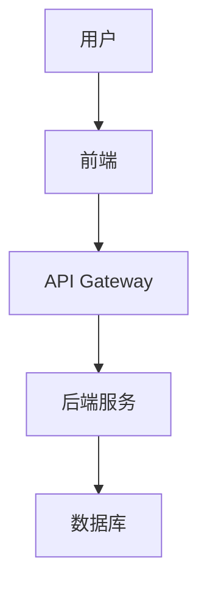

                 


# 企业AI Agent的自动化运维与故障预测

## 关键词：企业AI Agent、自动化运维、故障预测、机器学习、运维优化、系统架构

## 摘要：  
随着企业数字化转型的加速，AI Agent（人工智能代理）在企业运维中的应用越来越广泛。本文将深入探讨企业AI Agent在自动化运维和故障预测中的应用，从理论到实践，结合实际案例，详细讲解如何利用AI Agent提升企业运维效率和系统可靠性。通过分析AI Agent的核心原理、故障预测的实现方法以及系统架构设计，本文为企业技术决策者和运维人员提供实用的指导和参考。

---

## 第一部分：企业AI Agent概述

### 第1章：企业AI Agent的基本概念与应用

#### 1.1 AI Agent的定义与特点

**1.1.1 AI Agent的定义**  
AI Agent（人工智能代理）是一种能够感知环境、自主决策并执行任务的智能系统。它能够通过传感器或数据源获取信息，结合内部知识库和算法，做出决策并执行相应的操作。

**1.1.2 AI Agent的核心特点**  
- **智能性**：能够理解上下文并做出决策。  
- **自主性**：无需人工干预，自主完成任务。  
- **适应性**：能够根据环境变化调整行为。  
- **协作性**：能够与其他系统或人类用户协同工作。  

**1.1.3 企业AI Agent的应用场景**  
- **自动化运维**：监控系统状态，自动修复问题。  
- **故障预测**：基于历史数据预测系统故障。  
- **智能客服**：通过NLP技术提供智能化的客服支持。  

---

### 第2章：AI Agent的核心原理

#### 2.1 AI Agent的基本原理

**2.1.1 信息感知与处理**  
AI Agent通过传感器、日志文件或其他数据源获取环境信息，这些信息通常以结构化或非结构化数据形式存在。AI Agent需要对这些信息进行清洗、解析和特征提取。

**2.1.2 决策与执行**  
AI Agent基于感知到的信息，结合内部知识库和机器学习模型，做出决策并执行相应的操作。例如，当检测到系统资源使用异常时，AI Agent可以触发自动扩容或发出告警。

**2.1.3 自适应与学习**  
AI Agent通过机器学习算法不断优化自身的决策模型，提升预测准确性和响应速度。例如，使用强化学习算法优化资源分配策略。

#### 2.2 AI Agent的关键技术

**2.2.1 自然语言处理（NLP）**  
NLP技术使AI Agent能够理解和生成人类语言，例如通过聊天机器人与用户交互。  
- **技术特点**：支持多轮对话、意图识别、实体抽取。  
- **应用场景**：智能客服、用户反馈分析。  

**2.2.2 机器学习（ML）**  
机器学习算法是AI Agent的核心，用于模式识别和预测。  
- **常用算法**：监督学习（如决策树、随机森林）、无监督学习（如聚类、主题建模）。  

**2.2.3 知识图谱构建**  
知识图谱帮助AI Agent理解企业内部的知识体系，例如设备型号、供应商信息等。  
- **技术特点**：通过实体识别和关系抽取构建语义网络。  
- **应用场景**：智能搜索、知识问答。  

---

## 第二部分：故障预测的理论基础

### 第3章：故障预测的基本概念与方法

#### 3.1 故障预测的定义与分类

**3.1.1 故障预测的定义**  
故障预测是指通过分析系统运行数据，预测设备或系统可能出现故障的时间和类型。

**3.1.2 基于时间序列的故障预测**  
- **技术特点**：适用于周期性数据，如CPU负载、磁盘使用率。  
- **常用方法**：ARIMA模型、Prophet算法。  

**3.1.3 基于机器学习的故障预测**  
- **技术特点**：适用于非线性数据，能够捕捉复杂模式。  
- **常用算法**：XGBoost、神经网络（RNN、LSTM）。  

#### 3.2 机器学习在故障预测中的应用

**3.2.1 回归分析**  
回归分析用于预测连续型变量，例如预测设备剩余寿命。  
- **数学模型**：  
  $$ y = \beta_0 + \beta_1x_1 + \beta_2x_2 + \epsilon $$  
  其中，$y$ 是目标变量，$x_i$ 是特征变量，$\epsilon$ 是误差项。  

**3.2.2 分类算法**  
分类算法用于预测离散型变量，例如预测系统是否会在未来1小时内发生故障。  
- **常用算法**：逻辑回归、支持向量机（SVM）、随机森林。  

**3.2.3 聚类分析**  
聚类分析用于发现数据中的异常模式，例如检测异常的系统行为。  
- **技术特点**：无需标签数据，适用于无监督学习场景。  

---

## 第三部分：AI Agent的自动化运维

### 第4章：自动化运维的目标与实现

#### 4.1 自动化运维的目标

**4.1.1 提高运维效率**  
通过自动化脚本和工具，减少人工操作，提升运维效率。  
- **技术特点**：支持批量操作、任务编排。  

**4.1.2 降低人为错误**  
通过自动化流程减少人为操作失误，提升系统稳定性。  
- **应用场景**：自动部署、自动备份。  

**4.1.3 实现快速响应**  
通过实时监控和自动告警，快速定位和解决问题。  
- **技术特点**：支持多维度监控、告警阈值自定义。  

#### 4.2 自动化运维的关键技术

**4.2.1 脚本编写与流程自动化**  
- **技术特点**：使用Python或Shell脚本实现自动化操作。  
- **应用场景**：自动部署、自动备份。  

**4.2.2 持续集成与持续交付（CI/CD）**  
- **技术特点**：通过Jenkins、GitHub Actions实现自动化构建和部署。  
- **应用场景**：软件开发、系统更新。  

**4.2.3 监控与告警系统**  
- **技术特点**：通过Prometheus、Grafana实现系统监控和告警。  
- **应用场景**：实时监控、故障告警。  

---

## 第四部分：故障预测的实现

### 第5章：故障预测模型的构建

#### 5.1 数据预处理

**5.1.1 数据清洗**  
- **技术特点**：去除噪声数据、处理缺失值。  
- **实现步骤**：  
  1. 识别异常数据点。  
  2. 使用均值、中位数填充缺失值。  

**5.1.2 数据标准化**  
- **技术特点**：将数据缩放到统一范围内，避免特征维度差异影响模型性能。  
- **数学公式**：  
  $$ x_{normalized} = \frac{x - \mu}{\sigma} $$  
  其中，$\mu$ 是均值，$\sigma$ 是标准差。  

**5.1.3 数据分割**  
- **技术特点**：将数据集划分为训练集、验证集和测试集。  
- **实现步骤**：  
  1. 使用随机划分方法。  
  2. 确保各部分数据分布一致。  

#### 5.2 特征提取与模型训练

**5.2.1 特征提取**  
- **技术特点**：通过主成分分析（PCA）或LDA提取关键特征。  
- **数学公式**：  
  $$ y = w^T x + b $$  
  其中，$w$ 是权重向量，$x$ 是特征向量，$b$ 是偏置项。  

**5.2.2 模型训练**  
- **技术特点**：使用训练数据训练模型参数，优化目标函数。  
- **数学公式**：  
  $$ L = -\frac{1}{n}\sum_{i=1}^{n} y_i \log p(y_i) + (1 - y_i)\log (1 - p(y_i)) $$  
  其中，$L$ 是损失函数，$n$ 是样本数量，$y_i$ 是真实标签，$p(y_i)$ 是预测概率。  

---

## 第五部分：系统架构设计与项目实战

### 第6章：系统架构设计

#### 6.1 系统功能设计

**6.1.1 领域模型设计**  
- **技术特点**：通过类图描述系统功能模块之间的关系。  
- **实现步骤**：  
  1. 确定核心功能模块。  
  2. 分析模块之间的交互关系。  

**6.1.2 系统架构设计**  
- **技术特点**：通过分层架构设计，实现模块化开发。  
- **实现步骤**：  
  1. 确定系统的分层结构。  
  2. 设计各层的接口和交互方式。  

#### 6.2 系统架构图

**6.2.1 系统架构图**  


---

## 第六部分：项目实战

### 第7章：项目实战

#### 7.1 环境搭建

**7.1.1 安装依赖**  
- **技术特点**：使用虚拟环境管理依赖包。  
- **实现步骤**：  
  1. 创建虚拟环境。  
  2. 安装Python库（如scikit-learn、pandas）。  

#### 7.2 核心实现

**7.2.1 数据预处理代码**  
```python
import pandas as pd
from sklearn.preprocessing import StandardScaler

# 数据加载
data = pd.read_csv('data.csv')

# 数据清洗
data.dropna()
data.fillna(method='ffill')

# 标准化处理
scaler = StandardScaler()
data_normalized = scaler.fit_transform(data)
```

**7.2.2 模型训练代码**  
```python
from sklearn.ensemble import RandomForestClassifier
from sklearn.metrics import accuracy_score

# 模型训练
model = RandomForestClassifier()
model.fit(X_train, y_train)

# 模型评估
y_pred = model.predict(X_test)
print("Accuracy:", accuracy_score(y_test, y_pred))
```

---

## 第七部分：总结与展望

### 第8章：总结与展望

#### 8.1 最佳实践

**8.1.1 数据质量管理**  
- 确保数据的完整性和准确性。  
- 定期更新数据集。  

**8.1.2 模型优化**  
- 定期重新训练模型，更新权重。  
- 使用超参数调优提升模型性能。  

#### 8.2 小结

企业AI Agent的自动化运维与故障预测是企业智能化转型的重要组成部分。通过结合机器学习和自动化技术，企业能够显著提升运维效率和系统可靠性。未来，随着AI技术的不断发展，AI Agent将在企业运维中发挥更大的作用。

#### 8.3 注意事项

- **数据隐私**：确保数据处理符合隐私保护法规。  
- **模型解释性**：选择解释性较强的模型，便于问题定位。  
- **系统容错性**：设计容错机制，确保系统在异常情况下仍能稳定运行。  

#### 8.4 拓展阅读

- 《机器学习实战》  
- 《深入理解深度学习》  
- 《系统架构设计精要》  

---

通过以上内容，企业可以系统地了解和实施AI Agent在自动化运维与故障预测中的应用，从而提升企业的智能化水平和竞争力。

