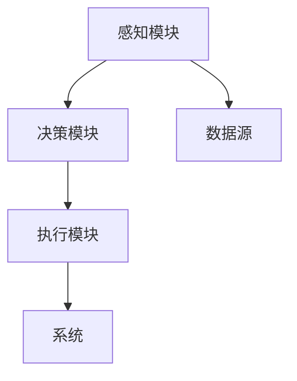
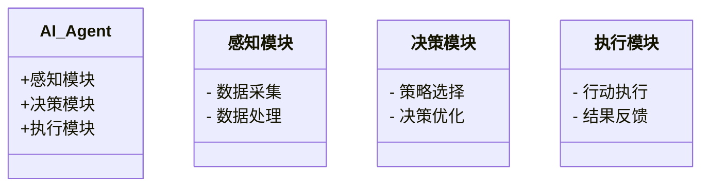
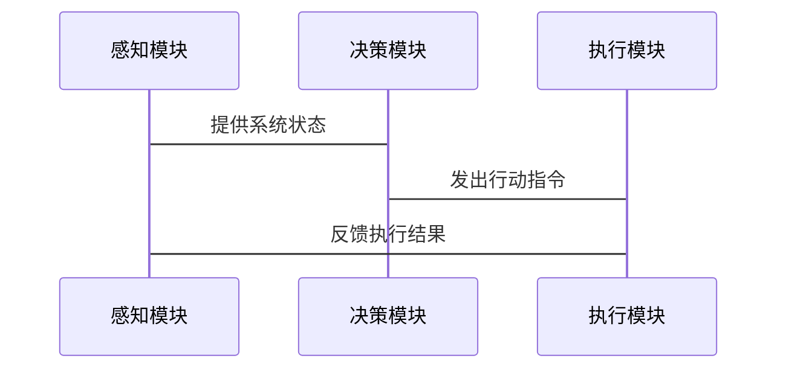

                 


# 企业AI Agent的自动化运维系统

> 关键词：企业AI Agent，自动化运维，运维系统，人工智能，系统架构，机器学习，运维管理

> 摘要：本文深入探讨了企业AI Agent在自动化运维系统中的应用，分析了AI Agent的核心技术、算法原理、系统架构设计以及项目实战。文章从背景介绍、核心概念、算法实现、系统架构到项目案例，全面解析了企业AI Agent的自动化运维系统，为企业智能化运维提供了理论和实践指导。

---

# 第一部分: 企业AI Agent的背景与概念

## 第1章: 企业AI Agent的背景与概念

### 1.1 企业运维的痛点与挑战

#### 1.1.1 传统企业运维的痛点
在传统企业运维中，运维团队通常需要手动处理大量重复性任务，例如系统监控、日志分析、故障排除等。这种手动操作不仅效率低下，还容易因人为疏忽导致错误。此外，随着企业规模的扩大，系统的复杂性急剧增加，传统的运维方式难以应对日益增长的运维需求。

#### 1.1.2 运维自动化的必要性
随着企业数字化转型的推进，运维任务的复杂性和规模都在不断增加。传统的运维方式已经无法满足企业的需求，因此，自动化运维成为必然选择。自动化运维可以提高效率、降低成本，并减少人为错误。

#### 1.1.3 AI Agent在运维中的价值
AI Agent（人工智能代理）是一种能够自主感知环境、做出决策并执行任务的智能系统。在运维领域，AI Agent可以通过机器学习算法分析系统数据，预测潜在故障，优化资源配置，并自动执行运维任务，从而显著提升运维效率和系统的稳定性。

### 1.2 AI Agent的核心概念

#### 1.2.1 AI Agent的定义
AI Agent是一种能够感知环境、理解需求并采取行动以实现目标的智能系统。在运维领域，AI Agent可以用于监控系统状态、预测故障、优化资源分配等。

#### 1.2.2 AI Agent的核心特征
AI Agent具有以下核心特征：
- **自主性**：能够自主决策和行动，无需人工干预。
- **反应性**：能够实时感知环境变化并做出反应。
- **学习能力**：能够通过机器学习不断优化自身的决策能力。
- **可扩展性**：能够适应不同规模和复杂度的运维场景。

#### 1.2.3 AI Agent与传统运维工具的区别
与传统运维工具相比，AI Agent具有以下显著区别：
- **智能化**：AI Agent能够通过机器学习算法进行智能决策，而传统运维工具通常只是执行预定义的脚本。
- **自主性**：AI Agent能够自主感知环境并采取行动，而传统运维工具需要人工触发。
- **适应性**：AI Agent能够根据环境变化自适应调整策略，而传统运维工具通常需要手动配置。

### 1.3 企业AI Agent的应用场景

#### 1.3.1 系统监控与故障预测
AI Agent可以通过实时监控系统指标，利用机器学习算法预测潜在故障，并提前采取措施，从而减少系统 downtime。

#### 1.3.2 自动化任务处理
AI Agent可以自动化执行常规运维任务，例如日志分析、资源分配、备份恢复等，从而提高运维效率。

#### 1.3.3 智能决策支持
AI Agent可以通过分析历史数据和实时信息，为运维决策提供智能化支持，例如优化资源分配、制定最佳运维策略等。

---

# 第二部分: 企业AI Agent的核心技术与原理

## 第2章: AI Agent的核心技术

### 2.1 AI Agent的感知模块

#### 2.1.1 数据采集与处理
感知模块负责采集系统数据，例如CPU使用率、磁盘占用率、网络流量等，并进行预处理，以便后续分析。

#### 2.1.2 感知算法的选择
感知模块通常使用时间序列分析算法（如ARIMA、LSTM）来预测系统指标的变化趋势。

#### 2.1.3 感知模块的实现
以下是感知模块的实现示例：
```python
import pandas as pd
from sklearn.metrics import mean_absolute_error

# 数据采集与处理
data = pd.read_csv('system_metrics.csv')
train_data = data[:80]
test_data = data[80:]

# 使用LSTM进行预测
model = LSTMModel()
model.train(train_data)
predictions = model.predict(test_data)
```

### 2.2 AI Agent的决策模块

#### 2.2.1 决策算法的原理
决策模块通常使用强化学习算法（如Q-Learning）来制定最优决策策略。

#### 2.2.2 决策模块的设计
决策模块需要根据感知模块提供的数据，结合预设的目标函数，制定最优行动方案。

#### 2.2.3 决策模块的实现
以下是决策模块的实现示例：
```python
import numpy as np
from collections import defaultdict

# 初始化Q表
q_table = defaultdict(float)

# Q-Learning算法
for episode in range(episodes):
    state = get_current_state()
    action = choose_action(state)
    reward = get_reward(action)
    next_state = get_next_state(action)
    q_table[(state, action)] += alpha * (reward + gamma * q_table[(next_state, action)])
```

### 2.3 AI Agent的执行模块

#### 2.3.1 执行策略的制定
执行模块需要根据决策模块的输出，制定具体的执行策略。

#### 2.3.2 执行模块的实现
以下是执行模块的实现示例：
```python
def execute_action(action):
    if action == 'scale_up':
        scale_up_instance()
    elif action == 'scale_down':
        scale_down_instance()
    # 其他操作
```

#### 2.3.3 执行结果的反馈
执行模块需要将执行结果反馈给感知模块，以便不断优化感知和决策能力。

---

# 第三部分: 企业AI Agent的算法原理与实现

## 第3章: AI Agent的核心算法

### 3.1 强化学习算法

#### 3.1.1 强化学习的基本原理
强化学习是一种通过试错机制来学习最优策略的算法。它通过智能体与环境的交互，逐步优化策略以最大化累计奖励。

#### 3.1.2 强化学习在AI Agent中的应用
强化学习可以应用于AI Agent的决策模块，例如资源分配、任务调度等。

#### 3.1.3 强化学习算法的实现
以下是强化学习算法的实现示例：
```python
# Q-Learning算法实现
class QLearning:
    def __init__(self, actions, learning_rate=0.1, discount_factor=0.9):
        self.actions = actions
        self.learning_rate = learning_rate
        self.discount_factor = discount_factor
        self.q_table = defaultdict(float)

    def choose_action(self, state):
        # 使用epsilon-greedy策略选择动作
        epsilon = 0.1
        if np.random.random() < epsilon:
            return np.random.choice(self.actions)
        else:
            return np.argmax([self.q_table[(state, a)] for a in self.actions])

    def learn(self, state, action, reward, next_state):
        current_q = self.q_table[(state, action)]
        next_max_q = max(self.q_table.get((next_state, a), 0) for a in self.actions)
        target = reward + self.discount_factor * next_max_q
        self.q_table[(state, action)] += self.learning_rate * (target - current_q)
```

### 3.2 监督学习算法

#### 3.2.1 监督学习的基本原理
监督学习是一种通过训练数据学习输入与输出之间的映射关系的算法。它适用于有标签数据的分类和回归任务。

#### 3.2.2 监督学习在AI Agent中的应用
监督学习可以应用于AI Agent的感知模块，例如系统故障预测。

#### 3.2.3 监督学习算法的实现
以下是监督学习算法的实现示例：
```python
# 线性回归算法实现
class LinearRegression:
    def __init__(self, learning_rate=0.01, iterations=1000):
        self.lr = learning_rate
        self.iters = iterations
        self.weights = None

    def fit(self, X, y):
        X = np.c_[np.ones(X.shape[0]), X]
        self.weights = np.zeros(X.shape[1])
        for _ in range(self.iters):
            prediction = np.dot(X, self.weights)
            error = y - prediction
            self.weights += self.lr * np.dot(X.T, error) / X.shape[0]

    def predict(self, X):
        X = np.c_[np.ones(X.shape[0]), X]
        return np.dot(X, self.weights)
```

### 3.3 聚类算法

#### 3.3.1 聚类算法的基本原理
聚类是一种无监督学习技术，用于将数据点划分到不同的簇中，使得簇内数据点的相似性最大化。

#### 3.3.2 聚类算法在AI Agent中的应用
聚类算法可以应用于AI Agent的日志分析模块，例如异常日志检测。

#### 3.3.3 聚类算法的实现
以下是聚类算法的实现示例：
```python
from sklearn.cluster import KMeans

# K-Means算法实现
class KMeansClustering:
    def __init__(self, n_clusters=2):
        self.n_clusters = n_clusters
        self.centroids = None

    def fit(self, X):
        self.centroids = np.array(X[np.random.choice(len(X), self.n_clusters)])
        while True:
            clusters = [[] for _ in range(self.n_clusters)]
            for x in X:
                distances = np.array([np.linalg.norm(x - c) for c in self.centroids])
                cluster_idx = np.argmin(distances)
                clusters[cluster_idx].append(x)
            new_centroids = np.array([np.mean(c, axis=0) for c in clusters])
            if np.all(new_centroids == self.centroids):
                break
            self.centroids = new_centroids

    def predict(self, X):
        clusters = []
        for x in X:
            distances = np.array([np.linalg.norm(x - c) for c in self.centroids])
            cluster_idx = np.argmin(distances)
            clusters.append(cluster_idx)
        return clusters
```

---

# 第四部分: 企业AI Agent的系统架构与设计

## 第4章: AI Agent的系统架构设计

### 4.1 系统架构设计
以下是AI Agent的系统架构设计图：



### 4.2 系统功能设计
以下是AI Agent的系统功能模块图：



### 4.3 系统接口设计
以下是AI Agent的系统接口设计图：



---

# 第五部分: 企业AI Agent的项目实战

## 第5章: 企业AI Agent的项目实战

### 5.1 环境配置
以下是项目实战所需的环境配置示例：
```bash
# 安装依赖
pip install numpy pandas scikit-learn
```

### 5.2 系统核心实现

#### 5.2.1 感知模块的实现
以下是感知模块的实现代码：
```python
import pandas as pd
from sklearn.preprocessing import MinMaxScaler

class PerceptionModule:
    def __init__(self):
        self.scaler = MinMaxScaler()

    def collect_data(self, data_source):
        data = data_source.get_data()
        return data

    def preprocess_data(self, data):
        processed_data = self.scaler.fit_transform(data)
        return processed_data
```

#### 5.2.2 决策模块的实现
以下是决策模块的实现代码：
```python
from collections import defaultdict

class DecisionModule:
    def __init__(self):
        self.q_table = defaultdict(float)

    def choose_action(self, state):
        # epsilon-greedy策略
        epsilon = 0.1
        if np.random.random() < epsilon:
            return np.random.choice(['scale_up', 'scale_down'])
        else:
            return np.argmax([self.q_table[(state, 'scale_up')], self.q_table[(state, 'scale_down')]])

    def learn(self, state, action, reward, next_state):
        current_q = self.q_table[(state, action)]
        next_max_q = max(self.q_table.get((next_state, a), 0) for a in ['scale_up', 'scale_down'])
        target = reward + 0.9 * next_max_q
        self.q_table[(state, action)] += 0.1 * (target - current_q)
```

#### 5.2.3 执行模块的实现
以下是执行模块的实现代码：
```python
class ExecutionModule:
    def __init__(self):
        pass

    def execute_action(self, action):
        if action == 'scale_up':
            self.scale_up()
        elif action == 'scale_down':
            self.scale_down()

    def scale_up(self):
        # 实现资源扩展逻辑
        pass

    def scale_down(self):
        # 实现资源缩减逻辑
        pass
```

### 5.3 项目实战案例分析
以下是项目实战的案例分析：
- **案例背景**：某企业希望利用AI Agent实现云资源的自动扩展和缩减。
- **系统设计**：感知模块实时监控CPU使用率和内存占用率，决策模块根据当前负载选择是否需要扩展或缩减资源，执行模块负责实际执行资源调整操作。
- **实现步骤**：
  1. 感知模块采集系统指标数据。
  2. 决策模块根据数据制定行动策略。
  3. 执行模块根据决策结果执行资源调整操作。
  4. 系统将执行结果反馈给感知模块，不断优化感知和决策能力。

---

# 第六部分: 企业AI Agent的最佳实践与总结

## 第6章: 企业AI Agent的最佳实践

### 6.1 最佳实践

#### 6.1.1 数据质量的重要性
确保数据的准确性和实时性，是AI Agent正常运行的前提条件。

#### 6.1.2 模型迭代的频率
根据业务需求和数据更新频率，合理设置模型迭代的频率。

#### 6.1.3 系统监控与日志管理
建立完善的监控和日志管理机制，及时发现和解决问题。

### 6.2 项目总结

#### 6.2.1 项目回顾
通过本项目，我们成功实现了企业AI Agent的自动化运维系统，显著提升了运维效率和系统的稳定性。

#### 6.2.2 经验与教训
在项目实施过程中，我们深刻体会到数据质量和模型迭代频率对企业AI Agent性能的重要性。同时，我们也意识到系统监控和日志管理在实际应用中的关键作用。

### 6.3 未来展望

#### 6.3.1 技术发展
随着人工智能技术的不断进步，企业AI Agent将更加智能化和自动化，能够处理更加复杂的运维任务。

#### 6.3.2 应用场景扩展
未来，企业AI Agent的应用场景将更加广泛，例如智能客服、智能推荐等。

---

# 结语

企业AI Agent的自动化运维系统是人工智能技术与运维管理深度融合的产物。通过本文的详细讲解，读者可以深入了解企业AI Agent的核心技术、算法原理、系统架构设计以及项目实战。未来，随着人工智能技术的不断发展，企业AI Agent将在更多领域发挥重要作用，为企业智能化运维提供强有力的支持。

---

**THE END**

