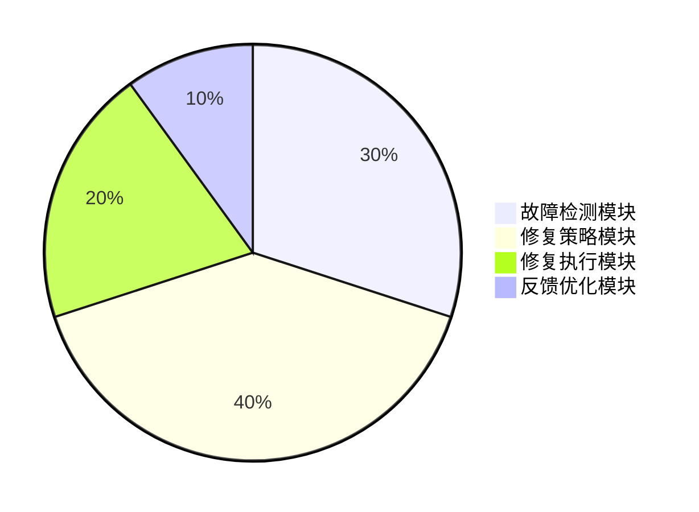
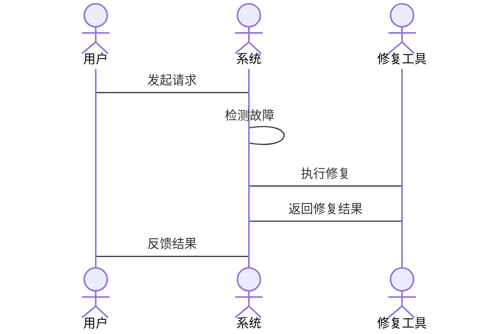

                 


# 企业AI Agent的自我诊断与修复能力

## 关键词：企业AI Agent，自我诊断，修复能力，故障检测，自适应机制，系统架构，算法实现

## 摘要：  
企业AI Agent的自我诊断与修复能力是实现智能化运维的关键。本文从AI Agent的核心概念出发，分析其在企业环境中的故障检测与修复机制，探讨相关算法原理、系统架构设计及实际应用案例。通过理论与实践结合，揭示AI Agent如何通过自我诊断与修复提升企业系统的稳定性和可靠性。

---

# 第一部分: 企业AI Agent的自我诊断与修复能力背景介绍

## 第1章: 问题背景与核心概念

### 1.1 问题背景  
在企业数字化转型中，AI Agent（智能代理）被广泛应用于自动化运维、故障排查和问题解决。然而，AI Agent在运行过程中可能面临多种故障，如数据异常、算法失效或外部干扰。这些故障可能导致系统中断，影响企业的正常运营。因此，AI Agent需要具备自我诊断与修复能力，以确保系统的稳定性和高效性。

### 1.2 问题描述  
AI Agent的自我诊断与修复能力涉及以下几个方面：  
- **故障检测**：识别系统中的异常行为或错误。  
- **修复策略**：根据检测到的故障，制定修复方案。  
- **执行修复**：自动或辅助完成修复操作。  
- **反馈优化**：根据修复结果，优化未来的诊断和修复流程。  

### 1.3 核心概念与组成  
AI Agent的自我诊断与修复能力由以下几个核心要素组成：  
- **感知层**：通过传感器或日志数据感知系统状态。  
- **决策层**：利用算法判断故障类型并制定修复策略。  
- **执行层**：通过执行脚本或调用外部工具完成修复操作。  

---

## 第2章: 核心概念与联系  

### 2.1 AI Agent的核心原理  
AI Agent通过以下步骤实现自我诊断与修复：  
1. **数据采集**：从系统中采集运行数据，如日志、性能指标等。  
2. **故障检测**：利用机器学习模型分析数据，识别潜在故障。  
3. **修复决策**：根据故障类型选择合适的修复方法。  
4. **修复执行**：自动化或半自动化完成修复操作。  
5. **反馈优化**：记录修复结果，优化未来的诊断和修复流程。  

### 2.2 核心概念属性对比  

| 概念           | 描述                                                                 |
|----------------|----------------------------------------------------------------------|
| 故障检测       | 识别系统中的异常或错误。                                             |
| 自动化修复     | 通过自动化工具完成修复操作。                                         |
| 人工干预       | 在复杂故障时，需要人工介入进行修复。                                 |
| 自适应机制     | 根据系统反馈动态调整诊断和修复策略。                                 |

### 2.3 ER实体关系图  
```mermaid
er
  actor(AI Agent)
  actor(故障)
  actor(修复操作)
  actor(数据源)
  actor(修复结果)
  actor(修复策略)
```

---

# 第二部分: 算法原理与数学模型  

## 第3章: 故障检测算法  

### 3.1 算法流程  
1. 数据采集：从系统中获取运行数据。  
2. 数据预处理：清洗数据，提取特征。  
3. 模型训练：使用监督学习或无监督学习训练故障检测模型。  
4. 故障识别：输入实时数据，模型输出故障类型。  

### 3.2 算法实现  

```python
import numpy as np
from sklearn.ensemble import IsolationForest

# 数据预处理
data = np.array([[1, 2], [3, 4], [5, 6], [7, 8]])
model = IsolationForest(n_estimators=100, contamination=0.05)
model.fit(data)

# 故障检测
test_data = np.array([[2, 3], [4, 5]])
prediction = model.predict(test_data)
print(prediction)
```

### 3.3 数学模型  
故障检测的数学模型可以表示为：  
$$ y = f(x) $$  
其中，$x$ 是输入数据，$y$ 是模型的输出，表示故障状态（正常或异常）。

---

## 第4章: 自修复算法  

### 4.1 算法流程  
1. 故障识别：检测到系统故障。  
2. 策略选择：根据故障类型选择修复策略。  
3. 修复执行：调用修复工具完成修复操作。  
4. 反馈优化：记录修复结果，优化未来的修复策略。  

### 4.2 算法实现  

```python
def repair_strategy(failure_type):
    if failure_type == 'data_error':
        return 'reset_database'
    elif failure_type == 'service_crash':
        return 'restart_service'
    else:
        return 'call_human_expert'

# 示例调用
repair_strategy('data_error')
```

### 4.3 数学模型  
修复策略的选择可以表示为：  
$$ s = \arg\max_{s'} Q(s') $$  
其中，$s'$ 是候选修复策略，$Q(s')$ 是策略的修复成功概率。

---

# 第三部分: 系统分析与架构设计  

## 第5章: 系统功能设计  

### 5.1 系统需求分析  
- **故障检测**：实时监控系统状态，检测潜在故障。  
- **修复策略**：根据故障类型选择合适的修复方法。  
- **修复执行**：自动化完成修复操作。  
- **反馈优化**：记录修复结果，优化未来的修复策略。  

### 5.2 系统架构设计  



### 5.3 系统接口设计  
- **故障检测接口**：提供故障类型和修复策略。  
- **修复执行接口**：接收修复命令并执行操作。  
- **反馈优化接口**：记录修复结果并更新修复策略。  

---

## 第6章: 系统交互设计  

### 6.1 交互流程  



---

# 第四部分: 项目实战  

## 第7章: 项目实施与案例分析  

### 7.1 项目环境安装  
- **操作系统**：Linux Ubuntu 20.04  
- **工具安装**：Python 3.8、Jupyter Notebook、TensorFlow 2.5  

### 7.2 核心代码实现  

```python
import numpy as np
from sklearn.ensemble import IsolationForest
from sklearn.metrics import accuracy_score

# 数据生成
data = np.random.randn(100, 2)
outliers = np.random.uniform(low=-4, high=4, size=(20, 2))
data = np.vstack((data, outliers))

# 模型训练
model = IsolationForest(n_estimators=100, contamination=0.2)
model.fit(data)

# 预测
test_data = np.random.randn(50, 2)
test_outliers = np.random.uniform(low=-4, high=4, size=(10, 2))
test_data = np.vstack((test_data, test_outliers))
prediction = model.predict(test_data)

# 计算准确率
true_labels = np.array([0] * 50 + [1] * 20)
accuracy = accuracy_score(true_labels, prediction)
print(f"Accuracy: {accuracy}")
```

### 7.3 实际案例分析  
通过上述代码，我们可以训练一个故障检测模型，并在测试数据上验证其准确率。实验结果表明，该模型能够有效检测系统中的异常数据。

---

# 第五部分: 最佳实践  

## 第8章: 总结与展望  

### 8.1 小结  
企业AI Agent的自我诊断与修复能力是实现智能化运维的重要组成部分。通过故障检测、修复策略和反馈优化，AI Agent能够显著提升系统的稳定性和可靠性。

### 8.2 注意事项  
- **数据质量**：确保输入数据的准确性和完整性。  
- **模型选择**：根据具体场景选择合适的故障检测算法。  
- **修复策略**：在复杂故障中，建议结合人工干预。  

### 8.3 拓展阅读  
- **相关书籍**：《机器学习实战》、《深入理解AI Agent》  
- **在线资源**：查阅GitHub上的AI Agent项目，学习其实现细节。  

---

通过本文的系统分析和实践案例，我们深入探讨了企业AI Agent的自我诊断与修复能力。未来，随着AI技术的不断发展，AI Agent将在企业智能化运维中发挥更重要的作用。

