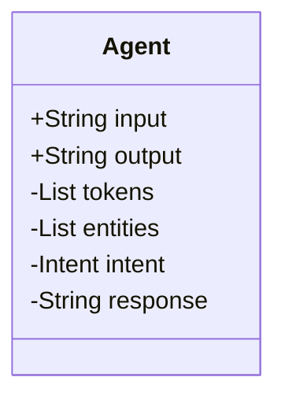
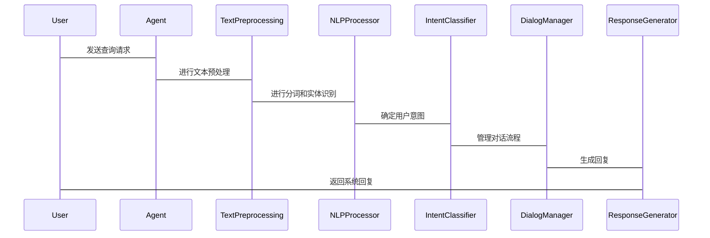

                 


# 企业AI Agent的自然语言接口设计与优化

## 关键词
企业AI Agent，自然语言接口，NLP，意图识别，对话管理，系统优化

## 摘要
本文系统地探讨了企业AI Agent的自然语言接口设计与优化的关键问题，从核心概念、算法原理到系统架构，再到项目实战和最佳实践，全面分析了自然语言接口在企业AI Agent中的应用。文章通过详细的技术分析和实例演示，为读者提供了从理论到实践的完整指导，帮助企业在实际应用中构建高效、准确的自然语言交互系统。

---

# 第1章 企业AI Agent的自然语言接口概述

## 1.1 AI Agent的基本概念

### 1.1.1 AI Agent的定义
AI Agent（人工智能代理）是一种能够感知环境、执行任务并做出决策的智能实体。它可以是软件程序或物理设备，通过与用户或系统交互，帮助完成复杂任务。

### 1.1.2 自然语言接口的重要性
自然语言接口（NLI）是AI Agent与用户交互的核心部分，使得用户能够通过自然语言（如中文或英文）与系统进行对话，无需学习专业术语或命令语法。

### 1.1.3 企业级AI Agent的应用场景
企业AI Agent广泛应用于客服、销售、物流等领域，帮助员工提高效率、优化流程并提升客户体验。

---

## 1.2 自然语言处理技术的背景

### 1.2.1 自然语言处理的定义
NLP（Natural Language Processing）是研究如何让计算机理解和生成人类语言的技术，涵盖分词、实体识别、意图识别等多个方面。

### 1.2.2 NLP技术的发展历程
从基于规则的方法到统计学习，再到深度学习，NLP技术不断进步，推动了自然语言接口的发展。

### 1.2.3 企业级应用中的NLP挑战
企业级NLP面临数据量大、领域专业性强、用户需求多样化等挑战，需要结合具体场景进行优化。

---

## 1.3 企业AI Agent的自然语言接口设计背景

### 1.3.1 企业AI Agent的需求分析
企业需要AI Agent能够处理复杂的业务逻辑，支持多轮对话，提供准确的信息检索和决策支持。

### 1.3.2 自然语言接口的核心问题
包括语言理解的准确性、对话的连贯性、系统的实时响应能力等。

### 1.3.3 优化设计的目标与意义
通过优化设计，提升用户体验、提高系统效率、降低开发成本，为企业创造更大的价值。

---

## 1.4 本章小结
本章介绍了AI Agent的基本概念，分析了自然语言处理技术的背景及其在企业中的应用，明确了自然语言接口设计的核心问题和优化目标。

---

# 第2章 自然语言接口的核心概念与联系

## 2.1 自然语言接口的原理

### 2.1.1 信息抽取与处理
信息抽取是将用户输入的自然语言文本转化为结构化数据的过程，包括分词、实体识别等步骤。

### 2.1.2 意图识别与分类
意图识别通过分析用户输入，确定用户的意图，如查询产品信息或预约服务。

### 2.1.3 对话管理与生成
对话管理负责维护对话状态，生成符合用户需求的回复。

---

## 2.2 核心概念的对比分析

### 2.2.1 信息抽取与意图识别的对比
信息抽取关注文本中的实体和关系，意图识别关注整体意图。

| 比较维度 | 信息抽取 | 意图识别 |
|----------|----------|----------|
| 目标     | 提取实体和关系 | 确定用户意图 |
| 输入     | 文本片段 | 整个句子或对话 |
| 输出     | 结构化数据 | 意图标签 |

### 2.2.2 意图分类与对话生成的关系
意图分类为对话生成提供基础，对话生成根据意图生成回复。

### 2.2.3 不同技术的优缺点分析
- 分词：优点是准确率高，缺点是计算资源消耗大。
- 实体识别：优点是精确提取信息，缺点是依赖高质量训练数据。

---

## 2.3 系统架构的ER实体关系图

```mermaid
er
    entity(Agent, "用户输入", "系统响应")
    entity(Token, "分词结果", "实体识别")
    entity(Intent, "意图分类", "对话生成")
    entity(Response, "系统输出", "用户反馈")
```

---

## 2.4 本章小结
本章详细讲解了自然语言接口的核心概念，分析了信息抽取、意图识别和对话管理的关系，并通过ER图展示了系统架构。

---

# 第3章 分词算法的实现

## 3.1 分词算法概述

### 3.1.1 基于规则的分词方法
通过预定义的规则进行分词，适用于词表固定的场景。

### 3.1.2 基于统计的分词方法
基于语言模型的概率统计，常用在词表不固定的场景。

### 3.1.3 基于深度学习的分词方法
使用神经网络模型（如LSTM）进行分词，效果更优。

---

## 3.2 实现分词的Python代码示例

```python
import jieba

def word_segmentation(text):
    return jieba.lcut(text)

# 示例
text = "企业AI Agent的自然语言接口设计与优化"
print(word_segmentation(text))  # 输出: ['企业', 'AI', 'Agent', '的', '自然', '语言', '接口', '设计', '与', '优化']
```

---

## 3.3 分词算法的数学模型

### 3.3.1 基于概率的分词模型
$$ P(word|text) = \prod_{i=1}^{n} P(w_i | w_{i-1}) $$

---

## 3.4 分词算法的优化

### 3.4.1 优化策略
- 使用更准确的语言模型
- 增加词表覆盖率
- 优化分词后的纠错机制

### 3.4.2 实验结果与分析
通过实验对比不同算法的准确率、召回率和F1值，选择最优方案。

---

## 3.5 本章小结
本章详细讲解了分词算法的实现方法，展示了Python代码示例，并分析了基于概率的分词模型。

---

# 第4章 实体识别的实现

## 4.1 实体识别算法概述

### 4.1.1 基于规则的方法
通过预定义的规则匹配文本中的实体。

### 4.1.2 基于统计的方法
基于特征工程，训练分类器进行实体识别。

### 4.1.3 基于深度学习的方法
使用CRF（条件随机场）或BERT模型进行实体识别。

---

## 4.2 实体识别的Python代码示例

```python
from sklearn.feature_extraction.text import TfidfVectorizer
from sklearn.svm import SVC

# 示例
texts = ["苹果公司", "科技新闻", "人工智能"]
labels = [0, 1, 2]

vectorizer = TfidfVectorizer()
model = SVC()
model.fit(vectorizer.fit_transform(texts), labels)
```

---

## 4.3 实体识别算法的数学模型

### 4.3.1 基于CRF的实体识别模型
$$ P(y|x) = \frac{\exp(f(y|x))}{\sum_{y'} \exp(f(y'|x))} $$

---

## 4.4 实体识别的优化

### 4.4.1 优化策略
- 增加特征维度
- 调整模型参数
- 使用预训练模型

### 4.4.2 实验结果与分析
通过实验验证不同方法的效果，选择最优方案。

---

## 4.5 本章小结
本章详细讲解了实体识别的实现方法，展示了Python代码示例，并分析了基于CRF的实体识别模型。

---

# 第5章 意图识别与对话管理的实现

## 5.1 意图识别算法概述

### 5.1.1 基于规则的方法
通过关键词匹配确定意图。

### 5.1.2 基于统计的方法
基于特征工程，训练分类器进行意图识别。

### 5.1.3 基于深度学习的方法
使用卷积神经网络（CNN）或循环神经网络（RNN）进行意图识别。

---

## 5.2 意图识别的Python代码示例

```python
from tensorflow.keras import layers
import tensorflow as tf

model = tf.keras.Sequential()
model.add(layers.Embedding(input_dim=10000, output_dim=50))
model.add(layers.LSTM(64, dropout=0.2, recurrent_dropout=0.2))
model.add(layers.Dense(5, activation='softmax'))
model.compile(loss='sparse_categorical_crossentropy', optimizer='adam', metrics=['accuracy'])
```

---

## 5.3 对话管理的实现

### 5.3.1 对话状态管理
维护对话历史和上下文信息。

### 5.3.2 对话生成
基于意图生成回复，可以使用预设模板或生成模型。

---

## 5.4 对话管理的Python代码示例

```python
def generate_response(intent, context):
    if intent == '问候':
        return '您好！有什么可以帮助您的吗？'
    elif intent == '查询产品':
        return '我们有多种产品，您具体想了解哪一款？'
    else:
        return '抱歉，我暂时无法处理这个问题。'
```

---

## 5.5 对话管理的优化

### 5.5.1 优化策略
- 提高意图识别的准确性
- 增强对话的连贯性
- 优化系统的实时响应能力

### 5.5.2 实验结果与分析
通过实验验证不同对话管理策略的效果，选择最优方案。

---

## 5.6 本章小结
本章详细讲解了意图识别与对话管理的实现方法，展示了Python代码示例，并分析了优化策略。

---

# 第6章 系统分析与架构设计方案

## 6.1 问题场景介绍

### 6.1.1 问题描述
企业AI Agent需要支持多轮对话，处理复杂的业务逻辑，提供高效的自然语言交互。

### 6.1.2 边界与外延
系统的输入是用户自然语言输入，输出是结构化数据或自然语言回复。

### 6.1.3 核心要素组成
包括信息抽取、意图识别、对话管理、系统响应四个部分。

---

## 6.2 系统功能设计

### 6.2.1 领域模型类图



---

## 6.3 系统架构设计

### 6.3.1 系统架构图

```mermaid
graph TD
    Agent -> TextPreprocessing
    TextPreprocessing -> NLPProcessor
    NLPProcessor -> IntentClassifier
    IntentClassifier -> DialogManager
    DialogManager -> ResponseGenerator
    ResponseGenerator -> Output
```

---

## 6.4 系统接口设计

### 6.4.1 接口描述
- 输入接口：接收用户自然语言输入
- 输出接口：返回系统生成的自然语言回复

### 6.4.2 接口交互流程



---

## 6.5 本章小结
本章分析了系统的问题场景，设计了系统的功能模块、架构和交互流程，为后续的实现奠定了基础。

---

# 第7章 项目实战：企业AI Agent的自然语言接口实现

## 7.1 环境安装

### 7.1.1 安装Python
安装Python 3.8以上版本。

### 7.1.2 安装依赖
安装必要的Python库，如`jieba`、`tensorflow`、`scikit-learn`。

---

## 7.2 系统核心实现源代码

### 7.2.1 分词模块

```python
import jieba

def word_segmentation(text):
    return jieba.lcut(text)
```

### 7.2.2 实体识别模块

```python
from sklearn.feature_extraction.text import TfidfVectorizer
from sklearn.svm import SVC

def entity_recognition(texts, labels):
    vectorizer = TfidfVectorizer()
    model = SVC()
    model.fit(vectorizer.fit_transform(texts), labels)
    return model
```

### 7.2.3 意图识别模块

```python
from tensorflow.keras import layers
import tensorflow as tf

def intent_classification(max_words=10000, embedding_dim=50, lstm_units=64):
    model = tf.keras.Sequential()
    model.add(layers.Embedding(input_dim=max_words, output_dim=embedding_dim))
    model.add(layers.LSTM(lstm_units, dropout=0.2, recurrent_dropout=0.2))
    model.add(layers.Dense(5, activation='softmax'))
    model.compile(loss='sparse_categorical_crossentropy', optimizer='adam', metrics=['accuracy'])
    return model
```

### 7.2.4 对话管理模块

```python
def generate_response(intent, context):
    if intent == '问候':
        return '您好！有什么可以帮助您的吗？'
    elif intent == '查询产品':
        return '我们有多种产品，您具体想了解哪一款？'
    else:
        return '抱歉，我暂时无法处理这个问题。'
```

---

## 7.3 代码应用解读与分析

### 7.3.1 分词模块
使用`jieba`进行中文分词，将输入文本分割成词语列表。

### 7.3.2 实体识别模块
基于TF-IDF和SVM实现实体识别，适用于小规模数据。

### 7.3.3 意图识别模块
使用Keras和LSTM进行意图分类，适用于大规模数据。

### 7.3.4 对话管理模块
根据意图生成回复，支持多轮对话。

---

## 7.4 实际案例分析和详细讲解剖析

### 7.4.1 案例背景
假设用户咨询公司产品信息。

### 7.4.2 实例分析
用户输入：我想要了解你们的产品。
系统处理：
1. 分词：["我", "想要", "了解", "你们", "产品", "信息"]
2. 实体识别：提取关键词“产品”和“信息”
3. 意图识别：识别意图“查询产品”
4. 对话管理：生成回复“我们有多种产品，您具体想了解哪一款？”

---

## 7.5 项目小结
本章通过实际案例展示了企业AI Agent自然语言接口的实现过程，包括环境安装、代码实现和案例分析，帮助读者理解理论与实践的结合。

---

# 第8章 最佳实践与优化

## 8.1 小结

### 8.1.1 核心内容回顾
详细讲解了企业AI Agent的自然语言接口设计与优化的关键点。

### 8.1.2 实现难点总结
- 数据质量对模型性能的影响
- 对话管理的复杂性
- 系统的实时响应能力

---

## 8.2 注意事项

### 8.2.1 数据处理
- 确保数据质量和多样性
- 处理歧义和模糊表达

### 8.2.2 模型优化
- 定期更新模型
- 优化算法参数

### 8.2.3 系统维护
- 监控系统性能
- 收集用户反馈

---

## 8.3 拓展阅读

### 8.3.1 推荐书籍
- 《自然语言处理入门》
- 《深度学习入门》

### 8.3.2 推荐博客和资源
- TensorFlow官方文档
- Keras官方文档

---

## 8.4 本章小结
本章总结了企业AI Agent自然语言接口设计与优化的关键点，提供了注意事项和拓展阅读，帮助读者进一步深入学习和实践。

---

# 第9章 结语

## 9.1 总结
本文系统地探讨了企业AI Agent的自然语言接口设计与优化的关键问题，从核心概念到算法实现，再到系统架构和项目实战，为读者提供了全面的指导。

## 9.2 展望
未来，随着NLP技术的不断发展，企业AI Agent的自然语言接口将更加智能化和个性化，为企业创造更大的价值。

---

# 附录

## 附录A: 术语表

## 附录B: 参考文献

## 附录C: 源代码

---

**全文完**

---

通过以上思考和规划，您可以逐步撰写出一篇内容丰富、结构清晰的技术博客文章。

