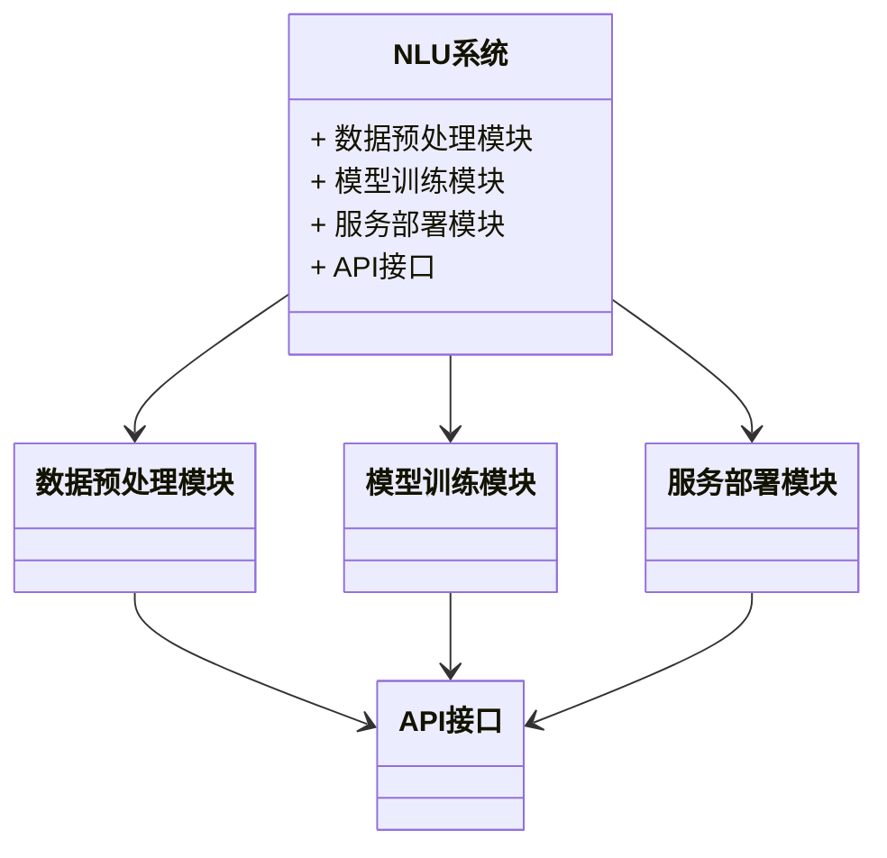
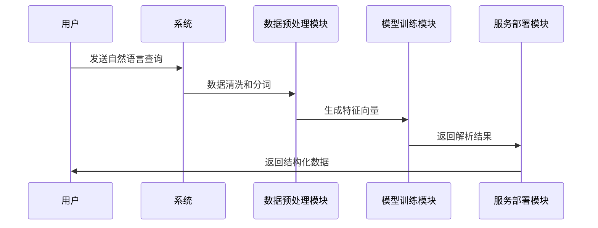

                 


# 企业AI Agent的自然语言理解(NLU)技术深化

## 关键词：企业AI Agent，自然语言理解，NLU，深度学习，大模型

## 摘要：  
本文深入探讨了企业AI Agent中自然语言理解（NLU）技术的核心概念、算法原理、系统架构及实际应用。通过分析NLU技术在企业中的背景、挑战与机遇，结合具体案例，详细讲解了NLU技术的实现过程，包括模型训练、优化策略和系统设计。文章还提供了从理论到实践的指导，帮助读者全面掌握企业AI Agent的NLU技术，并展望了未来的发展方向。

---

# 第1章: 企业AI Agent与NLU技术背景

## 1.1 NLU技术的定义与核心概念

### 1.1.1 自然语言理解(NLU)的定义  
自然语言理解（Natural Language Understanding, NLU）是自然语言处理（NLP）的核心技术之一，旨在让计算机能够理解和解析人类语言的语义、意图和情感。NLU的目标是将人类语言转化为计算机可处理的结构化信息。

### 1.1.2 NLU的核心概念与要素  
NLU的核心要素包括：  
1. **意图识别（Intent Recognition）**：识别用户输入的意图，例如“查询天气”或“预订酒店”。  
2. **实体识别（Entity Recognition）**：提取文本中的关键实体，如地点、时间、人名等。  
3. **语义解析（Semantic Parsing）**：将自然语言转化为结构化的数据，供计算机处理。  
4. **上下文理解（Contextual Understanding）**：基于上下文信息，提高理解的准确性。

### 1.1.3 NLU在企业AI Agent中的作用  
在企业AI Agent中，NLU技术是实现人机交互的核心桥梁，能够帮助企业自动化处理客户咨询、内部流程管理等任务。

## 1.2 NLU技术的发展历程

### 1.2.1 从传统NLP到深度学习NLU的演变  
传统NLP依赖于基于规则的系统，而深度学习的兴起推动了NLU技术的跨越式发展。

### 1.2.2 大模型时代对NLU的推动  
大模型（如GPT、BERT）的出现显著提升了NLU的准确性和泛化能力。

### 1.2.3 企业级NLU技术的现状与趋势  
企业级NLU正在从单一任务处理向多轮对话、跨场景应用方向发展。

## 1.3 企业AI Agent中的NLU应用

### 1.3.1 客户服务中的NLU应用  
通过NLU技术实现智能客服，提高客户满意度和处理效率。

### 1.3.2 企业内部流程自动化中的NLU应用  
自动化处理邮件、文档等任务，提升企业运营效率。

### 1.3.3 企业决策支持中的NLU应用  
通过分析会议记录、报告，辅助决策层制定战略。

## 1.4 NLU技术在企业中的挑战与机遇

### 1.4.1 数据质量与多样性问题  
企业数据的多样性和质量直接影响NLU模型的性能。

### 1.4.2 模型可解释性与鲁棒性  
企业需求对模型的可解释性和鲁棒性提出了更高要求。

### 1.4.3 企业级NLU的落地挑战  
企业环境中数据隐私、模型部署等问题需要重点关注。

## 1.5 本章小结  
本章从背景、发展历程、应用和挑战四个方面介绍了企业AI Agent中的NLU技术，为后续内容奠定了基础。

---

# 第2章: NLU技术的核心概念与原理

## 2.1 NLU的核心技术与模型

### 2.1.1 传统NLU技术与模型  
传统NLU依赖于基于规则的模型，例如正则表达式和有限状态机。

### 2.1.2 基于深度学习的NLU模型  
深度学习模型（如LSTM、Transformer）显著提升了NLU的性能。

### 2.1.3 大模型在NLU中的应用  
大模型通过预训练和微调，实现了更强大的语义理解能力。

## 2.2 NLU技术的关键环节

### 2.2.1 词法分析  
词法分析是NLU的基础，包括分词、词性标注等。

### 2.2.2 句法分析  
句法分析帮助理解句子的语法结构，例如主谓宾关系。

### 2.2.3 语义理解  
语义理解是NLU的核心，通过上下文和意图识别生成结构化输出。

## 2.3 NLU技术的核心算法与流程

### 2.3.1 基于规则的NLU算法  
基于规则的算法适用于特定场景，但灵活性较差。

### 2.3.2 统计模型与深度学习模型  
统计模型依赖特征工程，深度学习模型通过端到端训练提升性能。

### 2.3.3 模型训练与优化流程  
包括数据预处理、模型训练、评估与优化。

## 2.4 NLU技术的性能评估

### 2.4.1 常用评估指标  
准确率、召回率、F1值等。

### 2.4.2 评估方法与工具  
使用混淆矩阵、评估报告等工具进行评估。

### 2.4.3 企业级NLU的性能优化  
通过数据增强、模型调优等方法提升性能。

## 2.5 本章小结  
本章详细讲解了NLU的核心技术和算法，为后续实现提供了理论基础。

---

# 第3章: NLU技术的算法原理与实现

## 3.1 NLU模型的训练流程

### 3.1.1 数据预处理  
包括数据清洗、分词、标注等步骤。

### 3.1.2 模型训练  
通过深度学习模型进行端到端训练。

### 3.1.3 模型评估与优化  
通过评估指标优化模型性能。

## 3.2 基于深度学习的NLU算法

### 3.2.1 Transformer模型  
Transformer通过自注意力机制实现高效的语义理解。

### 3.2.2 BERT模型  
BERT通过预训练和微调，适用于多种NLU任务。

## 3.3 NLU算法的数学模型

### 3.3.1 Transformer模型的数学公式  
$$\text{Attention}(Q,K,V) = \text{softmax}\left(\frac{QK^T}{\sqrt{d_k}}\right)V$$

### 3.3.2 BERT模型的训练目标  
包括 MASK 任务和下一个句子预测任务。

## 3.4 NLU算法的优化策略

### 3.4.1 学习率衰减  
使用CosineAnnealingLR等策略优化学习率。

### 3.4.2 模型剪枝  
通过剪枝技术减少模型参数，提升效率。

## 3.5 本章小结  
本章通过数学公式和流程图详细讲解了NLU算法的实现原理。

---

# 第4章: 企业级NLU系统的架构设计

## 4.1 系统功能设计

### 4.1.1 模块划分  
包括数据预处理、模型训练、服务部署等模块。

### 4.1.2 功能模块设计  
使用Mermaid类图展示系统模块关系。



## 4.2 系统架构设计

### 4.2.1 分层架构  
包括数据层、模型层、服务层。

### 4.2.2 微服务架构  
通过微服务实现模块化设计。

## 4.3 系统接口设计

### 4.3.1 输入接口  
包括文本输入、上下文信息。

### 4.3.2 输出接口  
包括结构化数据、错误信息。

## 4.4 系统交互设计

### 4.4.1 用户与系统交互流程  
使用Mermaid序列图展示交互过程。



## 4.5 本章小结  
本章通过系统架构设计，展示了企业级NLU系统的实现方式。

---

# 第5章: 企业AI Agent NLU技术的项目实战

## 5.1 项目环境搭建

### 5.1.1 安装依赖  
使用Python和相关库（如TensorFlow、Hugging Face Transformers）。

### 5.1.2 配置开发环境  
安装Jupyter Notebook或VS Code插件。

## 5.2 核心功能实现

### 5.2.1 数据预处理  
编写代码进行文本清洗和分词。

### 5.2.2 模型训练  
使用预训练模型进行微调。

### 5.2.3 模型部署  
将模型部署为API服务。

## 5.3 代码实现与解读

### 5.3.1 数据预处理代码  
```python
import pandas as pd
from sklearn.model_selection import train_test_split

# 加载数据
data = pd.read_csv('nlu_dataset.csv')
X_train, X_test, y_train, y_test = train_test_split(data['text'], data['label'])
```

### 5.3.2 模型训练代码  
```python
from transformers import BertTokenizer, BertForSequenceClassification
from torch.utils.data import DataLoader, Dataset

class NLU Dataset(Dataset):
    def __init__(self, texts, labels, tokenizer, max_length):
        self.texts = texts
        self.labels = labels
        self.tokenizer = tokenizer
        self.max_length = max_length

    def __len__(self):
        return len(self.texts)

    def __getitem__(self, idx):
        text = self.texts[idx]
        label = self.labels[idx]
        encoding = self.tokenizer(
            text,
            max_length=self.max_length,
            padding='max_length',
            truncation=True,
            return_tensors='pt'
        )
        return {
            'input_ids': encoding['input_ids'].flatten(),
            'attention_mask': encoding['attention_mask'].flatten(),
            'label': label
        }

# 初始化tokenizer和模型
tokenizer = BertTokenizer.from_pretrained('bert-base-chinese')
model = BertForSequenceClassification.from_pretrained('bert-base-chinese', num_labels=len(unique_labels))
```

### 5.3.3 模型评估代码  
```python
from torch.utils.data import DataLoader
import torch.nn as nn

# 初始化数据加载器
train_dataset = NLU Dataset(X_train, y_train, tokenizer, max_length=128)
train_loader = DataLoader(train_dataset, batch_size=16, shuffle=True, num_workers=4)

# 定义训练函数
def train_model(model, train_loader, optimizer, epochs=3):
    model.train()
    for epoch in range(epochs):
        for batch in train_loader:
            optimizer.zero_grad()
            inputs = {k: v.to(device) for k, v in batch.items()}
            outputs = model(**inputs)
            loss = outputs.loss
            loss.backward()
            optimizer.step()

# 定义评估函数
def evaluate_model(model, test_loader):
    model.eval()
    correct = 0
    total = 0
    with torch.no_grad():
        for batch in test_loader:
            inputs = {k: v.to(device) for k, v in batch.items()}
            outputs = model(**inputs)
            predicted = torch.argmax(outputs.logits, dim=1)
            correct += (predicted == inputs['label']).sum().item()
            total += len(batch['label'])
    accuracy = correct / total
    return accuracy

# 执行训练和评估
optimizer = torch.optim.AdamW(model.parameters(), lr=2e-5)
train_model(model, train_loader, optimizer)
test_accuracy = evaluate_model(model, test_loader)
print(f"Test Accuracy: {test_accuracy:.4f}")
```

## 5.4 项目小结  
本章通过实际项目展示了企业AI Agent NLU技术的实现过程，包括环境搭建、数据处理、模型训练和部署。

---

# 第6章: 企业AI Agent NLU技术的最佳实践与展望

## 6.1 最佳实践

### 6.1.1 数据质量的重要性  
确保数据的多样性和代表性。

### 6.1.2 模型选择与优化  
根据需求选择合适的模型，并通过调优提升性能。

### 6.1.3 系统架构的可扩展性  
设计模块化架构，便于后续功能扩展。

## 6.2 小结  
总结全文，强调NLU技术在企业AI Agent中的重要性。

## 6.3 注意事项  
在实际应用中，需注意数据隐私、模型性能监控等问题。

## 6.4 拓展阅读  
推荐相关书籍和技术资料，供读者进一步学习。

---

# 附录: 参考文献与工具列表

## 附录A: 参考文献  
1. [1] BERT论文：《BERT: Pre-training of Deep Bidirectional Transformers for NLP》  
2. [2] Transformer论文：《Attention Is All You Need》  
3. [3] Hugging Face官方文档：https://huggingface.co/transformers/

## 附录B: 工具与库  
1. Python  
2. TensorFlow  
3. Hugging Face Transformers  
4. PyTorch

---

# 结语

企业AI Agent的NLU技术正在快速发展，未来将更加智能化和个性化。通过不断的技术创新和实践积累，企业能够更好地利用NLU技术实现智能化转型。

