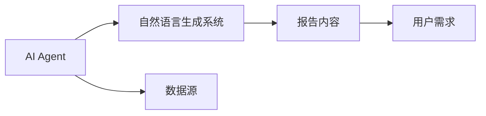
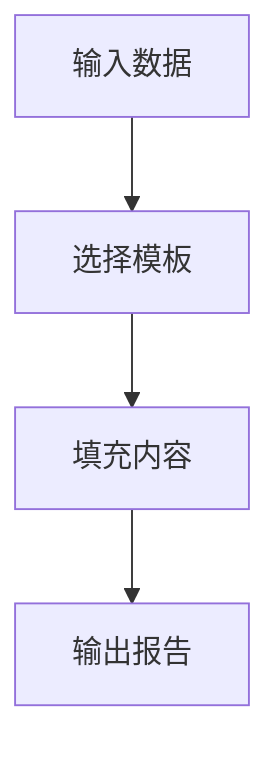
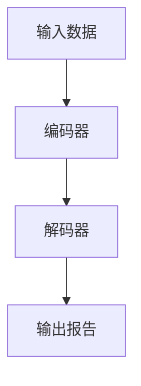
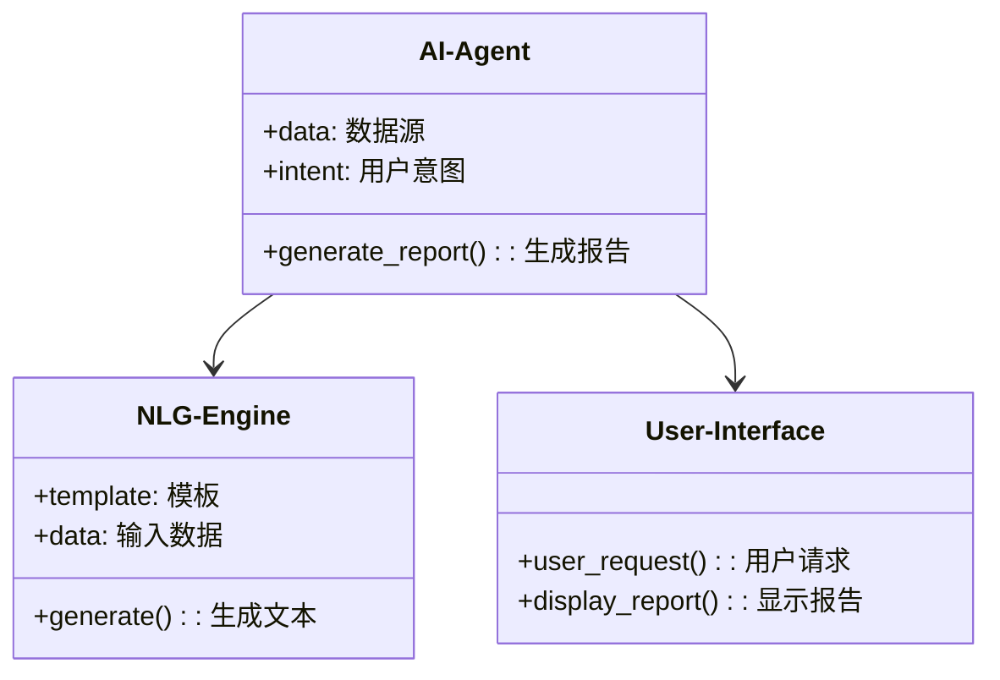
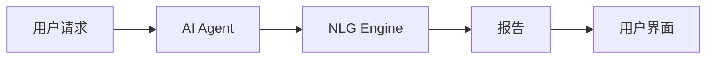
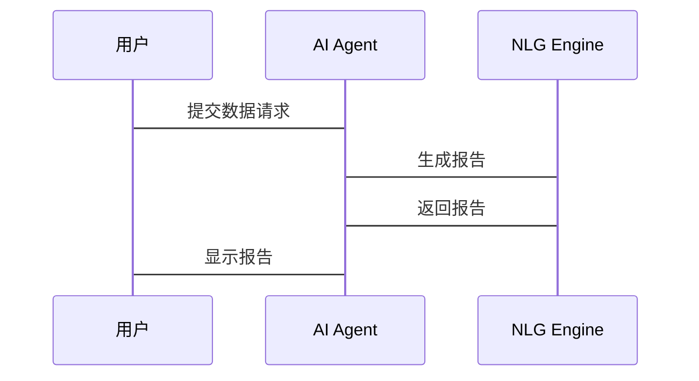

                 


# 企业AI Agent的自然语言生成(NLG)报告系统

> 关键词：企业，AI Agent，自然语言生成，报告系统，算法原理，系统架构，项目实战

> 摘要：本文详细探讨了企业AI Agent在自然语言生成(NLG)报告系统中的应用，从问题背景、核心概念、算法原理到系统架构、项目实战，全面分析了如何利用AI Agent提升企业报告生成的效率与准确性。文章内容涵盖了基于模板的NLG算法与基于生成模型的NLG算法的原理与实现，以及系统架构设计与优化策略。

---

## 第一部分: 企业AI Agent的自然语言生成(NLG)报告系统背景介绍

### 第1章: 问题背景与描述

#### 1.1 问题背景
- **当前企业信息处理的挑战**：企业在处理大量数据时，需要将数据转化为有意义的报告，但传统方法效率低、成本高且难以定制化。
- **自然语言生成技术的引入**：通过NLG技术，企业可以自动化生成结构化报告，提升效率与准确性。
- **AI Agent在企业中的角色**：AI Agent作为智能代理，能够理解用户需求、处理数据并生成符合要求的报告。

#### 1.2 问题描述
- **传统报告生成的痛点**：依赖人工操作，耗时长、成本高且容易出错。
- **AI Agent驱动的NLG报告的优势**：自动化、高效、可定制化。
- **企业应用场景的边界与外延**：适用于财务报告、市场分析、销售预测等场景，但不包括实时交互式报告生成。

#### 1.3 问题解决与核心要素
- **核心问题的解决思路**：利用AI Agent整合NLG技术，实现自动化报告生成。
- **系统组成与核心要素**：数据源、AI Agent、NLG引擎、用户需求解析模块。
- **核心要素之间的关系**：AI Agent负责数据处理与任务分配，NLG引擎负责生成报告，用户需求解析模块负责理解用户需求。

---

### 第2章: 核心概念与联系

#### 2.1 AI Agent与自然语言生成的定义
- **AI Agent的定义与属性**：智能代理，能够感知环境、执行任务。
- **自然语言生成(NLG)的定义与特点**：将结构化数据转化为自然语言文本的技术。
- **两者的联系与区别**：AI Agent是驱动者，NLG是生成工具。

#### 2.2 核心概念对比
- **AI Agent与传统软件代理的对比**：
  | 属性        | AI Agent                  | 传统软件代理                 |
  |-------------|---------------------------|------------------------------|
  | 智能性       | 高度智能，可自主决策      | 无智能性，按规则执行         |
  | 交互能力     | 支持自然语言交互          | 仅支持固定接口交互            |
  | 自适应性     | 能够自适应环境变化        | 无法自适应                    |
- **NLG与传统文本生成的对比**：
  | 属性        | NLG                       | 传统文本生成                 |
  |-------------|---------------------------|------------------------------|
  | 数据输入     | 结构化数据                | 文本或简单数据               |
  | 输出形式     | 自然语言文本              | 文本或固定格式               |
  | 灵活性       | 高度灵活                  | 较低                         |

#### 2.3 实体关系架构


---

### 第3章: 算法原理与数学模型

#### 3.1 基于模板的NLG算法
- **算法原理**：通过预定义模板和规则，将数据填充到模板中生成报告。
- **Mermaid流程图**：

- **Python代码实现**：
```python
def generate_report(template, data):
    report = template.format(**data)
    return report
```

#### 3.2 基于生成模型的NLG算法
- **算法原理**：使用深度学习模型（如Transformer）生成自然语言文本。
- **数学模型**：
  - **编码器-解码器结构**：
    $$\text{Encoder}(\text{Input}) \rightarrow \text{Context}$$
    $$\text{Decoder}(\text{Context}) \rightarrow \text{Output}$$
  - **注意力机制**：
    $$\text{Attention}(Q, K, V) = \text{softmax}(\frac{QK^T}{\sqrt{d}})V$$
- **Mermaid流程图**：


---

## 第二部分: 企业AI Agent的自然语言生成(NLG)报告系统架构与实现

### 第4章: 系统分析与架构设计

#### 4.1 问题场景介绍
- **典型场景**：企业需要根据财务数据生成季度报告。
- **系统目标**：快速、准确地生成符合用户需求的报告。

#### 4.2 系统功能设计
- **领域模型**：


#### 4.3 系统架构设计
- **架构图**：


#### 4.4 系统交互流程
- **序列图**：


---

### 第5章: 项目实战

#### 5.1 环境安装
- **所需库**：transformers, pytorch, numpy。
- **安装命令**：
  ```bash
  pip install transformers pytorch numpy
  ```

#### 5.2 系统核心实现

##### 5.2.1 数据预处理
```python
import pandas as pd

data = pd.read_csv('input.csv')
preprocessed_data = data.dropna().fillna(0)
```

##### 5.2.2 模型训练
```python
from transformers import AutoModelForMaskedLM, AutoTokenizer

model = AutoModelForMaskedLM.from_pretrained('facebook/marian-large')
tokenizer = AutoTokenizer.from_pretrained('facebook/marian-large')
```

##### 5.2.3 报告生成
```python
def generate_report(prompt, model, tokenizer):
    inputs = tokenizer(prompt, return_tensors='pt')
    outputs = model.generate(inputs.input_ids, max_length=500)
    report = tokenizer.decode(outputs[0], skip_special_tokens=True)
    return report
```

#### 5.3 案例分析
- **案例背景**：生成季度销售报告。
- **代码实现**：
  ```python
  prompt = "根据以下数据生成季度销售报告：\n" + preprocessed_data.to_string()
  final_report = generate_report(prompt, model, tokenizer)
  print(final_report)
  ```

---

### 第6章: 最佳实践与小结

#### 6.1 小结
- **关键点回顾**：AI Agent与NLG技术的结合，提升了企业报告生成的效率与准确性。
- **成功经验总结**：数据质量、模型调优与用户反馈是系统优化的关键。

#### 6.2 注意事项
- **数据安全**：确保数据处理过程中的安全性。
- **模型选择**：根据需求选择合适的NLG模型。
- **用户反馈**：及时收集用户反馈以优化系统。

#### 6.3 拓展阅读
- 推荐书籍：《深度学习入门：基于Python和Keras》。
- 推荐博客：[Awesome NLP](https://github.com/guillaumebert/awesome-nlp).

---

通过本文的详细分析，我们可以看到企业AI Agent的自然语言生成报告系统在提升企业效率与准确性方面的巨大潜力。希望本文能为读者提供有价值的参考与启发。

