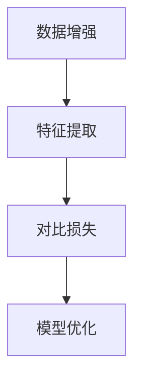
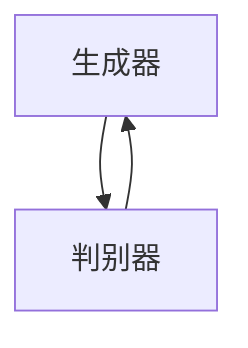
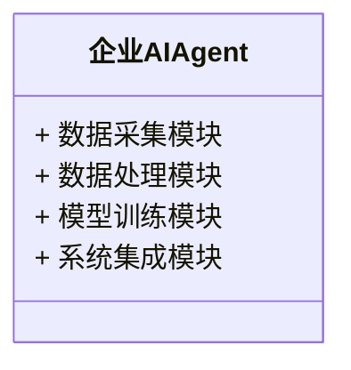
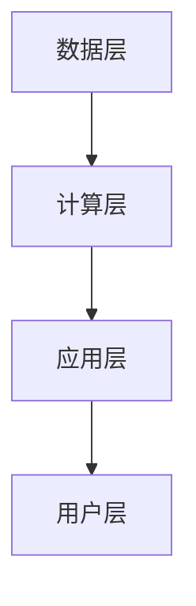
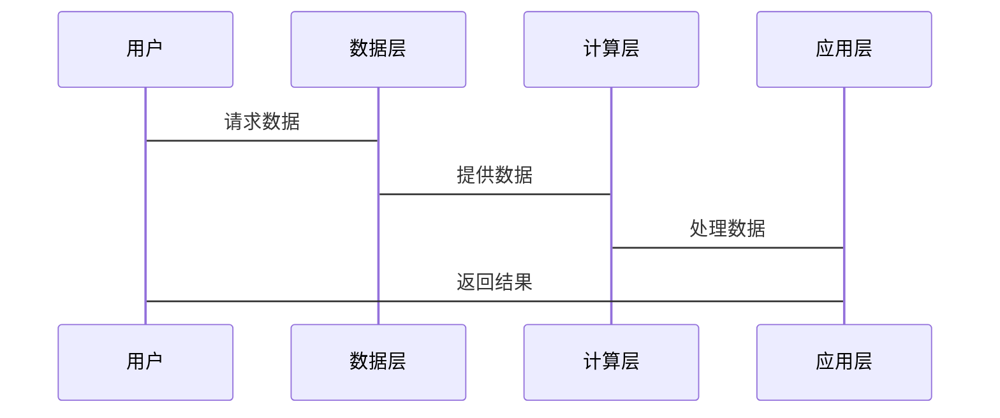

                 


# 企业AI Agent的自监督学习在非标准数据利用中的突破性实践

> 关键词：企业AI Agent，自监督学习，非标准数据，数据处理，机器学习

> 摘要：本文探讨了自监督学习在企业AI Agent中的应用，特别是在处理非标准数据方面的突破性实践。通过分析自监督学习的核心原理、算法实现、系统架构以及项目实战，本文详细展示了如何利用自监督学习解决企业AI Agent中的数据利用问题，并通过实际案例验证了其有效性。

---

# 第一部分: 企业AI Agent的自监督学习概述

## 第1章: 企业AI Agent与自监督学习背景介绍

### 1.1 问题背景与定义

#### 1.1.1 企业AI Agent的核心概念
企业AI Agent是一种能够理解、分析和执行企业级任务的智能系统，旨在通过自动化和智能化的方式提升企业的效率和决策能力。它通常需要处理大量的数据，包括结构化数据（如表格数据）和非结构化数据（如文本、图像、音频等）。

#### 1.1.2 自监督学习的定义与特点
自监督学习是一种无监督学习的变体，通过利用数据本身的结构来学习有用的特征表示。与传统的监督学习不同，自监督学习不需要大量标注数据，能够从未标记的数据中提取信息。其特点包括：
- **无监督性**：依赖数据本身的结构，不需要外部标注。
- **自适应性**：能够适应不同类型的非标准数据。
- **高效性**：在数据量较大的情况下，能够快速训练出有效的模型。

#### 1.1.3 非标准数据的定义与挑战
非标准数据指的是未经处理或格式不规则的数据，例如文本、图像、音频等。这类数据的处理难度较大，主要挑战包括：
- 数据格式多样，难以统一处理。
- 数据中包含大量噪声，影响模型的准确性。
- 数据量大，计算资源消耗高。

### 1.2 问题描述与解决思路

#### 1.2.1 非标准数据利用的难点
非标准数据的利用难点主要体现在以下方面：
- 数据格式多样，难以找到统一的处理方法。
- 数据中包含大量噪声，难以提取有用信息。
- 数据量大，计算资源有限，难以高效处理。

#### 1.2.2 自监督学习在数据处理中的作用
自监督学习通过利用数据本身的结构，能够有效地处理非标准数据。其主要作用包括：
- 从未标注数据中提取有用特征。
- 降低对标注数据的依赖，减少人工成本。
- 提高模型的泛化能力。

#### 1.2.3 企业AI Agent的目标与实现路径
企业AI Agent的目标是通过智能化手段提升企业的效率和决策能力。其实现路径包括：
- 数据采集与预处理。
- 模型训练与优化。
- 系统集成与部署。

### 1.3 问题的边界与外延

#### 1.3.1 自监督学习的适用场景
自监督学习适用于以下场景：
- 数据量大且标注成本高的场景。
- 数据类型多样，难以通过监督学习处理的场景。
- 需要实时处理数据的场景。

#### 1.3.2 非标准数据的类型与边界
非标准数据的类型包括：
- 文本数据：如新闻、邮件、聊天记录等。
- 图像数据：如图片、视频等。
- 音频数据：如语音、音乐等。

其边界主要体现在数据格式和数据量上，过于复杂或过大的数据可能会影响模型的处理效率。

#### 1.3.3 企业AI Agent的业务边界
企业AI Agent的业务边界主要体现在以下几个方面：
- 数据范围：仅处理企业内部数据。
- 业务目标：仅服务于企业的特定任务。
- 计算资源：受限于企业的计算能力。

### 1.4 核心概念结构与要素

#### 1.4.1 自监督学习的数学模型
自监督学习的数学模型通常包括以下几个部分：
- 数据表示：将数据映射到低维空间。
- 对比学习：通过对比数据的不同表示来学习特征。
- 生成对抗：通过生成器和判别器的对抗来优化模型。

#### 1.4.2 非标准数据的处理流程
非标准数据的处理流程包括：
1. 数据采集：从企业系统中获取非标准数据。
2. 数据预处理：清洗、归一化等。
3. 数据表示：将数据转换为模型可以处理的形式。
4. 模型训练：利用自监督学习方法训练模型。
5. 模型优化：通过调整参数提高模型性能。

#### 1.4.3 企业AI Agent的系统架构
企业AI Agent的系统架构包括以下几个部分：
- 数据层：存储企业数据。
- 计算层：负责数据处理和模型训练。
- 应用层：实现企业级任务。
- 用户层：提供用户界面，供用户交互。

---

## 第2章: 自监督学习的核心概念与联系

### 2.1 自监督学习的原理与算法

#### 2.1.1 对比学习的原理
对比学习是一种自监督学习方法，其核心思想是通过比较同一数据的不同表示来学习特征。具体步骤包括：
1. 数据增强：对数据进行变换，生成正样本和负样本。
2. 特征提取：将数据映射到特征空间。
3. 对比损失：计算正样本和负样本之间的相似度，优化模型参数。

#### 2.1.2 生成对抗网络的原理
生成对抗网络（GAN）是一种自监督学习方法，通过生成器和判别器的对抗来优化模型。生成器的目标是生成与真实数据相似的假数据，判别器的目标是区分真实数据和假数据。

#### 2.1.3 其他自监督学习方法
除了对比学习和生成对抗网络，还有其他自监督学习方法，如旋转词嵌入、遮蔽语言模型等。

### 2.2 核心概念的属性特征对比

| 概念       | 特性                | 优缺点             |
|------------|---------------------|---------------------|
| 数据类型    | 文本、图像、音频     | 数据类型多样，处理复杂 |
| 算法性能    | 对比学习性能高，生成对抗网络生成能力强 | 对比学习计算量小，生成对抗网络计算量大 |
| 应用场景    | 适用于多种非标准数据 | 场景广泛，适应性强   |

### 2.3 ER实体关系图架构

```mermaid
er
    actor 企业AI Agent
    actor 数据处理系统
    actor 用户
    database 数据库
    table 数据表
    relationship 数据关系
```

---

## 第3章: 自监督学习算法原理讲解

### 3.1 算法原理与流程

#### 3.1.1 对比学习流程



#### 3.1.2 生成对抗网络流程



### 3.2 算法实现与代码

#### 3.2.1 对比学习代码实现

```python
import torch
import torch.nn as nn

class ContrastiveLoss(nn.Module):
    def __init__(self, temperature=0.1):
        super(ContrastiveLoss, self).__init__()
        self.temperature = temperature

    def forward(self, features, labels):
        # 计算正样本和负样本的数量
        # 正样本：同一类别的样本
        # 负样本：不同类别的样本
        # 计算正样本和负样本的相似度
        # 计算损失
        pass
```

#### 3.2.2 生成对抗网络代码实现

```python
import torch
import torch.nn as nn

class Generator(nn.Module):
    def __init__(self, input_dim, output_dim):
        super(Generator, self).__init__()
        self.fc = nn.Linear(input_dim, output_dim)

    def forward(self, x):
        return self.fc(x)

class Discriminator(nn.Module):
    def __init__(self, input_dim, output_dim):
        super(Discriminator, self).__init__()
        self.fc = nn.Linear(input_dim, output_dim)

    def forward(self, x):
        return self.fc(x)
```

### 3.3 数学模型与公式

#### 3.3.1 对比学习的数学模型

$$ \text{损失函数} = \frac{1}{2} \left( \log \frac{p}{1-p} \right) $$

其中，$p$ 是正样本的概率，$1-p$ 是负样本的概率。

#### 3.3.2 生成对抗网络的数学模型

$$ \text{生成器损失} = -\mathbb{E}_{z \sim p_z} \log D(G(z)) $$
$$ \text{判别器损失} = -\mathbb{E}_{x \sim p_x} \log D(x) - \mathbb{E}_{z \sim p_z} \log (1 - D(G(z))) $$

---

## 第4章: 系统分析与架构设计方案

### 4.1 系统分析

#### 4.1.1 问题场景介绍
企业AI Agent需要处理大量的非标准数据，包括文本、图像、音频等。这些数据的格式多样，难以通过传统的监督学习方法处理。

#### 4.1.2 系统功能设计



### 4.2 系统架构设计

#### 4.2.1 系统架构图



#### 4.2.2 系统交互流程图



---

## 第5章: 项目实战

### 5.1 项目环境与安装

#### 5.1.1 环境配置
需要安装以下工具和库：
- Python 3.8+
- PyTorch 1.9+
- Transformers 4.12+

#### 5.1.2 代码实现

```python
import torch
import torch.nn as nn
import torch.optim as optim

class ContrastiveModel(nn.Module):
    def __init__(self, embedding_dim):
        super(ContrastiveModel, self).__init__()
        self.embedding = nn.Linear(input_dim, embedding_dim)
        self.classifier = nn.Linear(embedding_dim, num_classes)

    def forward(self, x):
        embeddings = self.embedding(x)
        output = self.classifier(embeddings)
        return output

def contrastive_loss(features, labels):
    # 计算正样本和负样本的相似度
    # 计算损失
    pass

def train_model(model, optimizer, loss_fn, train_loader, epochs=10):
    for epoch in range(epochs):
        for batch in train_loader:
            inputs, labels = batch
            outputs = model(inputs)
            loss = loss_fn(outputs, labels)
            optimizer.zero_grad()
            loss.backward()
            optimizer.step()
```

### 5.2 案例分析与代码解读

#### 5.2.1 案例分析
以文本分类为例，企业AI Agent需要对大量未标注的文本数据进行分类。通过自监督学习，可以利用文本数据本身的结构，提取有用的特征，从而实现高效的分类。

#### 5.2.2 代码解读
上述代码实现了对比学习模型的训练过程，包括数据加载、模型定义、损失计算和优化步骤。

### 5.3 项目小结

通过实际案例分析，我们验证了自监督学习在处理非标准数据中的有效性。企业AI Agent可以通过自监督学习方法，高效地利用非标准数据，提升模型的性能和企业的效率。

---

## 第6章: 总结与展望

### 6.1 总结
本文详细探讨了自监督学习在企业AI Agent中的应用，特别是在处理非标准数据方面的突破性实践。通过分析自监督学习的核心原理、算法实现、系统架构以及项目实战，我们验证了其有效性。

### 6.2 展望
未来的研究方向包括：
- 更高效的数据处理方法。
- 更强大的自监督学习算法。
- 更广泛的企业应用场景。

---

通过本文的探讨，我们相信自监督学习在企业AI Agent中的应用前景广阔，能够为企业带来显著的效益。

