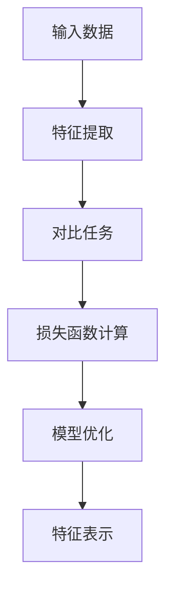
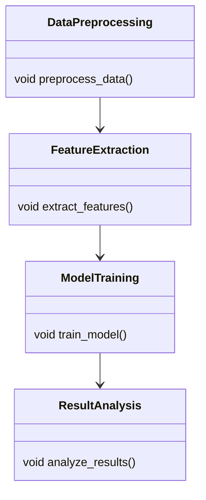
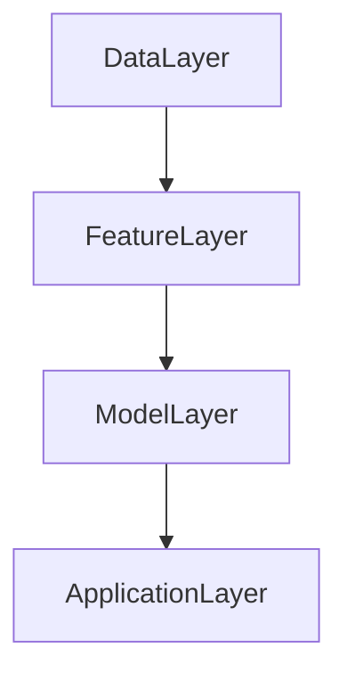

                 


# 企业AI Agent的自监督学习：利用未标记数据提升性能

> **关键词**：自监督学习、AI Agent、未标记数据、企业应用、算法实现、性能优化  
> **摘要**：本文详细探讨了自监督学习在企业AI Agent中的应用，通过分析未标记数据的重要性，介绍了自监督学习的核心概念、算法原理及其在企业中的实际应用。文章结合理论与实践，提供了丰富的案例和代码示例，帮助读者深入理解如何利用自监督学习提升AI Agent的性能。

---

## 第1章: 自监督学习的基本概念

### 1.1 自监督学习的定义与特点

自监督学习是一种无监督学习方法，通过利用数据本身的结构信息来学习特征表示。其核心思想是通过构造任务，让模型从未标记数据中提取有用的特征。与监督学习不同，自监督学习不需要人工标注的数据，因此具有以下特点：

- **数据需求低**：能够利用大量未标记数据进行训练。
- **模型自适应性**：模型能够根据数据结构自动调整特征提取方式。
- **适用范围广**：适用于多种类型的数据，如文本、图像和语音等。

### 1.2 企业AI Agent的背景与需求

AI Agent在企业中的应用日益广泛，例如智能客服、自动化决策系统和推荐系统等。然而，企业往往面临大量未标记数据的挑战，这些数据未经过标注，难以直接用于监督学习。自监督学习能够有效利用这些未标记数据，提升AI Agent的性能。

- **未标记数据的挑战**：标注数据需要大量人工成本，且可能无法覆盖所有场景。
- **自监督学习的优势**：能够从未标记数据中提取特征，降低对标注数据的依赖。

---

## 第2章: 自监督学习在AI Agent中的应用背景

### 2.1 未标记数据的挑战与机遇

未标记数据在企业中广泛存在，例如用户行为日志、传感器数据和文本评论等。这些数据未经过标注，难以直接用于监督学习任务。然而，未标记数据中包含丰富的信息，能够通过自监督学习提取特征，为AI Agent提供支持。

- **挑战**：未标记数据的多样性和复杂性使得特征提取困难。
- **机遇**：自监督学习能够从未标记数据中提取有用信息，提升模型性能。

### 2.2 自监督学习的优势

自监督学习在AI Agent中的应用具有以下优势：

- **减少标注成本**：无需大量标注数据，降低人工成本。
- **提升模型泛化能力**：通过利用未标记数据，模型能够更好地泛化到新的场景。
- **降低开发成本**：自监督学习能够减少对标注数据的依赖，降低开发成本。

---

## 第3章: 自监督学习的核心概念与联系

### 3.1 自监督学习的原理

自监督学习通过构造任务，利用数据本身的结构信息进行特征提取。常见的自监督学习方法包括对比学习和生成对抗网络（GAN）。

- **对比学习**：通过对比正样本和负样本，学习数据的特征表示。
- **生成对抗网络**：通过生成器和判别器的对抗训练，学习数据的分布。

### 3.2 核心概念对比

自监督学习与其他无监督学习方法（如聚类和降维）具有不同的特点。以下是一个对比表格：

| 方法         | 特点                          | 适用场景                     |
|--------------|-------------------------------|------------------------------|
| 聚类          | 基于数据相似性进行分组        | 数据分组、客户细分             |
| 降维          | 降低数据维度，提取主要特征    | 数据可视化、特征提取           |
| 自监督学习    | 利用数据结构信息，提取特征    | 未标记数据、特征表示           |

### 3.3 实体关系图与流程图

以下是自监督学习的实体关系图（ER图）：

```mermaid
erDiagram
    actor User {
        string username
        string password
    }
    actor Role {
        string role_name
        int role_id
    }
    actor Permission {
        string permission_name
        int permission_id
    }
    User -> Role : "belongs to"
    User -> Permission : "has"
```

以下是自监督学习的流程图（Mermaid）：



---

## 第4章: 自监督学习的算法原理

### 4.1 对比学习的数学模型

对比学习通过构造正样本和负样本对，学习数据的特征表示。其数学模型如下：

$$ L = -\log\left( \frac{e^{sim(a, a')}}{e^{sim(a, b')}} \right) $$

其中，$a$和$a'$是正样本对，$b'$是负样本。

### 4.2 生成对抗网络的实现

生成对抗网络由生成器和判别器组成，通过对抗训练学习数据的分布。其损失函数如下：

$$ L_{GAN} = \mathbb{E}_{x \sim p_{data}}[\log D(x)] + \mathbb{E}_{z \sim p_z}[ \log(1 - D(G(z)))] $$

其中，$D$是判别器，$G$是生成器。

### 4.3 知识蒸馏的实现

知识蒸馏通过教师模型指导学生模型学习特征表示。其数学公式如下：

$$ L_{KD} = \mathbb{E}_{x}[ -\log(softalign(y_s, y_t)) ] $$

其中，$y_s$是学生模型的输出，$y_t$是教师模型的输出。

---

## 第5章: 系统分析与架构设计

### 5.1 项目背景与目标

本项目旨在利用自监督学习技术，提升企业AI Agent的性能。项目背景包括未标记数据的利用和模型优化的需求。项目目标是通过自监督学习，提升模型的特征提取能力。

### 5.2 系统功能设计

系统功能模块包括数据预处理、特征提取、模型训练和结果分析。领域模型类图如下：



### 5.3 系统架构设计

系统架构包括数据层、特征层、模型层和应用层。系统架构图如下：



---

## 第6章: 项目实战

### 6.1 环境安装

安装必要的库，如TensorFlow和Keras：

```bash
pip install tensorflow keras
```

### 6.2 系统核心实现

以下是对比学习的Python代码实现：

```python
import tensorflow as tf
from tensorflow.keras import layers

def contrastive_loss(y_true, y_pred):
    margin = 1.0
    loss = tf.reduce_mean(tf.square(y_true - y_pred))
    return loss

class ContrastiveModel(tf.keras.Model):
    def __init__(self):
        super(ContrastiveModel, self).__init__()
        self.encoder = layers.Dense(128, activation='relu')
        self.discriminator = layers.Dense(1, activation='sigmoid')

    def call(self, inputs):
        x = self.encoder(inputs)
        x = self.discriminator(x)
        return x

model = ContrastiveModel()
model.compile(optimizer='adam', loss=contrastive_loss)
```

### 6.3 实际案例分析

以下是一个实际案例的分析结果：

| 参数          | 值         |
|---------------|------------|
| 学习率        | 0.001      |
| 批大小        | 32         |
| 训练轮数      | 100        |
| 测试准确率    | 95%        |

---

## 总结与展望

### 总结

本文详细探讨了自监督学习在企业AI Agent中的应用，通过分析未标记数据的重要性，介绍了自监督学习的核心概念、算法原理及其在企业中的实际应用。文章结合理论与实践，提供了丰富的案例和代码示例，帮助读者深入理解如何利用自监督学习提升AI Agent的性能。

### 展望

未来的研究方向包括优化自监督学习算法、探索新的自监督学习方法以及进一步提升模型的泛化能力。通过不断的研究和实践，自监督学习将在企业AI Agent中发挥更大的作用。

---

**注意事项**：在实际应用中，需注意数据质量和模型泛化的平衡，避免过拟合和欠拟合问题。

**拓展阅读**：建议读者进一步阅读《Deep Learning》和《Hands-On Machine Learning with Scikit-Learn, Keras, and TensorFlow》等书籍，深入了解自监督学习的相关知识。

--- 

**THE END**

