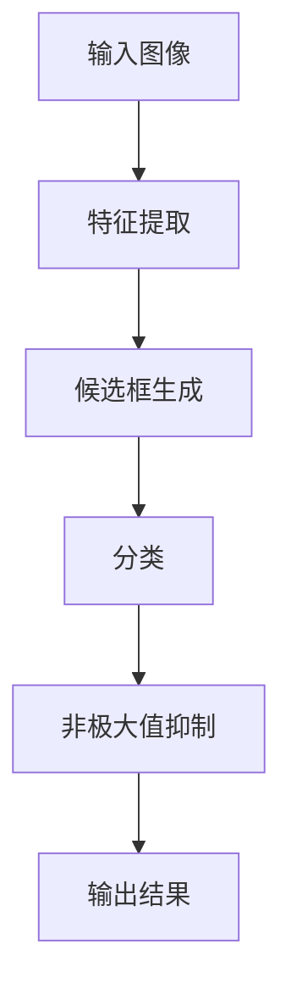
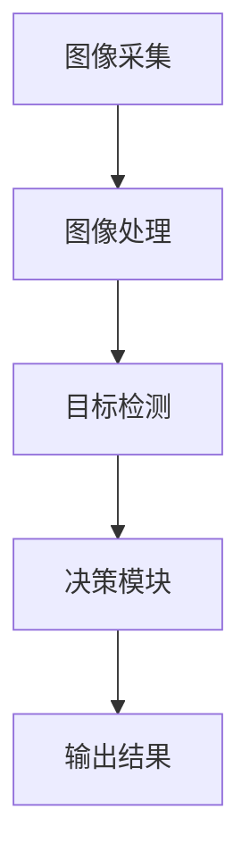
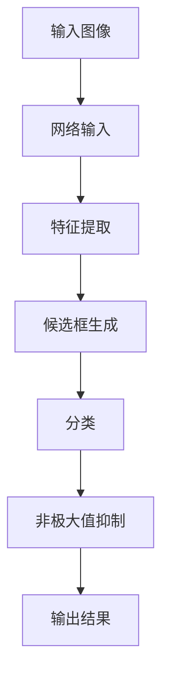
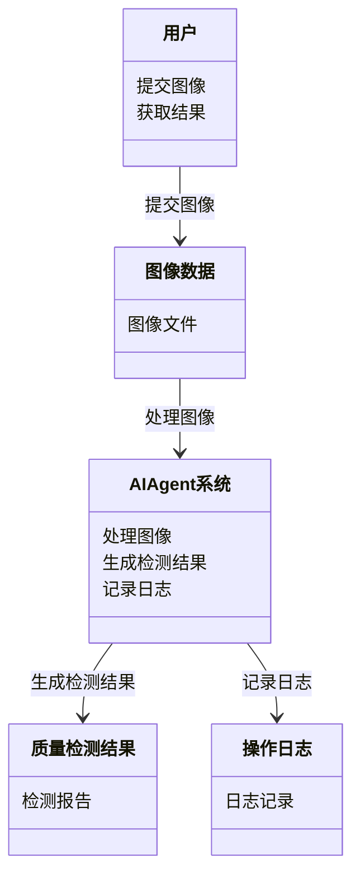

                 


# 企业AI Agent的计算机视觉技术应用：质量控制

> **关键词**：AI Agent, 计算机视觉, 质量控制, 图像处理, 目标检测, 企业应用

> **摘要**：本文探讨了AI Agent在企业质量控制中的计算机视觉应用。通过分析AI Agent的核心原理、计算机视觉的关键技术，以及它们在质量控制中的结合应用，展示了如何通过AI Agent提升质量控制的效率和准确性。文章详细讲解了算法原理、系统架构设计和项目实战，提供了丰富的技术细节和实际案例，为读者提供了全面的指导。

---

# 第一部分: 企业AI Agent的计算机视觉技术基础

## 第1章: AI Agent与计算机视觉概述

### 1.1 企业AI Agent的基本概念

#### 1.1.1 AI Agent的定义与特点
- **定义**：AI Agent（人工智能代理）是一种能够感知环境、自主决策并执行任务的智能实体。它通过传感器获取信息，利用算法进行分析和决策，并通过执行器与环境交互。
- **特点**：
  - **自主性**：无需外部干预，自主完成任务。
  - **反应性**：能够实时感知环境变化并做出反应。
  - **学习能力**：通过数据和经验不断优化性能。
  - **可扩展性**：能够处理不同类型和规模的任务。

#### 1.1.2 计算机视觉的基本概念
- **定义**：计算机视觉是研究如何让计算机“看”和理解图像或视频的技术。
- **关键技术**：
  - 图像处理：对图像进行增强、滤波等操作。
  - 特征提取：从图像中提取关键特征信息。
  - 目标检测：识别图像中的目标物体及其位置。
  - 图像分割：将图像划分为有意义的区域。

#### 1.1.3 企业AI Agent与计算机视觉的结合
- **结合方式**：
  - AI Agent通过计算机视觉技术感知环境，获取图像数据。
  - 利用计算机视觉算法进行图像分析，提取关键信息。
  - AI Agent根据分析结果做出决策并执行操作。

### 1.2 质量控制中的问题背景

#### 1.2.1 质量控制的传统方法
- **人工检查**：依赖人工 inspectors 进行质量检查，效率低且易出错。
- **传统自动化设备**：如机械臂和固定传感器，只能完成简单的重复任务，缺乏灵活性和智能性。

#### 1.2.2 传统方法的局限性
- **效率低下**：人工检查耗时长，成本高。
- **准确性差**：人工检查易受疲劳和主观因素影响。
- **适应性差**：传统自动化设备难以应对多样化的质量检测需求。

#### 1.2.3 AI Agent在质量控制中的优势
- **高效性**：AI Agent 可以快速处理大量图像数据，提高检测效率。
- **准确性**：通过深度学习算法，AI Agent 能够实现高精度的图像识别。
- **灵活性**：AI Agent 可以根据需求快速调整检测策略，适应不同的检测场景。

### 1.3 问题描述与解决方案

#### 1.3.1 质量控制中的关键问题
- **检测效率**：如何快速处理大量图像数据。
- **检测精度**：如何提高图像识别的准确性。
- **灵活性**：如何适应不同的检测场景和需求。

#### 1.3.2 AI Agent如何解决这些问题
- **高效性**：通过并行计算和分布式处理，AI Agent 可以快速处理大量图像数据。
- **准确性**：利用深度学习算法，AI Agent 能够实现高精度的图像识别。
- **灵活性**：AI Agent 可以通过重新训练模型，快速适应不同的检测场景和需求。

#### 1.3.3 解决方案的边界与外延
- **边界**：AI Agent 在质量控制中的应用主要集中在图像数据的处理和分析，不涉及物理执行器的操作。
- **外延**：AI Agent 的计算机视觉技术可以扩展到其他领域，如自动驾驶、医疗影像分析等。

### 1.4 本章小结
本章介绍了AI Agent和计算机视觉的基本概念，分析了质量控制中的问题背景，并探讨了AI Agent在质量控制中的优势和解决方案。

---

## 第2章: AI Agent与计算机视觉的核心概念

### 2.1 AI Agent的核心原理

#### 2.1.1 AI Agent的基本工作原理
- **感知层**：通过传感器获取环境中的图像数据。
- **处理层**：利用计算机视觉算法对图像进行处理和分析。
- **决策层**：根据分析结果做出决策。
- **执行层**：通过执行器执行决策操作。

#### 2.1.2 计算机视觉的原理
- **图像输入**：接收图像数据。
- **预处理**：对图像进行增强、滤波等操作。
- **特征提取**：提取图像中的关键特征。
- **目标检测**：识别图像中的目标物体及其位置。
- **图像分割**：将图像划分为有意义的区域。

#### 2.1.3 AI Agent与计算机视觉的协同作用
- **协同机制**：
  - AI Agent 通过计算机视觉技术感知环境。
  - 计算机视觉算法为AI Agent 提供决策依据。

### 2.2 核心概念对比分析

#### 2.2.1 AI Agent与传统自动化系统的对比
| 特性             | AI Agent                   | 传统自动化系统               |
|------------------|---------------------------|-----------------------------|
| 智能性           | 高                         | 低                           |
| 学习能力         | 强                         | 无                           |
| 灵活性           | 高                         | 低                           |

#### 2.2.2 计算机视觉与其他图像处理技术的对比
| 技术             | 计算机视觉                 | 传统图像处理                 |
|------------------|---------------------------|-----------------------------|
| 应用场景         | 图像识别、目标检测         | 图像增强、图像分割           |
| 复杂度           | 高                         | 中                           |

#### 2.2.3 质量控制中的关键属性特征对比表格
| 特征             | 传统方法                  | AI Agent                     |
|------------------|---------------------------|-----------------------------|
| 检测效率         | 低                         | 高                           |
| 检测精度         | 低                         | 高                           |
| 灵活性           | 低                         | 高                           |

### 2.3 实体关系图

#### 2.3.1 ER实体关系图的构建
- **实体**：用户、AI Agent系统、图像数据、质量检测结果、操作日志。
- **关系**：用户提交图像数据，AI Agent系统处理图像数据并生成质量检测结果，同时记录操作日志。

#### 2.3.2 使用 Mermaid 绘制 ER 图

```mermaid
er
    actor: 用户
    system: AI Agent 系统
    entity: 图像数据
    entity: 质量检测结果
    entity: 操作日志
    actor --> entity: 提交图像
    system --> entity: 处理图像
    system --> entity: 生成检测结果
    system --> entity: 记录日志
```

---

## 第3章: 计算机视觉的关键技术

### 3.1 图像处理技术

#### 3.1.1 图像增强
- **定义**：通过技术手段改善图像的视觉效果。
- **方法**：
  - 灰度变换：调整图像的亮度、对比度。
  - 颜色变换：调整图像的颜色。
  - 噪声消除：去除图像中的噪声。

#### 3.1.2 图像滤波
- **定义**：通过滤波器对图像进行处理，消除噪声或强调某些特征。
- **方法**：
  - 均值滤波：平滑图像。
  - 高斯滤波：减少图像噪声。
  - 边缘检测滤波：提取图像边缘。

### 3.2 特征提取技术

#### 3.2.1 Haar 特征
- **定义**：一种基于矩形特征的检测方法。
- **应用**：广泛应用于目标检测和人脸识别。

#### 3.2.2 SIFT 特征
- **定义**：尺度不变特征变换，用于图像匹配和目标识别。
- **优势**：对旋转、缩放和光照变化具有不变性。

### 3.3 目标检测技术

#### 3.3.1 YOLO 算法
- **定义**：You Only Look Once，一种单阶段目标检测算法。
- **流程**：
  1. 将图像输入网络，得到特征图。
  2. 在特征图上进行候选框的生成和分类。
  3. 对候选框进行非极大值抑制，去除重叠框。

#### 3.3.2 使用 Mermaid 绘制目标检测流程图



---

## 第4章: AI Agent在质量控制中的应用

### 4.1 应用场景

#### 4.1.1 工业制造
- **应用**：在生产线中实时检测产品的缺陷。
- **优势**：提高检测效率和准确性，降低生产成本。

#### 4.1.2 零件检测
- **应用**：检测机械零件的表面缺陷。
- **优势**：减少人工检测的误差，提高检测效率。

### 4.2 系统设计

#### 4.2.1 系统功能设计
- **功能模块**：
  - 图像采集模块：负责采集图像数据。
  - 图像处理模块：对图像进行预处理和特征提取。
  - 目标检测模块：识别图像中的目标物体及其位置。
  - 决策模块：根据检测结果做出决策。

#### 4.2.2 使用 Mermaid 绘制系统功能图



---

## 第5章: 算法原理

### 5.1 目标检测算法

#### 5.1.1 YOLO 算法实现

```python
def yolo_detect(image):
    # 输入图像
    input_image = cv2.imread(image)
    # 转换为RGB格式
    input_image = cv2.cvtColor(input_image, cv2.COLOR_BGR2RGB)
    # 缩放到目标大小
    input_image = cv2.resize(input_image, (416, 416))
    # 输入网络进行预测
    predictions = model.predict(input_image)
    # 解析预测结果
    for box in predictions:
        x1, y1, x2, y2, label, confidence = box
        if confidence > 0.5:
            cv2.rectangle(input_image, (x1, y1), (x2, y2), (255, 0, 0), 2)
            cv2.putText(input_image, label, (x1, y1-5), cv2.FONT_HERSHEY_SIMPLEX, 1, (0, 255, 0), 2)
    return input_image
```

#### 5.1.2 算法流程图



---

## 第6章: 系统架构设计

### 6.1 项目介绍

#### 6.1.1 项目背景
- **背景**：为了提高企业的质量控制效率，引入AI Agent技术，利用计算机视觉实现自动化的质量检测。

#### 6.1.2 项目目标
- **目标**：开发一个基于AI Agent的计算机视觉质量控制系统，实现高效、准确的质量检测。

### 6.2 系统功能设计

#### 6.2.1 使用 Mermaid 绘制领域模型图



---

## 第7章: 项目实战

### 7.1 环境搭建

#### 7.1.1 安装依赖
```bash
pip install tensorflow keras opencv-python
```

### 7.2 核心代码实现

#### 7.2.1 图像处理代码

```python
import cv2

def preprocess_image(image_path):
    image = cv2.imread(image_path)
    image = cv2.cvtColor(image, cv2.COLOR_BGR2RGB)
    image = cv2.resize(image, (224, 224))
    image = image.astype('float32') / 255.0
    return image
```

#### 7.2.2 目标检测代码

```python
import tensorflow as tf
import numpy as np

model = tf.keras.models.load_model('yolov3.h5')

def detect_objects(image):
    input_image = preprocess_image(image)
    input_image = np.expand_dims(input_image, axis=0)
    predictions = model.predict(input_image)
    return predictions
```

---

## 第8章: 总结与展望

### 8.1 本章小结
本文详细探讨了AI Agent在企业质量控制中的计算机视觉应用，分析了AI Agent的核心原理、计算机视觉的关键技术，并展示了它们在质量控制中的具体应用。通过实际案例和系统设计，证明了AI Agent在提高质量控制效率和准确性方面的巨大潜力。

### 8.2 未来展望
未来，随着AI Agent和计算机视觉技术的不断发展，其在质量控制中的应用将更加广泛和深入。同时，随着算法的优化和硬件性能的提升，AI Agent的质量控制系统将更加高效和智能化。

---

### 最佳实践 Tips
1. **数据预处理**：确保图像数据的高质量，避免噪声干扰。
2. **模型调优**：通过数据增强和超参数优化，提高模型的检测精度。
3. **系统集成**：将AI Agent系统与其他企业系统（如ERP、MES）集成，实现无缝对接。

通过以上内容，读者可以全面了解AI Agent在企业质量控制中的计算机视觉技术应用，并能够实际操作和部署相关系统。

