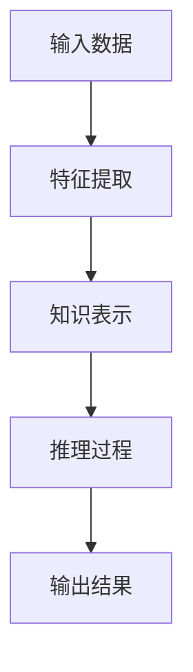
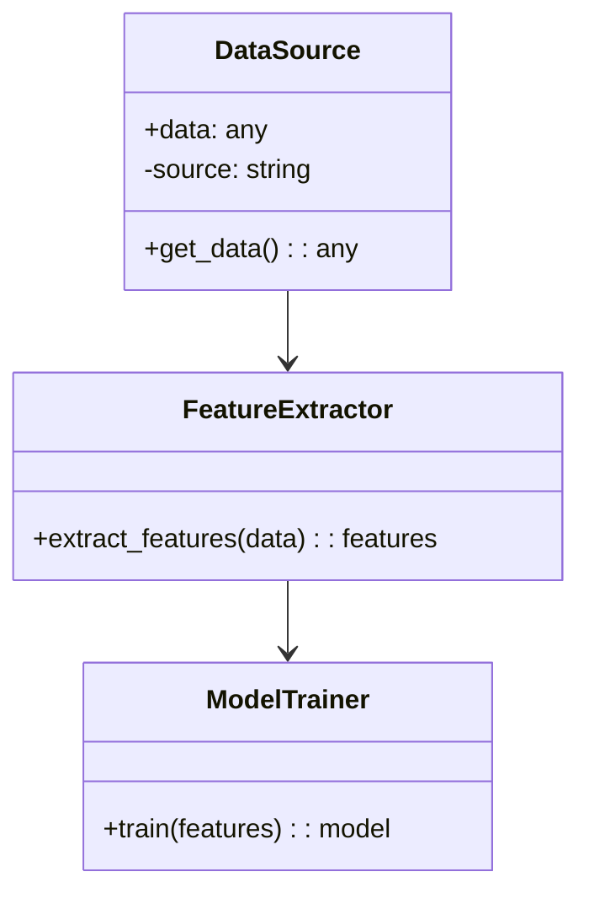

                 

# 企业AI Agent的跨域学习：打破数据孤岛，实现全局优化

> 关键词：企业AI Agent、跨域学习、数据孤岛、全局优化、知识表示、系统架构

> 摘要：本文探讨了企业AI Agent的跨域学习方法，重点介绍了如何通过打破数据孤岛实现全局优化。文章从企业AI Agent的背景与问题背景入手，详细阐述了跨域学习的核心概念、算法原理、系统架构与设计，以及实际项目的实现与应用。通过实际案例分析和最佳实践，本文为读者提供了跨域学习在企业AI Agent中的全面解读和实践指导。

---

## 第1章：企业AI Agent的背景与问题背景

### 1.1 企业AI Agent的定义与核心概念

#### 1.1.1 从传统AI到企业AI Agent的演进

企业AI Agent是一种智能体，能够根据企业环境中的数据和目标，自主地进行决策和行动。与传统AI不同，企业AI Agent更加注重跨域协作和全局优化，能够在复杂的商业环境中灵活应对各种挑战。

#### 1.1.2 数据孤岛的形成与问题描述

数据孤岛是指企业在不同部门或系统中积累的数据无法有效整合和共享的现象。这种现象导致企业无法充分利用数据价值，限制了决策的准确性和效率。数据孤岛的形成主要源于数据格式、存储方式和管理系统的不统一。

#### 1.1.3 跨域学习的必要性与目标

跨域学习是指在多个不同领域或数据源之间进行知识学习和整合的过程。在企业环境中，跨域学习能够打破数据孤岛，实现数据的统一管理和有效利用，从而提升企业的整体决策能力和竞争力。

---

### 1.2 企業AI Agent的核心要素

#### 1.2.1 数据源的多样性与整合

企业AI Agent需要整合来自不同系统和部门的数据，例如销售数据、客户信息、生产数据等。这些数据的多样性要求AI Agent具备强大的数据整合能力。

#### 1.2.2 知识表示与推理机制

知识表示是跨域学习的核心，通过将知识转化为可计算的形式，AI Agent能够进行推理和决策。常见的知识表示方法包括图表示和符号表示。

#### 1.2.3 跨域学习的边界与外延

跨域学习的边界在于不同领域的数据和知识，而其外延则包括多模态学习和边缘计算等新兴技术。

---

## 第2章：跨域学习的核心概念与联系

### 2.1 跨域学习的原理与数学模型

#### 2.1.1 跨域学习的原理

跨域学习通过在不同领域之间建立映射关系，实现知识的共享和迁移。其核心原理是利用领域间的共同特征，构建跨领域的模型。

#### 2.1.2 跨域学习的数学模型

跨域学习的数学模型可以表示为：

$$ P(y|x) = \sum_{i=1}^{n} P(y|x, d=i) P(d=i) $$

其中，\(d\) 表示领域，\(x\) 表示输入数据，\(y\) 表示输出。

---

### 2.2 跨域学习的核心算法与流程图

#### 2.2.1 跨域学习的算法原理

跨域学习的算法通常包括数据预处理、特征提取、模型训练和优化等步骤。

---

## 第3章：跨域学习的算法原理与实现

### 3.1 跨域学习的数学公式与模型

#### 3.1.1 跨域学习的数学公式

跨域学习的数学公式可以表示为：

$$ y = f(x) $$

其中，\(x\) 表示输入数据，\(y\) 表示输出结果，\(f\) 表示模型函数。

---

### 3.2 跨域学习的算法实现

#### 3.2.1 知识表示与推理算法

跨域学习的算法实现通常包括知识表示和推理过程。

---

## 第4章：跨域学习的系统架构与设计

### 4.1 系统功能设计

#### 4.1.1 领域模型设计

领域模型设计是跨域学习系统的核心，通常包括数据源、特征提取器和推理引擎等组件。

---

## 第5章：项目实战：跨域学习的实际应用

### 5.1 项目背景与目标

#### 5.1.1 项目背景

本项目旨在通过跨域学习技术，整合企业的销售数据、客户信息和生产数据，提升企业的整体决策能力。

#### 5.1.2 数据准备与预处理

数据预处理是跨域学习的关键步骤，包括数据清洗和特征提取。

---

## 第6章：最佳实践与注意事项

### 6.1 跨域学习的关键点

#### 6.1.1 数据质量的重要性

数据质量直接影响跨域学习的效果，需要确保数据的准确性和完整性。

#### 6.1.2 模型选择与调优

选择合适的模型并进行调优是跨域学习成功的关键。

---

## 第7章：未来展望

### 7.1 跨域学习的发展方向

#### 7.1.1 多模态学习

多模态学习是跨域学习的未来发展方向，能够更好地处理多种类型的数据。

#### 7.1.2 自适应学习与边缘计算

自适应学习和边缘计算的结合将使跨域学习更加高效和实时。

---

### 总结

通过本文的详细阐述，我们了解了企业AI Agent的跨域学习方法，以及如何通过打破数据孤岛实现全局优化。跨域学习作为一种新兴的技术，将在未来的企业智能化转型中发挥重要作用。

---

以上是文章的完整内容，涵盖了从背景到实际应用的各个方面，为读者提供了全面的技术解读和实践指导。

