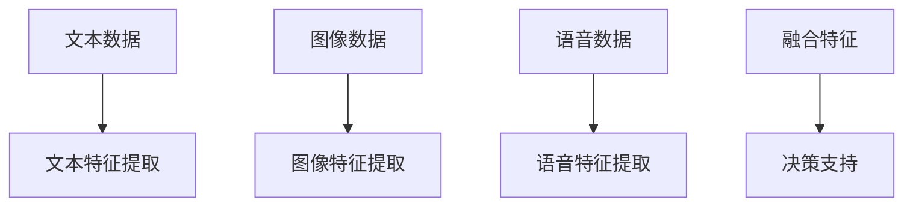
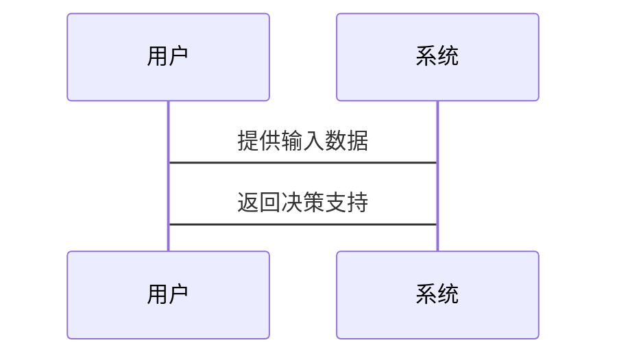

                 


# 企业AI Agent的跨模态学习：融合非结构化数据的决策支持

> 关键词：企业AI Agent、跨模态学习、非结构化数据、决策支持、多模态融合、注意力机制、数学模型

> 摘要：本文深入探讨企业AI Agent在跨模态学习中的应用，重点分析如何通过融合非结构化数据来提升决策支持能力。文章从跨模态学习的基本原理出发，详细讲解其在企业决策中的应用价值，结合实际案例，展示如何通过多模态融合技术优化企业决策流程。

---

## 第1章: 企业AI Agent与跨模态学习概述

### 1.1 AI Agent的基本概念

#### 1.1.1 AI Agent的定义与特点
- AI Agent的定义：智能代理（AI Agent）是指能够感知环境、自主决策并执行任务的智能体。
- 特点：
  - **自主性**：无需外部干预，自主完成任务。
  - **反应性**：能实时感知环境变化并做出响应。
  - **目标导向**：基于明确的目标进行决策。
  - **学习能力**：通过数据和经验不断优化自身能力。

#### 1.1.2 企业AI Agent的核心功能
- 数据处理与分析：从企业内外部数据中提取有价值的信息。
- 自主决策：基于数据和模型生成最优决策方案。
- 人机协作：与企业员工协同工作，提供实时支持。
- 智能优化：通过学习优化企业运营流程。

#### 1.1.3 跨模态学习的背景与意义
- 背景：随着企业数据类型的多样化，非结构化数据（如文本、图像、语音）占比显著增加，传统单模态学习方法难以满足复杂决策需求。
- 意义：跨模态学习能够整合多源异构数据，提升AI Agent的感知与决策能力，为企业的复杂问题提供更全面的解决方案。

---

### 1.2 跨模态学习的基本原理

#### 1.2.1 跨模态学习的定义
- 跨模态学习：通过多个数据模态（如文本、图像、语音）的信息协同，提升模型理解和决策能力的学习方法。

#### 1.2.2 跨模态学习的关键技术
- 多模态数据融合：将不同模态的数据进行整合，提取共同特征。
- 跨模态注意力机制：通过注意力机制，模型可以关注不同模态中的重要信息。
- 模态转换与对齐：将不同模态的数据进行对齐，以便模型能够协同工作。

#### 1.2.3 跨模态学习在企业中的应用价值
- 提升决策的全面性：通过整合多模态数据，提供更全面的决策支持。
- 增强模型鲁棒性：单一模态数据的局限性可以通过多模态数据的协同得到弥补。
- 优化用户体验：通过多模态交互，提升用户与AI Agent的交互体验。

---

### 1.3 企業決策中的非結構化數據處理

#### 1.3.1 非結構化數據的定義與類型
- 非结构化数据：未经明确结构化、难以通过常规数据库进行有效查询和分析的数据。
- 类型：
  - 文本数据（如报告、邮件）。
  - 图像数据（如图片、视频）。
  - 语音数据（如音频、语音记录）。

#### 1.3.2 非結構化數據对企业決策的支持
- 提供更丰富的数据来源，支持更全面的分析。
- 通过自然语言处理（NLP）和计算机视觉（CV）技术，提取隐含信息。
- 在实时监控、市场分析等领域发挥重要作用。

#### 1.3.3 跨模态学习在非結構化數據處理中的作用
- 跨模态学习能够将文本、图像等多种非结构化数据进行融合，提取更有价值的信息。
- 通过跨模态对齐技术，解决不同模态数据之间的语义差异问题。
- 提供更精准的决策支持，降低信息孤岛带来的风险。

---

## 第2章: 跨模态學習的核心概念与原理

### 2.1 跨模态学习的核心概念

#### 2.1.1 跨模态学习的基本原理
- 跨模态学习的核心在于通过多个数据模态的信息协同，提升模型的表达能力。
- 通过跨模态对齐，将不同模态的数据映射到同一个语义空间。
- 利用跨模态注意力机制，模型可以关注不同模态中的重要信息。

#### 2.1.2 跨模态学习的关键技术
- 多模态数据融合：将文本、图像等多种数据进行融合，提取共同特征。
- 跨模态注意力机制：通过注意力机制，模型可以动态分配不同模态的重要性。
- 模态转换与对齐：将不同模态的数据进行对齐，以便模型能够协同工作。

#### 2.1.3 跨模态学习的模型架构
- 多模态编码器：将不同模态的数据转化为统一的语义表示。
- 跨模态解码器：根据编码后的语义表示生成目标输出。
- 跨模态注意力网络：通过注意力机制，优化模型对不同模态信息的利用。

---

### 2.2 跨模态学习的核心算法

#### 2.2.1 多模态融合方法
- 晚融合（Late Fusion）：在特征提取阶段分别处理不同模态的数据，最后进行融合。
- 早融合（Early Fusion）：在特征提取过程中就进行多模态数据的融合。
- 混合融合：结合早融合和晚融合的优点，灵活处理不同模态数据。

#### 2.2.2 跨模态注意力机制
- 单模态注意力：在单个模态内部进行注意力分配。
- 跨模态注意力：在多个模态之间进行注意力分配，关注重要信息。
- 自适应注意力：根据任务需求动态调整注意力分配策略。

#### 2.2.3 跨模态学习的数学模型
- 多模态融合模型：
  $$ z = f(x_1, x_2, ..., x_n) $$
  其中，$x_i$ 表示不同模态的输入数据，$z$ 是融合后的表示。
- 跨模态注意力机制：
  $$ a_i = \text{softmax}(W_a x_i) $$
  其中，$W_a$ 是注意力权重矩阵，$a_i$ 是注意力分配。

---

## 第3章: 跨模态学习的算法原理

### 3.1 跨模态学习的算法流程

#### 3.1.1 数据预处理
- 数据清洗：去除噪声和冗余数据。
- 数据标注：对非结构化数据进行标注，以便后续处理。
- 数据增强：通过数据增强技术提升模型的鲁棒性。

#### 3.1.2 特征提取
- 文本特征提取：使用词袋模型、TF-IDF、Word2Vec等方法提取文本特征。
- 图像特征提取：使用CNN、ResNet等深度学习模型提取图像特征。
- 语音特征提取：使用Mel频谱、MFCC等方法提取语音特征。

#### 3.1.3 跨模态融合
- 晚融合：分别提取不同模态的特征，最后进行融合。
- 早融合：在特征提取过程中就进行多模态数据的融合。
- 混合融合：结合早融合和晚融合的优点，灵活处理不同模态数据。

#### 3.1.4 模型训练与优化
- 模型选择：选择适合任务的模型架构，如Transformer、BERT等。
- 模型训练：通过反向传播算法优化模型参数。
- 模型调优：通过超参数调优和数据增广提升模型性能。

---

### 3.2 跨模态学习的数学模型

#### 3.2.1 多模态融合的数学表达
- 多模态编码器：
  $$ z = \text{Encoder}(x_1, x_2, ..., x_n) $$
  其中，$x_i$ 表示不同模态的输入数据，$z$ 是融合后的表示。
- 多模态解码器：
  $$ y = \text{Decoder}(z) $$
  其中，$y$ 是模型的输出。

#### 3.2.2 跨模态注意力机制的公式推导
- 跨模态注意力权重计算：
  $$ a_{ij} = \text{softmax}(W_a x_i) $$
  其中，$W_a$ 是注意力权重矩阵，$x_i$ 是第$i$个模态的输入。
- 融合后的表示：
  $$ z = \sum_{j=1}^{n} a_{ij} x_j $$

---

## 第4章: 跨模态学习的系统架构设计

### 4.1 系统功能设计

#### 4.1.1 数据采集与预处理
- 数据源：文本、图像、语音等非结构化数据。
- 数据预处理：清洗、标注、增强。

#### 4.1.2 跨模态特征提取
- 文本特征提取：使用BERT、GPT等模型提取文本特征。
- 图像特征提取：使用ResNet、VGG等模型提取图像特征。
- 语音特征提取：使用Mel谱、MFCC等方法提取语音特征。

#### 4.1.3 跨模态融合与决策支持
- 多模态融合：将不同模态的特征进行融合，生成统一的语义表示。
- 决策支持：基于融合后的特征，生成决策建议。

---

### 4.2 系统架构设计

#### 4.2.1 系统架构图
- 使用Mermaid绘制系统架构图，展示系统的各个模块及其交互。

#### 4.2.2 系统接口设计
- API接口：提供RESTful API，方便其他系统调用。

#### 4.2.3 系统交互流程
- 使用Mermaid绘制交互流程图，展示用户与系统之间的交互过程。

---

## 第5章: 项目实战

### 5.1 环境安装

#### 5.1.1 安装Python环境
- 安装Python 3.8及以上版本。
- 安装必要的Python库，如TensorFlow、Keras、PyTorch等。

#### 5.1.2 安装深度学习框架
- 安装TensorFlow或PyTorch框架。
- 安装NLP库（如NLTK、spaCy）、CV库（如OpenCV、Pillow）。

#### 5.1.3 安装其他依赖
- 安装Jupyter Notebook用于实验。
- 安装数据可视化库（如Matplotlib、Seaborn）。

---

### 5.2 系统核心实现

#### 5.2.1 多模态数据加载
- 加载文本数据：使用Pandas读取CSV文件。
- 加载图像数据：使用Pillow库读取图片文件。
- 加载语音数据：使用librosa库读取音频文件。

#### 5.2.2 特征提取
- 文本特征提取：使用BERT模型提取文本向量。
- 图像特征提取：使用ResNet50模型提取图像向量。
- 语音特征提取：使用Mel谱提取语音向量。

#### 5.2.3 多模态融合
- 晚融合：将不同模态的特征向量进行拼接。
- 早融合：在特征提取过程中进行融合。

#### 5.2.4 模型训练
- 定义模型架构：使用Keras或PyTorch定义模型。
- 编译模型：定义损失函数和优化器。
- 训练模型：使用训练数据进行模型训练。

---

### 5.3 代码实现

#### 5.3.1 数据加载与预处理
```python
import pandas as pd
from PIL import Image
import librosa

# 加载文本数据
text_data = pd.read_csv('text.csv')

# 加载图像数据
image_data = []
for img_path in ['image1.jpg', 'image2.jpg']:
    img = Image.open(img_path)
    image_data.append(img)

# 加载语音数据
audio_data = []
for audio_path in ['audio1.wav', 'audio2.wav']:
    audio, _ = librosa.load(audio_path, sr=16000)
    audio_data.append(audio)
```

#### 5.3.2 特征提取
```python
from tensorflow.keras.applications import ResNet50
from tensorflow.keras.applications import ResNet50
import numpy as np

# 文本特征提取
text_features = model_text.encode_documents(text_data['content'].tolist())

# 图像特征提取
model_image = ResNet50(weights='imagenet', include_top=False)
image_features = model_image.predict(np.array(image_data))

# 语音特征提取
from librosa.feature import melspectrogram
audio_features = []
for audio in audio_data:
    spec = melspectrogram(y=audio, sr=16000)
    audio_features.append(spec)
```

#### 5.3.3 多模态融合与决策
```python
# 晚融合
merged_features = np.concatenate([text_features, image_features, audio_features], axis=1)

# 跨模态注意力机制
attention_weights = model_attention(merged_features)
final_representation = attention_weights * merged_features
decision = model_decision(final_representation)
```

---

## 第6章: 最佳实践与总结

### 6.1 最佳实践

#### 6.1.1 数据预处理的重要性
- 数据预处理是跨模态学习的关键步骤，直接影响模型性能。

#### 6.1.2 模型选择与调优
- 根据具体任务选择合适的模型架构。
- 通过超参数调优和数据增广提升模型性能。

#### 6.1.3 系统架构设计
- 设计灵活的系统架构，便于后续扩展和优化。

---

### 6.2 小结

- 跨模态学习在企业AI Agent中的应用前景广阔。
- 通过融合非结构化数据，可以显著提升企业的决策支持能力。
- 随着技术的不断发展，跨模态学习将在企业中发挥越来越重要的作用。

---

### 6.3 注意事项

- 数据隐私与安全：在处理企业数据时，必须注意数据隐私和安全问题。
- 模型可解释性：跨模态学习模型的可解释性对企业决策支持至关重要。
- 系统稳定性：确保系统的稳定性和可靠性，避免因技术问题影响企业运营。

---

### 6.4 拓展阅读

- 《Multi-modal Deep Learning: A Survey》
- 《Attention Mechanisms in NLP: A Comprehensive Survey》
- 《Cross-modal Learning for Decision Support Systems》

---

# 附录

## 附录A: 代码实现细节

### A.1 数据加载与预处理代码
```python
import pandas as pd
from PIL import Image
import librosa

# 加载文本数据
text_data = pd.read_csv('text.csv')

# 加载图像数据
image_data = []
for img_path in ['image1.jpg', 'image2.jpg']:
    img = Image.open(img_path)
    image_data.append(img)

# 加载语音数据
audio_data = []
for audio_path in ['audio1.wav', 'audio2.wav']:
    audio, _ = librosa.load(audio_path, sr=16000)
    audio_data.append(audio)
```

### A.2 特征提取代码
```python
from tensorflow.keras.applications import ResNet50
import numpy as np

# 文本特征提取
text_features = model_text.encode_documents(text_data['content'].tolist())

# 图像特征提取
model_image = ResNet50(weights='imagenet', include_top=False)
image_features = model_image.predict(np.array(image_data))

# 语音特征提取
from librosa.feature import melspectrogram
audio_features = []
for audio in audio_data:
    spec = melspectrogram(y=audio, sr=16000)
    audio_features.append(spec)
```

### A.3 多模态融合与决策代码
```python
# 晚融合
merged_features = np.concatenate([text_features, image_features, audio_features], axis=1)

# 跨模态注意力机制
attention_weights = model_attention(merged_features)
final_representation = attention_weights * merged_features
decision = model_decision(final_representation)
```

## 附录B: Mermaid图表

### B.1 系统架构图


### B.2 系统交互图


---

通过以上目录大纲，您可以逐步完成《企业AI Agent的跨模态学习：融合非结构化数据的决策支持》的撰写，确保内容详实、结构清晰、逻辑严密。

