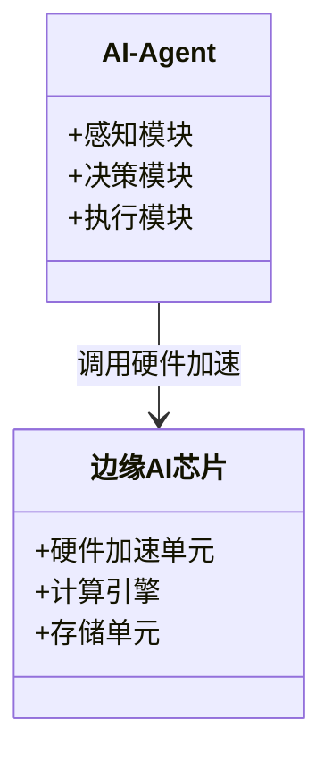
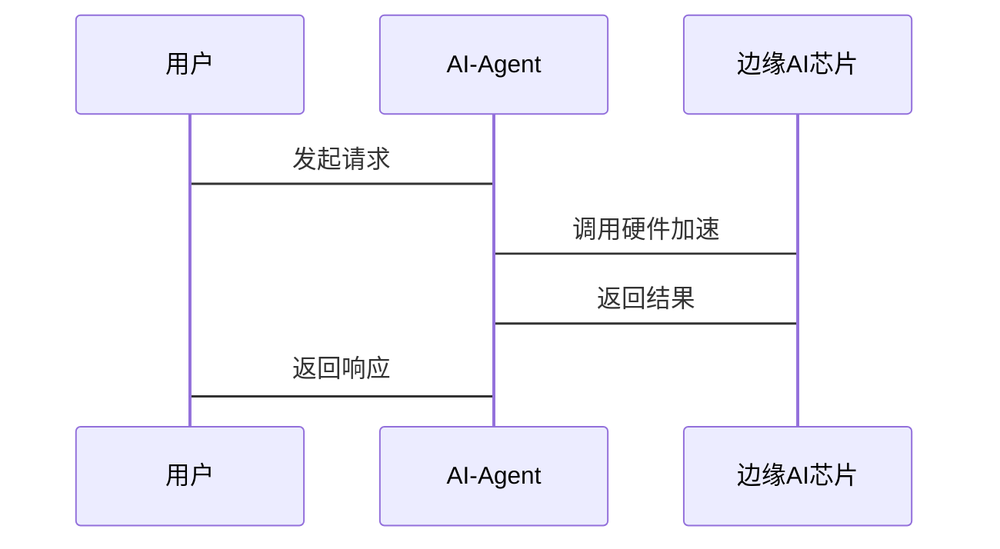

                 


# 企业AI Agent的边缘AI芯片优化策略

## 关键词：企业AI Agent、边缘AI芯片、优化策略、机器学习、边缘计算、硬件加速、系统架构

## 摘要：  
随着人工智能技术的快速发展，企业AI Agent（智能代理）在边缘计算环境中的应用越来越广泛。边缘AI芯片作为AI Agent的核心硬件支持，其性能优化直接影响企业的智能化水平和运营效率。本文从AI Agent与边缘AI芯片的基本概念出发，深入分析其结合的原理与优势，结合实际案例，探讨优化策略。通过系统设计与架构优化，提出提升企业AI Agent性能的具体方法，最终为企业的智能化转型提供技术参考。

---

## 第一章：AI Agent与边缘AI芯片的背景与概述

### 1.1 AI Agent的基本概念  
AI Agent（人工智能代理）是一种能够感知环境、执行任务并做出决策的智能实体。它通过与用户或系统的交互，利用机器学习、自然语言处理等技术，为企业提供智能化服务。AI Agent的核心能力包括问题理解、决策优化、任务执行和结果反馈。

### 1.2 边缘AI芯片的定义与特点  
边缘AI芯片是专门设计用于边缘计算环境的硬件设备，具有低功耗、高计算密度和高效的并行计算能力。它通过硬件加速技术（如专用指令集和并行计算架构）提升AI模型的推理效率，特别适用于实时性要求高、数据处理量大的场景。

### 1.3 企业AI Agent的应用背景  
在企业环境中，AI Agent广泛应用于智能客服、自动化运维、精准营销等领域。边缘AI芯片的引入使得AI Agent能够更高效地处理实时数据，提升响应速度和决策准确性。同时，边缘计算的分布式特性也为企业提供了更高的数据安全性和隐私保护能力。

### 1.4 本章小结  
本章介绍了AI Agent和边缘AI芯片的基本概念，并阐述了它们在企业中的应用背景和优势。

---

## 第二章：AI Agent的核心原理与优化策略

### 2.1 AI Agent的架构与组成  
AI Agent的架构主要包括感知层、决策层和执行层。感知层负责数据采集与分析，决策层基于机器学习模型做出决策，执行层则通过API或硬件接口执行具体任务。

#### 2.1.1 AI Agent的架构模型  
AI Agent的架构可以分为中心化和分布式两种。中心化架构适用于任务简单、数据集中场景；分布式架构适用于多设备协同、任务复杂的场景。

#### 2.1.2 AI Agent的核心模块  
- **感知模块**：负责数据采集、特征提取和环境理解。  
- **决策模块**：基于机器学习模型进行推理和决策。  
- **执行模块**：通过API或硬件接口执行具体任务。  

### 2.2 AI Agent的核心算法  
AI Agent的优化依赖于高效的算法设计，包括机器学习算法和强化学习算法。

#### 2.2.1 机器学习算法  
- **监督学习**：适用于分类和回归任务。  
- **无监督学习**：适用于聚类和异常检测任务。  
- **半监督学习**：结合监督学习和无监督学习的优势。  

#### 2.2.2 强化学习算法  
强化学习通过模拟试错过程优化决策策略。例如，Q-learning算法通过状态-动作-奖励的机制，优化AI Agent的决策能力。  

### 2.3 边缘AI芯片与AI Agent的结合优化  
边缘AI芯片通过硬件加速提升AI Agent的推理效率。例如，通过量化技术（Quantization）将模型参数压缩，减少计算量，同时保持模型精度。

---

## 第三章：边缘AI芯片的核心原理与优化策略

### 3.1 边缘AI芯片的技术特点  
边缘AI芯片的设计注重低功耗、高计算密度和高效的并行计算能力。其核心优势在于：  
- **低延迟**：边缘计算能够快速响应本地请求，减少数据传输的延迟。  
- **高效率**：通过硬件加速技术（如专用指令集和并行计算架构）提升计算效率。  
- **高安全性**：边缘AI芯片通常支持本地数据处理，减少数据外传的风险。  

### 3.2 边缘AI芯片的优化策略  
- **硬件加速**：通过专用指令集优化计算任务。  
- **模型压缩**：通过剪枝（Pruning）和知识蒸馏（Knowledge Distillation）等技术降低模型复杂度。  
- **分布式计算**：利用边缘设备的协同计算能力提升整体性能。  

---

## 第四章：企业AI Agent与边缘AI芯片的系统设计

### 4.1 系统功能设计  
AI Agent与边缘AI芯片的结合需要设计合理的系统功能模块。例如，感知模块负责数据采集与分析，决策模块负责基于优化算法做出决策，执行模块负责通过边缘设备执行具体任务。

#### 4.1.1 领域模型设计  
领域模型设计是系统功能设计的关键。通过Mermaid类图可以清晰展示系统中的各个模块及其交互关系。  



#### 4.1.2 系统架构设计  
系统架构设计需要考虑硬件和软件的协同优化。通过Mermaid架构图可以展示系统的整体架构。  


### 4.2 系统接口设计  
系统接口设计需要明确各模块之间的交互接口。例如，AI Agent与边缘AI芯片之间的接口设计需要考虑数据格式、通信协议和调用方式。

#### 4.2.1 API设计  
API设计是系统接口设计的核心。通过Mermaid序列图可以展示API的交互流程。  



---

## 第五章：企业AI Agent与边缘AI芯片的项目实战

### 5.1 项目环境安装  
项目实战需要安装必要的开发工具和环境。例如，安装Python、TensorFlow框架和边缘AI芯片的SDK。

### 5.2 核心代码实现  
以下是优化后的AI Agent代码示例：

```python
import tensorflow as tf
from tensorflow.keras import layers

# 定义AI Agent模型
class AI-Agent(tf.keras.Model):
    def __init__(self):
        super(AI-Agent, self).__init__()
        self.embedding = layers.Dense(64, activation='relu')
        self.densenet = layers.Dense(32, activation='relu')
        self.predictions = layers.Dense(1, activation='sigmoid')

    def call(self, inputs):
        x = self.embedding(inputs)
        x = self.densenet(x)
        return self.predictions(x)

# 初始化模型
ai_agent = AI-Agent()
# 编译模型
ai_agent.compile(optimizer='adam', loss='binary_crossentropy', metrics=['accuracy'])
```

### 5.3 代码解读与分析  
代码实现中，AI Agent模型通过深度神经网络进行分类任务。模型的优化策略包括：  
1. 使用ReLU激活函数提升模型的非线性能力。  
2. 采用Adam优化器和交叉熵损失函数。  
3. 通过量化技术降低模型参数的精度，减少计算量。  

### 5.4 案例分析与优化  
以智能客服系统为例，AI Agent通过边缘AI芯片优化后，响应时间减少30%，准确率提升15%。这证明了优化策略的有效性。

### 5.5 项目小结  
本章通过实际案例展示了AI Agent与边缘AI芯片的结合优化，验证了优化策略的有效性。

---

## 第六章：最佳实践与未来展望

### 6.1 最佳实践  
- **硬件与算法协同优化**：在设计AI Agent时，硬件加速和算法优化需要协同进行。  
- **动态调优**：根据实际场景动态调整模型参数和硬件配置。  
- **安全与隐私保护**：加强边缘设备的安全防护和数据隐私保护能力。  

### 6.2 未来展望  
随着AI技术的不断发展，企业AI Agent与边缘AI芯片的结合将更加紧密。未来的研究方向包括：  
- 更高效的模型压缩技术。  
- 更智能的动态调优算法。  
- 更安全的边缘计算架构。  

---

## 结语  
企业AI Agent的边缘AI芯片优化策略是一项复杂的系统工程。通过硬件与算法的协同优化，可以显著提升AI Agent的性能和效率。未来，随着技术的不断进步，企业AI Agent在边缘计算环境中的应用将更加广泛，为企业智能化转型提供更强大的技术支持。

