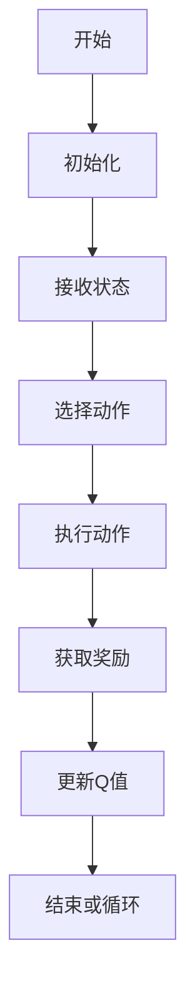
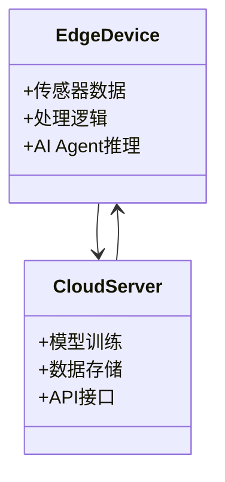

                 


# 企业AI Agent的边缘智能部署策略

## 关键词：AI Agent, 边缘智能, 企业部署, 智能系统, 边缘计算

## 摘要：  
随着企业智能化转型的加速，AI Agent（人工智能代理）在边缘计算环境中的部署成为企业提升效率和竞争力的重要策略。本文将从AI Agent的核心概念、算法原理、边缘智能的系统架构设计到实际部署策略进行全面解析，探讨如何在企业环境中有效部署AI Agent，以实现智能化决策和高效业务流程优化。

---

# 第一部分: 企业AI Agent的边缘智能部署背景与概念

## 第1章: 企业AI Agent与边缘智能概述

### 1.1 企业AI Agent的基本概念

#### 1.1.1 什么是AI Agent

AI Agent（人工智能代理）是一种能够感知环境、自主决策并执行任务的智能实体。它通过与环境交互，利用感知数据和预设目标，自主选择最优行动方案，以实现特定任务目标。

#### 1.1.2 AI Agent的核心特征

| 特征 | 描述 |
|------|------|
| 自主性 | 能够自主决策，无需外部干预 |
| 反应性 | 能够实时感知环境变化并做出反应 |
| 目标导向 | 以明确的目标为导向，优化行动方案 |
| 学习能力 | 能够通过经验或数据进行模型优化 |

#### 1.1.3 AI Agent与传统AI的区别

- **传统AI**：基于规则的系统，如专家系统，依赖预定义的规则进行决策。
- **AI Agent**：具备自主性和目标导向，能够动态适应环境变化。

### 1.2 边缘智能的基本概念

#### 1.2.1 边缘计算的定义与特点

- **边缘计算**：将计算能力从云端扩展到网络边缘，实现数据的实时处理和响应。
- **特点**：低延迟、高实时性、数据隐私保护、本地化决策。

#### 1.2.2 边缘智能的定义与应用场景

- **边缘智能**：在边缘设备上部署AI模型，实现数据的实时分析和智能决策。
- **应用场景**：智能制造、智慧城市、智能家居、自动驾驶等领域。

#### 1.2.3 边缘智能与云计算的对比

| 对比维度 | 边缘计算 | 云计算 |
|----------|----------|--------|
| 计算位置 | 边缘设备 | 云端   |
| 延迟     | 低延迟   | 高延迟 |
| 数据量   | 小数据   | 大数据 |
| 隐私性   | 高隐私   | 较低   |

### 1.3 企业AI Agent边缘部署的背景与意义

#### 1.3.1 当前企业智能化转型的趋势

- **数据爆炸**：企业数据来源多样化，数据量急剧增加。
- **实时性需求**：企业需要快速响应市场变化和客户需求。
- **隐私与安全**：数据本地化处理可以更好地保护隐私和数据安全。

#### 1.3.2 AI Agent在企业边缘部署的需求

- **实时决策**：边缘部署能够实现数据的实时处理和决策，提升业务响应速度。
- **本地优化**：通过本地化部署，减少数据传输成本和延迟，提升系统效率。
- **智能化升级**：AI Agent的自主性和学习能力能够推动企业智能化转型。

#### 1.3.3 边缘智能部署对企业竞争力的影响

- **提升效率**：通过实时数据分析和智能决策，优化企业运营流程。
- **增强客户体验**：快速响应客户需求，提供个性化服务。
- **降低运营成本**：通过本地化部署减少数据传输和存储成本。

## 1.4 本章小结

本章从AI Agent和边缘智能的基本概念出发，分析了AI Agent在企业边缘部署的背景和意义，为企业后续的部署策略奠定了理论基础。

---

# 第二部分: 企业AI Agent的边缘智能部署核心概念与联系

## 第2章: AI Agent的核心原理与算法

### 2.1 AI Agent的算法原理

#### 2.1.1 基于强化学习的AI Agent算法

- **强化学习**：通过与环境交互，AI Agent通过试错学习，选择最优行动方案。
- **马尔可夫决策过程（MDP）**：描述AI Agent在环境中的决策过程。

#### 2.1.2 基于监督学习的AI Agent算法

- **监督学习**：AI Agent基于标注数据进行训练，预测目标结果。
- **应用场景**：分类、回归等任务。

#### 2.1.3 基于无监督学习的AI Agent算法

- **无监督学习**：AI Agent基于未标注数据，发现数据内在结构。
- **应用场景**：聚类、异常检测等任务。

### 2.2 AI Agent的数学模型与公式

#### 2.2.1 强化学习的数学模型

$$ Q(s,a) = r + \gamma \max Q(s',a') $$

- **Q值函数**：表示状态-动作对的期望奖励。
- **折扣因子γ**：表示未来奖励的权重。

#### 2.2.2 监督学习的数学模型

$$ y = \theta x + b $$

- **线性回归模型**：θ为权重，b为偏置。

### 2.3 AI Agent的算法实现

#### 2.3.1 基于Python的强化学习实现

```python
def agent_policy(state):
    # 简单的策略函数
    action = np.argmax(q_values[state])
    return action
```

- **q_values**：状态-动作值函数表。
- **action**：根据当前状态选择最优动作。

### 2.3.2 算法流程图



- **流程说明**：AI Agent接收当前状态，选择动作，执行动作，获取奖励，并更新Q值函数。

### 2.4 本章小结

本章详细介绍了AI Agent的核心算法原理，包括强化学习、监督学习和无监督学习的实现方法，并通过流程图和Python代码示例，帮助读者理解AI Agent的算法实现过程。

---

## 第3章: 边缘智能系统的架构设计

### 3.1 边缘智能系统的功能模块

#### 3.1.1 数据采集模块

- **功能**：采集边缘设备的数据，如传感器数据、用户输入等。
- **实现**：通过IOT设备或API接口获取数据。

#### 3.1.2 数据处理模块

- **功能**：对采集的数据进行预处理，如清洗、转换等。
- **实现**：使用边缘计算框架，如Kafka、Flink等。

#### 3.1.3 AI Agent推理模块

- **功能**：基于预处理后的数据，AI Agent进行推理和决策。
- **实现**：部署AI模型，如TensorFlow Lite、ONNX等。

#### 3.1.4 结果反馈模块

- **功能**：将AI Agent的决策结果反馈给边缘设备或系统。
- **实现**：通过API或消息队列将结果传递给相关模块。

### 3.2 边缘智能系统的架构图



- **架构说明**：EdgeDevice负责数据采集和本地推理，CloudServer负责模型训练和数据存储，两者通过API进行交互。

### 3.3 本章小结

本章通过功能模块和架构图，详细介绍了边缘智能系统的整体架构设计，为后续的部署策略提供了理论支持。

---

## 第4章: 企业AI Agent的边缘智能部署策略

### 4.1 部署前的准备工作

#### 4.1.1 硬件环境

- **计算资源**：边缘设备需要具备一定的计算能力，如CPU、GPU或TPU。
- **存储空间**：足够的存储空间用于数据存储和模型部署。

#### 4.1.2 软件环境

- **边缘计算框架**：如Kubernetes、Docker等。
- **AI框架**：如TensorFlow、PyTorch等。

### 4.2 部署实施步骤

#### 4.2.1 模型选择与优化

- **模型选择**：根据任务需求选择合适的AI模型。
- **模型优化**：通过量化、剪枝等技术优化模型，降低计算复杂度。

#### 4.2.2 模型部署

- **容器化部署**：使用Docker将AI Agent封装为容器，确保环境一致性。
- **边缘设备部署**：将优化后的模型部署到边缘设备上，确保本地推理能力。

#### 4.2.3 系统集成

- **API接口设计**：设计统一的API接口，方便与其他系统集成。
- **数据同步机制**：建立数据同步机制，确保边缘设备与云端数据一致。

### 4.3 部署后的监控与维护

#### 4.3.1 性能监控

- **指标监控**：监控系统的响应时间、吞吐量等关键指标。
- **日志分析**：通过日志分析系统运行状态，发现异常问题。

#### 4.3.2 模型更新

- **在线更新**：通过A/B测试等方式，逐步更新模型。
- **离线更新**：定期将新模型部署到边缘设备。

### 4.4 本章小结

本章详细介绍了企业AI Agent在边缘智能部署的具体步骤，包括硬件和软件环境的准备、模型优化与部署、系统集成以及部署后的监控与维护。

---

## 第5章: 项目实战与案例分析

### 5.1 项目背景与目标

- **项目背景**：某制造企业希望利用AI Agent优化生产流程，提升效率。
- **项目目标**：实现生产线的实时监控和智能决策。

### 5.2 系统设计

#### 5.2.1 功能设计

- **数据采集**：采集生产线上的传感器数据。
- **数据处理**：对数据进行预处理，识别异常数据。
- **AI Agent推理**：基于预处理后的数据，AI Agent进行故障预测和决策。
- **结果反馈**：将决策结果反馈给生产线控制系统。

#### 5.2.2 系统架构设计


### 5.3 代码实现

#### 5.3.1 数据采集模块

```python
import serial

ser = serial.Serial('COM3', 9600)
data = ser.readline().decode()
```

#### 5.3.2 数据处理模块

```python
import pandas as pd

df = pd.read_csv('data.csv')
processed_data = df.dropna().head(100)
```

#### 5.3.3 AI Agent推理模块

```python
import tensorflow as tf

model = tf.keras.load_model('model.h5')
prediction = model.predict(processed_data)
```

#### 5.3.4 结果反馈模块

```python
import requests

response = requests.post('http://localhost:8000/api', json=prediction)
```

### 5.4 案例分析

#### 5.4.1 案例背景

某制造企业希望通过AI Agent实现生产线的实时监控和故障预测。

#### 5.4.2 实施过程

- **数据采集**：通过传感器采集生产线上的实时数据。
- **数据处理**：对数据进行预处理，识别异常数据。
- **AI Agent推理**：基于预处理后的数据，AI Agent进行故障预测和决策。
- **结果反馈**：将决策结果反馈给生产线控制系统。

#### 5.4.3 实施效果

- **效率提升**：通过实时监控和故障预测，减少了生产线停机时间。
- **成本降低**：通过优化生产流程，降低了生产成本。
- **客户满意度提升**：通过提高产品质量，提升了客户满意度。

### 5.5 本章小结

本章通过一个实际案例，详细介绍了企业AI Agent在边缘智能部署的具体实施过程和效果，为读者提供了实际操作的参考。

---

## 第6章: 最佳实践与总结

### 6.1 小结

- **AI Agent的核心作用**：通过自主决策和实时推理，提升企业的智能化水平。
- **边缘智能的优势**：通过本地化部署，实现低延迟、高实时性的智能决策。

### 6.2 注意事项

- **硬件资源**：确保边缘设备具备足够的计算能力和存储空间。
- **模型优化**：通过模型优化技术，降低计算复杂度，提升推理效率。
- **数据隐私**：通过数据加密和访问控制，保护数据隐私和安全。
- **系统维护**：定期监控系统运行状态，及时发现和解决问题。

### 6.3 拓展阅读

- **相关书籍**：
  - 《边缘计算：原理与实践》
  - 《人工智能：算法与应用》
- **技术博客**：
  - TensorFlow官方博客
  - PyTorch官方博客
- **在线课程**：
  - Coursera：《边缘计算与物联网》
  - Udemy：《人工智能与机器学习》

### 6.4 本章小结

本章总结了企业AI Agent边缘智能部署的关键点，提出了实际部署中的注意事项，并为读者提供了拓展阅读的资源。

---

## 第7章: 未来展望与挑战

### 7.1 未来展望

- **AI Agent的进化**：随着AI技术的发展，AI Agent将具备更强的自主性和学习能力。
- **边缘计算的扩展**：边缘计算的应用场景将更加广泛，涵盖更多的领域。
- **人机协作**：AI Agent将与人类协同工作，提升人类工作效率和生活质量。

### 7.2 部分挑战

- **技术挑战**：
  - 如何实现AI Agent的高效推理和实时决策。
  - 如何保证AI Agent的模型更新与数据同步。
- **安全挑战**：
  - 如何保护边缘设备的数据隐私和安全。
  - 如何防止AI Agent被恶意攻击和篡改。
- **成本挑战**：
  - 如何降低AI Agent在边缘部署的成本。
  - 如何实现AI Agent的高效管理和维护。

### 7.3 本章小结

本章展望了企业AI Agent边缘智能部署的未来发展方向，同时指出了当前面临的技术、安全和成本等挑战，为读者提供了进一步研究的方向。

---

## 结语

企业AI Agent的边缘智能部署是企业智能化转型的重要策略，通过本文的详细解析，读者可以全面了解AI Agent的核心原理、边缘智能的系统架构设计以及实际部署策略。未来，随着AI技术和边缘计算的不断发展，企业AI Agent将在更多的领域发挥重要作用，为企业创造更大的价值。

---

## 参考文献

1. LeCun, Y., Bengio, Y., & Hinton, G. (2015). Deep learning. Nature, 521(7555), 436-444.
2. Russell, S., & Norvig, P. (2010). Artificial Intelligence: A Modern Approach. Pearson.
3. 叶俊, 王伟. (2020). 边缘计算与人工智能. 清华大学出版社.

---

通过以上目录大纲，您可以根据需要进一步扩展每个章节的内容，添加更多的细节和实例，以满足10000～12000字的要求。每个章节都可以进一步细化，例如增加更多的技术细节、实际案例分析、代码实现和效果展示等。

