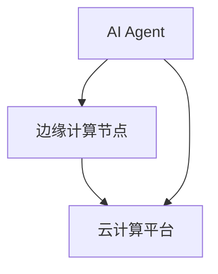
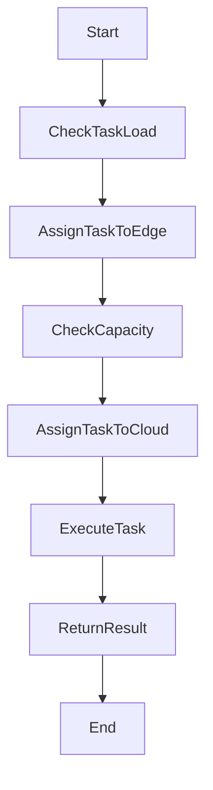
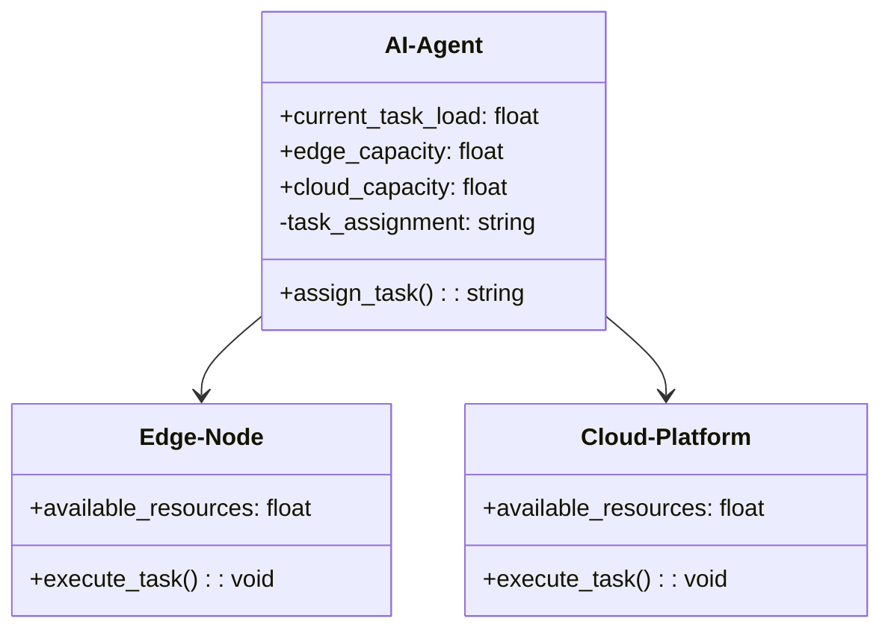
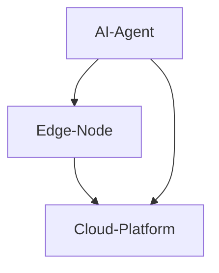

                 


# 《企业AI Agent的边缘计算与云计算协同策略》

## 关键词：企业AI Agent、边缘计算、云计算、协同策略、系统架构、算法原理

## 摘要：本文详细探讨了企业AI Agent在边缘计算与云计算协同中的策略，从背景介绍、核心概念、算法原理、系统架构到项目实战，全面解析了如何实现两者的高效协同，为企业在数字化转型中提供最优解决方案。

---

## 第一章: 企业AI Agent的背景与概念

### 1.1 企业AI Agent的背景介绍

#### 1.1.1 问题背景
- 当前企业数字化转型的需求
- AI Agent在企业中的应用现状
- 边缘计算与云计算的结合趋势

#### 1.1.2 问题描述
- 企业AI Agent面临的挑战
- 边缘计算与云计算协同的必要性
- 协同策略对企业竞争力的提升

#### 1.1.3 问题解决
- AI Agent的核心功能与目标
- 边缘计算与云计算协同的优势
- 协同策略对企业竞争力的提升

#### 1.1.4 边界与外延
- 企业AI Agent的边界定义
- 云计算与边缘计算的协同范围
- 相关技术的外延影响

#### 1.1.5 概念结构与核心要素
- AI Agent的构成要素
- 边缘计算与云计算的关系
- 协同策略的关键组成部分

---

## 第二章: AI Agent的核心概念与原理

### 2.1 AI Agent的基本原理

#### 2.1.1 AI Agent的定义与特征
- AI Agent的定义
- AI Agent的核心特征（智能性、自主性、反应性、社会性）

#### 2.1.2 AI Agent的分类
- 基于任务的分类
- 基于智能水平的分类
- 基于应用场景的分类

### 2.2 边缘计算与云计算的协同关系

#### 2.2.1 边缘计算的特点
- 边缘计算的定义
- 边缘计算的优势（低延迟、高带宽、本地化处理）

#### 2.2.2 云计算的特点
- 云计算的定义
- 云计算的优势（弹性扩展、资源池化、高可用性）

#### 2.2.3 边缘计算与云计算的协同优势
- 资源共享与优化
- 计算任务的动态分配
- 数据的高效处理与传输

### 2.3 AI Agent与边缘计算、云计算的协同模型

#### 2.3.1 协同模型的定义
- 协同模型的核心概念
- 协同模型的组成部分

#### 2.3.2 协同模型的实体关系


---

## 第三章: AI Agent的算法原理与实现

### 3.1 AI Agent的核心算法

#### 3.1.1 算法原理
- AI Agent的任务分配算法
- 边缘计算与云计算协同的数学模型
- 优化目标与约束条件

#### 3.1.2 算法流程


#### 3.1.3 算法实现
```python
def assign_task(current_task_load, edge_capacity, cloud_capacity):
    if current_task_load <= edge_capacity:
        return "Execute on Edge"
    else:
        return "Offload to Cloud"
```

---

## 第四章: 系统架构与设计

### 4.1 系统架构设计

#### 4.1.1 领域模型类图


#### 4.1.2 系统架构图


---

## 第五章: 项目实战与实现

### 5.1 环境安装与配置

#### 5.1.1 环境需求
- Python 3.8+
- Mermaid图表工具
- Jupyter Notebook

#### 5.1.2 安装依赖
```bash
pip install mermaid
```

### 5.2 核心代码实现

#### 5.2.1 任务分配算法实现
```python
def assign_task(current_task_load, edge_capacity, cloud_capacity):
    if current_task_load <= edge_capacity:
        return "Execute on Edge"
    else:
        return "Offload to Cloud"
```

#### 5.2.2 系统接口实现
```python
class EdgeNode:
    def execute_task(self):
        print("Executing task on edge node.")

class CloudPlatform:
    def execute_task(self):
        print("Offloading task to cloud platform.")
```

### 5.3 实际案例分析

#### 5.3.1 案例场景
- 任务负载：80%
- 边缘计算能力：70%
- 云计算能力：90%

#### 5.3.2 算法决策
- 由于任务负载（80%）超过边缘计算能力（70%），任务将被分配到云平台。

### 5.4 代码应用解读

#### 5.4.1 算法结果
```python
result = assign_task(80, 70, 90)
print(result)  # 输出: "Offload to Cloud"
```

#### 5.4.2 系统交互
```python
edge_node = EdgeNode()
cloud_platform = CloudPlatform()

if assign_task(80, 70, 90) == "Offload to Cloud":
    cloud_platform.execute_task()
else:
    edge_node.execute_task()
```

---

## 第六章: 总结与展望

### 6.1 最佳实践
- 合理分配计算任务
- 优化资源利用率
- 定期监控与调整

### 6.2 小结
- 本文详细介绍了企业AI Agent在边缘计算与云计算协同中的策略
- 提供了算法实现和系统架构的设计方案
- 展示了实际案例的应用与分析

### 6.3 注意事项
- 确保数据安全与隐私
- 定期维护与优化
- 考虑网络延迟与带宽限制

### 6.4 拓展阅读
- 《边缘计算与云计算协同的数学模型优化》
- 《AI Agent在分布式系统中的应用研究》

---

## 参考文献

1. 边缘计算与云计算协同的相关文献
2. AI Agent在企业中的应用研究
3. 分布式系统架构设计的最佳实践

