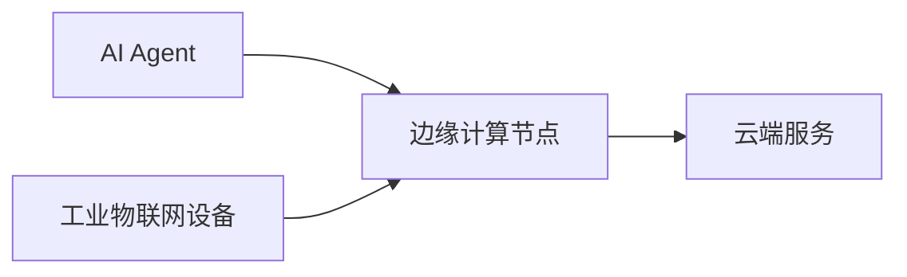
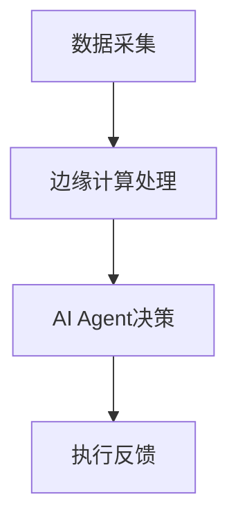
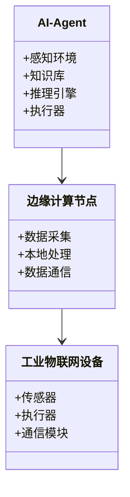
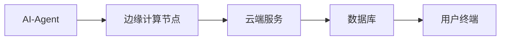
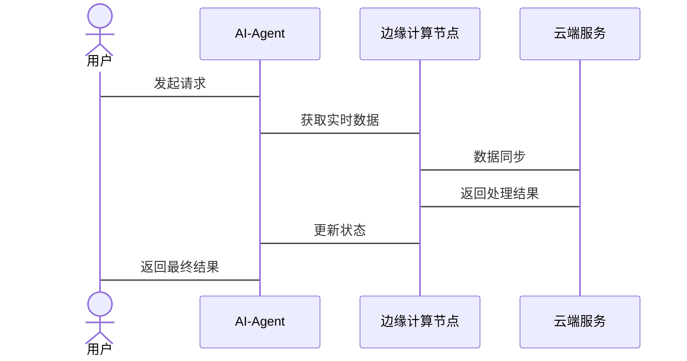

                 


# 企业AI Agent的边缘计算在工业物联网中的实践

## 关键词
- 企业AI Agent
- 边缘计算
- 工业物联网
- 系统架构
- 项目实战

## 摘要
本文详细探讨了企业AI Agent在边缘计算中的应用及其在工业物联网中的实践。通过分析核心概念、算法原理、系统架构和项目实战，本文为读者提供了一个全面的理解框架，帮助企业在工业物联网中高效实施AI Agent和边缘计算技术。

---

# 第一部分: 企业AI Agent的边缘计算在工业物联网中的实践概述

## 第1章: 企业AI Agent与边缘计算的背景介绍

### 1.1 问题背景与描述
#### 1.1.1 工业物联网的现状与挑战
工业物联网（IIoT）通过连接各种设备和传感器，实现了生产线的智能化和自动化。然而，随着数据量的激增，传统的云端计算模式在延迟和带宽方面面临瓶颈，边缘计算的引入成为必然。

#### 1.1.2 边缘计算在工业物联网中的作用
边缘计算将数据处理能力推移到靠近数据源的边缘设备，减少了数据传输的延迟，提高了实时性，同时降低了云端的压力。

#### 1.1.3 AI Agent在企业中的应用价值
AI Agent作为智能决策的核心，能够实时分析边缘设备的数据，优化生产流程，提高效率和质量。

### 1.2 核心概念与问题解决
#### 1.2.1 AI Agent的定义与特点
AI Agent是一种智能体，能够感知环境、自主决策并执行任务。其特点包括自主性、反应性、目标导向和学习能力。

#### 1.2.2 边缘计算的核心概念
边缘计算是指在靠近数据源的地方进行数据处理和分析，具有低延迟、高实时性和分布式的特点。

#### 1.2.3 问题解决路径与边界
通过边缘计算处理实时数据，AI Agent进行决策，实现对工业物联网的智能化管理。边界包括数据范围、处理能力和决策权限。

### 1.3 核心要素与概念结构
#### 1.3.1 AI Agent的核心要素
感知环境、知识库、推理引擎和执行器。

#### 1.3.2 边缘计算的架构模型
包括边缘设备、边缘网关和云端服务三层结构。

#### 1.3.3 工业物联网的系统组成
传感器、边缘设备、工业网关、云端平台和用户终端。

## 第2章: AI Agent与边缘计算的核心概念联系

### 2.1 核心概念原理
#### 2.1.1 AI Agent的工作原理
感知环境、分析信息、制定计划、执行任务和反馈结果。

#### 2.1.2 边缘计算的运行机制
数据采集、预处理、本地分析和决策执行。

#### 2.1.3 两者结合的协同效应
边缘计算提供实时数据，AI Agent进行智能决策，实现高效协同。

### 2.2 概念属性对比表
| 特性          | AI Agent                  | 边缘计算                |
|---------------|---------------------------|-------------------------|
| 数据来源      | 多源数据，实时感知       | 边缘设备，本地数据     |
| 计算位置      | 云端或本地                | 本地                   |
| 响应时间      | 较长                     | 较短                   |
| 应用场景      | 智能决策，自主行动       | 实时处理，减少延迟     |

### 2.3 实体关系图


## 第3章: AI Agent与边缘计算的算法原理

### 3.1 算法原理流程图


### 3.2 算法实现代码
```python
# 示例代码：边缘计算节点处理
def edge_computing(data):
    # 数据预处理
    processed_data = data preprocessing
    # 本地模型推理
    result = local_model.predict(processed_data)
    return result

# 示例代码：AI Agent决策
def ai_agent_decision(data):
    # 数据分析
    analysis = data analysis
    # 决策推理
    decision = decision_model.predict(analysis)
    return decision
```

### 3.3 数学模型与公式
#### 3.3.1 边缘计算中的概率模型
$$ P(A|B) = \frac{P(B|A)P(A)}{P(B)} $$

#### 3.3.2 AI Agent的决策树模型
$$ entropy = -\sum p_i \log p_i $$

## 第4章: 系统分析与架构设计方案

### 4.1 项目背景介绍
本项目旨在通过AI Agent和边缘计算技术，优化工业物联网的实时数据处理和智能决策能力。

### 4.2 系统功能设计
#### 4.2.1 领域模型


#### 4.2.2 系统架构设计


### 4.3 系统接口设计
- 边缘计算节点与AI-Agent之间的API接口：用于数据传递和指令执行。
- 边缘计算节点与云端服务之间的通信接口：用于数据同步和远程控制。

### 4.4 系统交互流程


## 第5章: 项目实战

### 5.1 环境安装
安装必要的软件和工具，包括Python、边缘计算框架（如Kafka）、AI框架（如TensorFlow）和工业物联网平台（如Azure IoT Hub）。

### 5.2 核心代码实现
#### 5.2.1 边缘计算节点代码
```python
import kafka
from kafka import KafkaProducer

def send_data():
    producer = KafkaProducer(bootstrap_servers='localhost:9092')
    while True:
        data = collect_sensor_data()
        producer.send('iot_topic', value=data)
```

#### 5.2.2 AI Agent决策代码
```python
import tensorflow as tf
from tensorflow.keras import models

def ai_decision():
    model = models.load_model('ai_model.h5')
    data = receive_from_kafka()
    prediction = model.predict(data)
    return prediction
```

### 5.3 案例分析
通过一个工厂生产线的实时监控案例，展示AI Agent如何通过边缘计算优化生产流程，减少故障停机时间。

### 5.4 项目小结
项目实现了AI Agent与边缘计算的协同工作，验证了技术的有效性，并为后续优化提供了方向。

## 第6章: 最佳实践与小结

### 6.1 总结
本文详细探讨了企业AI Agent在边缘计算中的应用，分析了其在工业物联网中的实践价值。

### 6.2 小结
通过本文的学习，读者能够理解并实施AI Agent与边缘计算在工业物联网中的应用。

### 6.3 注意事项
- 确保数据安全和隐私保护。
- 选择合适的硬件和软件架构。
- 定期维护和优化系统性能。

### 6.4 拓展阅读
推荐相关书籍和论文，供读者深入学习。

---

# 结语

企业AI Agent的边缘计算在工业物联网中的实践是一项复杂的系统工程，需要结合先进的技术手段和丰富的实践经验。通过本文的系统分析和项目实战，读者可以掌握这一领域的核心知识，为未来的实践打下坚实基础。

