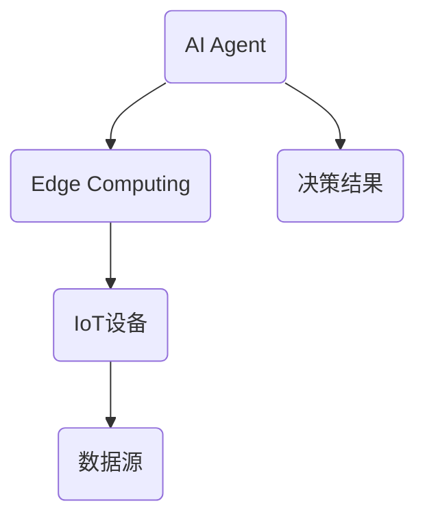
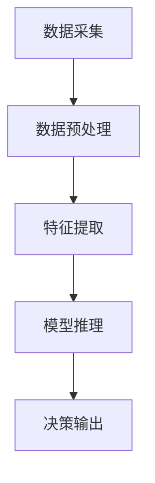
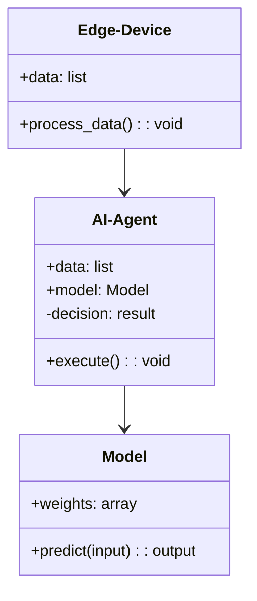
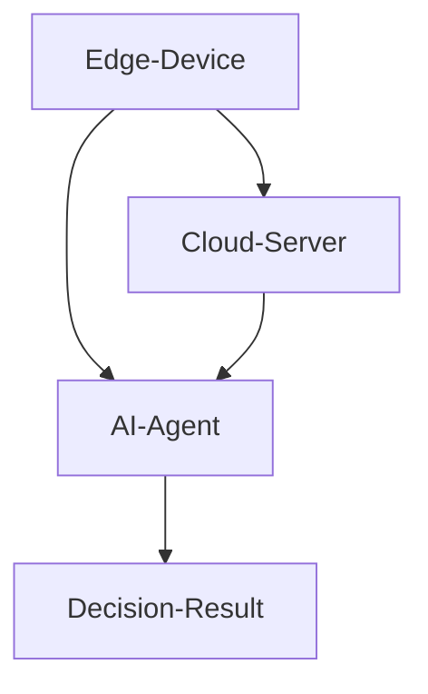
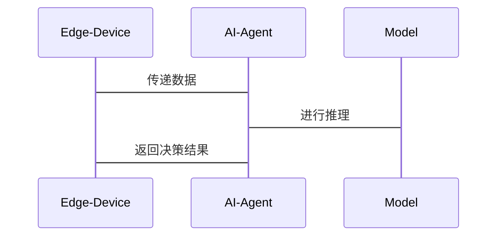

                 


# 企业AI Agent的边缘计算在物联网场景中的低延迟决策实践

## 关键词：企业AI Agent，边缘计算，物联网，低延迟决策，实时处理

## 摘要：本文详细探讨了企业AI Agent在边缘计算环境中的应用，特别是在物联网场景中的低延迟决策实践。通过分析核心概念、算法原理、系统架构设计和项目实战，本文为读者提供了从理论到实践的全面指导，展示了如何利用边缘计算实现高效的实时决策。

---

## 第一部分: 背景介绍

### 第1章: 企业AI Agent与边缘计算概述

#### 1.1 企业AI Agent的核心概念

##### 1.1.1 AI Agent的定义与特征
AI Agent（人工智能代理）是指能够感知环境、自主决策并采取行动的智能实体。企业AI Agent具备以下特征：
- **自主性**：能够在没有外部干预的情况下独立运作。
- **反应性**：能够实时感知环境变化并做出响应。
- **目标导向**：通过优化目标函数来实现预定目标。
- **学习能力**：通过机器学习模型不断优化决策能力。

##### 1.1.2 边缘计算的基本概念
边缘计算是一种分布式计算范式，将数据处理和决策能力从云端移到靠近数据源的边缘设备。其特点包括：
- **低延迟**：数据处理在本地进行，减少网络传输延迟。
- **高实时性**：适用于需要实时响应的场景。
- **隐私保护**：在边缘设备上处理数据，减少数据传输过程中的隐私泄露风险。

##### 1.1.3 物联网场景中的AI Agent应用
在物联网场景中，AI Agent通常部署在边缘设备上，负责实时处理数据并做出决策。例如，在智能制造中，AI Agent可以实时监控生产线状态，预测设备故障并进行自适应调整。

#### 1.2 问题背景与挑战

##### 1.2.1 物联网实时决策的需求
物联网系统通常涉及大量设备和传感器，需要实时处理海量数据并做出决策。传统基于云端的集中式决策模式存在延迟高、带宽消耗大等问题。

##### 1.2.2 中心化决策的局限性
云端决策模式在处理实时性要求高的场景时，由于网络延迟和带宽限制，难以满足快速响应的需求。此外，中心化决策还可能导致单点故障和隐私泄露问题。

##### 1.2.3 边缘计算在低延迟决策中的优势
边缘计算通过将数据处理和决策能力下沉到边缘设备，显著降低了决策延迟，提高了实时性。同时，边缘计算还能够减少云端的负担，优化网络资源利用率。

#### 1.3 问题解决与边界

##### 1.3.1 边缘计算如何实现低延迟决策
边缘计算通过在边缘设备上部署AI Agent，实时处理数据并做出决策。AI Agent能够快速响应本地事件，减少对云端的依赖，从而实现低延迟决策。

##### 1.3.2 AI Agent在边缘计算中的作用
AI Agent在边缘计算中作为智能决策的核心，负责感知环境、分析数据、制定策略并执行行动。它能够通过本地数据处理和模型推理，快速做出决策。

##### 1.3.3 边界与外延
边缘计算的边界通常是指数据处理的范围，AI Agent仅在边缘设备上处理与本地相关的数据，而将全局性任务仍交由云端处理。这种分工协作模式既能保证实时性，又能够充分利用云端资源。

#### 1.4 概念结构与核心要素

##### 1.4.1 AI Agent的组成与功能
AI Agent通常由感知模块、推理模块和执行模块组成。感知模块负责采集数据并识别环境状态，推理模块基于模型进行分析和决策，执行模块负责将决策结果转化为具体行动。

##### 1.4.2 边缘计算的架构与层次
边缘计算的架构通常包括设备层、边缘层和云端。设备层负责数据采集和初步处理，边缘层负责数据汇聚、分析和决策，云端负责全局性任务的处理和资源管理。

##### 1.4.3 物联网场景中的数据流与决策流程
在物联网场景中，数据从传感器设备采集后，通过边缘设备进行预处理和特征提取，然后由AI Agent进行模型推理和决策，最终将结果反馈给设备或传回云端。

---

## 第二部分: 核心概念与联系

### 第2章: AI Agent、边缘计算与物联网的关系

#### 2.1 核心概念原理

##### 2.1.1 AI Agent的决策机制
AI Agent通过感知环境、分析数据并基于预训练的模型进行推理，最终做出决策。其决策机制通常包括数据采集、特征提取、模型推理和结果输出四个步骤。

##### 2.1.2 边缘计算的分布式处理特点
边缘计算通过分布式架构将数据处理和决策能力下沉到边缘设备，充分利用本地资源，减少对云端的依赖。这种分布式处理模式能够提高系统的实时性和可靠性。

##### 2.1.3 物联网场景中的多设备协同
物联网场景中，多个设备协同工作，通过边缘计算实现数据的实时共享和协同决策。这种多设备协同模式能够提高系统的整体效率和智能化水平。

#### 2.2 概念对比与联系

##### 2.2.1 AI Agent与传统决策系统的对比
| 特性                | AI Agent               | 传统决策系统         |
|---------------------|-------------------------|-----------------------|
| 数据处理位置        | 边缘设备或本地          | 云端或集中式         |
| 响应时间            | 低延迟，实时响应        | 较高延迟，非实时      |
| 学习能力            | 具备机器学习能力        | 通常不具备            |
| 部署灵活性          | 支持分布式部署          | 通常集中部署          |

##### 2.2.2 边缘计算与云计算的对比
| 特性                | 边缘计算                | 云计算                |
|---------------------|-------------------------|-----------------------|
| 数据处理位置        | 边缘设备                | 云端                  |
| 延迟                | 低延迟                  | 较高延迟              |
| 网络依赖            | 较低                    | 较高                  |
| 隐私保护            | 较好，数据不出本地      | 较差，数据传输过程可能泄露 |

##### 2.2.3 物联网场景中的协同关系
在物联网场景中，AI Agent、边缘计算和物联网设备之间形成了协同关系。AI Agent负责决策，边缘计算提供分布式处理能力，物联网设备负责数据采集和执行操作。

#### 2.3 实体关系图（ER图）



---

## 第三部分: 算法原理讲解

### 第3章: 低延迟决策算法

#### 3.1 算法原理

##### 3.1.1 基于边缘计算的实时处理机制
低延迟决策算法的核心是通过边缘计算实现数据的实时处理和快速决策。AI Agent在边缘设备上运行，通过本地数据处理和模型推理，快速做出决策并执行。

##### 3.1.2 AI Agent的决策模型
AI Agent的决策模型通常包括感知模型、推理模型和执行模型。感知模型负责数据采集和特征提取，推理模型基于机器学习模型进行预测，执行模型负责将决策结果转化为具体行动。

#### 3.2 算法流程图



#### 3.3 Python代码实现

```python
def edge_decision(data):
    # 数据预处理
    processed_data = preprocess(data)
    # 特征提取
    features = extract_features(processed_data)
    # 模型推理
    prediction = model.predict(features)
    return prediction
```

#### 3.4 数学模型与公式

##### 3.4.1 滑动窗口机制
为了优化低延迟决策，我们可以使用滑动窗口机制。假设我们有时间序列数据，滑动窗口机制可以将数据分成多个窗口，每个窗口内的数据用于模型推理。

##### 3.4.2 模型推理公式
假设我们使用线性回归模型进行推理，模型的预测公式可以表示为：
$$ y = \theta_0 + \theta_1 x_1 + \theta_2 x_2 + \dots + \theta_n x_n $$
其中，$y$ 是预测结果，$\theta$ 是模型参数，$x$ 是输入特征。

##### 3.4.3 优化算法
为了提高模型的推理速度和准确性，我们可以使用优化算法（如Adam优化器）来训练模型。优化算法的更新规则可以表示为：
$$ \theta = \theta - \eta \nabla J(\theta) $$
其中，$\theta$ 是模型参数，$\eta$ 是学习率，$\nabla J(\theta)$ 是损失函数的梯度。

---

## 第四部分: 系统分析与架构设计

### 第4章: 系统分析与架构设计

#### 4.1 问题场景介绍
在智能制造场景中，我们需要实时监控生产线设备的状态，预测设备故障并进行自适应调整。通过部署AI Agent在边缘设备上，我们可以实现设备状态的实时监控和决策。

#### 4.2 系统功能设计

##### 4.2.1 领域模型类图



#### 4.3 系统架构设计

##### 4.3.1 架构图



#### 4.4 接口设计与交互流程

##### 4.4.1 接口设计
- 数据采集接口：从传感器设备采集数据。
- 数据处理接口：对采集的数据进行预处理和特征提取。
- 模型推理接口：基于预训练的模型进行预测。
- 决策结果接口：将决策结果反馈给设备或传回云端。

##### 4.4.2 交互流程图



---

## 第五部分: 项目实战

### 第5章: 项目实战

#### 5.1 环境安装与配置

##### 5.1.1 安装Python库
```bash
pip install numpy pandas scikit-learn
```

##### 5.1.2 安装边缘计算框架
```bash
pip install edge-computing-framework
```

#### 5.2 核心代码实现

##### 5.2.1 数据预处理函数
```python
def preprocess(data):
    # 数据清洗和标准化
    processed_data = data.dropna().astype(float)
    return processed_data
```

##### 5.2.2 特征提取函数
```python
def extract_features(data):
    # 提取特征向量
    features = data.mean(axis=0).values
    return features
```

##### 5.2.3 模型推理函数
```python
def model_predict(features):
    # 使用预训练模型进行预测
    prediction = model.predict(features)
    return prediction
```

#### 5.3 实际案例分析

##### 5.3.1 案例背景
在智能制造场景中，我们需要实时监控生产线设备的状态，预测设备故障并进行自适应调整。

##### 5.3.2 案例分析
通过部署AI Agent在边缘设备上，我们可以实时采集设备状态数据，进行预处理和特征提取，然后通过模型推理预测设备故障。AI Agent可以根据预测结果调整设备参数，从而实现自适应优化。

#### 5.4 项目总结

##### 5.4.1 成果总结
- 成功实现了AI Agent在边缘设备上的部署。
- 实现了低延迟的实时决策，显著提高了系统的响应速度和效率。
- 通过滑动窗口机制和优化算法，提高了模型的准确性和推理速度。

##### 5.4.2 经验总结
- 部署边缘计算需要考虑设备的计算能力和网络条件。
- 模型的选择和优化对决策的准确性和延迟有重要影响。
- 与云端的协同工作能够进一步优化系统的全局决策能力。

---

## 第六部分: 最佳实践

### 第6章: 最佳实践

#### 6.1 小结
企业AI Agent在边缘计算中的应用为物联网场景提供了低延迟决策的能力，显著提高了系统的实时性和效率。通过合理的架构设计和算法优化，我们可以实现高效的实时决策。

#### 6.2 注意事项
- 在部署边缘计算时，需要充分考虑设备的计算能力和网络条件。
- 模型的选择和优化对决策的准确性和延迟有重要影响。
- 需要定期更新模型以应对环境和数据的变化。

#### 6.3 未来趋势
- 边缘AI技术的进一步发展将推动边缘计算的应用范围扩大。
- 跨邊緣設備的协同决策将成为未来的重要研究方向。
- AI Agent与区块链等新技术的结合将为边缘计算带来新的可能性。

#### 6.4 拓展阅读
- 《Edge Computing and Its Applications》
- 《AI Agents in Distributed Systems》
- 《Low-Latency Decision Making in IoT》

---

通过以上内容，我们详细探讨了企业AI Agent在边缘计算中的应用，特别是在物联网场景中的低延迟决策实践。从理论到实践，本文为读者提供了全面的指导，帮助他们理解和应用这些技术。希望本文能够为相关领域的研究和实践提供有价值的参考。

