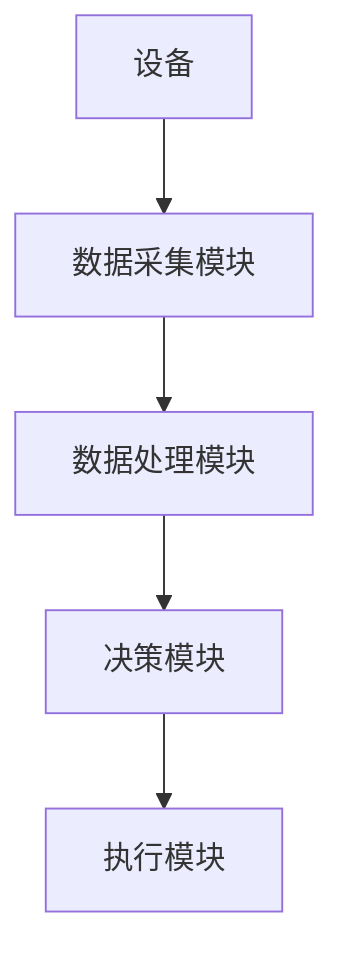
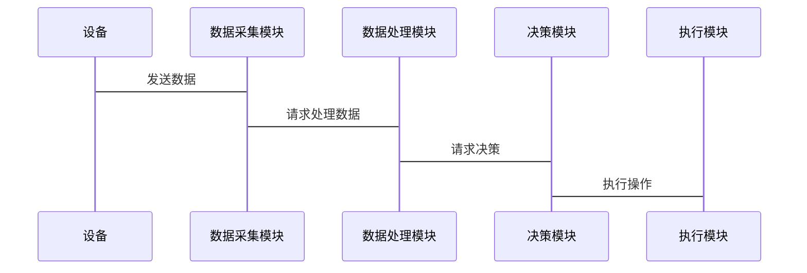

                 


# 《企业AI Agent的边缘计算在物联网场景中的实践》

---

## 关键词：
企业AI Agent，边缘计算，物联网，算法原理，系统架构，项目实战，最佳实践

---

## 摘要：
本文深入探讨了企业AI Agent在边缘计算环境下的物联网应用场景，从理论到实践，全面解析了AI Agent与边缘计算的结合方式。文章首先介绍了AI Agent和边缘计算的核心概念，分析了它们在企业物联网中的优势与挑战，随后详细阐述了相关的算法原理、系统架构设计和项目实战案例。通过具体的技术实现和案例分析，本文为读者提供了如何在实际项目中高效应用AI Agent和边缘计算的实践指导，最后总结了最佳实践经验和未来的发展方向。

---

## 第一部分：企业AI Agent的背景与概述

### 第1章：AI Agent与边缘计算的概述

#### 1.1 什么是AI Agent
- **1.1.1 AI Agent的定义与核心特征**
  - AI Agent（人工智能代理）是指能够感知环境、自主决策并执行任务的智能实体。
  - 核心特征：自主性、反应性、目标导向、社交能力、学习能力。

- **1.1.2 AI Agent的工作原理**
  - 感知环境：通过传感器或API获取实时数据。
  - 分析决策：基于机器学习模型进行分析和预测。
  - 执行任务：通过执行器或API实现目标。

- **1.1.3 AI Agent与传统代理的区别**
  - 传统代理：基于规则的被动执行。
  - AI Agent：基于机器学习的主动决策。

#### 1.2 边缘计算的概念与特点
- **1.2.1 边缘计算的定义**
  - 边缘计算是指在数据源附近进行数据处理和分析的技术，减少了对云端的依赖。

- **1.2.2 边缘计算的核心特点**
  - 低延迟：数据处理在本地完成，减少网络传输时间。
  - 高实时性：能够快速响应实时事件。
  - 高可用性：边缘节点独立运行，避免单点故障。

- **1.2.3 边缘计算与云计算的对比**
  - 云计算：集中式处理，依赖网络传输。
  - 边缘计算：分布式处理，数据本地化。

#### 1.3 物联网场景中的AI Agent
- **1.3.1 物联网的基本概念**
  - 物联网（IoT）：通过互联网连接各种设备、传感器和系统，实现数据的采集、传输和分析。

- **1.3.2 AI Agent在物联网中的作用**
  - 数据处理：在边缘节点处理物联网设备产生的海量数据。
  - 实时决策：基于实时数据做出快速反应。
  - 自动化控制：实现设备的智能化管理。

- **1.3.3 物联网场景中的AI Agent应用场景**
  - 智慧工厂：设备监控与预测性维护。
  - 智慧城市：交通管理与资源优化。
  - 智能家居：设备联动与自动化控制。

---

## 第二部分：核心概念与原理

### 第2章：企业AI Agent边缘计算的背景与需求

#### 2.1 企业智能化转型的背景
- **2.1.1 数字化转型的现状**
  - 企业正在从信息化向智能化转型，数据成为核心资产。
  - 传统企业面临数据孤岛、效率低下等问题。

- **2.1.2 企业智能化转型的核心需求**
  - 实现数据的实时处理与智能决策。
  - 提高业务流程的自动化水平。
  - 降低运营成本，提升用户体验。

- **2.1.3 AI Agent在企业智能化中的地位**
  - AI Agent作为智能化转型的核心技术，能够实现业务流程的自动化和智能化。

#### 2.2 边缘计算在企业中的应用趋势
- **2.2.1 边缘计算在企业中的应用现状**
  - 边缘计算在制造业、物流、能源等领域逐渐普及。
  - 企业开始采用边缘计算来优化数据处理效率。

- **2.2.2 边缘计算在企业中的发展趋势**
  - 边缘计算将与5G、AI、IoT等技术深度融合。
  - 边缘计算节点的数量和类型将不断增加。

- **2.2.3 AI Agent与边缘计算的结合**
  - AI Agent通过边缘计算实现数据的实时处理和智能决策。
  - 边缘计算为AI Agent提供了低延迟、高实时性的计算环境。

#### 2.3 物联网场景中的AI Agent需求
- **2.3.1 物联网场景中的数据处理需求**
  - 数据量大、类型多样，需要高效的处理能力。
  - 数据隐私和安全性的要求高。

- **2.3.2 AI Agent在物联网中的核心需求**
  - 快速响应：实时处理物联网设备的数据。
  - 自适应：能够根据环境变化自适应调整策略。
  - 可扩展性：支持大规模物联网设备的接入。

---

## 第三部分：算法原理

### 第3章：边缘计算中的数据处理算法

#### 3.1 数据预处理算法
- **数据清洗**：去除噪声数据，确保数据质量。
- **数据转换**：将数据转换为适合算法处理的形式。
- **数据聚合**：将多个数据点聚合为一个有意义的事件。

#### 3.2 数据分析算法
- **时间序列分析**：用于预测未来的趋势。
- **异常检测**：通过统计方法或机器学习模型检测异常数据。
- **关联规则挖掘**：发现数据中的关联关系。

#### 3.3 算法实现
- **实现步骤**：
  1. 数据采集。
  2. 数据预处理。
  3. 数据分析。
  4. 结果输出。

- **代码实现**：
  ```python
  import numpy as np
  from sklearn.preprocessing import StandardScaler

  # 示例数据
  data = np.array([1, 2, 3, 4, 5])
  scaler = StandardScaler()
  normalized_data = scaler.fit_transform(data.reshape(-1, 1))
  print(normalized_data)
  ```

- **数学模型**：
  $$ y = a x + b $$
  其中，$$ x $$ 是输入数据，$$ y $$ 是预测结果，$$ a $$ 和 $$ b $$ 是模型参数。

### 第4章：AI Agent中的决策算法

#### 4.1 决策树算法
- **决策树构建**：基于训练数据构建决策树模型。
- **决策树推理**：根据输入数据，通过决策树进行分类或回归。

#### 4.2 贝叶斯网络
- **贝叶斯网络构建**：通过概率关系构建模型。
- **概率推理**：根据先验概率和条件概率进行推理。

#### 4.3 算法实现
- **实现步骤**：
  1. 数据准备。
  2. 模型训练。
  3. 模型推理。

- **代码实现**：
  ```python
  from sklearn.tree import DecisionTreeClassifier
  from sklearn.metrics import accuracy_score

  # 示例数据
  X = [[1, 0], [1, 1], [0, 1], [0, 0]]
  y = [0, 1, 1, 0]

  # 训练模型
  clf = DecisionTreeClassifier()
  clf.fit(X, y)

  # 预测
  print(clf.predict([[1, 1]]))
  ```

- **数学模型**：
  $$ P(y|x) = \frac{P(x|y)P(y)}{P(x)} $$

---

## 第四部分：系统架构

### 第5章：系统架构设计

#### 5.1 系统功能设计
- **功能模块**：
  - 数据采集模块。
  - 数据处理模块。
  - 决策模块。
  - 执行模块。

#### 5.2 系统架构图


#### 5.3 接口设计
- **API接口**：
  - 数据采集接口：`POST /api/data`
  - 数据处理接口：`POST /api/process`
  - 决策接口：`POST /api/decision`

#### 5.4 交互流程


---

## 第五部分：项目实战

### 第6章：项目实战

#### 6.1 环境安装
- **安装Python**：
  ```bash
  python --version
  ```
- **安装依赖库**：
  ```bash
  pip install numpy scikit-learn
  ```

#### 6.2 核心代码实现
- **数据处理代码**：
  ```python
  import numpy as np

  def preprocess_data(data):
      return data / 100  # 示例数据预处理

  def main():
      data = np.array([100, 200, 300, 400, 500])
      processed_data = preprocess_data(data)
      print(processed_data)

  if __name__ == "__main__":
      main()
  ```

- **决策算法代码**：
  ```python
  from sklearn.tree import DecisionTreeClassifier

  def train_model(X, y):
      clf = DecisionTreeClassifier()
      clf.fit(X, y)
      return clf

  def predict(clf, new_data):
      return clf.predict(new_data)

  if __name__ == "__main__":
      X = [[1, 0], [1, 1], [0, 1], [0, 0]]
      y = [0, 1, 1, 0]
      clf = train_model(X, y)
      print(predict(clf, [[1, 1]]))
  ```

#### 6.3 代码解读与分析
- **数据处理代码**：
  - `preprocess_data`函数：对输入数据进行归一化处理。
  - `main`函数：生成示例数据并调用预处理函数。

- **决策算法代码**：
  - `train_model`函数：使用决策树算法训练模型。
  - `predict`函数：使用训练好的模型进行预测。

#### 6.4 实际案例分析
- **案例背景**：
  某智慧工厂需要实时监控设备状态，预测故障风险。

- **解决方案**：
  - 数据采集：设备传感器数据。
  - 数据处理：预处理和特征提取。
  - 决策算法：使用决策树模型预测设备状态。

- **结果展示**：
  - 预测结果：设备状态正常或异常。

#### 6.5 项目小结
- 项目实现了设备状态的实时监控和预测。
- 使用了AI Agent和边缘计算技术，提高了系统的实时性和可靠性。

---

## 第六部分：最佳实践

### 第7章：最佳实践与总结

#### 7.1 最佳实践
- **数据处理**：
  - 确保数据的实时性和准确性。
  - 处理数据时考虑隐私和安全问题。

- **算法选择**：
  - 根据具体场景选择合适的算法。
  - 定期更新模型，提高预测准确率。

- **系统架构**：
  - 确保系统的可扩展性和可维护性。
  - 采用模块化设计，便于后续优化。

#### 7.2 小结
- AI Agent与边缘计算的结合为企业物联网的应用提供了新的可能性。
- 通过本文的分析和实践，读者可以掌握如何在实际项目中应用这些技术。

#### 7.3 注意事项
- 数据安全：确保数据在处理和传输过程中的安全性。
- 系统稳定性：确保系统在极端情况下仍能正常运行。
- 维护与更新：定期维护系统，及时更新模型和算法。

#### 7.4 未来展望
- AI Agent将更加智能化，具备更强的自主决策能力。
- 边缘计算将与5G、IoT等技术深度融合，推动企业智能化转型。
- 新兴技术如联邦学习将为企业AI Agent的应用提供更多可能性。

#### 7.5 拓展阅读
- 《边缘计算入门与实践》
- 《AI Agent在企业智能化中的应用》
- 《物联网系统设计与实现》

---

## 总结
本文从理论到实践，详细探讨了企业AI Agent在边缘计算环境下的物联网应用场景。通过分析核心概念、算法原理、系统架构和项目实战，为读者提供了全面的技术指导。未来，随着技术的不断进步，AI Agent和边缘计算将在企业物联网中发挥更大的作用，为企业创造更多的价值。

