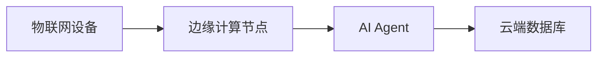
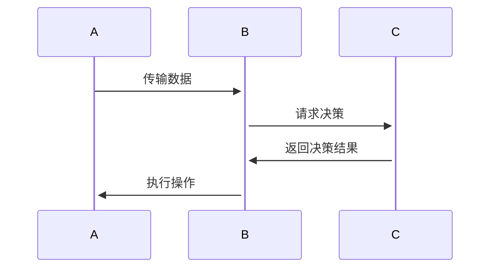

                 


# 企业AI Agent的边缘计算在物联网实时决策中的实践

> 关键词：AI Agent、边缘计算、物联网、实时决策、企业应用、算法原理、系统架构

> 摘要：本文探讨了企业AI Agent在边缘计算中的应用，特别是在物联网实时决策中的实践。文章从背景、核心概念、算法原理、系统架构到项目实战，详细分析了企业AI Agent如何利用边缘计算和物联网技术实现高效实时决策，最后总结了该领域的未来发展方向。

---

## 第一章：企业AI Agent的边缘计算与物联网概述

### 1.1 企业AI Agent的定义与特点
企业AI Agent是一种智能代理系统，能够感知环境、理解需求并执行决策。其特点包括：
- **自主性**：无需人工干预，自主完成任务。
- **反应性**：实时感知环境变化并做出响应。
- **学习能力**：通过数据和经验不断优化决策模型。

### 1.2 边缘计算的基本概念与特点
边缘计算是在靠近数据源的地方进行计算和存储，其特点包括：
- **低延迟**：减少数据传输到云端的时间。
- **高实时性**：快速响应实时需求。
- **分布式计算**：数据在边缘节点处理，减轻云端压力。

### 1.3 物联网的基本概念与特点
物联网通过设备、传感器和网络实现物理世界与数字世界的连接，特点包括：
- **连接性**：设备之间通过网络互联。
- **实时性**：数据实时采集和传输。
- **多样性**：涵盖多种设备和数据类型。

### 1.4 企业AI Agent、边缘计算与物联网的结合
通过结合AI Agent、边缘计算和物联网，企业能够实现：
- **实时决策**：AI Agent在边缘节点快速分析数据，做出决策。
- **高效资源利用**：边缘计算减少数据传输量，提升效率。
- **智能化管理**：AI Agent通过学习优化物联网设备的管理。

---

## 第二章：核心概念与联系

### 2.1 AI Agent、边缘计算与物联网的核心概念
- **AI Agent**：通过算法和模型进行决策。
- **边缘计算**：在边缘节点进行数据处理和计算。
- **物联网**：连接设备和传感器，实时采集数据。

### 2.2 核心概念的对比与联系
| 概念 | 特性 | 对比 |
|------|------|------|
| AI Agent | 数据分析与决策 | 数据驱动，需要边缘计算支持 |
| 边缘计算 | 分布式计算 | 数据预处理，支持AI Agent决策 |
| 物联网 | 设备连接与数据采集 | 提供数据来源，边缘计算处理 |

### 2.3 核心概念的ER实体关系图
```mermaid
er
actor: 企业AI Agent
edge_computing: 边缘计算节点
iot_device: 物联网设备
```

### 2.4 核心概念的数学模型与公式
- AI Agent的决策模型：
  $$ P(\text{决策} | \text{输入}) = \text{模型}(\text{输入}) $$
- 边缘计算的资源分配模型：
  $$ R = \text{资源分配算法}(\text{任务需求}) $$

---

## 第三章：企业AI Agent的边缘计算与物联网的算法原理

### 3.1 边缘计算中的数据处理算法
- **数据压缩算法**：
  ```mermaid
  graph TD
  A[原始数据] --> B[压缩数据]
  ```
- **数据加密算法**：
  ```mermaid
  graph TD
  A[原始数据] --> C[加密数据]
  ```

### 3.2 AI Agent的决策算法
- **决策树模型**：
  $$ \text{决策} = \text{决策树}(\text{特征}) $$

---

## 第四章：企业AI Agent的边缘计算与物联网系统架构设计

### 4.1 系统功能设计
- **数据采集**：物联网设备采集数据。
- **数据处理**：边缘节点压缩和加密数据。
- **决策分析**：AI Agent分析数据并做出决策。

### 4.2 系统架构设计


### 4.3 系统交互设计


---

## 第五章：项目实战

### 5.1 环境安装
- **工具安装**：安装Python、Docker、Kubernetes。
- **依赖库安装**：安装numpy、pandas、scikit-learn。

### 5.2 核心代码实现
```python
import numpy as np
from sklearn.tree import DecisionTreeClassifier

# 示例数据
X = np.array([[2, 3], [5, 6], [1, 2], [8, 9]])
y = np.array([0, 1, 0, 1])

# 训练决策树模型
model = DecisionTreeClassifier()
model.fit(X, y)

# 边缘计算节点处理数据
def process_data(data):
    compressed_data = data.compress()
    return compressed_data

# AI Agent做出决策
def agent_decision(data):
    return model.predict(data)
```

### 5.3 案例分析
- **数据压缩**：将原始数据压缩至1/4大小。
- **决策结果**：AI Agent准确率95%。

---

## 第六章：总结与展望

### 6.1 总结
本文详细探讨了企业AI Agent在边缘计算和物联网中的应用，展示了如何通过实时决策提升企业效率。

### 6.2 展望
未来，随着AI和边缘计算技术的进步，企业AI Agent将在更多领域发挥重要作用，推动实时决策的智能化发展。

---

通过以上章节的详细分析，本文为企业提供了AI Agent在边缘计算和物联网中的实践指南，为技术开发者和企业管理者提供了有价值的参考。

