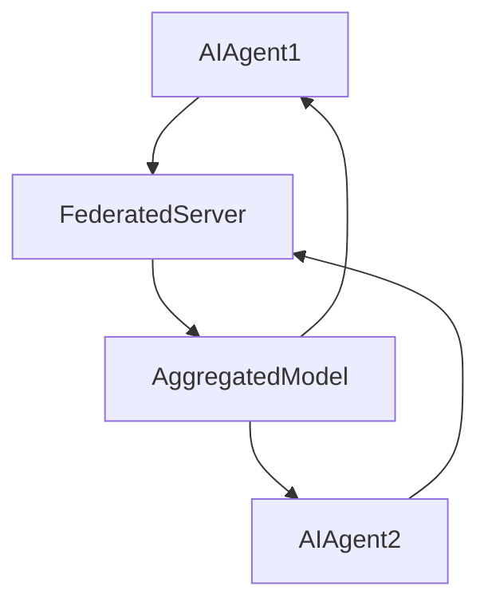
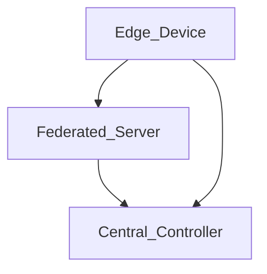

                 


# 《企业AI Agent的边缘计算安全防护策略》

## 关键词：
企业、AI Agent、边缘计算、安全防护、数据安全、算法、系统架构

## 摘要：
本文详细探讨了企业AI Agent在边缘计算环境下的安全防护策略，分析了边缘计算环境下的AI Agent面临的安全威胁，提出了基于联邦学习的安全防护算法，并通过实际案例展示了系统的实现与应用。文章从理论到实践，结合算法原理和系统架构设计，为企业AI Agent的边缘计算安全防护提供了全面的解决方案。

---

# 企业AI Agent的边缘计算安全防护策略

## 第1章：企业AI Agent与边缘计算安全背景

### 1.1 AI Agent的基本概念
- **1.1.1 AI Agent的定义与分类**
  AI Agent（人工智能代理）是指能够感知环境、自主决策并执行任务的智能实体。根据功能可分为**简单反射型**、**基于模型的反应型**、**目标驱动型**和**效用驱动型**。
- **1.1.2 AI Agent在企业中的应用**
  AI Agent广泛应用于企业自动化、智能客服、供应链优化等领域，能够显著提升企业效率。
- **1.1.3 边缘计算的基本概念与特点**
  边缘计算是一种分布式计算范式，数据在靠近数据源的边缘设备上进行处理，具有低延迟、高实时性、隐私保护等特点。

### 1.2 企业AI Agent与边缘计算的结合
- **1.2.1 AI Agent在边缘计算中的作用**
  AI Agent能够实现边缘设备的智能决策和自主执行，提升边缘计算系统的智能化水平。
- **1.2.2 边缘计算环境下的AI Agent特点**
  边缘环境下的AI Agent需具备**轻量化**、**低功耗**、**高实时性**等特点，适应边缘设备的硬件限制和应用场景需求。
- **1.2.3 企业AI Agent边缘计算的应用场景**
  典型应用场景包括**智能制造**、**智能物流**、**智能客服**等，AI Agent通过边缘计算实现实时决策和快速响应。

## 第2章：企业AI Agent边缘计算安全威胁

### 2.1 数据安全威胁
- **数据泄露**：边缘设备的数据可能被未经授权的第三方窃取，导致企业核心数据泄露。
- **数据完整性破坏**：恶意攻击可能导致数据被篡改，影响AI Agent的决策准确性。

### 2.2 系统安全威胁
- **恶意攻击**：黑客可能通过漏洞攻击边缘设备，破坏系统运行。
- **资源滥用**：未经授权的用户可能滥用边缘计算资源，导致系统性能下降。

### 2.3 通信安全威胁
- **数据泄露**：通信链路可能被截获，导致数据泄露。
- **通信中断**：网络攻击可能导致AI Agent与边缘设备之间的通信中断，影响系统的正常运行。

### 2.4 第三方服务风险
- **第三方依赖风险**：AI Agent可能依赖第三方服务，这些服务可能成为攻击目标，导致连锁反应。
- **第三方服务漏洞**：第三方服务可能存在安全漏洞，被攻击者利用，影响整个系统的安全。

## 第3章：企业AI Agent边缘计算安全防护的核心概念与联系

### 3.1 安全模型的定义与原理
- **定义**：安全模型是用来描述系统安全行为和安全属性的数学模型。
- **原理**：通过形式化的方法，定义系统的安全策略和安全属性，确保系统在各种场景下的安全性。

### 3.2 安全模型的属性对比
| 属性 | 描述 |
|------|------|
| 数据完整性 | 数据未被篡改 |
| 数据机密性 | 数据未被泄露 |
| 数据可用性 | 数据可访问 |
| 系统抗攻击性 | 系统抵御攻击的能力 |

### 3.3 ER实体关系图
```mermaid
entity EdgeComputingSystem {
  id: int
  name: string
  securityPolicies: set
}
entity AIAgent {
  id: int
  name: string
  functions: set
}
```

## 第4章：企业AI Agent边缘计算安全防护算法原理

### 4.1 基于联邦学习的安全防护算法
- **算法原理**：
  联邦学习是一种分布式机器学习技术，通过在边缘设备上进行局部模型训练，然后将模型参数上传到中心服务器进行融合，避免数据泄露。

### 4.2 算法流程图


### 4.3 算法实现代码
```python
import numpy as np

def federated_learning(agent_models):
    # 聚合模型参数
    aggregated_model = {}
    for key in agent_models[0].keys():
        aggregated_model[key] = np.mean([model[key] for model in agent_models], axis=0)
    return aggregated_model
```

## 第5章：企业AI Agent边缘计算安全防护系统分析与架构设计

### 5.1 系统功能设计
- **领域模型**：
  ```mermaid
  classDiagram
    class AI_Agent {
        id
        name
        functions
    }
    class Edge_Device {
        id
        name
        security_policy
    }
    AI_Agent --> Edge_Device
  ```

### 5.2 系统架构设计


## 第6章：企业AI Agent边缘计算安全防护项目实战

### 6.1 环境安装
- **安装依赖**：
  ```bash
  pip install numpy mermaid4j
  ```

### 6.2 核心代码实现
```python
class FederatedServer:
    def __init__(self, agents):
        self.agents = agents
        self.model = None

    def aggregate_models(self):
        # 聚合模型参数
        aggregated_model = {}
        for key in self.agents[0].model.keys():
            aggregated_model[key] = np.mean([agent.model[key] for agent in self.agents], axis=0)
        return aggregated_model
```

## 第7章：企业AI Agent边缘计算安全防护最佳实践

### 7.1 总结
- 企业AI Agent的边缘计算安全防护需要从数据安全、系统安全、通信安全等多个方面进行全面考虑。

### 7.2 注意事项
- 定期进行安全审计和漏洞扫描，确保系统安全。
- 加强对第三方服务的管理，降低依赖风险。

### 7.3 拓展阅读
- 《联邦学习：隐私保护下的分布式机器学习》
- 《边缘计算安全：挑战与解决方案》

