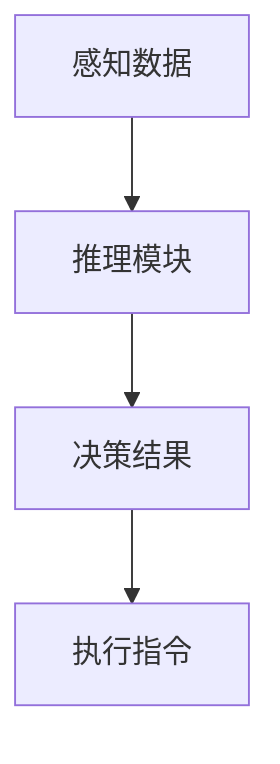
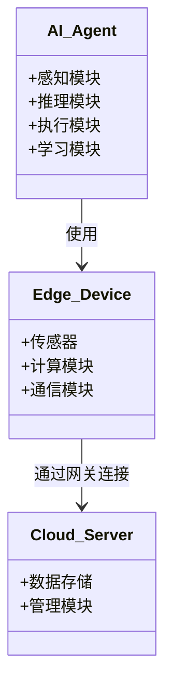

                 


# 企业AI Agent的边缘计算应用：提升响应速度

> 关键词：AI Agent、边缘计算、企业应用、响应速度、算法优化、系统架构、项目实战

> 摘要：本文探讨了企业AI Agent在边缘计算中的应用，分析了如何通过边缘计算提升AI Agent的响应速度。文章从背景介绍、核心概念、算法原理、系统架构、项目实战等多个方面展开，深入剖析了AI Agent与边缘计算的结合方式，并通过实际案例展示了如何在企业中实现高效的AI Agent边缘计算应用。

---

## 第一部分：企业AI Agent与边缘计算的背景介绍

### 第1章：AI Agent的基本概念

#### 1.1 AI Agent的定义与特点
AI Agent（人工智能代理）是一种能够感知环境、自主决策并执行任务的智能实体。它具有以下特点：
- **自主性**：能够在没有外部干预的情况下独立运作。
- **反应性**：能够根据环境变化实时调整行为。
- **目标导向**：具有明确的目标，并通过行为实现目标。
- **学习能力**：能够通过数据和经验不断优化自身性能。

#### 1.2 AI Agent的核心要素与组成
AI Agent的核心组成包括：
- **感知模块**：负责收集环境中的数据，如传感器输入或用户指令。
- **推理模块**：基于感知数据进行分析和推理，生成决策。
- **执行模块**：根据推理结果执行具体操作，如发送指令或触发动作。
- **学习模块**：通过机器学习算法优化AI Agent的性能。

#### 1.3 企业级AI Agent的应用场景
在企业中，AI Agent可以应用于多种场景，如：
- **智能客服**：通过自然语言处理技术为用户提供实时支持。
- **自动化运维**：监控系统状态，自动修复问题。
- **供应链管理**：优化库存管理和物流调度。

---

### 第2章：边缘计算的基本概念

#### 2.1 边缘计算的定义与特点
边缘计算是一种分布式计算模式，将计算能力从中心服务器迁移到数据产生的边缘设备。其特点包括：
- **低延迟**：数据在边缘设备上直接处理，减少传输延迟。
- **高实时性**：能够快速响应实时事件。
- **资源受限**：边缘设备通常资源有限，需优化计算效率。

#### 2.2 边缘计算的核心技术与优势
边缘计算的核心技术包括：
- **分布式计算**：数据在边缘节点进行处理，减少对中心服务器的依赖。
- **雾计算**：在边缘和中心之间引入中间层，优化资源分配。
- **边缘存储**：在边缘设备上存储必要的数据，减少带宽消耗。

边缘计算的优势在于：
- **提升响应速度**：数据处理更靠近用户或设备，减少网络传输时间。
- **降低带宽消耗**：通过边缘设备处理数据，减少需要传输到中心的数据量。
- **增强安全性**：数据在边缘处理后，敏感信息无需传输到中心服务器。

#### 2.3 边缘计算在企业中的应用前景
边缘计算在企业中的应用前景广阔，尤其是在：
- **工业物联网（IIoT）**：通过边缘计算优化设备监控和维护。
- **智能工厂**：实现设备间的实时通信和协同工作。
- **智慧城市**：通过边缘计算优化交通管理和服务提供。

---

### 第3章：AI Agent与边缘计算的结合

#### 3.1 AI Agent在边缘计算中的作用
AI Agent可以作为边缘计算的核心组件，负责处理实时数据、执行决策和优化任务。通过AI Agent的智能决策能力，边缘计算能够实现更高效的资源管理和任务执行。

#### 3.2 边缘计算对AI Agent性能的提升
边缘计算通过将计算能力推送到边缘，显著提升了AI Agent的响应速度和处理效率。具体表现在：
- **减少延迟**：数据在边缘设备上实时处理，无需等待中心服务器的响应。
- **优化资源分配**：通过边缘计算的分布式架构，合理分配计算资源，避免中心服务器的负载过载。
- **增强实时性**：边缘计算能够快速响应实时事件，提升AI Agent的实时处理能力。

#### 3.3 企业AI Agent边缘计算应用的背景与意义
随着企业数字化转型的推进，对实时性、响应速度和资源效率的要求越来越高。AI Agent与边缘计算的结合，为企业提供了更高效的解决方案，能够满足复杂场景下的实时需求。

---

## 第二部分：企业AI Agent边缘计算的核心概念与联系

### 第4章：AI Agent的核心原理

#### 4.1 AI Agent的感知与决策机制
AI Agent的感知模块通过传感器或API获取环境数据，决策模块基于感知数据进行推理和判断，最终生成执行指令。例如，在智能客服场景中，AI Agent通过自然语言处理技术理解用户需求，并根据知识库生成回复。

#### 4.2 AI Agent的推理与学习算法
AI Agent的核心算法包括：
- **规则引擎**：基于预定义的规则进行决策。
- **机器学习算法**：通过训练模型实现智能推理。
- **强化学习**：通过奖励机制优化决策策略。

#### 4.3 AI Agent的自适应能力
AI Agent能够通过持续学习和优化，不断提升自身的决策能力和响应速度。例如，通过在线学习算法，AI Agent可以根据最新的数据动态调整其决策模型。

---

### 第5章：边缘计算的核心原理

#### 5.1 边缘计算的分布式架构
边缘计算采用分布式架构，将计算能力推送到边缘设备。这种架构包括边缘节点、边缘网关和中心服务器，能够实现数据的本地处理和全局管理。

#### 5.2 边缘计算的数据处理与实时性
边缘计算通过在边缘节点上处理数据，减少了数据传输到中心服务器的延迟。例如，在工业物联网场景中，边缘设备可以实时监控设备状态，快速响应异常事件。

#### 5.3 边缘计算的资源优化与管理
边缘计算通过合理分配计算资源，优化了整体系统的性能。例如，通过容器化技术，边缘设备可以高效运行多种应用程序，并动态调整资源分配。

---

### 第6章：AI Agent与边缘计算的关系

#### 6.1 AI Agent在边缘计算中的功能定位
AI Agent在边缘计算中扮演着智能决策的核心角色。它通过感知边缘设备的数据，进行推理和决策，并通过边缘网关与中心服务器进行交互。

#### 6.2 边缘计算对AI Agent性能的优化
边缘计算通过分布式架构和本地数据处理，显著提升了AI Agent的响应速度和处理效率。例如，通过边缘计算，AI Agent可以实时处理传感器数据，快速做出决策。

#### 6.3 AI Agent与边缘计算的协同工作模式
AI Agent与边缘计算的协同工作模式包括：
- **数据协同**：AI Agent从边缘设备获取数据，进行分析和推理。
- **决策协同**：AI Agent通过边缘网关向边缘设备发送指令，执行决策。
- **反馈协同**：边缘设备将执行结果反馈给AI Agent，优化决策模型。

---

### 第7章：核心概念对比分析

#### 7.1 AI Agent与边缘计算的核心概念对比
以下是AI Agent与边缘计算的核心概念对比：

| **对比维度** | **AI Agent** | **边缘计算** |
|--------------|--------------|--------------|
| **核心目标** | 实现智能决策 | 实现分布式计算 |
| **关键能力** | 数据分析与推理 | 数据处理与实时性 |
| **应用场景** | 智能客服、自动化运维 | 工业物联网、智能工厂 |

#### 7.2 AI Agent与边缘计算的ER实体关系图
以下是AI Agent与边缘计算的ER实体关系图：

```mermaid
er
actor: AI Agent
actor --> edge_device: 使用
actor --> cloud_server: 与...交互
edge_device --> cloud_server: 通过网关连接
```

---

## 第三部分：企业AI Agent边缘计算的算法原理

### 第8章：AI Agent的算法原理

#### 8.1 边缘推理算法
边缘推理算法是AI Agent在边缘计算中的核心算法。以下是一个简单的边缘推理流程：



以下是一个简单的边缘推理算法示例：

```python
def edge_reasoning(sensor_data):
    # 感知数据处理
    processed_data = preprocess(sensor_data)
    # 推理与决策
    decision = inference_model.predict(processed_data)
    return decision
```

---

#### 8.2 数据处理算法
数据处理算法用于在边缘设备上对数据进行清洗和转换。例如，以下是一个数据清洗的Python代码示例：

```python
def data_cleaning(sensor_data):
    # 删除缺失值
    cleaned_data = sensor_data.dropna()
    return cleaned_data
```

---

#### 8.3 学习与优化算法
学习与优化算法用于提升AI Agent的决策能力。以下是一个强化学习算法的示例：

```python
def reinforce_learning(action):
    # 执行动作
    reward = evaluate_policy(action)
    # 更新策略
    update_policy(reward)
```

---

## 第四部分：企业AI Agent边缘计算的系统架构

### 第9章：系统分析与架构设计方案

#### 9.1 问题场景介绍
在企业中，AI Agent需要在边缘设备上实时处理大量数据，同时与中心服务器进行交互。例如，在智能工厂场景中，边缘设备需要实时监控设备状态，快速响应异常事件。

#### 9.2 系统功能设计
以下是系统功能设计的领域模型类图：



---

#### 9.3 系统架构设计
以下是系统架构设计的架构图：


---

## 第五部分：企业AI Agent边缘计算的项目实战

### 第10章：项目实战

#### 10.1 环境安装
在边缘设备上安装必要的软件和工具，包括：
- **操作系统**：Linux或Windows
- **编程语言**：Python 3.8+
- **框架与工具**：TensorFlow、Kafka、Flask

#### 10.2 核心代码实现

##### 10.2.1 感知模块代码
```python
import numpy as np

def preprocess(sensor_data):
    # 数据清洗
    cleaned_data = sensor_data.dropna()
    # 数据转换
    processed_data = cleaned_data.apply(lambda x: x / 100)
    return processed_data
```

##### 10.2.2 推理模块代码
```python
from sklearn import linear_model

def inference_model(processed_data):
    # 训练模型
    model = linear_model.LinearRegression()
    model.fit(processed_data[['temperature', 'humidity']], processed_data['target'])
    return model.predict(processed_data[['temperature', 'humidity']])
```

##### 10.2.3 执行模块代码
```python
def execute_action(predicted_value):
    # 发送指令到边缘设备
    import requests
    requests.post('http://edge_device_ip/api', json={'action': predicted_value})
```

#### 10.3 项目小结
通过实际项目实战，我们了解了AI Agent在边缘计算中的具体实现方式。感知模块负责数据处理，推理模块负责模型训练和预测，执行模块负责将决策结果发送到边缘设备。

---

## 第六部分：企业AI Agent边缘计算的最佳实践

### 第11章：最佳实践

#### 11.1 小结
本文详细介绍了企业AI Agent在边缘计算中的应用，分析了如何通过边缘计算提升AI Agent的响应速度和处理效率。

#### 11.2 注意事项
- 在实际应用中，需注意边缘设备的资源限制，合理分配计算资源。
- 需确保数据的安全性，避免敏感信息泄露。
- 需定期优化AI Agent的决策模型，提升其智能水平。

#### 11.3 拓展阅读
- 《边缘计算：原理与实践》
- 《AI Agent：智能决策与优化》
- 《分布式系统：架构与设计》

---

## 附录：参考文献与工具列表

### 附录A：参考文献
1. [1] 梁海燕, 等. 《边缘计算：原理与实践》. 北京: 人民邮电出版社, 2020.
2. [2] 李明, 等. 《AI Agent：智能决策与优化》. 北京: 清华大学出版社, 2021.

### 附录B：工具列表
- **编程语言**：Python 3.8+
- **框架与工具**：TensorFlow, Kafka, Flask
- **开发环境**：Jupyter Notebook, VS Code
- **部署工具**：Docker, Kubernetes

---

通过以上内容，我们详细分析了企业AI Agent在边缘计算中的应用，从理论到实践，全面探讨了如何通过边缘计算提升AI Agent的响应速度和处理效率。希望本文能够为企业的智能化转型提供有价值的参考和指导。

