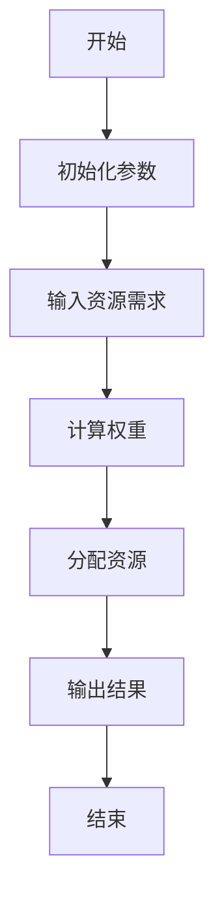
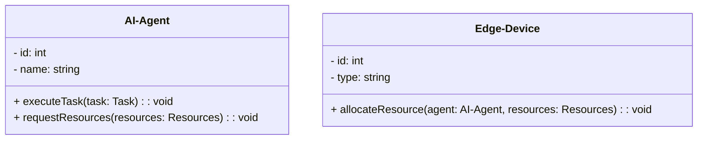
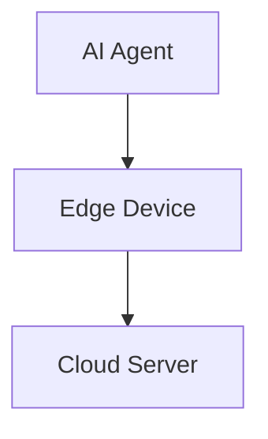
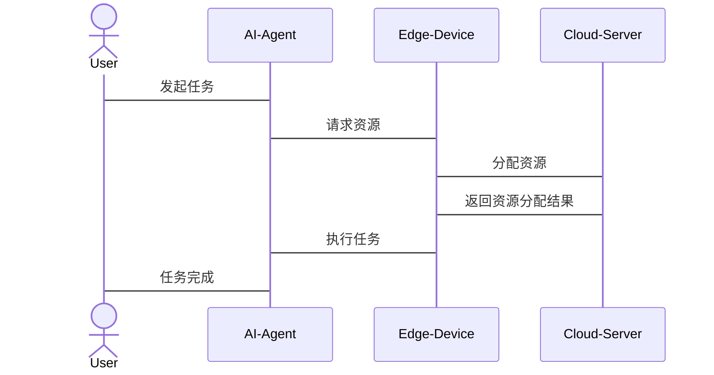

                 


# 企业AI Agent的边缘计算资源优化配置

> 关键词：边缘计算，AI Agent，资源优化，算法原理，系统架构

> 摘要：本文将深入探讨企业AI Agent在边缘计算环境下的资源优化配置问题。通过分析AI Agent与边缘计算的关系，阐述资源优化的核心概念、算法原理、系统架构设计以及项目实现方案。本文旨在为企业技术决策者和开发人员提供一套完整的理论框架和实践指南，帮助他们在复杂的边缘计算环境中高效配置和管理AI Agent资源。

---

# 第一部分: 企业AI Agent的边缘计算资源优化配置概述

# 第1章: 企业AI Agent与边缘计算概述

## 1.1 问题背景与定义
### 1.1.1 企业AI Agent的概念与特点
企业AI Agent是一种智能实体，能够感知环境、自主决策并执行任务。其特点包括：
- **自主性**：无需人工干预，自动完成任务。
- **反应性**：实时感知环境变化并做出响应。
- **社交能力**：能够与其他系统或人类进行交互。

### 1.1.2 边缘计算的定义与优势
边缘计算是指在数据生成的边缘设备（如传感器、智能终端等）上进行计算和数据处理。其优势包括：
- **低延迟**：减少数据传输到云端的时间。
- **带宽优化**：减少数据传输量。
- **隐私保护**：数据在边缘处理，减少云端数据泄露风险。

### 1.1.3 资源优化配置的必要性
在边缘计算环境中，资源（如计算能力、存储空间、网络带宽）有限，如何高效分配这些资源以支持多个AI Agent的任务成为关键问题。

## 1.2 问题描述与目标
### 1.2.1 边缘计算资源分配的挑战
- **资源稀缺性**：边缘设备计算能力有限。
- **任务多样性**：不同AI Agent的任务对资源需求不同。
- **动态变化**：环境变化可能导致任务需求变化。

### 1.2.2 企业AI Agent的需求分析
- **实时性**：任务需要快速响应。
- **资源敏感性**：不同任务对计算资源的需求不同。
- **动态分配**：资源分配需要根据实时需求动态调整。

### 1.2.3 资源优化的目标与边界
- **目标**：最大化资源利用率，最小化任务延迟。
- **边界**：资源分配不能影响其他任务的正常运行，且需保证数据隐私和安全。

## 1.3 问题解决与核心要素
### 1.3.1 资源分配的优化策略
- **动态分配**：根据实时任务需求分配资源。
- **静态分配**：根据预估任务需求分配资源。
- **混合分配**：结合动态和静态分配策略。

### 1.3.2 核心要素的构成与关系
- **计算资源**：包括CPU、GPU等。
- **存储资源**：包括本地存储和缓存。
- **网络资源**：包括带宽和连接数。
- **任务需求**：包括计算能力、存储空间和网络带宽需求。

### 1.3.3 边缘计算与AI Agent的结合
AI Agent在边缘计算中的应用广泛，包括智能制造、智慧城市、智能家居等领域。

## 1.4 本章小结
本章介绍了企业AI Agent和边缘计算的基本概念，分析了资源优化配置的必要性，并提出了资源分配的优化策略。

---

# 第二部分: 核心概念与联系

# 第2章: AI Agent与边缘计算的关系

## 2.1 核心概念原理
### 2.1.1 AI Agent的核心原理
AI Agent通过感知环境、推理和执行动作来实现任务。其核心原理包括：
- **感知**：通过传感器或API获取环境信息。
- **推理**：基于获取的信息进行决策。
- **执行**：根据决策执行动作。

### 2.1.2 边缘计算的核心原理
边缘计算通过在边缘设备上进行数据处理，减少对云端的依赖。其核心原理包括：
- **数据采集**：通过传感器或API获取数据。
- **数据处理**：在边缘设备上进行数据处理和分析。
- **数据传输**：将处理后的数据传输到云端或其他设备。

### 2.1.3 两者结合的协同机制
AI Agent与边缘计算的结合主要体现在：
- **数据处理**：AI Agent在边缘设备上进行数据处理。
- **任务执行**：AI Agent通过边缘设备执行任务。
- **资源分配**：AI Agent根据任务需求动态分配边缘设备资源。

## 2.2 概念对比与特征分析
### 2.2.1 AI Agent与传统AI的对比
| 特性       | AI Agent                | 传统AI               |
|------------|--------------------------|-----------------------|
| 自主性       | 高                     | 低                   |
| 反应性       | 高                     | 低                   |
| 交互能力     | 强                     | 弱                   |

### 2.2.2 边缘计算与云计算的对比
| 特性       | 边缘计算                | 云计算                |
|------------|--------------------------|-----------------------|
| 延迟       | 低                     | 高                   |
| 带宽       | 低                     | 高                   |
| 隐私       | 高                     | 低                   |

### 2.2.3 资源分配的特征分析
- **动态性**：资源需求随时间变化。
- **多样性**：不同任务对资源需求不同。
- **约束性**：资源有限，需合理分配。

## 2.3 ER实体关系图
```mermaid
er
actor(AI Agent) {
  id
  name
}
actor(边缘设备) {
  id
  type
}
actor(资源) {
  id
  type
}
```

## 2.4 本章小结
本章分析了AI Agent与边缘计算的核心概念和关系，并通过对比和ER图展示了它们的协同机制。

---

# 第三部分: 算法原理讲解

# 第3章: 资源分配算法原理

## 3.1 算法概述
### 3.1.1 资源分配的基本问题
资源分配的基本问题是如何在有限的资源条件下，满足多个AI Agent的任务需求。

### 3.1.2 基于强化学习的动态分配
基于强化学习的动态分配算法通过不断学习和调整，找到最优资源分配策略。

### 3.1.3 算法的数学模型
资源分配问题可以表示为一个优化问题：
$$ \text{最大化 } \sum_{i=1}^{n} f_i(x_i) $$
$$ \text{约束 } \sum_{i=1}^{n} x_i \leq X $$

其中，\( f_i(x_i) \) 是任务 \( i \) 的效用函数，\( x_i \) 是分配给任务 \( i \) 的资源量，\( X \) 是总资源量。

## 3.2 算法流程图


## 3.3 算法实现
### 3.3.1 Python代码实现
```python
def allocate_resources(demands, capacities):
    # 简单分配算法示例
    allocation = {}
    for resource in demands:
        allocation[resource] = min(demands[resource], capacities[resource])
    return allocation
```

## 3.4 数学模型与公式
### 

---

# 第四部分: 系统分析与架构设计

# 第4章: 系统分析与架构设计

## 4.1 问题场景介绍
### 4.1.1 项目背景
假设我们正在设计一个智能制造工厂的AI Agent系统，需要在边缘设备上部署多个AI Agent，以实现设备监控和预测维护。

## 4.2 系统功能设计
### 4.2.1 领域模型


### 4.2.2 系统架构设计


## 4.3 系统交互流程
### 4.3.1 交互流程图


## 4.4 本章小结
本章通过系统分析和架构设计，展示了如何在边缘计算环境中实现AI Agent的资源优化配置。

---

# 第五部分: 项目实战

# 第5章: 项目实战

## 5.1 环境安装
### 5.1.1 安装Python和依赖库
```bash
pip install numpy
pip install matplotlib
```

## 5.2 核心代码实现
### 5.2.1 资源分配算法实现
```python
def allocate_resources(demands, capacities):
    allocation = {}
    for resource in demands:
        allocation[resource] = min(demands[resource], capacities[resource])
    return allocation
```

## 5.3 案例分析
### 5.3.1 案例场景
假设我们有3个AI Agent，分别需要以下资源：
- Agent 1: CPU 2核，内存 4GB
- Agent 2: CPU 4核，内存 8GB
- Agent 3: CPU 3核，内存 6GB

总资源为 CPU 8核，内存 16GB。

## 5.4 项目小结
本章通过实际案例展示了如何在边缘计算环境中实现AI Agent的资源优化配置。

---

# 第六部分: 总结与展望

# 第6章: 总结与展望

## 6.1 最佳实践 tips
- **动态分配**：根据实时需求动态分配资源。
- **优先级排序**：根据任务优先级分配资源。
- **资源预留**：预留部分资源以应对突发任务。

## 6.2 小结
本文深入探讨了企业AI Agent在边缘计算环境下的资源优化配置问题，从理论到实践进行了全面分析。

## 6.3 注意事项
- **资源限制**：资源分配不能超出设备能力。
- **任务冲突**：注意处理任务之间的冲突。
- **数据安全**：确保数据安全和隐私保护。

## 6.4 拓展阅读
- 推荐阅读《边缘计算：原理与实践》和《人工智能：算法与应用》。

## 6.5 本章小结
本章总结了本文的主要内容，并提出了未来的研究方向。

---

# 结语

企业AI Agent的边缘计算资源优化配置是一个复杂的系统工程，需要结合理论与实践。通过本文的分析，读者可以全面理解AI Agent与边缘计算的关系，并掌握资源优化配置的核心算法和系统设计方法。希望本文能够为企业技术决策者和开发人员提供有价值的参考。

