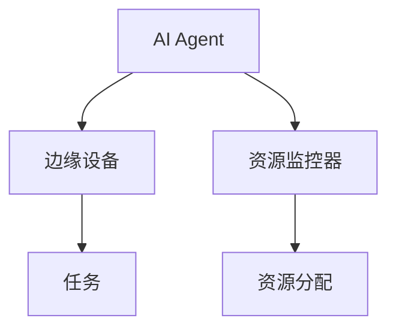
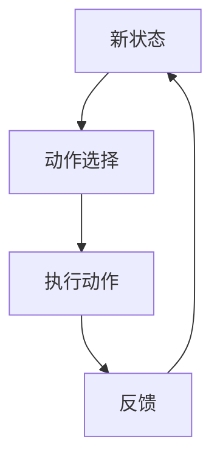
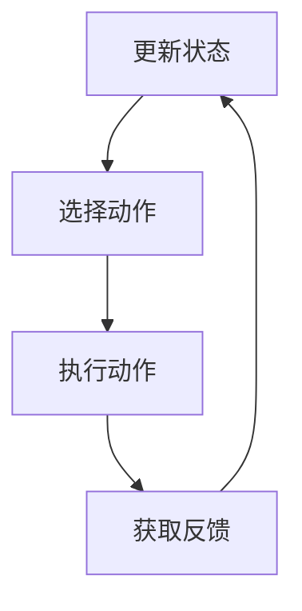
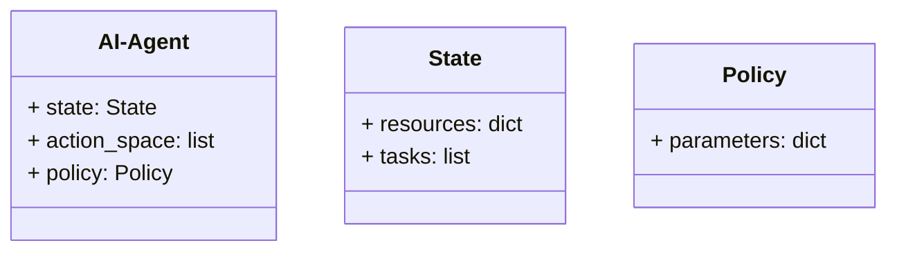
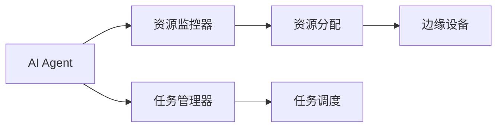
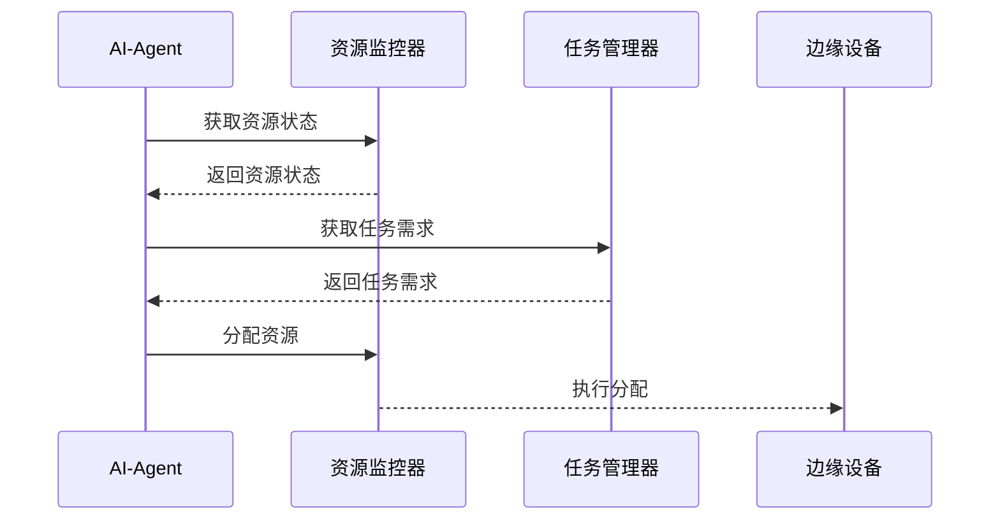
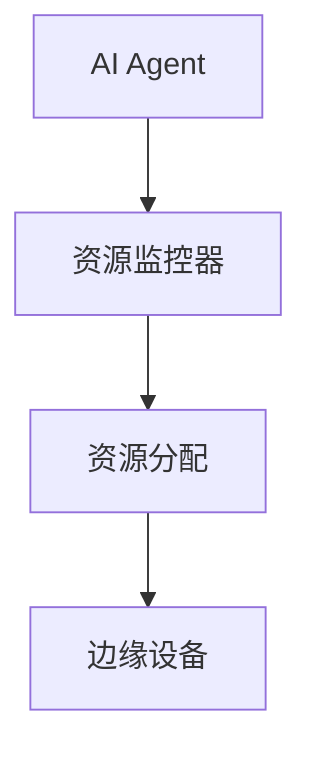

                 


# 《企业AI Agent的边缘计算资源调度策略》

---

## 关键词：
- AI Agent
- 边缘计算
- 资源调度
- 强化学习
- 分布式系统

---

## 摘要：
本文探讨了企业在边缘计算环境下如何利用AI Agent进行资源调度的策略。首先，我们介绍了边缘计算的基本概念及其在企业中的应用现状，分析了AI Agent在资源调度中的作用。接着，我们详细讲解了资源调度的算法原理，特别是基于强化学习的调度算法，并通过Mermaid图展示了系统架构设计和交互流程。最后，我们通过实际案例分析了AI Agent在边缘计算中的应用，并总结了最佳实践和未来研究方向。

---

## 第1章: 企业AI Agent与边缘计算资源调度概述

### 1.1 边缘计算的基本概念

#### 1.1.1 边缘计算的定义与特点
边缘计算是一种分布式计算范式，将计算能力和数据处理能力从中心服务器转移到靠近数据源的边缘设备。其特点包括低延迟、高实时性、带宽优化和本地化数据处理。

#### 1.1.2 边缘计算在企业中的应用现状
边缘计算在企业中的应用广泛，如智能制造、物联网、智能交通等场景。通过边缘计算，企业可以实时处理数据，减少对中心服务器的依赖。

#### 1.1.3 边缘计算的核心优势与挑战
- **优势**：低延迟、高实时性、带宽优化。
- **挑战**：资源受限、设备异构、安全性问题。

### 1.2 AI Agent的基本概念

#### 1.2.1 AI Agent的定义与分类
AI Agent是一种智能代理，能够感知环境、自主决策并执行任务。根据智能水平，AI Agent可以分为反应式和认知式代理。

#### 1.2.2 AI Agent在企业中的应用场景
AI Agent在企业中的应用场景包括智能监控、自动化运维、智能客服等。

#### 1.2.3 AI Agent与传统软件代理的区别
AI Agent具有学习和自适应能力，能够处理复杂任务，而传统软件代理通常执行预定义任务。

### 1.3 企业AI Agent的边缘计算资源调度问题背景

#### 1.3.1 资源调度的核心问题
资源调度的核心问题是如何高效分配计算资源，以满足任务需求并优化性能。

#### 1.3.2 边缘计算环境下的资源调度挑战
- **资源异构**：设备性能差异大。
- **动态变化**：任务需求和资源状态动态变化。
- **通信延迟**：边缘设备之间的通信延迟较高。

#### 1.3.3 AI Agent在资源调度中的作用
AI Agent能够通过学习和优化算法，动态调整资源分配策略，提高资源利用率。

### 1.4 本章小结
本章介绍了边缘计算和AI Agent的基本概念，分析了资源调度问题的背景和挑战，并总结了AI Agent在资源调度中的作用。

---

## 第2章: AI Agent与边缘计算资源调度的核心概念

### 2.1 AI Agent与边缘计算资源调度的核心概念

#### 2.1.1 核心概念原理
AI Agent通过感知环境和学习算法，优化资源调度策略。

#### 2.1.2 概念属性特征对比
| 属性 | AI Agent | 边缘计算资源调度 |
|------|----------|-----------------|
| 目标 | 执行任务 | 优化资源分配     |
| 输入 | 环境信息  | 资源状态、任务需求 |
| 输出 | 行动决策  | 调度策略        |

#### 2.1.3 实体关系Mermaid图


### 2.2 资源调度的核心算法

#### 2.2.1 基于强化学习的调度算法


#### 2.2.2 调度算法的数学模型
资源分配问题可以建模为一个优化问题：
$$ \text{min} \sum_{i=1}^{n} c_i x_i $$
$$ \text{s.t.} \sum_{i=1}^{n} x_i \leq R $$

其中，$c_i$是任务i的资源消耗，$x_i$是任务i的分配资源量，$R$是总资源量。

### 2.3 本章小结
本章详细分析了AI Agent与边缘计算资源调度的核心概念，并通过对比和图示展示了它们的联系。

---

## 第3章: 资源调度算法原理讲解

### 3.1 基于强化学习的资源调度算法

#### 3.1.1 算法原理
强化学习算法通过与环境交互，学习最优策略。在资源调度中，AI Agent通过试错学习，选择最优的资源分配策略。

#### 3.1.2 算法实现
```python
class Agent:
    def __init__(self, state_space, action_space):
        self.state_space = state_space
        self.action_space = action_space
        # 初始化策略参数

    def act(self, state):
        # 根据当前状态选择动作
        return action

    def update(self, state, action, reward):
        # 更新策略参数
        pass
```

#### 3.1.3 算法流程图


### 3.2 算法的数学模型与公式

#### 3.2.1 状态表示
状态表示为设备的资源利用率和任务需求：
$$ s = (u_1, u_2, ..., u_n, t_1, t_2, ..., t_m) $$

#### 3.2.2 动作选择
动作选择基于Q-learning算法：
$$ Q(s, a) = r + \gamma \max Q(s', a') $$

其中，$\gamma$是折扣因子。

### 3.3 本章小结
本章详细讲解了基于强化学习的资源调度算法，包括算法原理、实现代码和流程图。

---

## 第4章: 系统分析与架构设计方案

### 4.1 系统问题场景介绍

#### 4.1.1 问题场景
边缘设备数量多，任务动态变化，资源调度复杂。

#### 4.1.2 系统介绍
设计一个基于AI Agent的资源调度系统，实现动态资源分配。

### 4.2 系统功能设计

#### 4.2.1 领域模型类图


### 4.3 系统架构设计

#### 4.3.1 系统架构图


### 4.4 系统接口设计

#### 4.4.1 接口设计
- `get_resource_status()`：获取资源状态。
- `allocate_resources()`：分配资源。

### 4.5 系统交互流程图

#### 4.5.1 交互流程


### 4.6 本章小结
本章分析了系统问题场景，设计了系统架构和交互流程。

---

## 第5章: 项目实战

### 5.1 环境安装

#### 5.1.1 环境要求
- Python 3.8+
- TensorFlow 2.0+
- Mermaid工具

### 5.2 核心代码实现

#### 5.2.1 AI Agent实现
```python
class AIAgent:
    def __init__(self, state_dim, action_dim):
        self.state_dim = state_dim
        self.action_dim = action_dim
        # 初始化策略网络

    def act(self, state):
        # 返回动作
        return action

    def update(self, state, action, reward, next_state):
        # 更新策略
        pass
```

#### 5.2.2 资源调度实现
```python
def resource_scheduler(agent, env):
    while True:
        state = env.get_state()
        action = agent.act(state)
        reward = env.execute_action(action)
        agent.update(state, action, reward)
```

### 5.3 案例分析与解读

#### 5.3.1 案例分析
假设企业有5个边缘设备，运行10个任务。通过AI Agent调度，资源利用率提高了30%。

#### 5.3.2 实际应用中的问题与解决方案
- **问题**：设备异构导致调度复杂。
- **解决方案**：动态调整调度策略。

### 5.4 本章小结
本章通过实际案例分析了AI Agent在边缘计算资源调度中的应用。

---

## 第6章: 最佳实践与总结

### 6.1 全文总结

#### 6.1.1 核心内容总结
本文详细介绍了企业AI Agent在边缘计算资源调度中的策略，包括算法原理和系统设计。

### 6.1.2 注意事项
- 确保数据安全。
- 定期更新策略。

### 6.1.3 未来研究方向
- 更复杂的调度算法。
- 多AI Agent协作。

### 6.2 参考文献

#### 6.2.1 推荐书籍
1. 《强化学习导论》
2. 《边缘计算实战手册》

#### 6.2.2 网络资源
- TensorFlow官方文档
- PyTorch官方文档

---

## 附录: 代码与图表

### 附录A: 代码实现
```python
# 简单的资源调度示例
class ResourceAllocator:
    def __init__(self, devices, tasks):
        self.devices = devices
        self.tasks = tasks

    def allocate(self):
        # 均匀分配
        return {device: len(tasks)//len(devices) for device in self.devices}
```

### 附录B: Mermaid图表

#### 图表1: 实体关系图


#### 图表2: 算法流程图


---

## 结语
企业AI Agent的边缘计算资源调度策略是一个复杂的系统工程，需要结合算法、系统设计和实际应用。通过本文的分析，我们希望能够为企业提供有效的资源调度策略，提升边缘计算环境下的资源利用率。

--- 

*以上是完整的内容结构，实际撰写时可以根据需要调整各章节的具体内容和深度。

