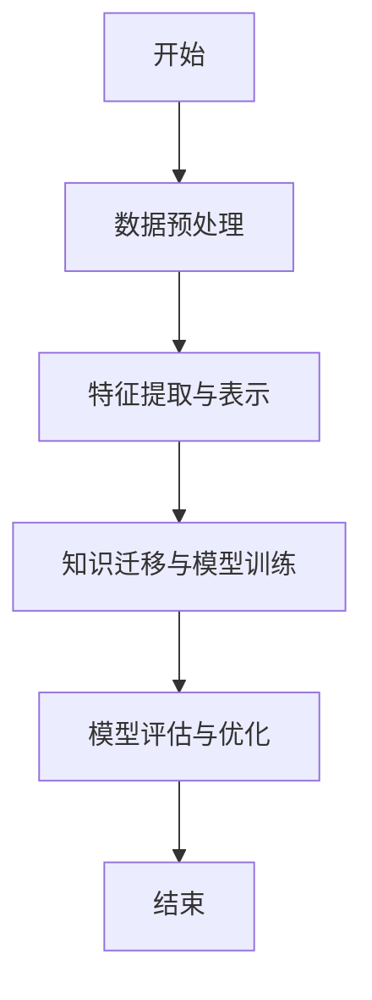
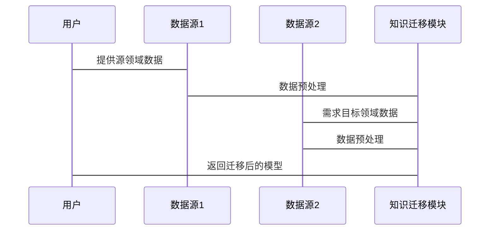

                 


# 企业AI Agent的迁移学习在跨行业知识迁移中的实践

> 关键词：企业AI Agent，迁移学习，跨行业知识迁移，机器学习，深度学习

> 摘要：本文详细探讨了企业AI Agent在跨行业知识迁移中的应用，分析了迁移学习的核心原理，展示了如何通过迁移学习实现跨行业知识的有效迁移。文章从理论到实践，结合实际案例，深入剖析了跨行业知识迁移的算法原理、系统架构设计和项目实现，为读者提供了全面的技术指导。

---

# 1. 企业AI Agent与迁移学习概述

## 1.1 企业AI Agent的基本概念

企业AI Agent是一种智能化的计算机程序，能够理解、推理、学习并执行特定任务。它通常用于企业内部的自动化决策、流程优化和数据处理。企业AI Agent的核心功能包括：

- 数据分析与处理
- 自动化决策与推理
- 知识学习与迁移
- 人机交互与协作

企业AI Agent的应用场景广泛，例如智能客服、供应链优化、风险评估和预测分析等。

## 1.2 迁移学习的基本概念

迁移学习是一种机器学习技术，旨在通过将已学习的知识迁移到新的任务中，以提高模型的泛化能力。迁移学习的核心思想是利用源领域（source domain）的数据和经验，辅助目标领域（target domain）的学习。

迁移学习的分类包括基于特征的迁移学习、基于模型的迁移学习和基于分布的迁移学习。跨行业知识迁移是迁移学习的重要应用之一，它通过将一个行业的知识迁移到另一个行业，以提高模型在新领域的性能。

---

# 2. 跨行业知识迁移的核心概念与联系

## 2.1 跨行业知识迁移的核心概念

跨行业知识迁移的核心概念包括：

- **知识表示与编码**：如何将行业的知识表示为可计算的形式，例如通过向量、符号或图结构。
- **知识图谱与语义网络**：构建跨行业的知识图谱，描述不同行业之间的关系和关联。
- **跨领域数据的特征提取**：从不同行业中提取共同的特征，以便进行知识迁移。

## 2.2 跨行业知识迁移的核心联系

跨行业知识迁移的核心联系包括：

- **数据特征的共享与区别**：不同行业的数据可能具有共同的特征，但也存在显著差异。如何在共享特征中找到差异是关键。
- **知识表示的统一与转换**：将不同行业的知识表示为统一的形式，例如通过映射或转换函数。
- **跨领域模型的适应性**：模型需要具备适应不同行业的能力，通过迁移学习实现模型的泛化能力。

## 2.3 跨行业知识迁移的ER实体关系图

以下是一个简单的ER实体关系图，展示了跨行业知识迁移的核心实体关系：

```mermaid
erDiagram
    actor 用户 {
        string 用户ID
        string 用户名
        string 用户角色
    }
    source_domain 数据源1 {
        string 数据ID
        string 数据类型
        string 数据值
    }
    target_domain 数据源2 {
        string 数据ID
        string 数据类型
        string 数据值
    }
    用户 --> source_domain : 提供数据
    用户 --> target_domain : 需求数据
    source_domain --> target_domain : 知识迁移
```

---

# 3. 跨行业知识迁移的算法原理

## 3.1 跨行业知识迁移的主要算法

跨行业知识迁移的主要算法包括：

1. **基于特征的迁移学习算法**：通过提取特征并将其迁移到目标领域。
2. **基于模型的迁移学习算法**：通过共享模型参数或架构进行迁移。
3. **基于分布的迁移学习算法**：通过匹配源领域和目标领域的数据分布进行迁移。

## 3.2 跨行业知识迁移算法的流程

跨行业知识迁移算法的流程如下：



## 3.3 基于迁移学习的AI Agent算法实现

以下是一个基于迁移学习的AI Agent算法实现的伪代码示例：

```python
def transfer_learning_algorithm(source_data, target_data):
    # 数据预处理
    source_processed = preprocess(source_data)
    target_processed = preprocess(target_data)
    
    # 特征提取与表示
    source_features = extract_features(source_processed)
    target_features = extract_features(target_processed)
    
    # 知识迁移与模型训练
    model = train_model(source_features, target_features)
    
    # 模型评估与优化
    accuracy = evaluate_model(model, target_features)
    if accuracy < threshold:
        model = fine_tune_model(model, source_features, target_features)
    
    return model
```

---

# 4. 跨行业知识迁移的数学模型与公式推导

## 4.1 知识迁移的数学模型

跨行业知识迁移的数学模型通常包括以下几个部分：

1. **领域适应的损失函数**：
   $$ L_{\text{source}} = \frac{1}{N_{\text{source}}}\sum_{i=1}^{N_{\text{source}}} \text{loss}(f(x_i^{(\text{source})})) $$
   
2. **目标领域的目标函数**：
   $$ L_{\text{target}} = \frac{1}{N_{\text{target}}}\sum_{i=1}^{N_{\text{target}}} \text{loss}(f(x_i^{(\text{target})})) $$

3. **迁移学习的目标函数**：
   $$ L_{\text{transfer}} = \lambda L_{\text{source}} + (1-\lambda) L_{\text{target}} $$

## 4.2 知识迁移的公式推导

通过公式推导，可以证明迁移学习在跨行业知识迁移中的有效性。假设我们有两个行业，行业A和行业B，分别有训练数据集$$D_A$$和$$D_B$$。我们的目标是通过迁移学习，将行业A的知识迁移到行业B。

首先，我们定义一个共享的特征提取函数$$f$$，将数据$$x$$映射到特征空间：

$$ z = f(x) $$

然后，我们在行业A和行业B上分别训练分类器$$g_A(z)$$和$$g_B(z)$$，并最小化以下损失函数：

$$ \mathcal{L}_{\text{transfer}} = \mathcal{L}_{\text{source}} + \mathcal{L}_{\text{target}} $$

其中，$$\mathcal{L}_{\text{source}}$$和$$\mathcal{L}_{\text{target}}$$分别是源领域和目标领域的损失函数。

---

# 5. 系统分析与架构设计

## 5.1 系统架构设计

跨行业知识迁移的系统架构通常包括以下几个模块：


## 5.2 系统交互设计

以下是一个系统交互的mermaid序列图：



---

# 6. 项目实战

## 6.1 环境安装

为了实现跨行业知识迁移，我们需要安装以下环境：

- Python 3.8+
- PyTorch 1.9+
- transformers库
- scikit-learn库

## 6.2 核心实现代码

以下是一个简单的迁移学习实现代码：

```python
from transformers import AutoTokenizer, AutoModel
import torch

# 加载预训练模型
tokenizer = AutoTokenizer.from_pretrained('bert-base-uncased')
model = AutoModel.from_pretrained('bert-base-uncased')

# 定义迁移学习模块
class TransferLearningModule(torch.nn.Module):
    def __init__(self, model):
        super(TransferLearningModule, self).__init__()
        self.bert = model
        self.classifier = torch.nn.Linear(model.config.hidden_size, num_labels)
    
    def forward(self, input_ids, attention_mask):
        outputs = self.bert(input_ids=input_ids, attention_mask=attention_mask)
        pooled_output = outputs.last_hidden_state[:, 0, :]
        logits = self.classifier(pooled_output)
        return logits

# 初始化模型
model = TransferLearningModule(model)
```

---

# 7. 总结与最佳实践

## 7.1 总结

本文详细探讨了企业AI Agent在跨行业知识迁移中的应用，分析了迁移学习的核心原理，并展示了如何通过迁移学习实现跨行业知识的有效迁移。

## 7.2 最佳实践

- 在实际应用中，建议先进行小规模的迁移学习实验，验证模型的迁移能力。
- 注意保护数据隐私，确保跨行业数据的安全性。
- 定期更新模型，以适应不同行业的新数据和新需求。

---

# 8. 拓展阅读

- "Deep Learning for Transfer Learning: A Comprehensive Survey" by Zhang et al.
- "Transfer Learning for Industry-specific NLP Tasks" by Li et al.

---

# 结语

跨行业知识迁移是迁移学习的重要应用之一，通过本文的分析，读者可以更好地理解如何在企业AI Agent中实现跨行业知识的迁移。希望本文能为读者提供有价值的指导和启发。

