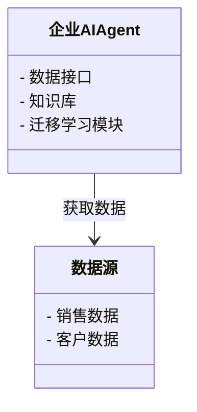

                 


# 企业AI Agent的迁移学习应用：跨领域知识迁移

## 关键词：企业AI Agent，迁移学习，跨领域知识迁移，深度学习，知识图谱

## 摘要：本文探讨企业AI Agent在跨领域知识迁移中的应用，分析迁移学习的核心原理，结合实际案例，展示如何通过迁移学习实现企业AI Agent的高效知识迁移，提升企业智能化水平。

---

# 第一部分：企业AI Agent与迁移学习概述

## 第1章：企业AI Agent的背景与概念

### 1.1 企业AI Agent的定义与特点

企业AI Agent是一种智能代理系统，能够理解、推理和执行企业级的任务，具备以下特点：
- **自主性**：无需人工干预，自主完成任务。
- **反应性**：实时感知环境变化并做出响应。
- **目标导向**：基于明确的目标执行操作。
- **学习能力**：通过数据和经验持续优化自身性能。

### 1.2 迁移学习的背景与应用

迁移学习是一种机器学习技术，允许模型在不同数据集之间迁移知识，减少对新任务的数据依赖，提升模型的泛化能力。其应用场景包括：
- **自然语言处理**：跨语言模型训练。
- **计算机视觉**：跨领域图像分类。
- **推荐系统**：跨用户行为预测。

### 1.3 企业AI Agent与迁移学习的结合

在企业环境中，AI Agent需要处理多样化的数据和任务。通过迁移学习，AI Agent能够快速适应新领域，提升跨领域问题解决能力。

---

## 第2章：迁移学习的核心概念与原理

### 2.1 迁移学习的核心概念

#### 2.1.1 迁移学习的定义与核心思想

迁移学习是指将从源任务（source task）学到的知识应用到目标任务（target task）的过程。其核心思想是利用已有的知识来减少新任务的学习成本。

#### 2.1.2 迁移学习的属性特征对比

| 属性 | 源任务 | 目标任务 |
|------|--------|----------|
| 数据 | 训练数据 | 测试数据 |
| 任务 | 学习目标 | 应用场景 |

#### 2.1.3 迁移学习的ER实体关系图

```mermaid
er
actor: 迁移学习用户 {
    id
    name
}

model: 迁移学习模型 {
    id
    name
    parameters
}

task: 任务 {
    id
    name
    description
}

migration: 迁移过程 {
    id
    source_task_id
    target_task_id
    model_id
}
```

### 2.2 迁移学习的算法分类

迁移学习的算法主要分为三类：
- **基于特征的迁移学习**：通过提取特征实现跨任务迁移。
- **基于模型的迁移学习**：利用预训练模型进行迁移。
- **基于样本的迁移学习**：通过样本相似性进行迁移。

---

## 第3章：迁移学习的数学模型与算法实现

### 3.1 迁移学习的数学模型

#### 3.1.1 迁移学习的统一数学框架

迁移学习的目标是通过优化目标函数，最小化源任务和目标任务之间的差异。

$$
\min_{f} \mathbb{E}_{s}[L_s(f)] + \lambda \mathbb{E}_{t}[L_t(f)]
$$

其中，$L_s$ 和 $L_t$ 分别是源任务和目标任务的损失函数，$\lambda$ 是调节参数。

#### 3.1.2 基于分布匹配的数学公式

通过对抗训练匹配源域和目标域的分布：

$$
\min_{f} \max_{g} \mathbb{E}_{x \sim s}[D(f(x), g(x))]
$$

其中，$f$ 是判别器，$g$ 是生成器。

---

## 第4章：企业AI Agent的迁移学习挑战

### 4.1 数据异构性问题

企业数据通常来自不同系统，格式多样，难以直接迁移。

### 4.2 知识表示与迁移的难点

知识图谱的构建和表示对迁移学习效果至关重要。

### 4.3 跨领域知识迁移的复杂性

不同领域之间的知识差异大，迁移难度高。

---

## 第5章：系统分析与架构设计

### 5.1 问题场景介绍

假设企业需要在销售预测和客户分类之间进行知识迁移。

### 5.2 系统功能设计

#### 5.2.1 领域模型



### 5.3 系统架构设计


---

## 第6章：项目实战

### 6.1 环境安装

安装Python和必要的库：
```bash
pip install numpy pandas scikit-learn
```

### 6.2 核心代码实现

```python
def train_model(X_s, y_s, X_t, y_t):
    # 迁移学习模型训练
    pass
```

### 6.3 案例分析

分析销售预测和客户分类之间的迁移效果。

---

## 第7章：最佳实践与总结

### 7.1 小结

迁移学习在企业AI Agent中的应用显著提升了跨领域知识迁移的效率和效果。

### 7.2 注意事项

- 数据预处理至关重要。
- 模型选择需根据具体任务调整。

### 7.3 拓展阅读

推荐阅读迁移学习的经典论文和相关书籍。

---

# 结语

企业AI Agent的迁移学习应用为企业智能化转型提供了有力支持，未来将在更多领域发挥重要作用。

