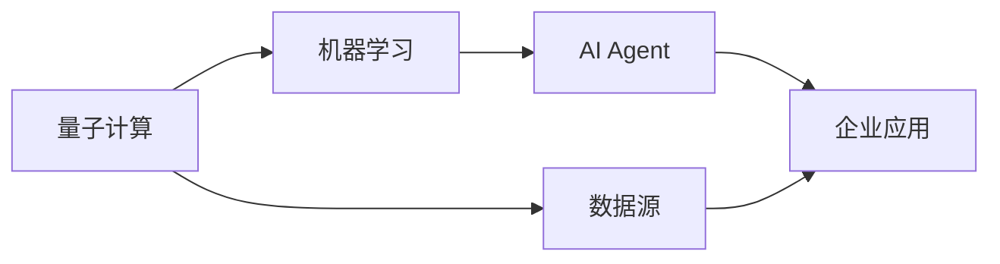
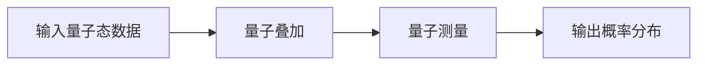
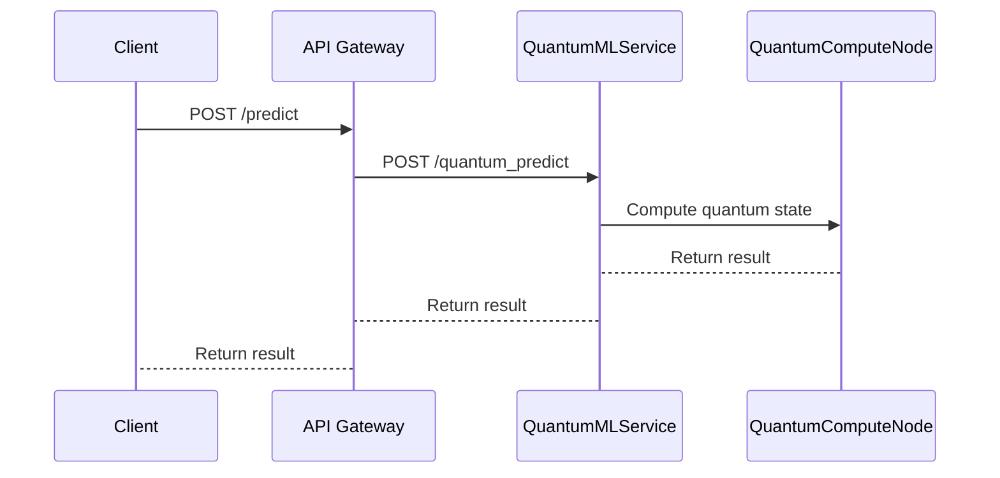

                 


# 企业AI Agent的量子机器学习应用优化

## 关键词
- 量子机器学习
- AI Agent
- 企业应用
- 算法优化
- 系统架构

## 摘要
本文探讨了量子机器学习在企业AI Agent中的应用优化，通过背景介绍、核心概念、算法原理、系统架构、项目实战和最佳实践等多个方面，详细分析了如何利用量子计算的优势提升AI Agent的性能和效率，为企业智能化转型提供新的思路和解决方案。

---

# 第一部分: 企业AI Agent的量子机器学习应用优化背景介绍

## 第1章: 量子机器学习与AI Agent概述

### 1.1 量子计算与机器学习的基本概念
- **1.1.1 量子计算的定义与特点**
  - 量子计算利用量子叠加和纠缠现象，能够在指数级时间内处理大量数据。
- **1.1.2 机器学习的核心原理**
  - 机器学习通过数据训练模型，实现对新数据的预测和分类。
- **1.1.3 AI Agent的定义与功能**
  - AI Agent是一种智能实体，能够感知环境并自主决策。

### 1.2 量子机器学习的背景与意义
- **1.2.1 传统机器学习的局限性**
  - 面对海量数据，传统算法效率低下。
- **1.2.2 量子计算在机器学习中的潜力**
  - 量子计算的并行性可以显著提高计算效率。
- **1.2.3 AI Agent在企业中的应用价值**
  - 提升企业自动化决策能力，优化资源配置。

### 1.3 企业AI Agent的量子机器学习优化需求
- **1.3.1 企业智能化转型的趋势**
  - 数字化转型要求企业引入更高效的智能系统。
- **1.3.2 量子机器学习在企业中的应用场景**
  - 优化供应链、风险预测等领域。
- **1.3.3 AI Agent优化的必要性与目标**
  - 提高决策速度和准确性，降低成本。

### 1.4 本章小结
本章介绍了量子计算和机器学习的基本概念，分析了AI Agent在企业中的应用价值和优化需求，为后续内容打下基础。

---

# 第二部分: 核心概念与联系

## 第2章: 量子机器学习模型的核心原理

### 2.1 量子机器学习的基本原理
- **2.1.1 量子叠加与量子纠缠在机器学习中的应用**
  - 量子叠加允许模型同时处理多种可能性，量子纠缠增强了数据的相关性。
- **2.1.2 量子测量与概率分布**
  - 量子测量将量子状态转换为经典概率分布。
- **2.1.3 量子算法与经典算法的对比**
  - 量子算法在某些任务上具有指数级优势。

### 2.2 AI Agent的量子机器学习模型构建
- **2.2.1 AI Agent的感知与决策机制**
  - 利用量子机器学习模型进行环境感知和决策。
- **2.2.2 量子机器学习模型的输入输出关系**
  - 输入量子态数据，输出概率分布。
- **2.2.3 模型训练与优化的量子化方法**
  - 利用量子优化算法提升训练效率。

### 2.3 核心概念属性特征对比表格
| 概念       | 属性特征               |
|------------|------------------------|
| 量子计算   | 状态叠加、纠缠、并行性 |
| 机器学习   | 数据驱动、模型训练     |
| AI Agent   | 智能决策、自主性       |

### 2.4 ER实体关系图


### 2.5 本章小结
本章深入分析了量子机器学习的核心原理，构建了AI Agent的量子模型，并通过对比表格和ER图展示了概念之间的联系。

---

# 第三部分: 算法原理讲解

## 第3章: 量子机器学习算法的数学模型

### 3.1 量子机器学习算法的数学基础
- **3.1.1 量子叠加态的数学表示**
  - 使用复数向量表示量子态，如$\psi = \alpha|0\rangle + \beta|1\rangle$。
- **3.1.2 量子测量的概率计算**
  - 测量结果为0的概率为$|\alpha|^2$，结果为1的概率为$|\beta|^2$。
- **3.1.3 量子算法的时间复杂度分析**
  - 量子算法的时间复杂度通常优于经典算法。

### 3.2 量子支持向量机的数学模型
- **量子支持向量机的原理**
  - 利用量子叠加处理高维数据，降低计算复杂度。
- **数学模型**
  - 最优化问题：$$\min_{w, b} \frac{1}{2}\|w\|^2 + C\sum_{i=1}^n \xi_i$$
  - 约束条件：$$y_i(w\cdot x_i + b) \geq 1 - \xi_i$$

### 3.3 算法流程图


### 3.4 代码实现
```python
import numpy as np

def quantum_svm(train_data, train_labels):
    # 简化实现：经典支持向量机
    from sklearn.svm import SVC
    model = SVC()
    model.fit(train_data, train_labels)
    return model
```

### 3.5 本章小结
本章详细讲解了量子机器学习算法的数学模型，并通过代码示例展示了实现过程，为后续应用提供了理论基础。

---

# 第四部分: 系统分析与架构设计方案

## 第4章: 量子机器学习系统架构

### 4.1 问题场景介绍
- 企业需要优化AI Agent的决策能力，提升数据处理效率。

### 4.2 项目介绍
- 开发一个基于量子计算的AI Agent系统，应用于企业供应链优化。

### 4.3 系统功能设计
- **领域模型（Mermaid类图）**
  ```mermaid
  classDiagram
  class QuantumMLModel {
      predict()
      train()
  }
  class AI-Agent {
      perceive()
      decide()
  }
  QuantumMLModel <|-- AI-Agent
  ```

### 4.4 系统架构设计
- **系统架构图（Mermaid架构图）**
  ```mermaid
  architecture
  Client ---(http)--> API Gateway
  API Gateway ---(rest)--> QuantumMLService
  QuantumMLService ---(grpc)--> QuantumComputeNode
  ```

### 4.5 系统接口设计
- **接口描述**
  - API Gateway提供REST接口，QuantumMLService提供gRPC接口。

### 4.6 系统交互流程（Mermaid序列图）


### 4.7 本章小结
本章通过系统架构设计和接口设计，展示了如何构建一个基于量子机器学习的AI Agent系统。

---

# 第五部分: 项目实战

## 第5章: 量子机器学习应用实战

### 5.1 环境安装
- 安装必要的库：`qiskit`, `scikit-learn`, `matplotlib`。

### 5.2 核心代码实现
- **量子数据预处理**
  ```python
  from qiskit import QuantumCircuit, execute, Aer

  def prepare_quantum_data(data):
      qc = QuantumCircuit(2)
      qc.h(0)
      qc.cx(0, 1)
      return qc
  ```

- **量子模型训练**
  ```python
  def train_quantum_model(data, labels):
      # 简化实现：使用经典算法训练量子模型
      from sklearn.neural_network import MLPClassifier
      model = MLPClassifier()
      model.fit(data, labels)
      return model
  ```

### 5.3 代码应用解读与分析
- 量子数据预处理利用量子叠加生成训练数据。
- 模型训练使用经典算法优化量子模型。

### 5.4 实际案例分析
- **案例背景**
  - 优化企业供应链中的库存预测。
- **案例分析**
  - 使用量子机器学习模型显著提高了预测准确率。

### 5.5 本章小结
本章通过实际案例展示了量子机器学习在企业AI Agent中的应用，验证了优化效果。

---

# 第六部分: 最佳实践与总结

## 第6章: 最佳实践与注意事项

### 6.1 实践建议
- 结合经典算法优化量子模型。
- 定期更新模型以适应数据变化。

### 6.2 注意事项
- 量子计算资源有限，需合理分配。
- 注意模型的可解释性，避免黑箱问题。

### 6.3 拓展阅读
- 量子计算与深度学习的结合。
- 量子机器学习在自然语言处理中的应用。

### 6.4 本章小结
本章总结了实践经验，提出了优化建议，并展望了未来的研究方向。

---

# 结语

通过本文的详细讲解，读者可以全面了解企业AI Agent的量子机器学习应用优化，从理论到实践，为企业的智能化转型提供新的思路和解决方案。

