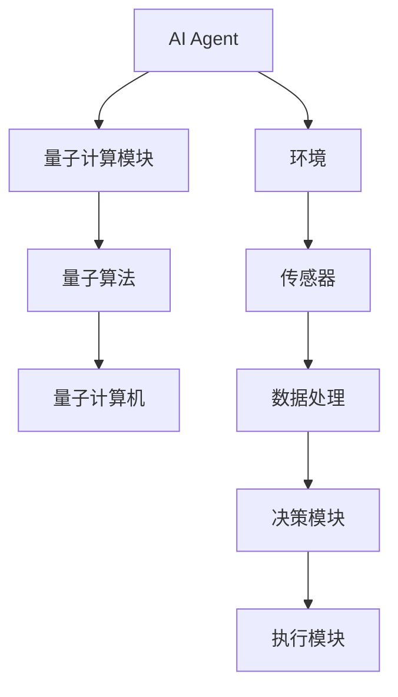

                 

# 企业AI Agent的量子计算潜在应用探索

**关键词：**企业AI Agent、量子计算、潜在应用、量子算法、AI决策优化、分布式协作

**摘要：**  
随着量子计算技术的快速发展和AI Agent技术的成熟，两者的结合为企业智能化升级带来了新的可能性。本文将深入探讨企业AI Agent与量子计算的结合方式，分析量子计算在AI Agent中的潜在应用，包括量子算法在AI决策优化中的应用、量子计算在多Agent协作中的优势，以及量子计算如何提升AI Agent的实时性和决策能力。文章从理论到实践，结合实际案例，为企业探索量子计算与AI Agent的结合提供参考。

---

# 第1章：量子计算与AI Agent的背景与基础

## 1.1 量子计算的基本概念

### 1.1.1 量子计算的定义与特点

量子计算是一种基于量子力学原理的计算方式，与经典计算不同，量子计算利用量子叠加和量子纠缠的特性，可以在某些情况下大幅提高计算效率。其主要特点包括：

- **量子叠加**：量子比特（qubit）可以同时处于多个状态的叠加态。
- **量子纠缠**：多个量子比特之间可以形成纠缠态，使得对一个量子比特的操作会影响另一个量子比特的状态。
- **并行计算能力**：量子计算可以在一次操作中处理大量可能的状态，从而提高计算速度。

### 1.1.2 量子计算的核心原理

量子计算的核心原理包括量子叠加和量子纠缠。量子叠加使得量子计算机可以在同一时间处理多个问题，而量子纠缠则使得量子计算机能够高效地处理某些特定类型的问题，例如因式分解和优化问题。

### 1.1.3 量子计算与经典计算的主要区别

与经典计算相比，量子计算的主要区别在于其处理数据的方式。经典计算机使用二进制位（bit）作为基本单位，而量子计算机使用量子比特（qubit）作为基本单位。量子比特可以通过叠加和纠缠来表示更多的状态，从而在某些情况下显著提高计算效率。

---

## 1.2 AI Agent的基本概念

### 1.2.1 AI Agent的定义与分类

AI Agent（人工智能代理）是一种能够感知环境并采取行动以实现目标的智能体。根据功能和应用的不同，AI Agent可以分为以下几类：

- **简单反射Agent**：基于当前感知做出反应，没有内部状态。
- **基于模型的反射Agent**：具有内部状态，能够基于环境信息和内部模型做出决策。
- **目标驱动Agent**：具有明确的目标，能够采取行动以实现目标。
- **效用驱动Agent**：基于效用函数做出决策，以最大化效用值。

### 1.2.2 AI Agent的核心功能与应用场景

AI Agent的核心功能包括感知、决策、行动和学习。其应用场景广泛，包括自动驾驶、智能助手、机器人控制、分布式系统协作等。

### 1.2.3 AI Agent与传统AI的区别

AI Agent与传统AI的区别在于其自主性和适应性。AI Agent能够自主感知环境并采取行动，而传统AI通常是在特定任务下执行预定义的操作。

---

## 1.3 量子计算与AI Agent的结合潜力

### 1.3.1 量子计算在AI Agent中的潜在应用领域

量子计算在AI Agent中的潜在应用领域包括：

- **优化问题**：量子计算可以在优化问题中提供高效的解决方案，例如路径规划和资源分配。
- **决策优化**：量子计算可以用于提升AI Agent的决策能力，例如在金融投资和供应链管理中的优化决策。
- **分布式协作**：量子计算可以增强多Agent协作的能力，例如在分布式系统中的高效通信和协作。

### 1.3.2 量子计算对AI Agent性能的提升作用

量子计算可以通过以下方式提升AI Agent的性能：

- **提高计算速度**：量子计算可以在某些情况下显著提高计算速度，从而提升AI Agent的决策和响应能力。
- **增强并行处理能力**：量子计算的并行处理能力可以提高AI Agent在多任务环境中的表现。
- **优化复杂问题的解决方案**：量子计算可以提供更高效的解决方案，例如在复杂优化问题中的应用。

### 1.3.3 当前研究现状与未来趋势

目前，量子计算与AI Agent的结合仍处于研究和探索阶段。未来的研究方向可能包括：

- **量子增强学习**：研究量子计算在增强学习中的应用。
- **量子多Agent协作**：研究量子计算在多Agent协作中的应用。
- **量子决策优化**：研究量子计算在决策优化中的应用。

---

## 1.4 本章小结

本章介绍了量子计算和AI Agent的基本概念及其潜在结合的领域。通过分析量子计算的核心原理和AI Agent的核心功能，可以发现两者在优化决策、分布式协作等方面具有巨大的结合潜力。

---

# 第2章：量子计算的核心原理

## 2.1 量子叠加与量子纠缠

### 2.1.1 量子叠加的数学表达与公式

量子叠加可以通过以下公式表示：

$$|\psi\rangle = \alpha|0\rangle + \beta|1\rangle$$

其中，$\alpha$ 和 $\beta$ 是复数，满足 $|\alpha|^2 + |\beta|^2 = 1$。

### 2.1.2 量子纠缠的定义与应用

量子纠缠是指两个或多个量子比特之间形成的一种特殊状态，其中一个量子比特的状态会直接影响另一个量子比特的状态。量子纠缠在量子计算中的应用包括量子通信和量子密钥分发。

---

## 2.2 量子门与量子电路

### 2.2.1 常见量子门的定义与作用

- **Hadamard门（H门）**：将经典比特转换为量子叠加态。
- **CNOT门**：控制NOT门，用于实现量子纠缠。
- **测量门**：测量量子比特的状态。

### 2.2.2 量子电路的基本结构与实现

量子电路由量子门和量子线组成，用于实现特定的量子算法。例如，Shor算法和Grover算法是两种经典的量子算法。

---

## 2.3 量子算法简介

### 2.3.1 Shor算法的基本原理

Shor算法是一种用于大整数因式分解的量子算法，其时间复杂度为 $O(\log^2 n)$，远低于经典算法的时间复杂度。

### 2.3.2 Grover算法的基本原理

Grover算法是一种用于无序搜索问题的量子算法，其时间复杂度为 $O(\sqrt{N})$，远低于经典算法的时间复杂度。

---

## 2.4 本章小结

本章详细介绍了量子计算的核心原理，包括量子叠加、量子纠缠、量子门和量子电路。通过这些原理，可以理解量子计算在AI Agent中的潜在应用。

---

# 第3章：AI Agent的核心原理与结构

## 3.1 AI Agent的感知与决策机制

### 3.1.1 感知模块的实现原理

AI Agent的感知模块通过传感器或数据接口获取环境信息，并将其转换为内部表示。例如，在自动驾驶中，AI Agent通过摄像头和雷达感知周围环境。

### 3.1.2 决策模块的算法选择

AI Agent的决策模块可以选择多种算法，例如基于规则的决策、基于模型的决策和基于机器学习的决策。

### 3.1.3 决策模块的实现步骤

1. **感知环境**：获取环境信息。
2. **构建模型**：根据环境信息构建决策模型。
3. **选择动作**：基于模型选择最优动作。
4. **执行动作**：将动作发送到执行模块。

---

## 3.2 AI Agent的通信与协作机制

### 3.2.1 多Agent系统中的通信协议

多Agent系统中的通信协议用于实现Agent之间的信息交换。常见的通信协议包括CORBA和J ava RMI。

### 3.2.2 分布式环境中的协作算法

在分布式环境中，AI Agent可以通过分布式计算和协作算法实现协作。例如，基于多Agent的分布式优化算法。

---

## 3.3 AI Agent的自适应与学习机制

### 3.3.1 增量学习的基本原理

增量学习是一种基于在线学习的算法，其基本原理是逐步更新模型参数。

### 3.3.2 在线学习的实现方法

在线学习的实现方法包括：

1. **梯度下降**：通过最小化损失函数更新模型参数。
2. **经验回放**：通过存储历史经验来提高学习效率。

---

## 3.4 本章小结

本章详细介绍了AI Agent的核心原理与结构，包括感知与决策机制、通信与协作机制以及自适应与学习机制。

---

# 第4章：量子计算在AI Agent中的算法与数学模型

## 4.1 量子计算在AI Agent中的算法实现

### 4.1.1 量子叠加在AI Agent中的应用

量子叠加可以用于AI Agent的感知和决策过程，例如在多目标优化问题中，量子叠加可以同时考虑多个可能的解决方案。

### 4.1.2 量子纠缠在多Agent协作中的应用

量子纠缠可以用于多Agent协作中的信息共享和协同决策，例如在分布式优化问题中，量子纠缠可以提高协作效率。

---

## 4.2 量子AI Agent的优化算法

### 4.2.1 量子增强学习算法的基本原理

量子增强学习算法是一种结合量子计算和增强学习的算法，其基本原理是通过量子叠加和量子测量来优化学习过程。

### 4.2.2 量子强化学习的数学模型

量子强化学习的数学模型可以表示为：

$$V(s) = \max_{a} \sum_{s'} P(s'|s,a) V(s')$$

其中，$V(s)$ 表示状态 $s$ 的价值函数，$P(s'|s,a)$ 表示从状态 $s$ 采取动作 $a$ 后转移到状态 $s'$ 的概率。

---

## 4.3 量子计算在AI Agent中的具体实现

### 4.3.1 量子AI Agent的硬件实现

量子AI Agent的硬件实现需要基于量子计算机，例如 IBM 的量子计算机和 Google 的量子计算机。

### 4.3.2 量子AI Agent的软件实现

量子AI Agent的软件实现需要编写量子算法和AI Agent的算法，例如使用Qiskit和Cirq等量子计算框架。

---

## 4.4 本章小结

本章详细介绍了量子计算在AI Agent中的算法与数学模型，包括量子叠加、量子纠缠的应用以及量子增强学习算法的实现。

---

# 第5章：量子计算在AI Agent中的系统设计与应用

## 5.1 量子计算与AI Agent的系统架构

### 5.1.1 量子计算与AI Agent的系统架构图

以下是一个量子计算与AI Agent的系统架构图：

### 5.1.2 量子计算与AI Agent的交互流程

1. **感知环境**：AI Agent通过传感器感知环境。
2. **量子计算模块调用**：AI Agent调用量子计算模块进行优化计算。
3. **决策模块执行**：决策模块基于量子计算结果做出决策。
4. **执行模块执行**：执行模块执行决策模块的指令。

---

## 5.2 量子计算在AI Agent中的具体应用

### 5.2.1 量子优化在供应链管理中的应用

量子计算可以用于供应链管理中的优化问题，例如优化物流路径和库存管理。

### 5.2.2 量子决策在金融投资中的应用

量子计算可以用于金融投资中的决策优化，例如优化投资组合和风险控制。

---

## 5.3 量子计算与AI Agent的协同优化

### 5.3.1 量子计算与AI Agent的协同优化模型

量子计算与AI Agent的协同优化模型可以通过以下公式表示：

$$\text{优化目标} = \max_{x} f(x)$$

其中，$f(x)$ 是优化目标函数，$x$ 是优化变量。

### 5.3.2 量子计算与AI Agent的协同优化流程

1. **问题建模**：将优化问题建模为量子计算问题。
2. **量子计算求解**：使用量子计算机求解优化问题。
3. **AI Agent决策**：基于量子计算结果做出决策。
4. **结果反馈**：将结果反馈给量子计算机进行优化。

---

## 5.4 本章小结

本章详细介绍了量子计算在AI Agent中的系统设计与应用，包括系统架构、具体应用以及协同优化。

---

# 第6章：量子计算与AI Agent的未来展望

## 6.1 量子计算与AI Agent的发展趋势

### 6.1.1 量子计算技术的未来发展

量子计算技术的未来发展包括提高量子比特的稳定性、增加量子比特的数量以及开发更高效的量子算法。

### 6.1.2 AI Agent技术的未来发展

AI Agent技术的未来发展包括增强自主性、提高决策能力和优化协作能力。

### 6.1.3 量子计算与AI Agent的结合趋势

量子计算与AI Agent的结合趋势包括：

- **量子增强学习**：研究量子计算在增强学习中的应用。
- **量子多Agent协作**：研究量子计算在多Agent协作中的应用。
- **量子决策优化**：研究量子计算在决策优化中的应用。

---

## 6.2 量子计算与AI Agent的潜在挑战

### 6.2.1 量子计算的硬件限制

目前，量子计算机的硬件限制包括量子比特的不稳定性、量子计算的高成本以及量子计算的适用性有限。

### 6.2.2 AI Agent的决策复杂性

AI Agent的决策复杂性包括多目标优化、动态环境和不确定性。

### 6.2.3 量子计算与AI Agent的结合挑战

量子计算与AI Agent的结合挑战包括：

- **量子计算的局限性**：量子计算在某些情况下可能无法显著提高计算效率。
- **AI Agent的适应性**：AI Agent需要适应量子计算的特性。
- **协同优化的复杂性**：量子计算与AI Agent的协同优化需要复杂的系统设计。

---

## 6.3 本章小结

本章展望了量子计算与AI Agent的未来发展趋势，并分析了其潜在的挑战。

---

# 第7章：结论与建议

## 7.1 研究总结

量子计算与AI Agent的结合为企业智能化升级带来了新的可能性。量子计算可以通过提高计算效率和优化决策能力，显著提升AI Agent的性能。

## 7.2 对企业的建议

### 7.2.1 投资量子计算技术

企业应该投资量子计算技术，以提升AI Agent的性能。

### 7.2.2 与量子计算公司合作

企业可以与量子计算公司合作，共同探索量子计算与AI Agent的结合。

### 7.2.3 培训量子计算与AI Agent的专业人才

企业应该培训量子计算与AI Agent的专业人才，以推动技术的落地应用。

---

# 参考文献

（此处可以列出相关的参考文献和资料）

---

通过本文的探讨，可以发现量子计算与AI Agent的结合具有巨大的潜力，但也面临诸多挑战。未来的研究和实践需要进一步探索量子计算与AI Agent的结合方式，以充分发挥其潜力。

