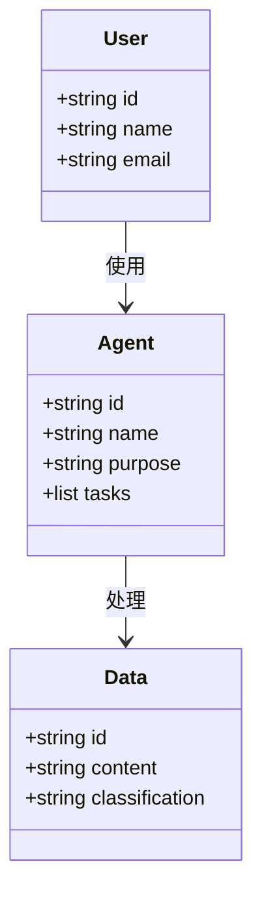
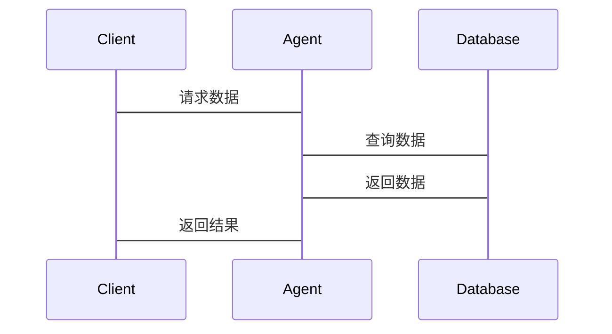

                 


# 企业AI Agent的隐私保护机制

**关键词**：企业AI Agent、隐私保护、数据安全、差分隐私、同态加密、数据匿名化、数据脱敏

**摘要**：  
随着人工智能技术的快速发展，企业AI Agent的应用越来越广泛。然而，AI Agent在处理大量敏感数据时，隐私保护问题变得尤为重要。本文将详细探讨企业AI Agent的隐私保护机制，涵盖核心概念、技术实现、系统架构以及实际案例分析。通过对比数据匿名化、数据加密等技术，结合差分隐私和同态加密的算法实现，本文旨在为企业AI Agent的隐私保护提供全面的技术解决方案。

---

# 第1章: 企业AI Agent的背景与问题背景

## 1.1 企业AI Agent的概念与特点

### 1.1.1 AI Agent的定义与核心概念

AI Agent（人工智能代理）是一种能够感知环境、自主决策并执行任务的智能实体。企业AI Agent专门为企业场景设计，用于优化业务流程、提升决策效率和客户体验。其核心概念包括：

- **自主性**：能够在没有外部干预的情况下独立运行。
- **反应性**：能够根据环境变化实时调整行为。
- **目标导向**：通过设定目标来驱动任务执行。

### 1.1.2 企业AI Agent的独特性

企业AI Agent与个人或通用AI Agent相比，具有以下独特性：

1. **数据敏感性**：处理企业内部的机密数据，如客户信息、财务数据等。
2. **合规性要求**：必须符合企业内部的隐私政策和相关法律法规。
3. **高可用性**：需要在高压力环境下稳定运行，确保业务连续性。

### 1.1.3 企业AI Agent的应用场景

- **客户关系管理**：通过分析客户数据，提供个性化服务。
- **供应链优化**：实时监控和调整供应链流程，降低成本。
- **风险管理**：通过分析市场数据，预测和规避潜在风险。

## 1.2 隐私保护的重要性

### 1.2.1 数据隐私的基本概念

数据隐私指对数据的收集、存储、处理和共享进行合法、合规的控制，确保数据仅被授权方访问和使用。在企业AI Agent中，数据隐私是确保客户信任和合规运营的关键。

### 1.2.2 企业AI Agent中的隐私威胁

企业AI Agent在处理大量敏感数据时，面临以下隐私威胁：

1. **数据泄露**：未经授权的第三方可能获取敏感数据。
2. **数据滥用**：数据被用于未经授权的目的。
3. **数据篡改**：数据被恶意修改，导致决策失误。

### 1.2.3 隐私保护的法律与合规要求

随着《通用数据保护条例》（GDPR）等法规的实施，企业AI Agent必须遵守严格的隐私保护要求。这些法规要求企业在处理数据时，必须采取技术手段确保数据的机密性、完整性和可用性。

---

# 第2章: 隐私保护机制的核心概念

## 2.1 隐私保护机制的属性对比

### 2.1.1 数据匿名化与数据加密的对比

| **属性**       | **数据匿名化**                  | **数据加密**                  |
|-----------------|----------------------------------|-------------------------------|
| **定义**        | 将数据去标识化，使其无法关联到具体个人 | 通过加密算法对数据进行加密，防止未经授权的访问 |
| **目的**        | 防止数据泄露后识别个体           | 防止数据在传输或存储过程中被窃取 |
| **技术实现**    | 去除或替换敏感字段               | 使用加密算法（如AES、RSA） |
| **应用场景**    | 数据共享、数据分析             | 数据存储、网络传输           |

### 2.1.2 数据脱敏与数据混淆的对比

| **属性**       | **数据脱敏**                   | **数据混淆**                   |
|-----------------|-------------------------------|-------------------------------|
| **定义**        | 将敏感数据进行变形，使其失去可读性 | 通过添加噪声或随机化技术改变数据分布 |
| **目的**        | 防止数据泄露后被还原           | 防止数据被统计分析时泄露隐私 |
| **技术实现**    | 替换敏感字段、加密敏感信息     | 添加随机值、打乱数据顺序       |
| **应用场景**    | 数据共享、数据存储             | 数据分析、数据挖掘             |

### 2.1.3 数据访问控制与数据共享控制的对比

| **属性**       | **数据访问控制**               | **数据共享控制**               |
|-----------------|-------------------------------|-------------------------------|
| **定义**        | 控制用户对数据的访问权限       | 控制数据的共享范围和方式       |
| **目的**        | 防止未经授权的访问             | 防止数据被共享到未经授权的第三方 |
| **技术实现**    | 基于角色的访问控制（RBAC）     | 数据脱敏、数据加密             |
| **应用场景**    | 数据存储、数据访问             | 数据共享、数据传输             |

## 2.2 隐私保护机制的ER实体关系图

```mermaid
erDiagram
    User {
        +string id
        +string name
        +string email
    }
    Agent {
        +string id
        +string name
        +string purpose
    }
    Data {
        +string id
        +string content
        +string classification
    }
    User -|> Agent: 使用
    Agent -|> Data: 处理
    Data -|> User: 提供
```

---

# 第3章: 企业AI Agent的隐私保护技术实现

## 3.1 差分隐私算法

### 3.1.1 差分隐私的基本原理

差分隐私是一种通过在数据中添加噪声来保护个体隐私的技术。其核心思想是在数据查询结果中添加随机噪声，使得单个数据点的变化不会显著影响查询结果。

### 3.1.2 差分隐私的实现代码

```python
import numpy as np

def add_noise(data, epsilon):
    """
    使用拉普拉斯分布添加噪声
    Args:
        data: 需要加噪声的数据
        epsilon: 鲍鱼参数，控制噪声的大小
    Returns:
        加噪声后的数据
    """
    noise = np.random.laplace(0, 1/epsilon, data.shape)
    return data + noise

# 示例数据
data = np.array([1, 2, 3, 4, 5])
epsilon = 1.0

noised_data = add_noise(data, epsilon)
print("原始数据:", data)
print("加噪声后的数据:", noised_data)
```

### 3.1.3 差分隐私的数学模型

差分隐私的数学模型可以用以下公式表示：

$$ P(Q(D) = y) \geq P(Q(D') = y) - \epsilon $$

其中：
- $D$ 和 $D'$ 是两个相邻的数据集。
- $Q$ 是查询函数。
- $y$ 是查询结果。
- $\epsilon$ 是隐私参数，控制隐私保护的强度。

---

## 3.2 同态加密算法

### 3.2.1 同态加密的基本原理

同态加密是一种允许在加密数据上执行计算的技术。加密后的数据可以直接进行运算，而无需解密，从而保护数据隐私。

### 3.2.2 同态加密的实现代码

```python
from cryptography.fernet import Fernet

def encrypt_data(key, data):
    """
    使用同态加密对数据进行加密
    Args:
        key: 加密密钥
        data: 需要加密的数据
    Returns:
        加密后的数据
    """
    fernet = Fernet(key)
    encrypted_data = fernet.encrypt(data.encode())
    return encrypted_data

def decrypt_data(key, encrypted_data):
    """
    使用同态加密对数据进行解密
    Args:
        key: 解密密钥
        encrypted_data: 需要解密的加密数据
    Returns:
        解密后的数据
    """
    fernet = Fernet(key)
    decrypted_data = fernet.decrypt(encrypted_data).decode()
    return decrypted_data

# 示例数据
data = "客户姓名：张三"
key = Fernet.generate_key()

encrypted = encrypt_data(key, data)
print("加密后的数据:", encrypted)
print("解密后的数据:", decrypt_data(key, encrypted))
```

### 3.2.3 同态加密的数学模型

同态加密的数学模型可以用以下公式表示：

$$ E(x) = x \cdot e^{k} $$

其中：
- $x$ 是原始数据。
- $k$ 是加密密钥。
- $E(x)$ 是加密后的数据。

通过这种方式，可以在加密状态下对数据进行加法和乘法运算。

---

# 第4章: 企业AI Agent的系统架构设计

## 4.1 问题场景介绍

企业在使用AI Agent时，常常面临以下问题：

1. **数据泄露风险**：敏感数据在传输和存储过程中可能被截获。
2. **隐私合规要求**：企业需要遵守严格的隐私保护法规。
3. **数据安全威胁**：恶意攻击可能导致数据泄露。

## 4.2 系统功能设计

### 4.2.1 系统功能模块



### 4.2.2 系统架构设计


### 4.2.3 系统接口设计



---

# 第5章: 项目实战

## 5.1 环境安装

### 5.1.1 安装Python

```bash
python --version
pip install --upgrade pip
```

### 5.1.2 安装依赖库

```bash
pip install numpy cryptography
```

## 5.2 核心代码实现

### 5.2.1 差分隐私实现

```python
import numpy as np

def add_noise(data, epsilon):
    noise = np.random.laplace(0, 1/epsilon, data.shape)
    return data + noise

data = np.array([1, 2, 3, 4, 5])
epsilon = 1.0
noised_data = add_noise(data, epsilon)
print("原始数据:", data)
print("加噪声后的数据:", noised_data)
```

### 5.2.2 同态加密实现

```python
from cryptography.fernet import Fernet

def encrypt_data(key, data):
    fernet = Fernet(key)
    encrypted_data = fernet.encrypt(data.encode())
    return encrypted_data

def decrypt_data(key, encrypted_data):
    fernet = Fernet(key)
    decrypted_data = fernet.decrypt(encrypted_data).decode()
    return decrypted_data

data = "客户姓名：张三"
key = Fernet.generate_key()

encrypted = encrypt_data(key, data)
print("加密后的数据:", encrypted)
print("解密后的数据:", decrypt_data(key, encrypted))
```

## 5.3 案例分析与代码解读

### 5.3.1 案例分析

假设我们有一个企业AI Agent，用于分析客户的购买行为。为了保护客户隐私，我们使用差分隐私对客户的购买数据进行处理。

### 5.3.2 代码解读

```python
import numpy as np

def add_noise(data, epsilon):
    noise = np.random.laplace(0, 1/epsilon, data.shape)
    return data + noise

# 示例数据
data = np.array([1, 2, 3, 4, 5])
epsilon = 1.0

noised_data = add_noise(data, epsilon)
print("原始数据:", data)
print("加噪声后的数据:", noised_data)
```

---

# 第6章: 最佳实践、小结与注意事项

## 6.1 最佳实践

1. **数据分类分级**：根据数据的重要性和敏感性进行分类，制定相应的保护措施。
2. **最小化数据收集**：仅收集必要的数据，减少隐私泄露的风险。
3. **定期安全审计**：定期检查系统漏洞，确保隐私保护措施的有效性。

## 6.2 小结

企业AI Agent的隐私保护是一个复杂而重要的任务。通过理解隐私保护的核心概念、选择合适的加密算法、设计合理的系统架构，企业可以在保证数据安全的前提下，充分利用AI Agent的强大能力。

## 6.3 注意事项

- **合规性**：确保所有隐私保护措施符合相关法律法规。
- **安全性**：定期测试系统，防止数据泄露。
- **可扩展性**：设计灵活的架构，适应未来业务的发展。

## 6.4 拓展阅读

- **《数据隐私与保护》**：深入理解数据隐私的基本概念和保护方法。
- **《差分隐私与数据挖掘》**：详细讲解差分隐私在数据挖掘中的应用。
- **《同态加密技术》**：探索同态加密的最新技术和发展趋势。

---

通过以上章节的详细讲解，我们希望能够为企业AI Agent的隐私保护提供全面的技术指导，帮助企业更好地应对隐私保护的挑战，同时充分利用AI技术推动业务发展。

