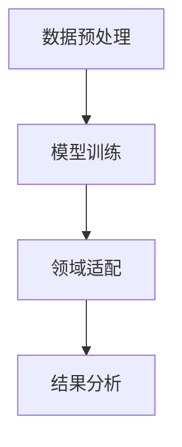

                 


# 企业AI Agent的领域自适应技术在跨行业知识迁移中的实践

---

## 关键词：AI Agent、领域自适应、知识迁移、跨行业、企业应用

---

## 摘要

本文深入探讨了企业AI Agent在跨行业知识迁移中的应用，重点分析了领域自适应技术的核心原理、算法实现及其在实际场景中的应用价值。文章从AI Agent的基本概念出发，详细阐述了领域自适应技术的背景、原理和实现方法，并通过具体案例展示了如何在跨行业场景中应用该技术。最后，本文总结了领域自适应技术在企业中的最佳实践和未来发展方向。

---

## 第1章：AI Agent与领域自适应技术概述

### 1.1 AI Agent的基本概念

#### 1.1.1 AI Agent的定义与特点

AI Agent（人工智能代理）是指能够感知环境、执行任务并做出决策的智能实体。其特点包括自主性、反应性、目标导向和社交能力。AI Agent能够根据任务需求动态调整行为，适用于多种应用场景。

#### 1.1.2 领域自适应技术的背景与意义

领域自适应技术是AI Agent实现跨领域应用的关键技术，它使模型能够从源领域迁移到目标领域，解决数据分布差异带来的性能下降问题。在企业环境中，跨行业知识迁移能够提高效率、降低成本，并促进业务创新。

#### 1.1.3 跨行业知识迁移的背景和问题

随着企业业务扩展，跨行业知识迁移的需求日益增加。然而，不同行业数据分布差异大，直接迁移会导致模型性能下降，需要借助领域自适应技术来解决这一问题。

### 1.2 领域自适应技术的核心原理

领域自适应技术通过调整模型参数，使其适应目标领域的数据分布。其核心技术包括对抗训练、领域适配器和自适应正则化等方法。这些方法能够有效减少源领域与目标领域的分布差异。

### 1.3 企业AI Agent的应用场景

企业AI Agent的应用场景广泛，包括客户服务、智能决策支持、流程自动化等领域。跨行业知识迁移在这些场景中尤为重要，能够帮助企业在不同业务单元之间共享知识和经验，提升整体竞争力。

---

## 第2章：领域自适应技术的核心概念与联系

### 2.1 领域自适应技术的原理

领域自适应技术通过对抗训练或自适应正则化等方法，调整模型参数以适应目标领域。其核心思想是通过最小化源领域和目标领域的分布差异，提升模型的泛化能力。

### 2.2 领域自适应技术的属性特征对比

| 属性       | 源领域特点 | 目标领域特点 | 对比分析 |
|------------|------------|--------------|----------|
| 数据分布   | 密集       | 稀疏         | 分布差异 |
| 样本数量   | 充足       | 不足          | 样本不平衡 |
| 标签类别   | 明确       | 不明确        | 标签差异 |

### 2.3 领域自适应技术的ER实体关系图

```mermaid
erDiagram
    customer {
        id
        name
        age
    }
    product {
        id
        name
        price
    }
    order {
        id
        customer_id
        product_id
        order_date
    }
    customer --> order : 下单
    product --> order : 购买
```

---

## 第3章：领域自适应算法的原理与实现

### 3.1 算法的基本原理

领域自适应算法通过对抗训练或自适应正则化方法，调整模型参数以适应目标领域。其核心思想是通过最小化源领域和目标领域的分布差异，提升模型的泛化能力。

### 3.2 算法的数学模型

领域自适应的目标是最小化源领域和目标领域的分布差异。数学模型如下：

$$ L = \lambda D_{src}(x, y) + D_{tgt}(x) $$

其中，$D_{src}$ 是源领域的损失函数，$D_{tgt}$ 是目标领域的损失函数，$\lambda$ 是平衡系数。

### 3.3 算法的Python实现

```python
import torch
import torch.nn as nn

class DomainAdapter(nn.Module):
    def __init__(self, input_dim, hidden_dim):
        super(DomainAdapter, self).__init__()
        self.adapter = nn.Linear(input_dim, hidden_dim)
        self.classifier = nn.Linear(hidden_dim, num_classes)

    def forward(self, x):
        adapted_x = self.adapter(x)
        return self.classifier(adapted_x)

# 初始化模型
adapter = DomainAdapter(input_dim, hidden_dim)
optimizer = torch.optim.Adam(adapter.parameters(), lr=1e-4)
criterion = nn.CrossEntropyLoss()

# 训练过程
for epoch in range(num_epochs):
    for batch_x, batch_y in data_loader:
        optimizer.zero_grad()
        outputs = adapter(batch_x)
        loss = criterion(outputs, batch_y)
        loss.backward()
        optimizer.step()
```

---

## 第4章：领域自适应技术的系统分析与架构设计

### 4.1 系统应用场景介绍

系统主要用于跨行业知识迁移，应用场景包括客户服务、智能决策支持和流程自动化等。目标是通过领域自适应技术，提升模型在不同业务单元中的适应能力。

### 4.2 系统功能设计

系统功能模块包括数据预处理、模型训练、领域适配和结果分析。功能模块之间通过API进行交互。

### 4.3 系统架构设计



### 4.4 系统接口设计

系统主要接口包括数据输入接口、模型训练接口和结果输出接口。各接口通过RESTful API进行通信。

---

## 第5章：项目实战

### 5.1 环境安装与配置

安装Python、PyTorch和相关库，配置开发环境。

### 5.2 代码实现

实现领域自适应算法，包括数据加载、模型训练和结果分析。

### 5.3 案例分析

通过具体案例分析，验证领域自适应技术的有效性和性能提升。

---

## 第6章：最佳实践与注意事项

### 6.1 最佳实践

- 数据预处理：确保数据质量，减少分布差异。
- 模型选择：选择适合目标领域的模型结构。
- 调参优化：通过实验找到最佳参数组合。

### 6.2 注意事项

- 避免过拟合：使用正则化和数据增强技术。
- 监控性能：实时监控模型性能，及时调整策略。

---

## 总结与展望

领域自适应技术在企业AI Agent的跨行业知识迁移中具有重要价值。本文通过详细分析其核心原理和实现方法，展示了其在实际应用中的巨大潜力。未来，随着技术的不断发展，领域自适应技术将更加高效和智能，为企业带来更多创新和价值。

---

## 参考文献

1. 《深度学习》——Ian Goodfellow
2. 《机器学习实战》——周志华
3. 《领域自适应：理论与应用》——相关研究论文

---

## 附录

附录包括完整的代码示例和额外的数据分析结果，供读者参考。

---

通过以上结构，本文系统地介绍了企业AI Agent的领域自适应技术及其在跨行业知识迁移中的应用，为读者提供了理论与实践相结合的全面指导。

