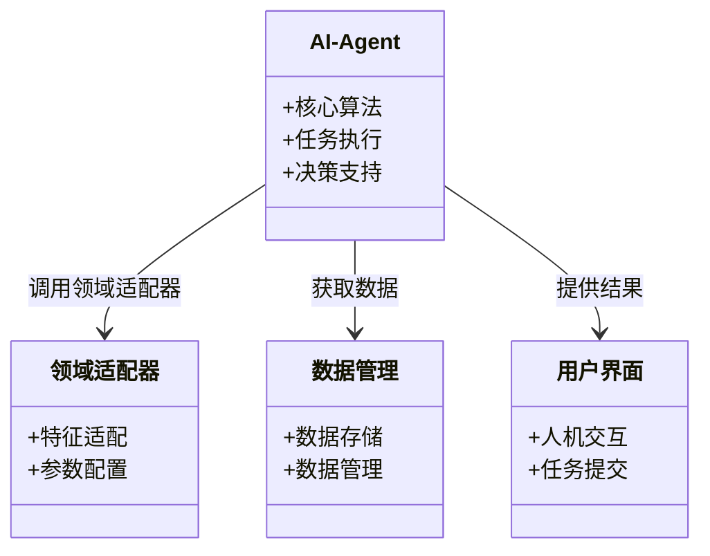

                 


# 企业AI Agent的领域自适应技术在跨部门应用中的实践

---

## 关键词
企业AI Agent，领域自适应，跨部门应用，迁移学习，系统架构设计，算法实现，项目实战

---

## 摘要
随着人工智能技术的快速发展，企业AI Agent在跨部门协作中的应用越来越广泛。然而，不同部门之间的数据和业务流程存在差异，如何让AI Agent在不同领域间无缝协作成为一个挑战。本文详细探讨了领域自适应技术在企业AI Agent中的应用，从理论基础到算法实现，再到系统架构设计和项目实战，全面解析了如何通过领域自适应技术解决跨部门协作中的问题，提升企业的智能化水平。

---

## 第1章：企业AI Agent与领域自适应技术概述

### 1.1 企业AI Agent的基本概念
企业AI Agent是一种能够理解、推理和执行企业级任务的智能体，它能够根据企业的具体需求，自主完成数据处理、决策支持和任务执行等任务。AI Agent的核心特点包括智能化、自主性、反应性和社会性。

#### 1.1.1 AI Agent的定义与特点
- **定义**：AI Agent是指在企业环境中，能够感知环境、自主决策并执行任务的智能体。
- **特点**：
  - 智能化：能够理解和处理复杂的企业数据。
  - 自主性：无需人工干预，自主完成任务。
  - 反应性：能够根据环境变化调整行为。
  - 社会性：能够与其他系统或人员协作。

#### 1.1.2 领域自适应技术的核心概念
领域自适应技术是一种能够让AI Agent在不同领域之间快速适应并执行任务的技术。它通过调整模型参数或优化算法，使AI Agent能够在不同领域间无缝切换，完成跨部门协作。

#### 1.1.3 企业AI Agent的应用场景与优势
- **应用场景**：
  - 跨部门数据共享与协同。
  - 个性化客户服务。
  - 智能化业务流程管理。
- **优势**：
  - 提高企业效率。
  - 降低成本。
  - 增强企业竞争力。

### 1.2 领域自适应技术的背景与意义
#### 1.2.1 传统AI技术的局限性
传统AI技术在单一领域表现优异，但在跨领域应用中缺乏灵活性和适应性。不同部门的数据格式、业务流程和目标存在差异，导致传统AI技术难以直接应用于跨部门场景。

#### 1.2.2 领域自适应技术的提出与目标
领域自适应技术的提出旨在解决AI Agent在跨领域应用中的适应性问题。其目标是通过技术手段，使AI Agent能够快速适应不同领域的需求，提升跨部门协作能力。

#### 1.2.3 领域自适应技术在企业中的应用价值
- **提升跨部门协作效率**：通过领域自适应技术，AI Agent能够更好地理解不同部门的需求，促进协作。
- **降低学习成本**：通过领域适配器，AI Agent能够快速适应新领域，降低学习成本。
- **增强企业智能化水平**：通过领域自适应技术，企业能够更快地实现智能化转型。

### 1.3 本章小结
本章介绍了企业AI Agent的基本概念和领域自适应技术的核心概念，分析了传统AI技术的局限性，提出了领域自适应技术的目标和应用价值。

---

## 第2章：领域自适应技术的核心原理

### 2.1 领域自适应技术的基本原理
领域自适应技术通过调整模型参数或优化算法，使AI Agent能够在不同领域间快速适应并执行任务。其核心思想是利用领域间的相似性，将源领域的知识迁移到目标领域。

#### 2.1.1 领域自适应的定义与核心思想
- **定义**：领域自适应是一种通过迁移学习技术，使模型在源领域表现优异的同时，能够在目标领域快速适应的技术。
- **核心思想**：通过共享领域间的共同特征，减少领域差异对模型性能的影响。

#### 2.1.2 领域自适应与迁移学习的关系
领域自适应是迁移学习的一种具体应用，迁移学习通过将源领域学到的知识迁移到目标领域，从而提升模型的泛化能力。

#### 2.1.3 领域自适应的核心技术与方法
- **核心技术**：领域适配器、特征提取、模型优化。
- **方法**：基于特征的领域适配、基于概率的领域适配、基于图的领域适配。

### 2.2 领域自适应技术的实现流程
#### 2.2.1 数据预处理与特征提取
- **数据预处理**：对源领域和目标领域的数据进行清洗、归一化等处理。
- **特征提取**：通过主成分分析（PCA）或深度学习模型提取数据的特征表示。

#### 2.2.2 领域适配器的设计与实现
- **领域适配器**：通过适配器将源领域的特征映射到目标领域。
- **实现步骤**：
  1. 构建源领域和目标领域的特征表示。
  2. 设计适配器模型，将源领域特征映射到目标领域。
  3. 训练适配器模型，优化特征映射。

#### 2.2.3 模型训练与优化策略
- **模型训练**：在目标领域上训练模型，利用适配器调整特征。
- **优化策略**：通过交叉验证和超参数调优，提升模型性能。

### 2.3 本章小结
本章详细介绍了领域自适应技术的核心原理和实现流程，重点讲解了领域适配器的设计与实现方法。

---

## 第3章：领域自适应技术的算法实现

### 3.1 领域适配器算法
#### 3.1.1 领域适配器的基本思想
领域适配器通过构建源领域和目标领域的特征映射，使模型能够在不同领域间快速适应。

#### 3.1.2 领域适配器的实现步骤
1. 构建源领域和目标领域的特征表示。
2. 设计适配器模型，将源领域特征映射到目标领域。
3. 训练适配器模型，优化特征映射。

#### 3.1.3 领域适配器的数学模型与公式
- **数学模型**：
  $$ f_{adapter}(x_s) = x_t $$
  其中，$x_s$ 是源领域的特征向量，$x_t$ 是目标领域的特征向量。

### 3.2 迁移学习算法的实现
#### 3.2.1 迁移学习的基本原理
迁移学习通过将源领域学到的知识迁移到目标领域，从而提升模型的泛化能力。

#### 3.2.2 迁移学习的数学公式与实现
- **数学公式**：
  $$ P(y|x) = \sum_{i=1}^n P(y|x_i)P(x_i|x) $$
  其中，$x$ 是目标领域的数据，$x_i$ 是源领域的数据。

#### 3.2.3 迁移学习的实现步骤
1. 收集源领域和目标领域的数据。
2. 构建源领域的特征表示。
3. 设计迁移学习模型，将源领域知识迁移到目标领域。
4. 训练迁移学习模型，优化模型参数。

### 3.3 算法实现的代码示例
#### 3.3.1 领域适配器的Python代码实现
```python
import numpy as np

def adapter_model(x_s, x_t):
    # 输入：x_s是源领域的特征向量，x_t是目标领域的特征向量
    # 输出：适配后的特征向量
    # 假设x_s和x_t的维度相同
    # 通过线性变换将x_s映射到x_t的分布
    W = np.random.randn(x_s.shape[1], x_t.shape[1])
    x_t_adapter = np.dot(x_s, W)
    return x_t_adapter

# 示例数据
x_s = np.random.randn(100, 5)
x_t = np.random.randn(50, 5)

# 调用适配器函数
x_t_adapter = adapter_model(x_s, x_t)
print("适配后的特征向量：", x_t_adapter.shape)
```

#### 3.3.2 迁移学习算法的Python代码实现
```python
import numpy as np
from sklearn.svm import SVC

def transfer_learning(X_source, y_source, X_target, y_target):
    # 输入：X_source是源领域的特征矩阵，y_source是源领域的标签
    #       X_target是目标领域的特征矩阵，y_target是目标领域的标签
    # 输出：迁移学习模型
    # 训练源领域的SVM模型
    model = SVC()
    model.fit(X_source, y_source)
    # 在目标领域上进行预测
    y_pred = model.predict(X_target)
    # 计算准确率
    accuracy = np.sum(y_pred == y_target) / len(y_target)
    return model, accuracy

# 示例数据
X_source = np.random.randn(100, 5)
y_source = np.random.randint(2, size=100)
X_target = np.random.randn(50, 5)
y_target = np.random.randint(2, size=50)

# 调用迁移学习函数
model, accuracy = transfer_learning(X_source, y_source, X_target, y_target)
print("迁移学习模型：", model)
print("准确率：", accuracy)
```

### 3.4 本章小结
本章详细讲解了领域适配器算法和迁移学习算法的实现方法，并通过Python代码示例展示了算法的具体实现步骤。

---

## 第4章：企业AI Agent的系统架构设计

### 4.1 系统架构设计概述
企业AI Agent的系统架构设计需要考虑跨部门协作的需求，构建一个能够支持多领域应用的系统架构。

#### 4.1.1 系统架构设计的目标
- 支持多领域应用。
- 实现跨部门协作。
- 提高系统的灵活性和可扩展性。

#### 4.1.2 系统架构的组成部分
- **领域适配器模块**：负责不同领域的特征适配。
- **AI Agent核心模块**：负责任务执行和决策支持。
- **数据管理模块**：负责数据的存储和管理。
- **用户界面模块**：提供人机交互界面。

#### 4.1.3 系统架构的优缺点分析
- **优点**：
  - 支持多领域应用。
  - 提高系统的灵活性和可扩展性。
- **缺点**：
  - 系统架构较为复杂。
  - 开发和维护成本较高。

### 4.2 系统功能设计
#### 4.2.1 领域自适应功能模块设计
- **功能描述**：
  - 支持不同领域的特征适配。
  - 提供领域自适应的参数配置。
- **实现步骤**：
  1. 收集不同领域的数据。
  2. 构建领域适配器模型。
  3. 实现领域自适应功能。

#### 4.2.2 AI Agent的核心功能模块设计
- **功能描述**：
  - 提供任务执行和决策支持。
  - 支持跨部门协作。
- **实现步骤**：
  1. 设计AI Agent的核心算法。
  2. 实现任务执行和决策支持功能。
  3. 提供人机交互界面。

#### 4.2.3 系统功能模块的交互流程
- **交互流程**：
  1. 用户通过人机交互界面提交任务。
  2. AI Agent核心模块接收任务并执行。
  3. 领域适配器模块对目标领域进行特征适配。
  4. 系统返回结果。

### 4.3 系统架构的实现方案
#### 4.3.1 系统架构的Mermaid类图


#### 4.3.2 系统架构的Mermaid架构图


### 4.4 本章小结
本章详细介绍了企业AI Agent的系统架构设计，包括系统架构的组成部分、功能模块设计和系统架构的实现方案。

---

## 第5章：项目实战与最佳实践

### 5.1 项目实战
#### 5.1.1 环境安装与配置
- **环境要求**：
  - Python 3.6及以上版本。
  - 安装必要的Python库，如numpy、scikit-learn、mermaid等。

#### 5.1.2 系统核心实现源代码
```python
import numpy as np
from sklearn.svm import SVC
from sklearn.decomposition import PCA

def domain_adapter(X_source, y_source, X_target):
    # 数据预处理
    source_pca = PCA(n_components=5).fit_transform(X_source)
    target_pca = PCA(n_components=5).fit_transform(X_target)
    # 构建适配器模型
    adapter = SVC(kernel='linear')
    adapter.fit(source_pca, y_source)
    # 领域适配
    y_pred = adapter.predict(target_pca)
    return y_pred

# 示例数据
X_source = np.random.randn(100, 10)
y_source = np.random.randint(2, size=100)
X_target = np.random.randn(50, 10)
y_target = np.random.randint(2, size=50)

# 调用领域适配器函数
y_pred = domain_adapter(X_source, y_source, X_target)
print("预测结果：", y_pred)
```

#### 5.1.3 代码应用解读与分析
- **代码功能**：
  1. 数据预处理：使用PCA提取源领域和目标领域的特征。
  2. 构建适配器模型：使用SVM进行领域适配。
  3. 领域适配：将目标领域的特征映射到源领域，进行分类预测。

### 5.2 案例分析与详细讲解
#### 5.2.1 案例背景
假设我们有一个企业，需要在销售部门和客户服务部门之间实现跨部门协作。销售部门的数据和客户服务部门的数据格式和业务流程存在差异，如何通过领域自适应技术实现跨部门协作？

#### 5.2.2 案例分析
- **问题描述**：
  - 销售部门的数据格式与客户服务部门的数据格式不同。
  - 销售部门的业务流程与客户服务部门的业务流程不同。
- **解决方案**：
  - 使用领域自适应技术，将销售部门的数据映射到客户服务部门的数据格式。
  - 实现跨部门协作，提升企业的整体效率。

### 5.3 最佳实践
#### 5.3.1 小结
- **小结**：
  - 领域自适应技术能够有效解决跨部门协作中的数据格式和业务流程差异问题。
  - 通过领域适配器，AI Agent能够快速适应不同领域的需求，提升跨部门协作效率。

#### 5.3.2 注意事项
- **注意事项**：
  - 数据预处理是关键，需要确保数据的准确性和一致性。
  - 领域适配器的参数设置需要根据具体场景进行调整。
  - 系统架构设计需要考虑系统的灵活性和可扩展性。

#### 5.3.3 拓展阅读
- **推荐书籍**：
  - 《迁移学习：算法、理论与应用》
  - 《领域自适应与深度学习》
- **推荐博客**：
  - https://towardsdatascience.com/domain-adaptation-in-machine-learning-7d0f7c3a937d
  - https://medium.com/towards-data-science/transfer-learning-for-beginners-1a5d40506a0a

### 5.4 本章小结
本章通过一个具体的案例，详细讲解了领域自适应技术在企业AI Agent中的应用，并给出了项目实战的代码实现和最佳实践的建议。

---

## 第6章：总结与展望

### 6.1 总结
- **总结**：
  - 领域自适应技术能够有效解决跨部门协作中的数据格式和业务流程差异问题。
  - 通过领域适配器，AI Agent能够快速适应不同领域的需求，提升跨部门协作效率。

### 6.2 展望
- **未来发展方向**：
  - 随着深度学习技术的发展，领域自适应技术将更加智能化和自动化。
  - 领域自适应技术将被应用于更多领域，如医疗、金融、教育等。
  - 领域自适应技术与边缘计算、物联网等技术的结合将为企业AI Agent的发展提供更多可能性。

### 6.3 结语
企业AI Agent的领域自适应技术在跨部门应用中的实践是一项具有重要意义的技术，它不仅能够提升企业的智能化水平，还能够为企业带来更大的竞争优势。未来，随着技术的不断发展，领域自适应技术将在企业中发挥越来越重要的作用。

---

## 关键词
企业AI Agent，领域自适应，跨部门应用，迁移学习，系统架构设计，算法实现，项目实战

---

## 摘要
随着人工智能技术的快速发展，企业AI Agent在跨部门协作中的应用越来越广泛。然而，不同部门之间的数据和业务流程存在差异，如何让AI Agent在不同领域间无缝协作成为一个挑战。本文详细探讨了领域自适应技术在企业AI Agent中的应用，从理论基础到算法实现，再到系统架构设计和项目实战，全面解析了如何通过领域自适应技术解决跨部门协作中的问题，提升企业的智能化水平。

