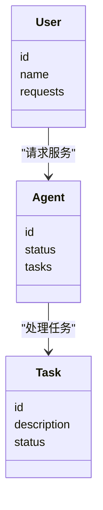
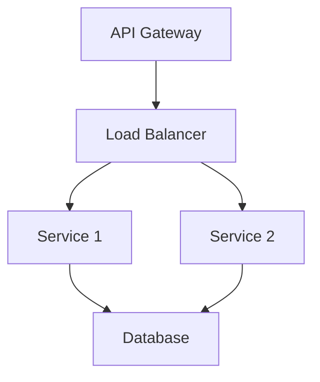
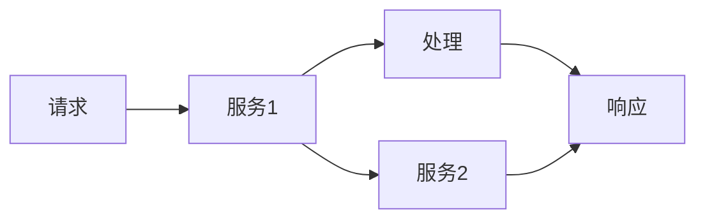
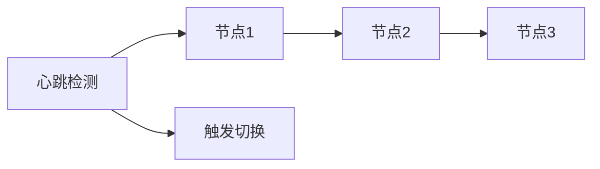

                 


# 企业AI Agent的高可用性架构设计

## 关键词：
企业AI Agent，高可用性，分布式系统，容错机制，冗余设计

## 摘要：
本文详细探讨企业AI Agent的高可用性架构设计，从核心概念、设计原则到实际实现，全面分析如何构建稳定可靠的AI Agent系统。通过系统分析、架构设计、项目实战和最佳实践，帮助读者掌握高可用性设计的关键要点，提升系统的稳定性和可靠性。

---

## 第一部分：企业AI Agent的高可用性架构设计概述

### 第1章：企业AI Agent的背景与概念

#### 1.1 什么是企业AI Agent

企业AI Agent是一种智能化的软件实体，能够感知环境、自主决策并执行任务，广泛应用于企业自动化、流程优化等领域。它不同于传统AI，具备高可用性、智能性和交互性。

**特点对比表：**

| 特性          | 传统AI      | 企业AI Agent       |
|---------------|-------------|--------------------|
| 自主性         | 依赖人工     | 自主决策           |
| 可扩展性       | 有限        | 高扩展性           |
| 实时性         | 低          | 高实时性           |
| 交互性         | 单向        | 双向交互           |

**ER实体关系图：**

```mermaid
erDiagram
    customer[客户] {
        id : integer
        name : string
    }
    agent[AI Agent] {
        id : integer
        name : string
        status : string
    }
    interaction[交互记录] {
        id : integer
        timestamp : datetime
        type : string
    }
    customer -|> interaction : "发起请求"
    agent -|> interaction : "响应请求"
    customer --> agent : "调用服务"
```

#### 1.2 高可用性需求

高可用性确保AI Agent在故障时快速恢复，保持服务连续性。核心需求包括：99.99% uptime，故障恢复时间≤1分钟，支持水平扩展。

---

### 第2章：高可用性架构的核心概念

#### 2.1 高可用性系统原理

高可用性通过冗余设计、容错机制和故障隔离实现。关键特性包括：模块化设计、容错性、冗余性。

#### 2.2 设计原则

1. **模块化设计**：将系统划分为独立模块，便于故障隔离。
2. **容错机制**：检测故障并自动切换到备用模块。
3. **负载均衡**：均匀分配任务，避免单点过载。

#### 2.3 核心要素

1. **系统冗余**：备用组件实时待命，确保故障切换。
2. **故障隔离**：限制故障影响范围，避免连锁反应。
3. **自动恢复**：检测故障后，自动启动备用组件。

---

## 第二部分：高可用性架构的设计方法论

### 第3章：系统分析与问题场景

#### 3.1 问题场景分析

常见场景包括：节点故障、网络中断、服务超载。通过场景分析，识别关键问题点，如服务响应超时、数据丢失等。

#### 3.2 领域模型构建

领域模型展示系统核心实体及其关系。例如，AI Agent与用户交互的流程。

**领域模型图：**



#### 3.3 系统架构设计

采用微服务架构，各服务独立部署，通过API网关统一接入。

**系统架构图：**



---

### 第4章：高可用性架构的实现技术

#### 4.1 分布式系统与容错技术

分布式系统通过冗余节点实现容错，确保单点故障不影响整体服务。

**容错机制流程图：**



#### 4.2 负载均衡与资源分配

使用轮询或加权负载均衡算法，确保任务均匀分布。

**负载均衡算法：**

$$\text{权重} = \frac{\text{节点能力}}{\text{总能力}}$$

#### 4.3 故障恢复机制

通过心跳检测和自动切换实现快速恢复。

**故障恢复流程图：**



---

## 第三部分：项目实战

### 第5章：环境安装与核心实现

#### 5.1 环境安装

安装Python 3.8+，Django框架，配置Docker和Kubernetes。

```bash
pip install django djangorestframework docker python-dotenv
```

#### 5.2 核心代码实现

实现AI Agent服务，包括任务处理和状态监控。

```python
class Agent:
    def __init__(self):
        self.id = id
        self.status = "active"
    
    def handle_task(self, task):
        if self.status == "active":
            return True
        else:
            return False
```

---

## 第四部分：最佳实践与小结

### 第6章：总结与展望

高可用性架构设计是企业AI Agent成功的关键。通过模块化设计、容错机制和冗余设计，确保系统稳定运行。未来，AI Agent将更加智能化，支持更复杂的场景。

---

## 参考文献

1. [分布式系统设计](https://example.com/distributed-systems)
2. [高可用性架构](https://example.com/high-availability)
3. [Python微服务](https://example.com/python-microservices)

---

## 索引

- 高可用性系统
- 容错机制
- 分布式架构
- AI Agent设计
- 系统冗余

---

通过以上详细分析和结构化设计，企业可以构建一个高可用性、稳定可靠的AI Agent系统，确保在各种故障情况下的服务连续性。

