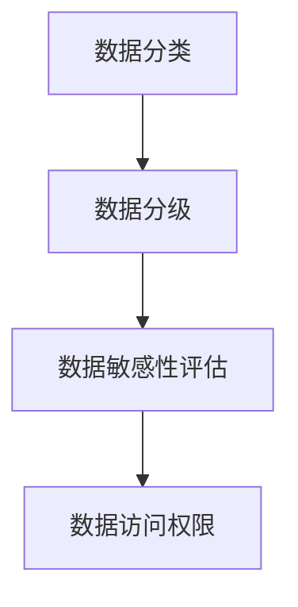
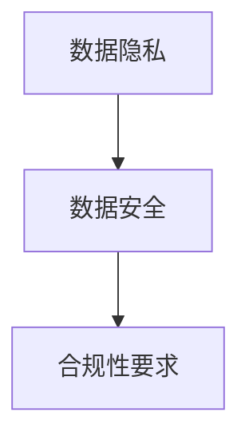
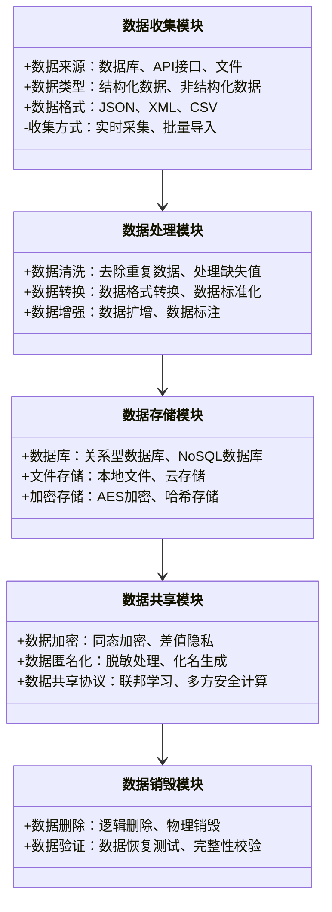
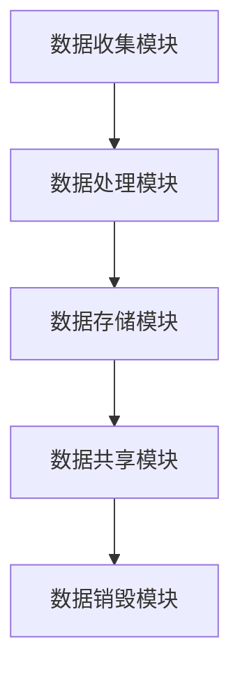

                 


# 企业AI数据安全：从收集到销毁的全生命周期管理

## 关键词：企业数据安全，AI技术，数据生命周期，隐私保护，数据销毁

## 摘要：本文深入探讨了企业AI数据安全的全生命周期管理，从数据收集到销毁的每个阶段，分析了数据安全的关键挑战和解决方案。文章结合实际案例，详细讲解了数据收集、存储、处理、共享和销毁过程中的安全措施，强调了合规性、隐私保护和数据脱敏的重要性。通过系统分析和实战案例，为企业的AI数据安全管理提供了全面的指导和实践建议。

---

# 第1章 企业AI数据安全概述

## 1.1 数据安全的背景与重要性

### 1.1.1 数据作为核心资产的时代背景
在数字化转型的今天，数据已成为企业的核心资产。企业通过AI技术处理数据，提取价值，提升竞争力。然而，数据的价值也使其成为攻击者的靶点。据统计，2022年全球数据泄露事件较2021年增加了16.7%，企业因数据泄露的平均损失高达130万美元。数据安全已成为企业生存的关键问题。

### 1.1.2 AI技术对企业数据安全的影响
AI技术的应用带来了数据量的指数级增长和处理复杂度的提升。AI算法对数据的依赖性越高，数据安全风险也越大。例如，深度学习模型可能因训练数据中的偏差或泄露而引发隐私问题。此外，AI技术本身也可能成为攻击工具，如生成对抗网络（GAN）被用于伪造数据，威胁数据真实性。

### 1.1.3 数据全生命周期管理的必要性
数据的全生命周期包括收集、存储、处理、共享和销毁。每个阶段都可能面临不同的安全风险。例如，数据收集阶段可能涉及未经授权的数据获取，数据存储阶段可能面临黑客攻击，数据处理阶段可能涉及算法偏见，数据共享阶段可能引发隐私泄露，数据销毁阶段可能因处理不当导致数据残留。因此，全生命周期管理是确保数据安全的基础。

## 1.2 企业AI数据安全的核心问题

### 1.2.1 数据收集、处理、存储、共享与销毁的关键挑战
- **数据收集**：合法性和匿名化处理。企业必须确保收集的数据符合相关法律法规，并采取匿名化措施，防止用户身份被追溯。
- **数据处理**：算法透明性和数据脱敏。AI模型的训练数据可能包含敏感信息，需要通过脱敏技术去除敏感字段，同时确保算法的透明性，避免因算法偏见引发歧视问题。
- **数据存储**：加密存储和访问控制。数据必须加密存储，同时通过严格的访问控制策略，确保只有授权人员可以访问敏感数据。
- **数据共享**：隐私保护和联邦学习。企业在共享数据时，需要通过联邦学习等技术在不共享原始数据的前提下进行模型训练，确保数据隐私。
- **数据销毁**：彻底销毁和验证。数据销毁必须确保数据无法被恢复，并通过技术手段验证销毁的彻底性。

### 1.2.2 数据泄露对企业的影响
数据泄露可能导致的后果包括：
- **经济损失**：赔偿受害者、支付罚款、修复系统漏洞等。
- **声誉损失**：客户信任度下降，影响企业形象。
- **法律责任**：违反数据保护法规可能面临巨额罚款和法律诉讼。

### 1.2.3 数据安全的边界与外延
数据安全的边界包括：
- 数据的物理安全：防止设备丢失或被盗。
- 数据的逻辑安全：防止未经授权的访问和篡改。
- 数据的传输安全：确保数据在传输过程中的机密性和完整性。
- 数据的存储安全：防止数据被未授权访问或删除。

数据安全的外延包括：
- 数据隐私：保护个人隐私，防止数据滥用。
- 数据完整性：确保数据在处理过程中未被篡改。
- 数据可用性：确保数据在需要时可访问。

## 1.3 数据安全的核心概念与联系

### 1.3.1 数据分类与分级的层级结构图


### 1.3.2 数据安全与隐私保护的关系


---

# 第2章 数据收集阶段的安全管理

## 2.1 数据收集的合法性与合规性

### 2.1.1 数据收集的合法性要求
企业必须确保数据收集符合相关法律法规，如GDPR（通用数据保护条例）和CCPA（加州消费者隐私法案）。例如，在欧盟境内收集个人数据的企业必须明确告知用户数据收集的目的，并获得用户的同意。

### 2.1.2 合规性框架（如GDPR、CCPA等）
- **GDPR**：要求企业明确数据收集的目的，并在用户同意的情况下收集数据。用户有权访问、修改和删除其数据。
- **CCPA**：要求企业向用户提供数据收集和使用的目的，并允许用户拒绝数据共享。

## 2.2 数据匿名化与脱敏处理

### 2.2.1 数据匿名化技术
数据匿名化技术包括：
- **删除标识信息**：移除数据中的个人身份信息（如姓名、地址）。
- **数据扰动**：对数据进行小幅度的修改，使其无法被重新识别。
- **加密**：对数据进行加密处理，确保未经授权的人员无法解密数据。

### 2.2.2 数据脱敏
数据脱敏是通过技术手段将敏感数据转化为非敏感数据，同时保持数据的可用性。例如，对用户姓名进行脱敏处理，可以将其转换为“化名”或“代号”。

---

# 第3章 数据存储与处理阶段的安全管理

## 3.1 数据存储的安全措施

### 3.1.1 加密存储
数据存储时，必须对敏感数据进行加密处理。例如，使用AES（高级加密标准）对数据进行加密，确保只有拥有密钥的人员才能解密数据。

### 3.1.2 访问控制
通过严格的访问控制策略，确保只有授权的人员可以访问数据。例如，使用基于角色的访问控制（RBAC），根据用户的职位和职责分配不同的访问权限。

## 3.2 数据处理的安全措施

### 3.2.1 数据脱敏
在数据处理阶段，必须对敏感数据进行脱敏处理。例如，对用户的出生日期进行脱敏处理，可以将其转换为“年龄”或“年份”。

### 3.2.2 数据完整性校验
通过校验码（如哈希值）确保数据在处理过程中未被篡改。例如，使用SHA-256算法对数据进行哈希校验，确保数据在传输和处理过程中的完整性。

---

# 第4章 数据共享与隐私保护

## 4.1 数据共享的安全挑战

### 4.1.1 数据共享的挑战
- **数据泄露风险**：共享数据可能被未经授权的第三方访问。
- **隐私保护**：共享数据可能违反用户的隐私权。

### 4.1.2 联邦学习
联邦学习是一种在不共享原始数据的前提下进行模型训练的技术。例如，多个机构可以分别训练自己的模型，然后将模型参数共享，最终得到一个全局模型。

## 4.2 数据共享的隐私保护技术

### 4.2.1 同态加密
同态加密是一种允许在加密数据上进行计算的技术。例如，使用同态加密对数据进行加密后，可以在不解密的情况下进行数据加法和乘法运算。

### 4.2.2 差值隐私
差值隐私是一种通过添加噪声来保护数据隐私的技术。例如，在数据发布前，对数据进行轻微的随机化处理，确保单个数据点的贡献无法被识别。

---

# 第5章 数据销毁阶段的安全管理

## 5.1 数据销毁的策略

### 5.1.1 数据销毁的策略
- **物理销毁**：对存储介质进行物理销毁，如碎纸化、磁带消磁等。
- **逻辑销毁**：通过覆盖技术彻底擦除数据，确保数据无法被恢复。

## 5.2 数据销毁的技术实现

### 5.2.1 数据销毁的验证
通过技术手段验证数据是否被彻底销毁。例如，使用数据恢复工具对销毁后的数据进行扫描，确保无法恢复。

---

# 第6章 企业AI数据安全系统的架构设计

## 6.1 系统功能设计

### 6.1.1 领域模型


## 6.2 系统架构设计

### 6.2.1 系统架构


---

# 第7章 项目实战：企业AI数据安全系统部署

## 7.1 环境配置

### 7.1.1 系统环境
- 操作系统：Linux（Ubuntu 20.04）
- 数据库：MySQL 8.0
- 云存储：阿里云OSS
- 开发工具：PyCharm 2023.1

## 7.2 核心代码实现

### 7.2.1 数据收集模块
```python
import requests

def collect_data(api_url):
    try:
        response = requests.get(api_url)
        if response.status_code == 200:
            return response.json()
        else:
            return None
    except Exception as e:
        print(f"数据收集失败：{e}")
        return None
```

### 7.2.2 数据处理模块
```python
import pandas as pd

def data_cleaning(data):
    # 去除重复数据
    df = pd.DataFrame(data)
    df = df.drop_duplicates()
    # 处理缺失值
    df = df.dropna()
    return df.to_dict('records')
```

### 7.2.3 数据存储模块
```python
import mysql.connector

def store_data(data, db_config):
    try:
        cnx = mysql.connector.connect(**db_config)
        cursor = cnx.cursor()
        for item in data:
            cursor.execute("INSERT INTO users (name, email, age) VALUES (%s, %s, %s)", 
                          (item['name'], item['email'], item['age']))
        cnx.commit()
        cursor.close()
        cnx.close()
        return True
    except Exception as e:
        print(f"数据存储失败：{e}")
        return False
```

---

# 第8章 最佳实践与小结

## 8.1 最佳实践
- **数据分类与分级**：根据数据的重要性和敏感性进行分类，制定相应的安全策略。
- **访问控制**：采用最小权限原则，确保用户只能访问其需要的数据。
- **数据加密**：对敏感数据进行加密存储和传输，确保数据机密性。
- **数据脱敏**：在处理过程中对敏感数据进行脱敏处理，防止数据泄露。
- **数据销毁**：确保数据销毁的彻底性，避免数据残留。

## 8.2 小结
企业AI数据安全是一个复杂的系统工程，涉及数据的全生命周期管理。通过合理的数据分类、严格的访问控制、有效的数据加密和脱敏技术，可以最大限度地降低数据安全风险。同时，企业需要定期进行安全演练和风险评估，确保数据安全管理体系的有效性。

---

# 第9章 拓展阅读与工具推荐

## 9.1 拓展阅读
- **书籍**：《数据安全：从基础到高级》
- **技术博客**：Google Security Blog、OWASP官方博客
- **在线课程**：Coursera上的《数据安全与隐私保护》

## 9.2 工具推荐
- **数据加密工具**：BitLocker、 VeraCrypt
- **数据脱敏工具**：Great Lakes Data Privacy、DataMasker
- **数据销毁工具**：DBAN、Permanently Delete

---

通过以上内容，我们系统地介绍了企业AI数据安全的全生命周期管理，从数据收集到销毁的每个阶段都进行了详细分析。希望本文能够为企业在AI数据安全管理方面提供有价值的参考和指导。

