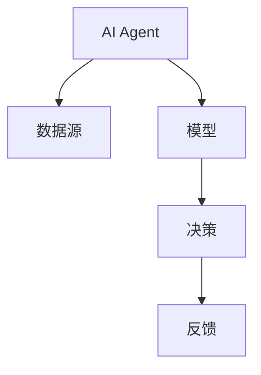
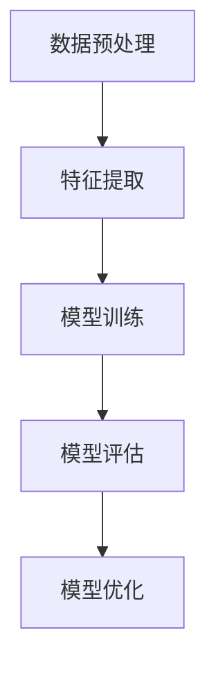

                 


# 《企业AI治理框架：确保AI Agent的可控与合规》

> **关键词**：企业AI治理、AI Agent、可控性、合规性、治理框架、数据隐私、算法监管

> **摘要**：随着人工智能技术的迅速发展，企业对AI Agent的依赖日益增加。然而，AI系统的复杂性和不确定性带来了诸多治理挑战。本文系统阐述了企业AI治理框架的核心要素，详细探讨了AI Agent的可控性与合规性，通过监督学习算法的原理与实现，结合系统架构设计和项目实战，为企业构建AI治理框架提供了实践指导。文章最后总结了AI治理的最佳实践，为企业的AI可持续发展提供了参考。

---

## 第一部分：企业AI治理框架概述

### 第1章：AI治理的背景与问题背景

#### 1.1 问题背景

- **1.1.1 AI技术的快速发展与企业需求**  
  随着深度学习、自然语言处理等技术的突破，AI Agent在企业中的应用越来越广泛。企业希望通过AI Agent提升效率、优化决策，但AI系统的复杂性和不确定性也带来了新的挑战。

- **1.1.2 AI Agent在企业中的广泛应用**  
  AI Agent被用于客户服务、供应链管理、风险管理等领域。然而，这些系统的自主性和复杂性使得企业难以完全掌控其行为。

- **1.1.3 当前AI治理的主要挑战**  
  AI治理涉及数据隐私、算法透明性、决策可解释性等问题。企业在实施AI系统时，如何确保其可控与合规是一个关键挑战。

#### 1.2 问题描述

- **1.2.1 AI Agent失控的风险**  
  AI Agent可能因为训练数据偏差或算法漏洞导致决策错误，甚至引发法律风险。

- **1.2.2 数据隐私与合规性问题**  
  AI系统需要处理大量敏感数据，如何确保数据的隐私和合规性是企业面临的重要问题。

- **1.2.3 AI决策的透明性与可解释性**  
  用户和监管机构需要了解AI决策的依据，这对企业提出了更高的要求。

#### 1.3 问题解决

- **1.3.1 AI治理的目标与原则**  
  AI治理的目标是确保AI系统的可控性、合规性和透明性。治理原则包括数据安全、算法透明、决策可解释、责任可追溯。

- **1.3.2 AI Agent可控性与合规性的实现路径**  
  通过制定治理框架、建立监控机制、实施数据隐私保护等手段，确保AI系统的可控与合规。

- **1.3.3 AI治理框架的核心要素**  
  数据治理、模型治理、决策治理和反馈治理是AI治理框架的核心要素。

#### 1.4 概念结构与核心要素

- **1.4.1 AI治理框架的定义**  
  AI治理框架是一套用于规范AI系统设计、开发、部署和运营的规则和机制。

- **1.4.2 核心要素**  
  - **数据**：数据的采集、存储、处理和共享需符合隐私法规。
  - **模型**：模型的训练、评估和部署需确保透明性和可解释性。
  - **决策**：决策过程需可追溯，确保符合企业政策和法律法规。
  - **反馈**：通过实时监控和反馈机制优化AI系统。

- **1.4.3 AI治理框架的边界与外延**  
  AI治理框架不仅关注技术层面，还涉及组织架构、政策法规和文化建设。

---

## 第二部分：AI治理的核心概念与联系

### 第2章：AI治理的核心概念

#### 2.1 AI Agent的核心属性

- **2.1.1 自主性**  
  AI Agent能够独立感知环境并做出决策，但需在治理框架下运行。

- **2.1.2 可解释性**  
  AI Agent的决策需能够被人类理解，确保透明性和可追溯性。

- **2.1.3 可控性**  
  通过治理框架确保AI Agent的行为符合企业目标和政策。

#### 2.2 AI治理框架的属性特征对比

| **属性**       | **AI治理框架A**                 | **AI治理框架B**                 |
|----------------|---------------------------------|---------------------------------|
| **目标**       | 数据隐私与模型透明性           | 决策可解释性与责任追溯         |
| **主体**       | 数据科学家与IT团队             | 法律合规部门与业务部门         |
| **手段**       | 数据加密与匿名化               | 模型可解释性工具与监控系统     |

#### 2.3 ER实体关系图



---

## 第三部分：AI治理的算法原理

### 第3章：监督学习算法原理

#### 3.1 监督学习流程



#### 3.2 算法实现

- **数据预处理**  
  ```python
  import pandas as pd
  data = pd.read_csv('data.csv')
  data.dropna(inplace=True)
  data['label'] = data['label'].map(lambda x: 0 if x == 'negative' else 1)
  ```

- **模型训练**  
  ```python
  from sklearn.tree import DecisionTreeClassifier
  model = DecisionTreeClassifier()
  model.fit(X_train, y_train)
  ```

- **模型评估**  
  ```python
  from sklearn.metrics import accuracy_score
  y_pred = model.predict(X_test)
  print(f"Accuracy: {accuracy_score(y_test, y_pred)}")
  ```

#### 3.3 数学模型与公式

- **损失函数**  
  $$ L = \frac{1}{n} \sum_{i=1}^{n} (y_i - \hat{y}_i)^2 $$

- **优化器**  
  $$ \theta_{new} = \theta - \eta \frac{\partial L}{\partial \theta} $$

---

## 第四部分：系统分析与架构设计

### 第4章：系统分析与架构设计

#### 4.1 系统功能设计

- **领域模型**  
  ```mermaid
  classDiagram
  class AI_Governance_Framework {
    - Data_Governance
    - Model_Management
    - Decision_Control
    - Feedback_Mechanism
  }
  ```

- **系统架构设计**  
  ```mermaid
  graph TD
  A[Data_Source] --> B[Data_Processing]
  B --> C[Model_Training]
  C --> D[Decision_Making]
  D --> E[Feedback]
  ```

- **系统接口设计**  
  - 数据接口：数据采集、处理、存储。
  - 模型接口：模型训练、评估、部署。
  - 决策接口：决策生成、反馈处理。

- **系统交互设计**  
  ```mermaid
  sequenceDiagram
  participant User
  participant AI-Agent
  participant Governance_Framework
  User -> AI-Agent: 请求处理
  AI-Agent -> Governance_Framework: 数据验证
  Governance_Framework -> AI-Agent: 数据反馈
  AI-Agent -> User: 返回结果
  ```

---

## 第五部分：项目实战

### 第5章：项目实战

#### 5.1 环境安装

- **工具安装**  
  ```bash
  pip install pandas scikit-learn mermaid4jupyter
  ```

#### 5.2 系统核心实现源代码

- **数据预处理**  
  ```python
  import pandas as pd
  data = pd.read_csv('data.csv')
  data = data.dropna()
  ```

- **模型训练**  
  ```python
  from sklearn.tree import DecisionTreeClassifier
  model = DecisionTreeClassifier()
  model.fit(X_train, y_train)
  ```

#### 5.3 代码应用解读与分析

- **代码解读**  
  数据预处理阶段，我们去除缺失值，并对标签进行二值化处理。模型训练阶段使用决策树算法，确保模型的可解释性。

#### 5.4 实际案例分析

- **案例分析**  
  以客户服务中的AI Agent为例，通过实时监控和反馈机制优化模型，确保决策的透明性和合规性。

#### 5.5 项目小结

- **小结**  
  通过实际案例分析，验证了AI治理框架的有效性，确保了AI Agent的可控与合规。

---

## 第六部分：最佳实践与总结

### 第6章：最佳实践

#### 6.1 小结

- AI治理框架是企业AI应用的基础，确保AI Agent的可控与合规是企业成功的关键。

#### 6.2 注意事项

- 数据隐私保护是AI治理的核心，需严格遵守相关法规。
- 模型的可解释性是决策透明性的关键，需在设计阶段就予以考虑。
- 反馈机制是优化AI系统的重要手段，需实时监控并及时调整。

#### 6.3 拓展阅读

- 推荐阅读《机器学习实战》和《数据隐私与合规》等书籍，深入理解AI治理的理论与实践。

---

通过以上结构，我们全面探讨了企业AI治理框架的设计与实现，为企业构建可控、合规的AI系统提供了实践指导。

