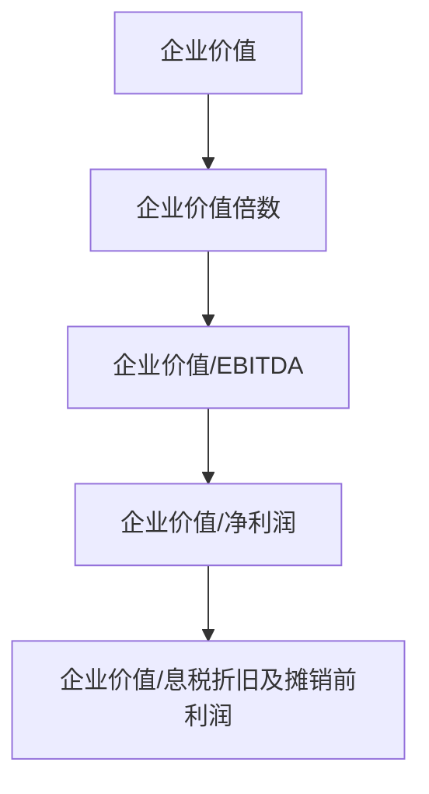
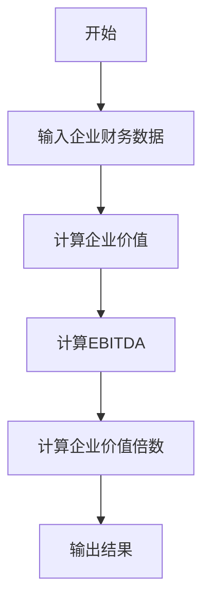
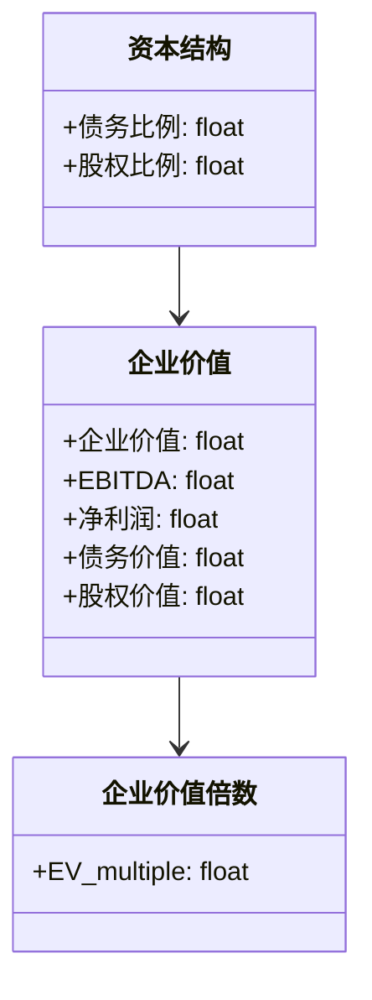
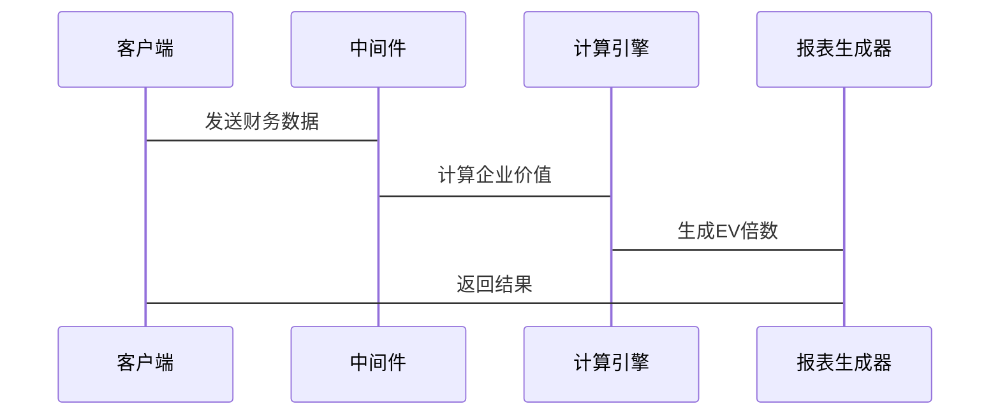

                 


# 企业价值倍数：全面考虑公司资本结构的估值

## 关键词：企业价值倍数, 资本结构, 企业估值, EBITDA, 净利润

## 摘要：本文深入探讨了企业价值倍数的评估方法，重点分析了资本结构对企业价值的影响。通过系统化的分析，从理论基础到实际应用，详细讲解了如何计算企业价值倍数，并结合资本结构优化策略，提供了提升企业价值的实用建议。

---

# 第一部分: 企业价值倍数的背景与基础

## 第1章: 企业价值倍数概述

### 1.1 企业价值的基本概念
#### 1.1.1 企业价值的定义与内涵
企业价值（Enterprise Value, EV）是公司整体价值的评估指标，包括股权价值、债权价值以及其他权益价值。EV反映了公司全部资产的市场价值，是衡量公司价值的核心指标。

#### 1.1.2 企业价值与股东价值的关系
企业价值与股东价值密切相关，但不完全相同。股东价值仅考虑股权部分，而企业价值包括了所有权益。EV = 股东价值 + 债务价值 + 其他负债价值。

#### 1.1.3 企业价值评估的重要性
企业价值评估是投资决策的重要依据，帮助投资者判断公司是否被低估或高估。准确评估企业价值有助于制定合理的收购、融资和资本分配策略。

### 1.2 企业价值倍数的定义与计算
#### 1.2.1 企业价值倍数的定义
企业价值倍数（EV Multiple）是企业价值与某个盈利指标（如EBITDA、净利润）的比率。常用公式为：EV Multiple = EV / EBITDA 或 EV / 净利润。

#### 1.2.2 企业价值倍数的计算公式
- EV Multiple = 企业价值 / EBITDA
- EV = 股东价值 + 债务价值 + 其他负债价值

#### 1.2.3 企业价值倍数的行业基准
不同行业的企业价值倍数差异较大，因此评估时应参考同行业公司的平均水平。

### 1.3 企业价值倍数的理论基础
#### 1.3.1 财务学基础
企业价值评估基于财务报表中的关键指标，如EBITDA、净利润等。这些指标反映了公司的盈利能力和现金流情况。

#### 1.3.2 资本资产定价模型（CAPM）
CAPM用于确定公司的资本成本，影响企业价值的计算。资本成本越低，企业价值越高。

#### 1.3.3 经济学基础
宏观经济环境、行业竞争状况等因素也会影响企业价值。例如，经济衰退可能导致企业价值下降。

---

## 第2章: 企业价值倍数的核心概念与联系

### 2.1 核心概念原理
#### 2.1.1 企业价值倍数的公式推导
企业价值倍数通过将企业价值与盈利指标结合，反映了公司估值的合理性。公式推导如下：
$$ EV = EV \times (EBITDA / EV \times EV) $$

#### 2.1.2 核心要素与属性特征对比表格
| 要素       | 特征         |
|------------|--------------|
| 企业价值   | 总体价值      |
| EBITDA     | 税息折旧前利润 |
| 净利润     | 税后利润      |
| 资本结构   | 债务与股权比例 |

#### 2.1.3 ER实体关系图架构的 Mermaid 流程图


### 2.2 企业价值倍数的 Mermaid 流程图


### 2.3 算法原理的 Python 源代码
```python
def calculate_ev_multiple(ev, ebitda):
    return ev / ebitda

# 示例数据
ev = 1000000000
ebitda = 100000000
multiple = calculate_ev_multiple(ev, ebitda)
print(f"企业价值倍数为: {multiple}")
```

---

## 第3章: 企业价值倍数的算法原理

### 3.1 算法原理的 Mermaid 流程图


### 3.2 算法原理的 Python 源代码
```python
def calculate_ev_multiple(ev, ebitda):
    return ev / ebitda

# 示例数据
ev = 1000000000
ebitda = 100000000
multiple = calculate_ev_multiple(ev, ebitda)
print(f"企业价值倍数为: {multiple}")
```

---

## 第4章: 企业价值倍数的数学模型与公式

### 4.1 数学模型
$$企业价值倍数 = \frac{企业价值}{EBITDA}$$

### 4.2 公式推导
$$企业价值 = 企业价值倍数 \times EBITDA$$

### 4.3 实际案例分析
假设某公司EBITDA为$100 million，企业价值倍数为15，则企业价值为$1.5 billion。

---

## 第5章: 企业价值倍数的系统分析与架构设计方案

### 5.1 问题场景介绍
#### 5.1.1 企业价值评估的常见问题
- 数据准确性
- 资本结构影响
- 行业基准差异

#### 5.1.2 资本结构对企业价值的影响
高杠杆公司可能面临更高的利息支出，影响盈利能力和现金流，从而影响EV。

### 5.2 系统功能设计（领域模型 Mermaid 类图）


### 5.3 系统架构设计 Mermaid 架构图


### 5.4 系统接口设计
- 输入接口：财务数据输入
- 计算接口：EV、EBITDA、净利润计算
- 输出接口：EV倍数结果

### 5.5 系统交互 Mermaid 序列图


---

## 第6章: 项目实战

### 6.1 环境安装
- 数据库：MySQL
- 开发工具：Python、Jupyter Notebook
- 库：pandas、numpy

### 6.2 系统核心实现源代码
```python
import pandas as pd

def calculate_ev(ev, ebitda):
    return ev / ebitda

# 示例数据
data = {'公司': ['A', 'B', 'C'],
        'EV': [1000, 1500, 2000],
        'EBITDA': [100, 150, 200]}
df = pd.DataFrame(data)
df['EV倍数'] = df.apply(lambda x: calculate_ev(x['EV'], x['EBITDA']), axis=1)
print(df)
```

### 6.3 代码应用解读与分析
通过代码计算企业价值倍数，分析不同公司的估值情况，帮助投资者做出决策。

### 6.4 实际案例分析
以某行业为例，分析不同资本结构下的企业价值倍数，评估哪种结构更优。

### 6.5 项目小结
通过实战项目，验证了理论模型的可行性，并展示了如何将理论应用于实际。

---

## 第7章: 最佳实践 tips、小结、注意事项、拓展阅读

### 7.1 最佳实践 tips
- 考虑行业基准和宏观经济因素
- 结合资本结构优化策略
- 定期更新数据和模型

### 7.2 小结
企业价值倍数是评估公司价值的重要工具，资本结构优化是提升企业价值的关键。

### 7.3 注意事项
- 数据质量影响结果
- 资本结构复杂性
- 宏观经济波动影响

### 7.4 拓展阅读
建议阅读《企业价值评估》和《资本结构优化》相关书籍，深入理解相关理论和方法。

---

# 结语

企业价值倍数的评估需要综合考虑公司财务状况、资本结构和行业特点。通过系统化的分析和优化，可以有效提升企业价值，为投资者和管理层提供科学决策依据。希望本文能为您提供有价值的见解和方法。

