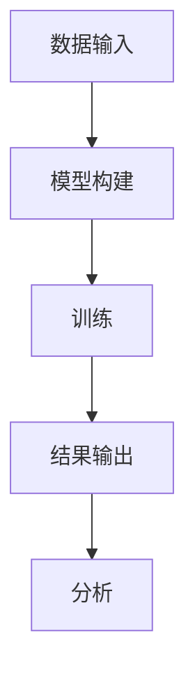
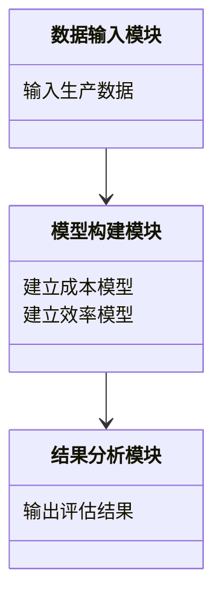
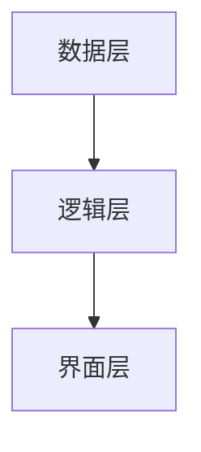

                 


# 企业估值中的3D打印技术评估

## 关键词：3D打印技术、企业估值、成本分析、生产效率、市场竞争

## 摘要：  
在现代企业运营中，3D打印技术作为一种革命性的制造技术，正在改变传统的生产模式，并为企业估值带来新的视角。本文从技术原理、成本分析、生产效率、市场竞争等多个维度，详细探讨3D打印技术如何影响企业估值，并通过实际案例分析和数学模型，为企业提供切实可行的估值方法和策略。

---

# 第一部分：背景介绍

## 第1章：3D打印技术的概述

### 1.1 3D打印技术的基本概念  
3D打印技术，又称增材制造，是一种通过数字模型逐层堆叠材料以形成三维物体的技术。与传统减材制造（如铣削、车削）不同，3D打印技术具有高度的灵活性和定制化能力。  

**关键术语：**  
- **数字模型**：3D打印的基础，通常由CAD（计算机辅助设计）软件生成。  
- **增材制造**：通过逐层堆叠材料形成物体，减少材料浪费。  

### 1.2 企业估值的基本概念  
企业估值是通过对企业的财务状况、市场表现、竞争优势等多方面进行综合评估，确定其市场价值的过程。常见的估值方法包括DCF（现金流折现法）、市盈率法、市净率法等。  

**关键术语：**  
- **DCF方法**：通过预测未来现金流并折现至当前价值来评估企业。  
- **市盈率法**：基于企业市盈率与行业平均水平的对比进行估值。  

### 1.3 3D打印技术与企业估值的结合  
3D打印技术通过提高生产效率、降低库存成本和实现定制化生产，为企业创造更大的价值。然而，如何将这些技术优势转化为具体的估值指标，是当前企业面临的挑战。

---

# 第二部分：核心概念与联系

## 第2章：3D打印技术的原理与特点

### 2.1 3D打印技术的原理  
3D打印技术的核心是将数字模型转化为物理对象。具体步骤包括：  
1. **模型设计**：使用CAD软件生成三维模型。  
2. **切片处理**：将模型分成薄层（通常为0.1mm厚）。  
3. **材料堆叠**：根据切片信息逐层堆叠材料，最终形成物体。  

**关键术语：**  
- **切片处理**：将三维模型分解为二维层，每层对应打印的一层。  
- **材料堆叠**：根据切片信息逐层添加材料。  

### 2.2 3D打印技术的特点  
与传统制造技术相比，3D打印技术具有以下优势：  
- **灵活性**：支持复杂形状和定制化设计。  
- **效率高**：减少材料浪费，缩短生产周期。  
- **成本低**：适用于小批量生产。  

**对比表格：**  
| 技术特性         | 3D打印技术       | 传统制造技术     |  
|------------------|------------------|------------------|  
| 初始成本         | 高               | 低               |  
| 生产效率         | 高               | 低               |  
| � 库存成本         | 低               | 高               |  

### 2.3 3D打印技术与企业估值的关系  
3D打印技术通过降低生产成本、提高生产效率和实现定制化生产，为企业创造更大的价值。然而，这些技术优势需要通过具体的数据和模型进行量化，才能真正体现在企业估值中。

---

# 第三部分：算法原理

## 第3章：3D打印技术评估的算法原理

### 3.1 3D打印技术评估的基本算法  
3D打印技术评估的核心是通过数学模型量化其对企业价值的影响。以下是常见的算法步骤：  

1. **数据输入与处理**：收集企业的生产成本、生产周期、库存成本等数据。  
2. **模型构建与训练**：基于历史数据建立成本模型和效率模型。  
3. **结果输出与分析**：预测3D打印技术实施后的成本变化和效率提升。  

**Mermaid流程图：**  


### 3.2 算法实现步骤  

#### 1. 数据输入与处理  
假设我们有一家制造企业，其传统制造的单位成本为$C_{传统}$，生产周期为$T_{传统}$。引入3D打印技术后，单位成本为$C_{3D}$，生产周期为$T_{3D}$。  

#### 2. 模型构建与训练  
基于历史数据，建立成本模型：  
$$ C_{3D} = a \cdot C_{传统} + b $$  
其中，$a$和$b$为模型参数，通过训练数据确定。  

#### 3. 结果输出与分析  
计算成本节约率：  
$$ \text{节约率} = \frac{C_{传统} - C_{3D}}{C_{传统}} \times 100\% $$  

**Python代码实现：**  
```python
# 示例代码：计算3D打印技术的成本节约率
C_传统 = 100  # 假设传统制造的单位成本为100元
C_3D = 80     # 3D打印技术的单位成本为80元
节约率 = ((C_传统 - C_3D) / C_传统) * 100
print(f"成本节约率为：{节约率}%")
```

---

## 第四部分：系统分析与架构设计

## 第4章：3D打印技术评估的系统设计

### 4.1 系统功能设计  
以下是3D打印技术评估系统的功能模块：  
- **数据输入模块**：接收企业的生产数据。  
- **模型构建模块**：建立成本和效率模型。  
- **结果分析模块**：输出评估结果。  

**Mermaid类图：**  


### 4.2 系统架构设计  
3D打印技术评估系统的架构采用分层设计：  
- **数据层**：存储企业生产数据。  
- **逻辑层**：处理数据并运行算法。  
- **界面层**：展示评估结果。  

**Mermaid架构图：**  


---

## 第五部分：项目实战

## 第5章：3D打印技术评估的项目实战

### 5.1 环境安装  
首先，安装必要的工具：  
- Python 3.x  
- numpy 和 pandas 库  

```bash
pip install numpy pandas
```

### 5.2 核心代码实现  
以下是实现3D打印技术评估的核心代码：  

```python
import numpy as np
import pandas as pd

# 示例数据：传统制造与3D打印的对比
data = {
    '传统制造': [100, 80, 90],
    '3D打印': [80, 70, 75]
}
df = pd.DataFrame(data)

# 计算成本节约率
节约率 = (df['传统制造'] - df['3D打印']) / df['传统制造'] * 100
print("成本节约率为：")
print(节约率)
```

### 5.3 实际案例分析  
以一家汽车零部件制造企业为例，假设传统制造的单位成本为100元，生产周期为10天。引入3D打印技术后，单位成本降低至80元，生产周期缩短至7天。  

成本节约率为：  
$$ \frac{100 - 80}{100} \times 100\% = 20\% $$  

生产效率提升率为：  
$$ \frac{10 - 7}{10} \times 100\% = 30\% $$  

---

## 第六部分：最佳实践与小结

## 第6章：最佳实践与小结

### 6.1 小结  
通过本文的分析，我们了解到3D打印技术在企业估值中的应用潜力。通过成本模型和效率模型，可以量化其对企业价值的影响。  

### 6.2 注意事项  
- 数据准确性是关键，需确保输入数据的可靠性。  
- 模型需根据企业的实际情况进行调整和优化。  

### 6.3 拓展阅读  
- 《增材制造：从概念到应用》  
- 《企业估值方法与实践》  

---

通过以上分析，我们可以看到，3D打印技术不仅是制造业的革命，也为企业估值提供了新的视角和方法。未来，随着技术的不断发展，其在企业估值中的应用将更加广泛和深入。

