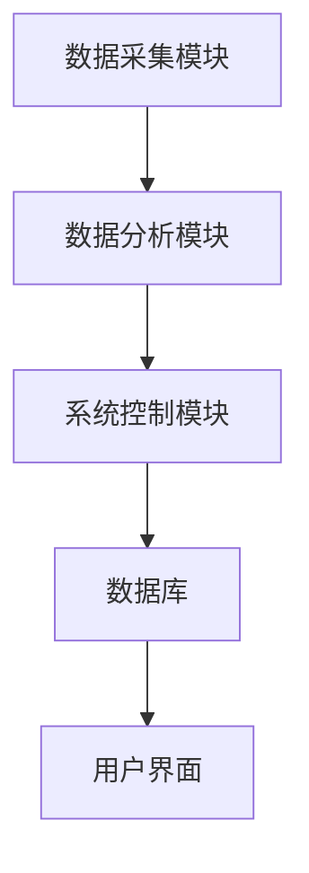

                 


# 企业估值中的5G应用场景评估

> 关键词：企业估值，5G应用场景，智能制造，智慧城市，智慧医疗，算法评估，系统架构

> 摘要：本文深入探讨了5G技术在企业估值中的应用场景，分析了智能制造、智慧城市和智慧医疗等领域的具体应用，通过数学建模和系统架构设计，评估了5G对企业价值的影响，并通过实际案例展示了如何在企业估值中合理评估5G应用场景的价值。

---

## 第一章: 5G技术基础与企业估值概述

### 1.1 5G技术的核心特点

#### 1.1.1 5G与4G的区别
5G相较于4G，主要在以下几个方面实现了突破：
- **数据传输速度**：5G的理论下载速度可达10Gbps，是4G的100倍。
- **延迟**：5G的延迟可低至1ms，而4G的延迟约为50ms。
- **连接密度**：5G每平方公里可支持100万个连接，是4G的10倍。

#### 1.1.2 5G的主要技术优势
- **增强移动宽带（eMBB）**：支持超高清视频、虚拟现实等高带宽应用。
- **大规模机器类通信（mMTC）**：适用于物联网设备的大规模连接。
- **高可靠低时延通信（uRLLC）**：适用于自动驾驶、工业自动化等对实时性要求极高的场景。

#### 1.1.3 5G的三大应用场景
| 应用场景 | 描述 |
|----------|------|
| eMBB     | 支持高带宽、大规模数据传输，适用于视频 streaming 和虚拟现实。 |
| mMTC     | 支持大规模物联网设备连接，适用于智慧城市和智能家居。 |
| uRLLC    | 支持超低延迟，适用于自动驾驶和工业自动化。 |

### 1.2 企业估值的基本概念

#### 1.2.1 企业估值的定义与方法
企业估值是指对企业整体价值的评估，常用的方法包括：
- **相对估值法**：通过比较可比公司（如市盈率、市净率）进行估值。
- **DCF模型**：通过现金流折现法评估企业未来现金流的现值。
- **资产基础法**：基于企业资产负债表进行估值。

#### 1.2.2 企业估值的关键影响因素
- **财务状况**：收入、利润、资产负债情况。
- **行业地位**：市场占有率、竞争对手情况。
- **技术创新**：技术领先性对未来的盈利能力影响。
- **政策环境**：行业政策、税收优惠等。

### 1.3 5G与企业估值的关系

#### 1.3.1 5G对企业价值的影响
5G技术的应用将显著提升企业的：
- **竞争力**：通过更快的数据传输和更低的延迟，提升产品和服务的质量。
- **运营效率**：优化供应链管理、降低运营成本。
- **收入来源**：创造新的商业模式，如物联网服务。

#### 1.3.2 5G应用场景对企业估值的外延
通过5G技术的应用，企业可以：
- **扩大市场**：进入新的市场领域，增加客户群体。
- **提升效率**：优化内部流程，降低运营成本。
- **增加收入**：通过新技术和新服务增加收入来源。

---

## 第二章: 5G应用场景分析

### 2.1 智能制造中的5G应用

#### 2.1.1 智能制造的基本概念
智能制造是通过物联网、大数据、人工智能等技术实现生产过程的智能化。

#### 2.1.2 5G在智能制造中的应用
- **工业物联网（IIoT）**：通过5G实现生产设备的实时监控和数据传输。
- **智能工厂**：利用5G支持生产线的实时数据传输和自动化控制。
- **工业自动化**：5G的低延迟特性适用于机器人和自动化设备的远程控制。

#### 2.1.3 智能制造的应用场景
| 场景 | 描述 |
|------|------|
| 设备监控 | 通过5G实时监控生产设备的状态，预防故障。 |
| 数据采集 | 采集生产数据，进行数据分析和优化。 |
| 机器人协作 | 多台机器人通过5G协同工作，提高生产效率。 |

### 2.2 智慧城市中的5G应用

#### 2.2.1 智慧城市的定义与特点
智慧城市是利用信息技术优化城市资源管理，提升居民生活质量。

#### 2.2.2 5G在智慧城市中的应用
- **智慧交通**：通过5G实现交通信号灯的智能调节和自动驾驶车辆的通信。
- **智慧安防**：利用5G支持高清监控视频的实时传输和人脸识别。
- **智慧能源**：通过5G实现智能电网的远程监控和管理。

#### 2.2.3 智慧城市的应用场景
| 场景 | 描述 |
|------|------|
| 智慧交通 | 5G支持自动驾驶和交通信号灯的智能控制。 |
| 智慧安防 | 5G支持高清监控和人脸识别系统。 |
| 智慧能源 | 5G支持智能电网和分布式能源的管理。 |

### 2.3 智慧医疗中的5G应用

#### 2.3.1 智慧医疗的基本概念
智慧医疗是通过信息化技术优化医疗服务和管理。

#### 2.3.2 5G在智慧医疗中的应用
- **远程医疗**：通过5G实现高清视频通话和远程诊断。
- **医疗物联网**：通过5G连接医疗设备，实现数据的实时传输和共享。
- **医疗数据传输**：5G支持大量医疗数据的快速传输和分析。

#### 2.3.3 智慧医疗的应用场景
| 场景 | 描述 |
|------|------|
| 远程诊断 | 医生通过5G网络为远端患者进行诊断。 |
| 医疗物联网 | 医疗设备通过5G实时传输患者数据。 |
| 医疗数据共享 | 医疗机构之间通过5G共享患者数据。 |

---

## 第三章: 5G应用场景对企业估值的影响

### 3.1 5G提升企业竞争力的途径

#### 3.1.1 通过技术创新提升市场地位
5G技术的应用使企业能够提供更优质的产品和服务，从而在市场竞争中占据优势。

#### 3.1.2 通过效率提升降低运营成本
5G的应用优化了企业的运营流程，降低了成本，提高了利润率。

#### 3.1.3 通过收入增长增加企业价值
5G的应用为企业创造了新的收入来源，如物联网服务和数据分析服务。

### 3.2 5G应用场景对企业运营效率的优化

#### 3.2.1 通过自动化减少人工成本
5G支持的自动化生产线减少了人工成本，提高了生产效率。

#### 3.2.2 通过实时数据提高决策效率
5G支持的数据实时传输，使得企业能够更快地做出决策。

#### 3.2.3 通过智能化管理降低资源浪费
5G支持的智能管理系统优化了资源分配，减少了浪费。

### 3.3 5G应用场景对企业收入增长的推动

#### 3.3.1 通过新服务增加收入
5G的应用为企业提供了新的服务模式，如远程医疗和智能工厂。

#### 3.3.2 通过市场扩展增加收入
5G的应用帮助企业进入新的市场，扩大客户群体，增加收入。

#### 3.3.3 通过数据 monetization 提高收入
5G支持的大数据分析帮助企业 monetization 数据，创造新的收入来源。

---

## 第四章: 5G应用场景评估方法与模型

### 4.1 5G应用场景评估的基本框架

#### 4.1.1 评估框架的核心要素
- **应用场景的成熟度**：技术成熟度和市场接受度。
- **应用的经济性**：投资回报周期和成本效益。
- **应用的可持续性**：长期的技术支持和维护。

#### 4.1.2 评估框架的步骤
1. 确定应用场景的目标和需求。
2. 评估技术可行性。
3. 评估经济可行性。
4. 评估社会影响。
5. 制定实施计划。

### 4.2 5G应用场景评估的数学模型

#### 4.2.1 5G应用场景的收益模型
$$ \text{收益} = \text{收入增长} - \text{成本增加} $$

#### 4.2.2 5G应用场景的风险模型
$$ \text{风险} = \text{技术风险} + \text{市场风险} + \text{运营风险} $$

#### 4.2.3 5G应用场景的回报模型
$$ \text{回报} = \frac{\text{收益} - \text{风险}}{\text{投资成本}} $$

---

## 第五章: 系统设计与实现

### 5.1 系统设计背景

#### 5.1.1 项目背景介绍
本项目旨在通过5G技术提升企业的估值，优化企业的运营效率和市场竞争力。

### 5.2 系统功能设计

#### 5.2.1 系统功能模块
- **数据采集模块**：通过5G采集生产数据。
- **数据分析模块**：对数据进行分析和优化。
- **系统控制模块**：根据分析结果进行系统控制。

#### 5.2.2 系统功能流程
1. 数据采集模块采集生产数据。
2. 数据分析模块对数据进行分析。
3. 系统控制模块根据分析结果进行控制。

### 5.3 系统架构设计

#### 5.3.1 系统架构图


### 5.4 系统接口设计

#### 5.4.1 系统接口描述
- 数据采集模块与数据分析模块之间的接口。
- 数据分析模块与系统控制模块之间的接口。
- 系统控制模块与数据库之间的接口。

### 5.5 系统交互设计

#### 5.5.1 系统交互流程
1. 用户通过用户界面输入指令。
2. 系统控制模块根据指令进行操作。
3. 数据采集模块采集数据并传输给数据分析模块。
4. 数据分析模块分析数据并反馈结果。

---

## 第六章: 项目实战与案例分析

### 6.1 项目背景介绍

#### 6.1.1 项目目标
本项目旨在通过5G技术提升企业的估值，优化企业的运营效率和市场竞争力。

### 6.2 项目实施过程

#### 6.2.1 环境安装
- 安装5G网络设备。
- 配置数据采集模块和数据分析模块。

#### 6.2.2 核心代码实现
```python
import requests

def collect_data():
    response = requests.get("http://5g-server:8080/data")
    return response.json()

def analyze_data(data):
    # 数据分析逻辑
    return analysis_result

def control_system(result):
    # 系统控制逻辑
    return status
```

### 6.3 项目小结

#### 6.3.1 项目成果
通过5G技术的应用，企业实现了生产过程的智能化，提高了运营效率和市场竞争力。

#### 6.3.2 经验总结
5G技术的应用需要企业进行全面的规划和实施，从技术选型到系统设计都需要精心策划。

---

## 第七章: 总结与展望

### 7.1 总结

#### 7.1.1 核心观点回顾
5G技术的应用对企业估值具有深远的影响，通过提升企业的竞争力、优化运营效率和创造新的收入来源，显著提升了企业的价值。

### 7.2 展望

#### 7.2.1 未来发展趋势
随着5G技术的不断发展和应用场景的拓展，其对企业估值的影响将更加深远。

#### 7.2.2 对企业决策者的建议
企业应积极拥抱5G技术，合理规划5G应用场景，以提升企业的核心竞争力和市场地位。

---

## 第八章: 最佳实践与注意事项

### 8.1 最佳实践

#### 8.1.1 技术选型
企业在选择5G技术时，应根据自身需求和实际情况进行选型。

#### 8.1.2 项目实施
项目实施过程中，应注重技术的可行性和经济性。

#### 8.1.3 持续优化
企业应持续优化5G应用场景，以应对技术发展的挑战。

### 8.2 注意事项

#### 8.2.1 技术风险
企业在应用5G技术时，应充分考虑技术风险。

#### 8.2.2 经济风险
企业应评估5G应用场景的经济可行性，避免过度投资。

#### 8.2.3 运营风险
企业在实施5G应用场景时，应注重运营风险的管理。

---

## 第九章: 拓展阅读

### 9.1 相关书籍

#### 9.1.1 推荐书籍
- 《5G技术与应用》
- 《企业估值实战》
- 《工业互联网白皮书》

### 9.2 相关技术文档

#### 9.2.1 推荐文档
- 5G技术白皮书
- 工业互联网技术白皮书
- 智慧城市发展规划

---

## 第十章: 参考文献

### 10.1 参考文献列表
1. 5G技术白皮书
2. 工业互联网技术白皮书
3. 智慧城市发展规划
4. 企业估值实战书籍
5. 相关学术论文

---

通过以上内容，我们系统地探讨了5G技术在企业估值中的应用场景，分析了智能制造、智慧城市和智慧医疗等领域的具体应用，通过数学建模和系统架构设计，评估了5G对企业价值的影响，并通过实际案例展示了如何在企业估值中合理评估5G应用场景的价值。

