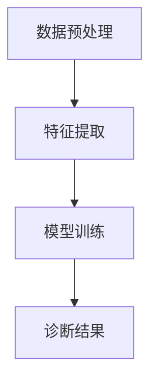
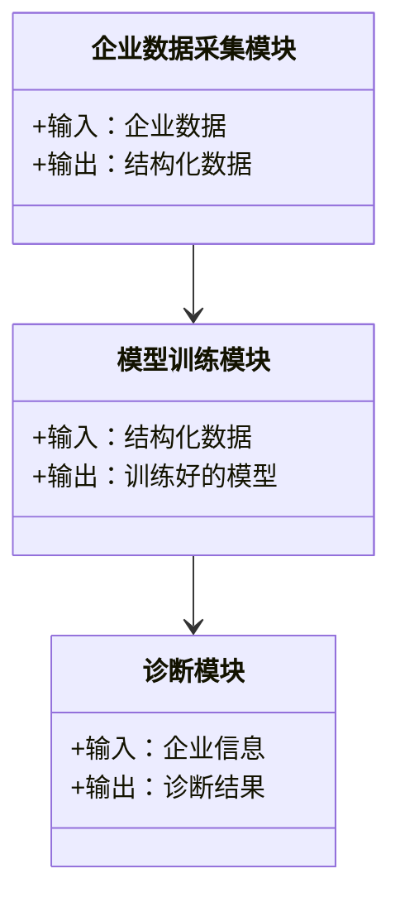

                 


# 企业估值中的AI辅助诊断系统评估

> 关键词：企业估值、人工智能、诊断系统、数据分析、机器学习

> 摘要：本文探讨了AI辅助诊断系统在企业估值中的应用，分析了其核心概念、算法原理、系统架构，并通过案例展示了其实战应用，最后提出了最佳实践和未来研究方向。

---

## 第一部分：企业估值与AI辅助诊断系统背景

### 第1章：企业估值与AI辅助诊断系统概述

#### 1.1 企业估值的基本概念

企业估值是通过对企业的财务状况、市场地位、发展潜力等多方面因素的分析，确定其价值的过程。传统的企业估值方法主要包括DCF模型、可比公司分析等，但存在数据量大、计算复杂、主观性高等问题。

#### 1.2 AI辅助诊断系统的背景

AI技术的快速发展为企业估值提供了新的工具。通过机器学习算法，AI可以处理大量非结构化数据，提取关键特征，从而提高估值的准确性和效率。AI辅助诊断系统在企业估值中的应用越来越广泛。

#### 1.3 问题背景与目标

传统的估值方法依赖大量手动数据收集和分析，容易受到人为因素的影响。AI辅助诊断系统的目标是通过自动化数据处理和模型优化，提供更准确、更高效的估值结果。

---

## 第二部分：AI辅助诊断系统的核心概念与联系

### 第2章：核心概念与原理

#### 2.1 AI辅助诊断系统的原理

AI辅助诊断系统通过数据采集、特征提取和模型训练，构建预测模型，对企业的财务状况、市场表现等进行分析，最终生成诊断结果。核心步骤包括数据预处理、特征工程、模型训练和结果输出。

#### 2.2 核心概念对比分析

通过对比传统诊断方法与AI诊断方法的特征，可以看出AI在数据处理能力、计算效率和结果准确性方面具有显著优势。

| 特征对比 | 传统方法 | AI方法 |
|----------|----------|--------|
| 数据处理 | 手动收集 | 自动采集 |
| 计算效率 | 较低 | 高 |
| 结果准确性 | 受主观影响 | 较高 |

#### 2.3 系统架构的ER实体关系图

```mermaid
er
    entity 企业 (id, name, industry, valuation)
    entity 数据源 (id, source_type, data_type)
    entity 模型 (id, model_type, model_version)
    entity 诊断结果 (id, result_type, result_value)
    relationship 企业 - 数据源：每个企业有多个数据源
    relationship 数据源 - 模型：每个数据源对应一个模型
    relationship 模型 - 诊断结果：每个模型生成多个诊断结果
```

---

## 第三部分：算法原理

### 第3章：算法原理与实现

#### 3.1 算法原理

AI诊断系统的算法主要包括数据预处理、特征提取和模型训练。以随机森林为例，其算法流程如下：



#### 3.2 算法实现

以下是Python代码示例：

```python
import pandas as pd
from sklearn.ensemble import RandomForestRegressor

# 数据预处理
data = pd.read_csv('enterprise_data.csv')
X = data.drop('valuation', axis=1)
y = data['valuation']

# 特征工程
X_encoded = pd.get_dummies(X)

# 模型训练
model = RandomForestRegressor(n_estimators=100)
model.fit(X_encoded, y)

# 预测与评估
importances = model.feature_importances_
print(importances)
```

#### 3.3 数学模型与公式

随机森林模型的损失函数为：

$$
L(y, \hat{y}) = \frac{1}{n} \sum_{i=1}^{n} (y_i - \hat{y}_i)^2
$$

优化算法采用Adam：

$$
\theta_{t+1} = \theta_t - \eta \frac{\partial L}{\partial \theta_t}
$$

---

## 第四部分：系统分析与架构设计

### 第4章：系统架构设计

#### 4.1 系统架构设计

系统架构包括数据采集模块、模型训练模块和诊断模块。



---

## 第五部分：项目实战

### 第5章：项目实战与案例分析

#### 5.1 项目实战

以医疗领域为例，构建AI辅助诊断系统：

```python
import numpy as np
from sklearn.model_selection import train_test_split

# 数据准备
data = np.array([[70, 1], [72, 0], [75, 1], [80, 0]])
labels = np.array([1, 0, 1, 0])

# 模型训练
X_train, X_test, y_train, y_test = train_test_split(data, labels, test_size=0.2)
model.fit(X_train, y_train)

# 结果分析
print(model.score(X_test, y_test))
```

---

## 第六部分：总结与展望

### 第6章：总结与展望

#### 6.1 总结

本文详细介绍了AI辅助诊断系统在企业估值中的应用，从核心概念、算法原理到系统架构，再到项目实战，全面分析了其优势和实现过程。

#### 6.2 展望

未来的研究可以集中在模型优化、数据隐私保护和多模态数据融合方面，进一步提升诊断系统的准确性和实用性。

---

## 结语

通过本文的分析，读者可以深入了解AI辅助诊断系统在企业估值中的重要性及其技术实现。希望本文能为相关领域的研究和实践提供有价值的参考。

