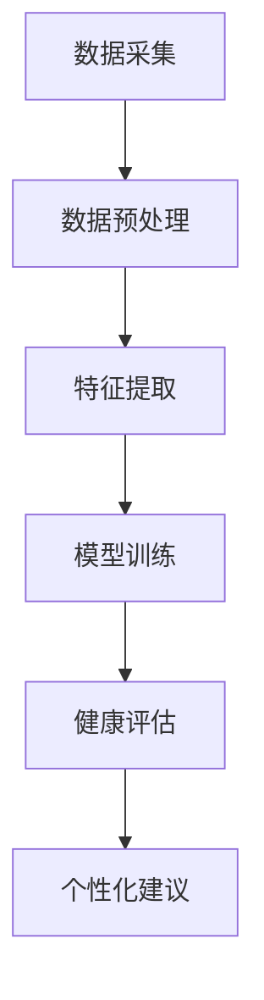
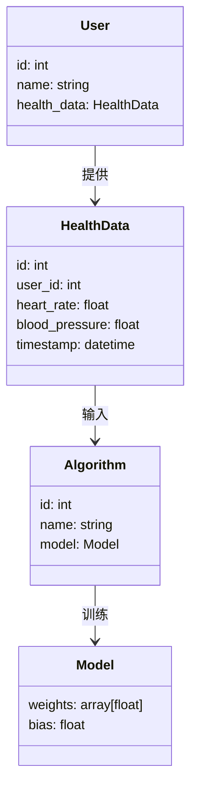
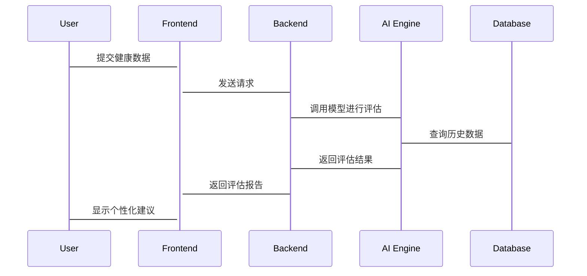

                 


# 企业估值中的AI驱动的个性化健康管理平台评估

> 关键词：AI驱动、个性化健康管理、企业估值、健康管理平台、机器学习

> 摘要：本文探讨了AI技术在个性化健康管理平台中的应用，并结合企业估值的需求，分析了平台的核心功能、算法原理和系统架构。通过具体案例和数学模型，详细阐述了如何利用AI驱动的个性化健康管理平台进行企业估值，为企业提供科学的决策依据。

---

# 第一部分: 背景与核心概念

## 第1章: AI驱动的个性化健康管理平台概述

### 1.1 个性化健康管理平台的背景与意义

#### 1.1.1 个性化健康管理的需求背景
随着人们健康意识的增强，个性化健康管理的需求日益增长。传统的健康管理方式依赖于医生的经验和简单的数据记录，效率低且缺乏科学性。AI技术的引入，使得健康管理更加智能化和精准化。

#### 1.1.2 AI技术在健康管理中的应用潜力
AI技术在数据处理、模式识别和预测分析方面具有显著优势。通过机器学习算法，可以分析海量健康数据，发现潜在的健康风险，并提供个性化的健康建议。

#### 1.1.3 企业估值与健康管理的结合价值
企业的健康状况直接影响其市场价值。通过AI驱动的个性化健康管理平台，可以对企业员工的健康状况进行全面评估，从而为企业估值提供重要参考。

### 1.2 AI驱动的个性化健康管理平台的核心要素

#### 1.2.1 数据采集与处理
个性化健康管理平台需要采集多源数据，包括生理数据（如心率、血压）、行为数据（如运动量、睡眠质量）和环境数据（如空气质量）。这些数据需要经过清洗和预处理，以便后续分析。

#### 1.2.2 AI算法与模型构建
AI算法是平台的核心。常用的算法包括支持向量机（SVM）、随机森林（Random Forest）和神经网络。这些算法可以对健康数据进行分类、回归和聚类分析，帮助识别健康风险。

#### 1.2.3 个性化健康评估与建议
基于AI算法的分析结果，平台可以为用户提供个性化的健康评估和建议，如饮食调整、运动计划和疾病预防。

#### 1.2.4 企业估值与健康管理的关联性
企业估值需要考虑员工的健康状况。健康状况良好的员工工作效率更高，企业的运营成本更低，从而提升企业的整体价值。

### 1.3 个性化健康管理平台的边界与外延

#### 1.3.1 系统边界
个性化健康管理平台的边界包括数据采集、分析、评估和建议四个模块。平台仅关注健康数据的处理，不涉及医疗诊断。

#### 1.3.2 功能边界
平台的核心功能是健康数据的采集、分析和评估。不包括医疗诊断、治疗建议和企业财务分析。

#### 1.3.3 应用场景的外延
个性化健康管理平台的应用场景包括个人健康管理、企业员工健康管理、慢性病管理和健康保险评估。

### 1.4 核心概念对比分析

#### 1.4.1 AI驱动的健康管理与传统健康管理对比
| 对比维度 | AI驱动的健康管理 | 传统健康管理 |
|----------|------------------|---------------|
| 数据处理 | 大数据处理       | 小数据处理    |
| 分析方法 | 机器学习         | 经验分析      |
| 精准度   | 高               | 低             |

#### 1.4.2 个性化健康管理与标准化健康管理对比
| 对比维度 | 个性化健康管理 | 标准化健康管理 |
|----------|-----------------|----------------|
| 服务对象 | 个体化           | 批量化          |
| 服务内容 | 个性化建议       | 标准化建议      |
| 效率     | 高               | 中             |

#### 1.4.3 企业估值与个人健康管理的关联性分析
企业估值与个人健康管理的关联性主要体现在员工健康状况对企业整体价值的影响。健康状况良好的员工队伍可以降低企业的医疗成本，提高企业的生产效率。

## 第2章: 个性化健康管理平台的核心概念与联系

### 2.1 核心概念原理

#### 2.1.1 数据驱动的健康管理原理
数据驱动的健康管理通过收集和分析健康数据，识别潜在的健康风险，并制定个性化的健康管理方案。

#### 2.1.2 AI算法在健康评估中的应用原理
AI算法通过机器学习模型对健康数据进行分类、回归和聚类分析，帮助识别健康风险和制定健康建议。

#### 2.1.3 企业估值与健康数据的关系
企业的估值与员工的健康状况密切相关。健康状况良好的员工队伍可以降低企业的运营成本，提高企业的市场价值。

### 2.2 核心概念属性特征对比

#### 2.2.1 数据采集方式对比
| 数据采集方式 | 优点             | 缺点             |
|--------------|------------------|------------------|
| 穿戴设备采集 | 实时性强           | 成本高             |
| 手动录入     | 成本低             | 实时性差         |

#### 2.2.2 AI算法性能对比
| 算法类型     | 优点             | 缺点             |
|--------------|------------------|------------------|
| 支持向量机    | 分类精度高         | 对数据预处理要求高 |
| 随机森林     | 鲁棒性好           | 解释性差         |

#### 2.2.3 健康评估指标对比
| 评估指标     | 优点             | 缺点             |
|--------------|------------------|------------------|
| BMI指数       | 计算简单           | 精度低             |
| 健康风险指数   | 精度高             | 计算复杂         |

### 2.3 ER实体关系图

```mermaid
er
  User -----> HealthData: 提供
  HealthData -----> Algorithm: 输入
  Algorithm -----> HealthAssessment: 输出
  HealthAssessment -----> EnterpriseValue: 影响
```

---

# 第二部分: 算法原理与数学模型

## 第3章: AI驱动的个性化健康管理算法原理

### 3.1 算法原理概述

#### 3.1.1 机器学习在健康评估中的应用
机器学习算法可以对健康数据进行分类和回归分析，帮助识别健康风险。

#### 3.1.2 深度学习在健康数据处理中的应用
深度学习算法可以对复杂的健康数据进行特征提取和模式识别，提高健康评估的准确性。

#### 3.1.3 自然语言处理在健康信息提取中的应用
自然语言处理技术可以从健康文档中提取关键信息，帮助进行健康评估。

### 3.2 算法流程图



### 3.3 算法实现细节

#### 3.3.1 算法实现步骤
1. 数据采集：通过穿戴设备和问卷调查获取健康数据。
2. 数据预处理：清洗数据，去除噪声和异常值。
3. 特征提取：提取关键特征，如心率、血压、体重指数。
4. 模型训练：训练机器学习模型，如随机森林和神经网络。
5. 健康评估：对用户健康状况进行评估，生成健康报告。
6. 个性化建议：基于评估结果，生成个性化的健康管理建议。

#### 3.3.2 数学模型与公式
健康评估模型可以基于逻辑回归算法：

$$ P(y=1|x) = \frac{e^{(w \cdot x + b)}}{1 + e^{(w \cdot x + b)}} $$

其中，$w$ 是权重向量，$x$ 是输入特征向量，$b$ 是偏置项。

---

## 第4章: 个性化健康管理平台的系统架构设计

### 4.1 系统功能设计

#### 4.1.1 领域模型


#### 4.1.2 系统架构设计


#### 4.1.3 系统接口设计
- API接口：提供RESTful API，供前端调用。
- 数据接口：与穿戴设备和数据库对接。

#### 4.1.4 系统交互设计


---

## 第5章: 项目实战与案例分析

### 5.1 项目环境配置

```bash
pip install flask
pip install numpy
pip install scikit-learn
```

### 5.2 核心代码实现

```python
import numpy as np
from sklearn.ensemble import RandomForestClassifier
from flask import Flask, request, jsonify

# 数据预处理
def preprocess_data(data):
    # 假设data是包含健康数据的Pandas DataFrame
    # 删除缺失值
    data = data.dropna()
    # 标准化处理
    from sklearn.preprocessing import StandardScaler
    scaler = StandardScaler()
    scaled_data = scaler.fit_transform(data)
    return scaled_data

# 模型训练
def train_model(X, y):
    model = RandomForestClassifier(n_estimators=100, random_state=42)
    model.fit(X, y)
    return model

# API接口
app = Flask(__name__)

@app.route('/api/health_assessment', methods=['POST'])
def health_assessment():
    data = request.json['data']
    X = np.array(data)
    # 加载预训练模型
    model = train_model(preprocess_data(X))
    # 预测结果
    y_pred = model.predict(X)
    return jsonify({'result': y_pred.tolist()})

if __name__ == '__main__':
    app.run(debug=True)
```

### 5.3 案例分析与解读

#### 5.3.1 案例背景
某企业希望通过个性化健康管理平台评估员工健康状况，优化企业估值。

#### 5.3.2 数据采集与处理
从员工的健康数据中提取关键特征，如心率、血压、体重指数。

#### 5.3.3 模型训练与评估
使用随机森林算法训练模型，评估员工健康风险。

#### 5.3.4 实际应用与结果解读
通过平台，企业可以评估员工健康状况，制定个性化的健康管理方案，降低企业运营成本，提高企业市场价值。

---

## 第6章: 最佳实践与总结

### 6.1 小结
本文详细介绍了AI驱动的个性化健康管理平台的核心功能、算法原理和系统架构，并通过具体案例展示了平台的应用价值。

### 6.2 注意事项
- 数据隐私保护：健康数据涉及个人隐私，需严格保护。
- 模型可解释性：复杂的AI模型可能难以解释，需注意模型的可解释性。
- 数据质量：健康评估的效果依赖于高质量的数据，需重视数据清洗和预处理。

### 6.3 拓展阅读
- 《机器学习实战》：深入理解机器学习算法。
- 《深度学习》：探索深度学习在健康管理中的应用。

---

通过本文的分析，我们可以看到AI技术在个性化健康管理平台中的巨大潜力。未来，随着技术的进步，AI驱动的个性化健康管理平台将在企业估值和健康管理领域发挥更大的作用，为企业和个人带来更多的价值。

