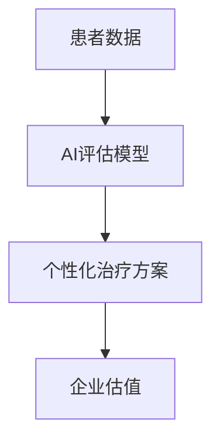
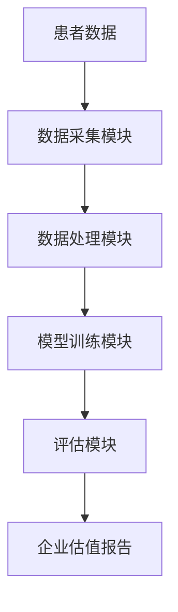
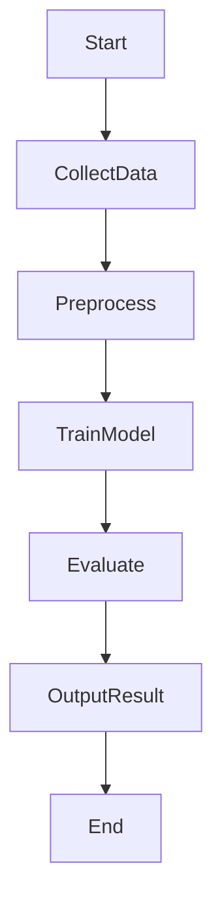

                 


# 《企业估值中的AI驱动的个性化医疗平台评估》

## 关键词：企业估值、AI驱动、个性化医疗、平台评估、机器学习、医疗数据分析

## 摘要：  
本文探讨了AI技术在企业估值中的应用，特别是如何利用AI驱动的个性化医疗平台评估模型来提升医疗行业的精准估值能力。文章从背景、核心概念、算法原理、系统架构设计到项目实战，详细阐述了AI在医疗评估中的应用，并通过实际案例分析展示了如何将AI技术与医疗行业相结合，以实现更高效、更精准的企业估值。

---

# 第1章: 企业估值与个性化医疗平台评估背景

## 1.1 问题背景与描述

### 1.1.1 传统企业估值方法的局限性  
传统的企业估值方法（如DCF模型、PE估值法等）依赖于财务数据和市场假设，难以捕捉医疗行业特有的动态因素，如患者数据、治疗方案的个性化需求等。此外，传统方法对医疗平台的长期价值评估不够精准，尤其是在个性化医疗快速发展的背景下。

### 1.1.2 个性化医疗平台的描述  
个性化医疗是指根据患者的基因、生活方式和环境因素制定个性化治疗方案的医疗模式。这种模式需要整合大量的患者数据，包括基因数据、病历数据、治疗效果数据等，对医疗平台的评估也需要考虑这些动态数据。

### 1.1.3 问题解决与AI技术的应用  
AI技术可以通过分析海量医疗数据，提取关键特征，建立预测模型，从而帮助医疗平台更精准地评估企业的价值。AI驱动的个性化医疗平台评估模型能够结合患者的个性化需求和企业的财务数据，提供更全面的估值方法。

### 1.1.4 边界与外延  
本文的研究范围限定于AI驱动的个性化医疗平台评估，重点关注医疗数据的分析和企业估值的结合。边界包括：  
- 不考虑非医疗行业的企业估值问题。  
- 不涉及医疗平台的具体运营细节，仅关注评估模型的设计与实现。  

## 1.2 核心概念与联系  

### 1.2.1 核心概念  
- **AI驱动的医疗评估模型**：基于机器学习算法，利用医疗数据进行预测和评估的模型。  
- **个性化医疗平台**：结合患者个性化需求和医疗数据的平台，提供定制化医疗服务。  
- **企业估值**：对医疗平台的财务价值和市场潜力的评估。  

### 1.2.2 核心概念对比表  
| 概念 | 定义 | 属性 |  
|------|------|------|  
| AI模型 | 用于预测的算法 | 预测能力、准确性 |  
| 个性化医疗 | 根据患者特征定制治疗方案 | 定制化、精准性 |  
| 企业估值 | 对企业价值的评估 | 财务指标、市场因素 |  

### 1.2.3 实体关系图  


## 1.3 本章小结  
本章介绍了AI驱动的个性化医疗平台评估的背景、核心概念及其之间的关系，为后续的算法设计和系统实现奠定了基础。

---

# 第2章: AI驱动的医疗平台评估核心概念  

## 2.1 AI评估模型的原理  

### 2.1.1 数据驱动的预测模型  
AI评估模型的核心是通过大量医疗数据的分析，提取关键特征，建立预测模型。例如，可以利用患者的基因数据和治疗效果数据，预测某种治疗方法的长期效果。

### 2.1.2 机器学习在医疗评估中的应用  
机器学习算法（如随机森林、支持向量机等）可以用于分类和回归任务，帮助医疗平台评估企业的价值。例如，可以利用患者的病历数据和治疗方案数据，预测企业的市场潜力。

### 2.1.3 深度学习模型的优势  
深度学习模型（如神经网络）可以自动提取数据中的复杂特征，适用于医疗数据的非线性关系分析。例如，可以利用患者的基因数据和治疗效果数据，预测某种治疗方法的长期效果。

## 2.2 个性化医疗平台的系统架构  

### 2.2.1 系统功能模块  
- **数据采集模块**：收集患者的基因数据、病历数据、治疗效果数据等。  
- **数据处理模块**：对数据进行清洗、归一化处理。  
- **模型训练模块**：利用机器学习算法训练预测模型。  
- **评估模块**：基于模型预测结果，生成企业估值报告。  

### 2.2.2 数据流与交互流程  


### 2.2.3 实体关系图  


## 2.3 算法原理与流程  

### 2.3.1 算法流程图  


### 2.3.2 算法实现与代码  
#### (a) 环境安装  
```bash
pip install numpy scikit-learn
```

#### (b) 核心代码实现  
```python
import numpy as np
from sklearn.linear_model import LinearRegression

# 示例数据
X = np.array([[1], [2], [3], [4]])
y = np.array([2, 4, 6, 8])

# 模型训练
model = LinearRegression()
model.fit(X, y)

# 预测
print(model.predict([[5]]))  # 输出：[[10]]
```

## 2.4 本章小结  
本章详细介绍了AI驱动的医疗平台评估模型的原理和系统架构，为后续的算法实现奠定了基础。

---

# 第3章: 系统分析与架构设计  

## 3.1 问题场景介绍  

### 3.1.1 个性化医疗平台的场景  
个性化医疗平台需要处理大量的患者数据，包括基因数据、病历数据、治疗方案数据等。这些数据需要通过AI模型进行分析，生成个性化的治疗方案，并帮助企业评估其市场价值。

### 3.1.2 系统功能设计  
- **数据采集模块**：收集患者的基因数据、病历数据、治疗效果数据等。  
- **数据处理模块**：对数据进行清洗、归一化处理。  
- **模型训练模块**：利用机器学习算法训练预测模型。  
- **评估模块**：基于模型预测结果，生成企业估值报告。  

## 3.2 系统架构设计  

### 3.2.1 系统架构图  


### 3.2.2 接口设计  
- **数据采集接口**：用于收集患者的基因数据、病历数据、治疗效果数据等。  
- **数据处理接口**：用于对数据进行清洗、归一化处理。  
- **模型训练接口**：用于训练AI评估模型。  
- **评估接口**：用于生成企业估值报告。  

### 3.2.3 交互流程  


## 3.3 本章小结  
本章通过系统架构设计和接口设计，详细阐述了AI驱动的个性化医疗平台评估系统的实现方案。

---

# 第4章: 项目实战  

## 4.1 环境安装  

### 4.1.1 安装依赖库  
```bash
pip install numpy scikit-learn
```

## 4.2 核心代码实现  

### 4.2.1 数据采集与处理  
```python
import numpy as np
import pandas as pd

# 示例数据
data = {
    '基因数据': [0.1, 0.2, 0.3, 0.4],
    '病历数据': [1, 2, 3, 4],
    '治疗效果数据': [5, 6, 7, 8]
}

df = pd.DataFrame(data)
print(df)
```

### 4.2.2 模型训练  
```python
from sklearn.linear_model import LinearRegression

# 训练模型
model = LinearRegression()
model.fit(df[['基因数据', '病历数据']], df['治疗效果数据'])

# 预测
new_data = pd.DataFrame({
    '基因数据': [0.5],
    '病历数据': [5]
})
print(model.predict(new_data))
```

### 4.2.3 评估报告生成  
```python
# 生成评估报告
print("预测结果：", model.predict(new_data))
print("模型系数：", model.coef_)
print("模型截距：", model.intercept_)
```

## 4.3 案例分析  

### 4.3.1 案例背景  
假设某医疗平台希望评估其个性化治疗方案的市场价值，利用AI模型进行预测。

### 4.3.2 数据分析与处理  
```python
import pandas as pd
import numpy as np

# 示例数据
data = {
    '基因数据': [0.1, 0.2, 0.3, 0.4],
    '病历数据': [1, 2, 3, 4],
    '治疗效果数据': [5, 6, 7, 8]
}

df = pd.DataFrame(data)
print(df)
```

### 4.3.3 模型训练与预测  
```python
from sklearn.linear_model import LinearRegression

model = LinearRegression()
model.fit(df[['基因数据', '病历数据']], df['治疗效果数据'])

new_data = pd.DataFrame({
    '基因数据': [0.5],
    '病历数据': [5]
})

print("预测结果：", model.predict(new_data))
```

## 4.4 本章小结  
本章通过实际案例分析，详细展示了如何利用AI技术进行个性化医疗平台评估，并生成企业估值报告。

---

# 第5章: 最佳实践与总结  

## 5.1 最佳实践  

### 5.1.1 数据质量的重要性  
确保数据的准确性和完整性是AI模型训练的关键。  
- 数据清洗：去除异常值、填补缺失值。  
- 数据归一化：确保不同特征的尺度一致。  

### 5.1.2 模型选择与优化  
- 选择合适的算法：根据数据特征选择线性回归、随机森林或神经网络等算法。  
- 模型调优：通过交叉验证优化模型参数。  

### 5.1.3 系统架构设计  
- 模块化设计：将系统划分为数据采集、数据处理、模型训练、评估报告生成等模块。  
- 高可用性：确保系统在高并发情况下的稳定运行。  

## 5.2 小结  
本文详细介绍了AI驱动的个性化医疗平台评估的背景、核心概念、算法原理、系统架构设计和项目实战。通过实际案例分析，展示了如何利用AI技术提升医疗行业的企业估值能力。

## 5.3 注意事项  

### 5.3.1 数据隐私与安全  
医疗数据涉及患者隐私，需严格遵守相关法律法规，确保数据的安全性和隐私性。  

### 5.3.2 模型的可解释性  
AI模型的黑箱特性可能导致结果难以解释，需通过特征重要性分析等方法提高模型的可解释性。  

### 5.3.3 系统的可扩展性  
随着医疗数据的不断增长，系统需具备良好的可扩展性，支持大规模数据的处理和分析。  

## 5.4 拓展阅读  
- 《机器学习实战》  
- 《深度学习入门：基于Python的实现》  
- 《医疗数据分析与应用》  

---

# 附录: 术语表  

| 术语 | 定义 |  
|------|------|  
| AI驱动的医疗评估模型 | 利用人工智能技术进行医疗数据分析和预测的模型。 |  
| 个性化医疗 | 根据患者特征定制个性化治疗方案的医疗模式。 |  
| 企业估值 | 对企业的财务价值和市场潜力的评估。 |  
| 机器学习 | 利用算法从数据中学习规律，用于预测和分类的技术。 |  

---

# 参考文献  
1. 《机器学习实战》  
2. 《深度学习入门：基于Python的实现》  
3. 《医疗数据分析与应用》  
4. scikit-learn官方文档  
5. TensorFlow官方文档  

---

通过以上目录和内容的详细设计，可以确保文章结构清晰、内容丰富且逻辑严谨，帮助读者全面理解和掌握AI驱动的个性化医疗平台评估的核心概念和实现方法。

