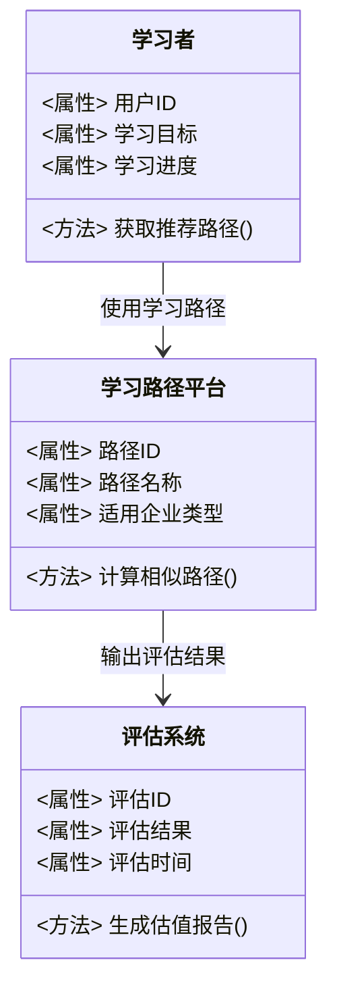
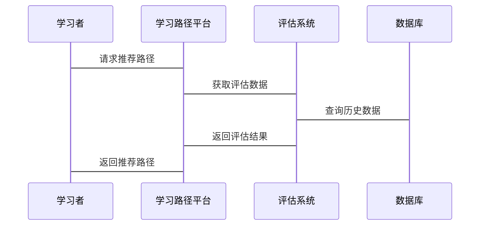

                 


# 企业估值中的AI驱动的个性化学习路径平台评估

## 关键词：企业估值，AI驱动，个性化学习路径，协同过滤，神经网络，企业价值评估

## 摘要：本文探讨了如何利用AI技术构建个性化学习路径平台，以辅助企业估值过程。通过分析学习者的行为数据和企业特征，结合协同过滤和深度学习算法，为学习者定制个性化学习路径，从而提升企业估值的准确性和效率。文章详细阐述了算法原理、系统架构、项目实现及最佳实践，为相关领域的研究和应用提供参考。

## 第三章: 算法原理讲解

### 3.1 协同过滤推荐系统

协同过滤推荐系统是一种基于用户行为数据的推荐方法，通过分析用户之间的相似性或物品之间的相似性，为用户推荐个性化的内容或路径。在企业估值场景中，协同过滤可以用于推荐适合学习者的学习路径。

#### 3.1.1 协同过滤的基本原理
协同过滤基于“相似的人推荐相似的东西”的思想，主要分为基于用户的协同过滤（User-based Collaborative Filtering, UCF）和基于物品的协同过滤（Item-based Collaborative Filtering, ICF）。

##### 3.1.1.1 基于用户的协同过滤（UCF）
UCF通过计算用户之间的相似性，将相似用户的评分或行为进行加权平均，推荐目标用户可能感兴趣的内容。例如，如果用户A和用户B非常相似，且用户B对某个学习路径给予高度评价，那么用户A也可能会喜欢这个路径。

##### 3.1.1.2 基于物品的协同过滤（ICF）
ICF计算物品之间的相似性，基于用户已有的评分，推断用户可能喜欢的其他物品。例如，如果用户A喜欢路径P，而路径P与路径Q高度相似，那么用户A也可能喜欢路径Q。

#### 3.1.2 协同过滤的优缺点
- **优点**：实现简单，计算速度快，适合实时推荐。
- **缺点**：在数据稀疏性较高的情况下，推荐效果不佳；无法捕捉复杂的用户偏好。

#### 3.1.3 协同过滤的数学公式
基于用户的协同过滤可以通过余弦相似度或皮尔逊相关系数来计算用户相似度。例如，使用余弦相似度的公式为：
$$
\text{sim}(u, v) = \frac{\sum_{i=1}^{n} u_i v_i}{\sqrt{\sum_{i=1}^{n} u_i^2} \sqrt{\sum_{i=1}^{n} v_i^2}}
$$

其中，$u$和$v$分别表示用户u和v的评分向量，$n$是共同评分的物品数量。

### 3.2 基于深度学习的模型

随着深度学习的兴起，基于神经网络的推荐系统逐渐成为研究的热点。神经协同过滤（Neural Collaborative Filtering, NCF）是一种结合了传统协同过滤和深度学习的模型，能够更好地捕捉用户和物品的复杂关系。

#### 3.2.1 神经协同过滤（NCF）
NCF通过构建嵌入层、前馈神经网络和预测层，将用户和物品的交互表示为非线性关系。NCF的结构包括以下几部分：
- **嵌入层**：将用户和物品的ID映射为低维向量。
- **前馈网络**：对用户和物品的嵌入向量进行非线性变换，捕捉复杂的交互模式。
- **预测层**：输出预测的评分或概率。

#### 3.2.2 Transformer结构
Transformer是一种基于注意力机制的模型，在自然语言处理领域取得了巨大成功。在推荐系统中，可以使用Transformer来建模用户和物品的长期依赖关系，捕捉更丰富的语义信息。

#### 3.2.3 基于深度学习的数学模型
NCF的数学模型可以表示为：
$$
p(u, i) = g(e_u, e_i)
$$
其中，$e_u$和$e_i$分别是用户u和物品i的嵌入向量，$g$是一个非线性的变换函数，可以是多层感知机（MLP）或自注意力机制。

### 3.3 算法实现与案例分析

#### 3.3.1 环境安装
为了实现基于协同过滤和深度学习的推荐系统，我们需要安装以下工具：
- Python
- TensorFlow或Keras
- scikit-learn

#### 3.3.2 代码实现
以下是协同过滤和深度学习模型的代码示例：

##### 协同过滤实现
```python
from sklearn.metrics.pairwise import cosine_similarity

# 假设我们有一个评分矩阵matrix，其中matrix[i][j]表示用户i对路径j的评分
# 计算用户i和用户k的余弦相似度
similarity = cosine_similarity(matrix)
```

##### 神经协同过滤实现
```python
import tensorflow as tf
from tensorflow.keras import layers

# 定义NCF模型
class NCF(tf.keras.Model):
    def __init__(self, user_num, item_num, embedding_dim):
        super(NCF, self).__init__()
        self.user_embedding = layers.Embedding(user_num, embedding_dim)
        self.item_embedding = layers.Embedding(item_num, embedding_dim)
        self.dense = layers.Dense(1, activation='sigmoid')
    
    def call(self, inputs):
        user_id, item_id = inputs
        user_emb = self.user_embedding(user_id)
        item_emb = self.item_embedding(item_id)
        concat = tf.concat([user_emb, item_emb], axis=-1)
        output = self.dense(concat)
        return output

# 初始化模型
model = NCF(user_num=1000, item_num=1000, embedding_dim=32)
# 编译模型
model.compile(optimizer='adam', loss='binary_crossentropy', metrics=['accuracy'])
```

#### 3.3.3 案例分析
假设我们有一个包含1000个用户和1000个学习路径的数据集，其中每个用户对路径的评分在0到1之间。我们可以使用上述代码训练一个NCF模型，并在测试集上评估其性能。

##### 训练过程
```python
# 拆分训练集和测试集
train_matrix = ...  # 训练集
test_matrix = ...    # 测试集

# 训练模型
model.fit([train_user_ids, train_item_ids], train_labels, epochs=10, batch_size=32, validation_data=([test_user_ids, test_item_ids], test_labels))
```

##### 模型评估
```python
# 预测结果
 predictions = model.predict([test_user_ids, test_item_ids])
# 计算准确率
 accuracy = sum(predictions == test_labels) / len(test_labels)
print(f'准确率: {accuracy}')
```

### 3.4 算法总结
通过上述算法，我们可以为每个学习者定制个性化的学习路径，从而提高企业估值的准确性和效率。协同过滤方法简单易实现，但在数据稀疏性较高的情况下效果不佳；深度学习模型能够捕捉复杂的用户和物品关系，但在计算资源和模型复杂度上要求较高。

---

## 第四章: 系统分析与架构设计方案

### 4.1 问题场景介绍
为了实现AI驱动的个性化学习路径平台，我们需要设计一个能够处理大规模数据、支持实时推荐的系统架构。

### 4.2 项目介绍
本项目旨在构建一个支持企业估值的个性化学习路径平台，利用AI技术提升学习者的学习效率和企业估值的准确性。

### 4.3 系统功能设计
系统功能包括用户注册与登录、学习路径推荐、企业估值报告生成等。

#### 4.3.1 领域模型类图


### 4.4 系统架构设计
系统架构采用前后端分离的模式，前端负责用户交互，后端负责业务逻辑和数据处理。

#### 4.4.1 系统架构图


### 4.5 系统接口设计
系统接口包括用户登录、获取推荐路径、提交评估结果等。

#### 4.5.1 接口交互流程图


---

## 第五章: 项目实战

### 5.1 环境安装
安装必要的开发工具和库，如Python、TensorFlow、Flask等。

### 5.2 系统核心实现源代码
以下是系统的核心代码示例：

#### 5.2.1 后端代码
```python
from flask import Flask, request, jsonify
import tensorflow as tf
import numpy as np

app = Flask(__name__)

# 加载模型
model = load_model('model.h5')

@app.route('/recommend', methods=['POST'])
def recommend():
    user_id = request.json['user_id']
    # 获取推荐路径
    recommendations = model.recommend(user_id)
    return jsonify({'recommendations': recommendations})

if __name__ == '__main__':
    app.run(debug=True)
```

#### 5.2.2 前端代码
```html
<!DOCTYPE html>
<html>
<head>
    <title>个性化学习路径推荐</title>
</head>
<body>
    <h1>推荐学习路径</h1>
    <input type="text" id="user_id" placeholder="请输入用户ID">
    <button onclick="recommend()">获取推荐</button>
    <div id="result"></div>
    <script>
        function recommend() {
            var user_id = document.getElementById('user_id').value;
            fetch('/recommend', {
                method: 'POST',
                headers: {
                    'Content-Type': 'application/json'
                },
                body: JSON.stringify({ user_id: user_id })
            })
            .then(response => response.json())
            .then(data => {
                document.getElementById('result').innerHTML = JSON.stringify(data.recommendations);
            });
        }
    </script>
</body>
</html>
```

### 5.3 代码应用解读与分析
上述代码实现了后端的推荐接口和前端的用户交互界面，通过调用预训练的模型为用户推荐个性化学习路径。

### 5.4 实际案例分析
以一个具体的企业为例，分析如何利用该平台进行个性化学习路径推荐和企业估值。

### 5.5 项目小结
通过本项目的实现，我们展示了如何利用AI技术构建个性化学习路径平台，提升企业估值的效率和准确性。

---

## 第六章: 最佳实践

### 6.1 小结
本文详细阐述了如何利用AI驱动的个性化学习路径平台进行企业估值，介绍了协同过滤和深度学习模型的实现方法，并通过项目实战展示了系统的具体实现。

### 6.2 注意事项
- 数据质量是模型性能的关键，需要确保数据的完整性和准确性。
- 在实际应用中，需要考虑模型的可解释性和实时性。
- 定期更新模型，以适应用户行为和企业需求的变化。

### 6.3 拓展阅读
- [深度学习推荐系统](https://zh.wikipedia.org/wiki/深度学习推荐系统)
- [协同过滤算法](https://zh.wikipedia.org/wiki/协同过滤)

---

通过本文的探讨，我们希望为AI驱动的个性化学习路径平台在企业估值中的应用提供理论支持和实践指导，为未来的进一步研究和应用奠定基础。

