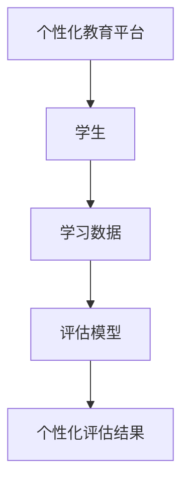
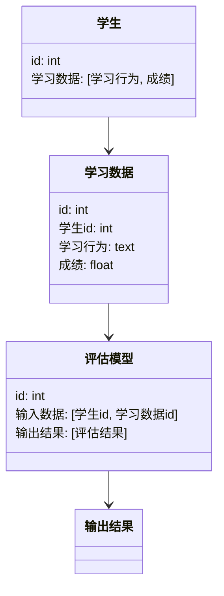
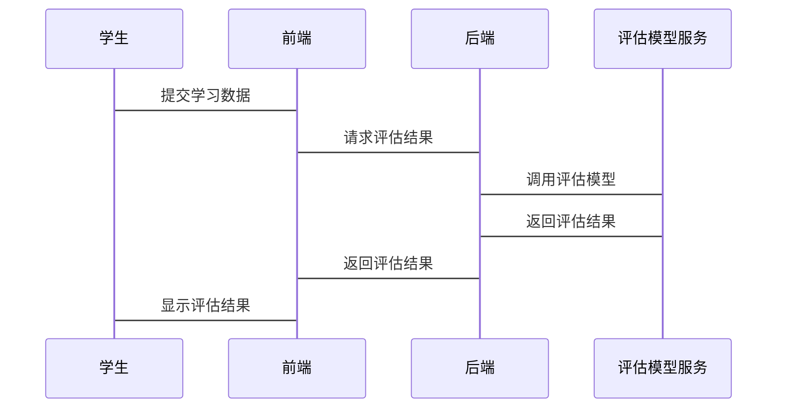

                 


# 企业估值中的AI驱动的个性化教育平台评估

> 关键词：企业估值，人工智能，个性化教育，教育平台，评估模型

> 摘要：本文深入探讨了AI技术在个性化教育平台评估中的应用，分析了传统估值方法的局限性，提出了基于机器学习和深度学习的AI驱动评估模型，并通过实际案例展示了如何利用这些模型进行教育平台的价值评估。

---

## 第一部分: 背景与问题背景

### 第1章: 背景与问题背景

#### 1.1 教育行业的现状与挑战

##### 1.1.1 传统教育评估的局限性
传统教育评估主要依赖教师的主观判断和标准化考试成绩，这种方式难以全面反映学生的学习能力和潜力。此外，评估结果往往忽视个体差异，无法满足个性化教育的需求。

##### 1.1.2 个性化教育的需求增长
随着教育技术的发展，个性化教育逐渐成为趋势。学生的学习需求和能力各不相同，传统的评估方法难以满足这种多样化的需求。

##### 1.1.3 AI技术在教育领域的应用潜力
AI技术可以通过分析海量数据，为每个学生提供个性化的学习建议和评估结果。这种技术能够帮助教育机构更准确地评估学生的潜力和能力。

#### 1.2 企业估值中的教育平台评估问题

##### 1.2.1 个性化教育平台的核心价值
个性化教育平台的核心价值在于其能够提供定制化的学习方案和评估结果，从而提高学生的学习效果和教育机构的竞争力。

##### 1.2.2 传统估值方法的不足
传统估值方法通常依赖财务指标和市场表现，难以全面评估教育平台的核心竞争力和潜在价值。

##### 1.2.3 AI驱动的个性化评估优势
AI驱动的评估方法能够基于学生的学习数据和行为分析，提供更精准的评估结果，帮助教育机构更好地理解学生的需求和潜力。

#### 1.3 问题描述与目标

##### 1.3.1 个性化教育平台评估的核心问题
个性化教育平台的评估需要考虑学生的学习能力、潜力、学习行为等多个因素，传统方法难以全面覆盖这些因素。

##### 1.3.2 问题解决的思路与方法
通过AI技术，我们可以构建一个基于机器学习和深度学习的评估模型，利用学生的学习数据和行为数据，提供个性化的评估结果。

##### 1.3.3 本研究的目标与意义
本研究的目标是通过AI技术，构建一个高效、精准的个性化教育平台评估模型，帮助教育机构和投资者更好地评估教育平台的价值。

---

## 第二部分: 核心概念与联系

### 第2章: 核心概念与联系

#### 2.1 个性化教育平台的定义与属性

##### 2.1.1 个性化教育平台的定义
个性化教育平台是指基于学生的学习数据和行为数据，提供定制化的学习方案和评估结果的教育平台。

##### 2.1.2 核心属性对比分析
| 属性 | 描述 |
|------|------|
| 定制化 | 提供个性化学习方案 |
| 数据驱动 | 基于学习数据进行评估 |
| 实时性 | 及时反馈学习结果 |
| 可扩展性 | 支持大规模学习者 |

##### 2.1.3 实体关系图（ER图）

```mermaid
erd
  学生
    id: int
    学习数据
      id: int
      学生id: int
      学习行为: text
      成绩: float
  教育平台
    id: int
    平台属性
      用户数量: int
      平台功能: text
  评估模型
    id: int
    输入数据
      学生id: int
      学习数据id: int
    输出结果
      评估结果: text
```

#### 2.2 AI驱动的评估模型原理

##### 2.2.1 机器学习在教育评估中的应用
机器学习可以通过监督学习和无监督学习，从学生的学习数据中提取特征，构建预测模型。

##### 2.2.2 深度学习模型的特征提取能力
深度学习模型（如神经网络）能够从非结构化数据中提取复杂的特征，帮助评估模型更准确地预测学生的学习潜力。

##### 2.2.3 混合模型的优势与挑战
混合模型结合了机器学习和深度学习的优势，能够更好地处理不同类型的数据，但其复杂性和计算成本较高。

#### 2.3 核心概念关系图（Mermaid流程图）



---

## 第三部分: 算法原理与数学模型

### 第3章: 算法原理与数学模型

#### 3.1 个性化教育评估算法概述

##### 3.1.1 监督学习与非监督学习的对比
- **监督学习**：基于标签数据进行模型训练，适用于预测任务。
- **非监督学习**：基于无标签数据进行聚类分析，适用于发现数据中的隐藏结构。

##### 3.1.2 深度学习模型的适用场景
深度学习模型适用于处理非结构化数据（如文本、图像）和复杂特征提取任务。

##### 3.1.3 混合模型的优势
混合模型结合了多种算法的优势，能够提高模型的准确性和泛化能力。

#### 3.2 算法原理详细讲解

##### 3.2.1 机器学习模型的训练流程
1. 数据预处理：清洗和归一化数据。
2. 模型训练：使用训练数据训练模型。
3. 模型评估：通过验证集评估模型性能。
4. 模型优化：调整超参数和模型结构。

##### 3.2.2 深度学习模型的特征提取过程
1. 输入数据：如学生的学习行为数据。
2. 网络层：提取数据的高层次特征。
3. 输出结果：如学生的学习潜力评分。

##### 3.2.3 混合模型的融合策略
1. 将多个模型的输出结果进行加权平均。
2. 根据模型的性能自动调整权重。

#### 3.3 数学模型与公式

##### 3.3.1 损失函数
$$ L = \frac{1}{n}\sum_{i=1}^{n}(y_i - \hat{y_i})^2 $$

##### 3.3.2 优化算法
$$ \theta_{new} = \theta_{old} - \eta \cdot \frac{\partial L}{\partial \theta} $$

---

## 第四部分: 系统分析与架构设计

### 第4章: 系统分析与架构设计

#### 4.1 问题场景介绍

##### 4.1.1 教育平台的评估需求
教育平台需要对学生的学习能力、潜力和行为进行评估。

##### 4.1.2 评估系统的功能需求
- 数据采集：收集学生的学习数据。
- 数据分析：利用AI技术进行评估。
- 结果输出：生成个性化评估报告。

#### 4.2 系统功能设计

##### 4.2.1 领域模型（Mermaid类图）



#### 4.3 系统架构设计

##### 4.3.1 系统架构图（Mermaid架构图）


#### 4.4 系统接口设计

##### 4.4.1 接口设计
- **输入接口**：接收学生的学习数据。
- **输出接口**：返回个性化的评估结果。

#### 4.5 系统交互流程

##### 4.5.1 交互流程图（Mermaid序列图）



---

## 第五部分: 项目实战与案例分析

### 第5章: 项目实战与案例分析

#### 5.1 项目介绍

##### 5.1.1 项目背景
本项目旨在开发一个基于AI的个性化教育平台评估系统。

##### 5.1.2 项目目标
构建一个高效、精准的评估模型，能够基于学生的学习数据提供个性化的评估结果。

#### 5.2 核心代码实现

##### 5.2.1 环境安装
```bash
pip install numpy scikit-learn tensorflow
```

##### 5.2.2 核心代码

```python
import numpy as np
from sklearn.model_selection import train_test_split
from tensorflow.keras import layers, models

# 数据预处理
X = np.array([...])  # 特征数据
y = np.array([...])  # 标签数据

X_train, X_test, y_train, y_test = train_test_split(X, y, test_size=0.2)

# 模型构建
model = models.Sequential()
model.add(layers.Dense(64, activation='relu', input_shape=(X_train.shape[1],)))
model.add(layers.Dense(1, activation='sigmoid'))

model.compile(optimizer='adam', loss='binary_crossentropy', metrics=['accuracy'])

# 模型训练
model.fit(X_train, y_train, epochs=10, batch_size=32, validation_data=(X_test, y_test))
```

##### 5.2.3 代码解读
- **数据预处理**：将数据分为训练集和测试集。
- **模型构建**：构建一个简单的神经网络模型。
- **模型训练**：训练模型并评估其性能。

#### 5.3 案例分析

##### 5.3.1 案例背景
假设我们有一个包含1000名学生的数据集，每个学生的学习数据包括学习时间、作业完成情况和考试成绩。

##### 5.3.2 案例分析
通过模型训练，我们可以预测每个学生的学习潜力，并生成个性化的评估报告。

#### 5.4 小结

---

## 第六部分: 最佳实践与小结

### 第6章: 最佳实践与小结

#### 6.1 最佳实践

##### 6.1.1 数据质量的重要性
确保数据的准确性和完整性，是模型性能的关键。

##### 6.1.2 模型选择的策略
根据具体任务选择合适的算法和模型。

##### 6.1.3 模型优化技巧
通过调整超参数和优化算法，可以提高模型的性能。

#### 6.2 小结

##### 6.2.1 总结
本文通过AI技术，提出了一个高效的个性化教育平台评估模型，能够基于学生的学习数据提供精准的评估结果。

##### 6.2.2 注意事项
在实际应用中，需要注意数据隐私和模型的可解释性。

##### 6.2.3 拓展阅读
建议读者进一步学习机器学习和深度学习的相关知识，深入了解模型的优化和调优技巧。

---

## 附录

### 附录A: 术语解释

| 术语 | 解释 |
|------|------|
| AI | 人工智能 |
| 个性化教育 | 基于学生个体需求定制的学习方案 |
| 评估模型 | 基于AI技术构建的评估系统 |

### 附录B: 工具与库

| 工具 | 功能 |
|------|------|
| TensorFlow | 深度学习框架 |
| Scikit-learn | 机器学习库 |
| Mermaid | 图表绘制工具 |

### 附录C: 参考文献

1. LeCun, Y., Bengio, Y., & Hinton, G. (2015). Deep learning. Nature, 521(7555), 436-444.
2. Bishop, C. M. (2006). Pattern recognition and machine learning. Springer.

---

通过以上内容，您可以开始撰写完整的文章。每个章节的内容需要详细展开，确保逻辑清晰，结构紧凑，并结合实际案例和图表进行说明。

