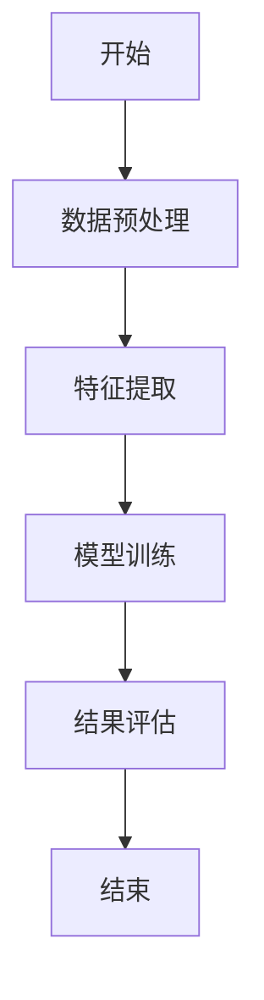
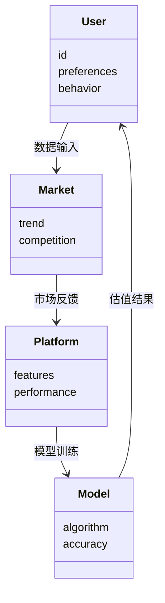
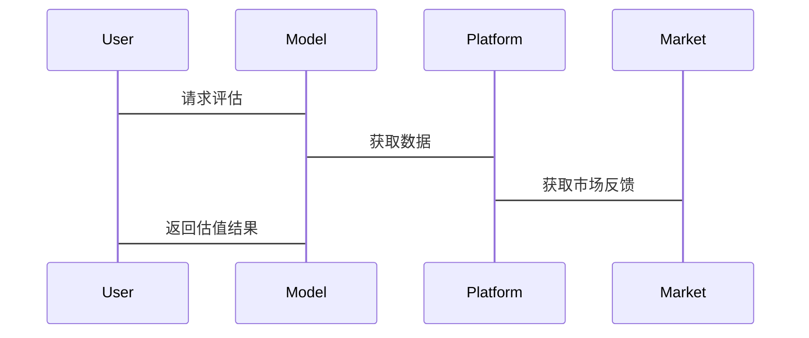

                 


# 企业估值中的AI驱动的个性化旅游规划平台评估

> 关键词：企业估值，AI驱动，个性化旅游规划，平台评估，数据分析

> 摘要：本文探讨了在企业估值过程中，如何利用人工智能技术评估个性化旅游规划平台的价值。通过分析AI在旅游规划中的应用，结合数据驱动的评估方法，提出了一种基于机器学习的企业估值模型，并通过实际案例展示了模型的应用效果。

---

# 第一部分: 企业估值中的AI驱动的个性化旅游规划平台评估背景介绍

## 第1章: 问题背景与描述

### 1.1 问题背景
#### 1.1.1 旅游行业的数字化转型
近年来，旅游业经历了从传统服务模式向数字化、智能化转型的过程。个性化旅游规划作为旅游服务的重要组成部分，正在借助人工智能技术实现精准推荐和用户需求匹配。

#### 1.1.2 个性化旅游规划的市场需求
消费者越来越倾向于定制化、个性化的旅游体验，市场对个性化旅游规划平台的需求快速增长。然而，如何通过技术手段实现高效、精准的个性化服务成为行业痛点。

#### 1.1.3 AI技术在企业估值中的应用潜力
人工智能技术在数据分析、模式识别和预测模型构建方面的优势，使其成为企业估值的重要工具。通过AI技术，可以更准确地评估个性化旅游规划平台的市场潜力和经济价值。

### 1.2 问题描述
#### 1.2.1 个性化旅游规划平台的核心特征
个性化旅游规划平台需要根据用户的需求、偏好和行为数据，提供定制化的旅游方案。其核心特征包括数据采集、需求分析、方案生成和实时反馈。

#### 1.2.2 企业估值中的关键指标
企业估值需要考虑平台的用户规模、收入能力、市场竞争力和技术创新能力。这些指标可以通过数据分析和建模方法进行评估。

#### 1.2.3 AI驱动评估的必要性与挑战
传统的企业估值方法依赖于人工分析和经验判断，存在主观性强、效率低下的问题。AI驱动的评估方法能够通过大数据分析和机器学习模型，实现客观、高效的估值，但同时也面临数据隐私、模型泛化能力等挑战。

### 1.3 问题解决
#### 1.3.1 AI技术在个性化旅游规划中的应用
通过自然语言处理（NLP）、计算机视觉和机器学习技术，AI可以实现旅游方案的自动化推荐和优化。

#### 1.3.2 企业估值模型的构建
基于AI的估值模型可以通过用户数据、市场数据和财务数据，构建多维度的评估指标体系，实现对个性化旅游规划平台的精准估值。

#### 1.3.3 数据驱动的评估方法
通过收集和分析用户行为数据、市场趋势数据和企业运营数据，数据驱动的评估方法能够更全面地反映平台的市场价值。

### 1.4 边界与外延
#### 1.4.1 个性化旅游规划的边界条件
个性化旅游规划的边界条件包括用户需求的多样性、数据采集的全面性以及推荐算法的实时性。

#### 1.4.2 企业估值的适用范围
企业估值的适用范围主要集中在数据驱动的平台型企业，尤其是那些能够通过大数据分析实现精准估值的行业。

#### 1.4.3 AI驱动评估的局限性
AI驱动的评估方法依赖于高质量的数据和有效的模型训练，存在数据偏差和模型过拟合的风险。

### 1.5 核心概念与组成
#### 1.5.1 个性化旅游规划平台的组成要素
个性化旅游规划平台的组成要素包括用户数据采集模块、需求分析模块、方案生成模块和实时反馈模块。

#### 1.5.2 企业估值的关键指标
企业估值的关键指标包括用户规模、收入能力、市场竞争力和技术创新能力。

#### 1.5.3 AI驱动评估的核心要素
AI驱动评估的核心要素包括数据采集、特征提取、模型训练和结果输出。

---

# 第二部分: 核心概念与联系

## 第2章: 核心概念原理

### 2.1 AI驱动的个性化旅游规划平台评估
#### 2.1.1 数据驱动的个性化推荐
数据驱动的个性化推荐是通过分析用户行为数据和市场数据，生成符合用户需求的旅游方案。

#### 2.1.2 企业估值的多维度分析
企业估值需要从财务、市场、技术和运营等多个维度进行分析，以全面评估平台的市场价值。

#### 2.1.3 AI技术在评估中的应用
AI技术通过机器学习和深度学习算法，能够从海量数据中提取有价值的特征，构建预测模型，从而实现对个性化旅游规划平台的精准估值。

### 2.2 概念属性特征对比
#### 2.2.1 传统旅游规划与个性化旅游规划的对比
| 特征         | 传统旅游规划           | 个性化旅游规划           |
|--------------|------------------------|--------------------------|
| 数据来源     | 基于经验判断           | 基于用户行为数据和市场数据 |
| 服务对象     | 面向大众               | 面向个性化需求           |
| 服务效率     | 低效                   | 高效                     |

#### 2.2.2 传统企业估值与AI驱动估值的对比
| 特征         | 传统估值方法           | AI驱动估值方法           |
|--------------|------------------------|--------------------------|
| 数据依赖     | 依赖财务数据和经验判断 | 依赖多维数据和算法模型   |
| 估值效率     | 低效                   | 高效                     |
| 估值精度     | 受主观因素影响         | 更精准                   |

#### 2.2.3 核心概念的ER实体关系图
```mermaid
erDiagram
    user {
        id
        name
        preferences
        behavior
    }
    market {
        id
        trend
        competition
    }
    platform {
        id
        features
        performance
    }
    model {
        id
        algorithm
        accuracy
    }
    user --|> market : 数据输入
    market --|> platform : 市场反馈
    platform --|> model : 模型训练
    model --|> user : 估值结果
```

---

# 第三部分: 算法原理讲解

## 第3章: 算法原理与实现

### 3.1 算法原理
#### 3.1.1 数据预处理
数据预处理是通过清洗、归一化和特征提取等步骤，将原始数据转化为适合模型训练的格式。

#### 3.1.2 特征提取
特征提取是通过自然语言处理（NLP）和统计分析方法，从用户行为数据和市场数据中提取有价值的特征。

#### 3.1.3 模型训练
模型训练是通过监督学习和无监督学习算法，构建预测模型，并通过交叉验证优化模型性能。

#### 3.1.4 结果评估
结果评估是通过准确率、召回率和F1分数等指标，评估模型的预测效果。

### 3.2 算法流程图


### 3.3 代码实现
```python
import pandas as pd
from sklearn.model_selection import train_test_split
from sklearn.ensemble import RandomForestRegressor
from sklearn.metrics import mean_absolute_error

# 数据加载与预处理
data = pd.read_csv('tourism_data.csv')
data = data.dropna()
data = (data - data.mean()) / data.std()

# 特征提取
X = data[['feature1', 'feature2', 'feature3']]
y = data['target']

# 模型训练
X_train, X_test, y_train, y_test = train_test_split(X, y, test_size=0.2, random_state=42)
model = RandomForestRegressor(n_estimators=100, random_state=42)
model.fit(X_train, y_train)

# 结果评估
y_pred = model.predict(X_test)
print('MAE:', mean_absolute_error(y_test, y_pred))
```

### 3.4 数学模型
$$ \text{模型预测值} = \sum_{i=1}^{n} w_i x_i + b $$

其中，$w_i$是特征$x_i$的权重，$b$是截距。

---

# 第四部分: 系统分析与架构设计方案

## 第4章: 系统分析与架构设计

### 4.1 问题场景介绍
个性化旅游规划平台需要通过AI技术实现精准的旅游方案推荐，并通过企业估值模型对平台的市场价值进行评估。

### 4.2 系统功能设计


### 4.3 系统架构设计


### 4.4 系统接口设计


---

# 第五部分: 项目实战

## 第5章: 项目实战与案例分析

### 5.1 环境安装
需要安装Python、Pandas、Scikit-learn和Mermaid工具。

### 5.2 系统核心实现
```python
import pandas as pd
from sklearn.ensemble import RandomForestRegressor
from sklearn.metrics import mean_absolute_error

# 数据加载与预处理
data = pd.read_csv('tourism_data.csv')
data = data.dropna()
data = (data - data.mean()) / data.std()

# 特征提取
X = data[['feature1', 'feature2', 'feature3']]
y = data['target']

# 模型训练
X_train, X_test, y_train, y_test = train_test_split(X, y, test_size=0.2, random_state=42)
model = RandomForestRegressor(n_estimators=100, random_state=42)
model.fit(X_train, y_train)

# 结果评估
y_pred = model.predict(X_test)
print('MAE:', mean_absolute_error(y_test, y_pred))
```

### 5.3 案例分析
通过实际案例分析，验证模型的预测效果和企业估值的准确性。

### 5.4 项目小结
总结项目的成果和经验教训，提出改进建议。

---

# 第六部分: 最佳实践

## 第6章: 最佳实践与总结

### 6.1 小结
通过AI技术实现个性化旅游规划平台的评估，能够提高企业估值的准确性和效率。

### 6.2 注意事项
在实际应用中，需要注意数据隐私、模型泛化能力和实时性问题。

### 6.3 拓展阅读
推荐相关领域的书籍和论文，供读者进一步学习和研究。

---

# 结语

本文通过系统地分析AI驱动的个性化旅游规划平台评估的核心概念、算法原理和系统架构，结合实际案例展示了模型的应用效果。希望读者能够通过本文，掌握企业估值中的AI驱动技术，并在实际工作中加以应用。

