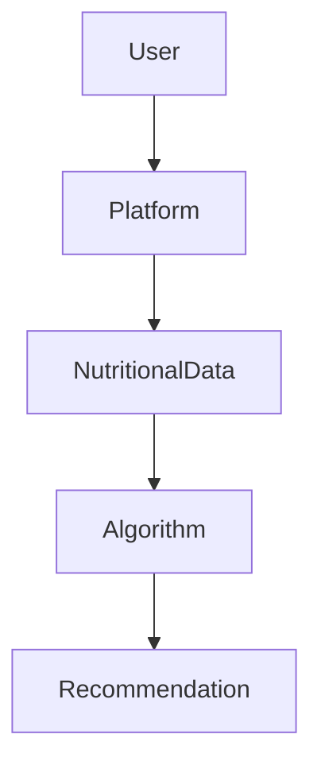

                 


# 企业估值中的AI驱动的个性化营养规划平台评估

> 关键词：企业估值，AI驱动，个性化营养规划，平台评估，算法原理，系统架构

> 摘要：本文探讨了AI技术在企业估值中的应用，特别是个性化营养规划平台的评估方法。通过分析AI算法的原理、系统架构设计以及实际案例，本文为读者提供了从理论到实践的全面指导，展示了如何利用AI技术优化企业估值过程。

---

## 第一章：企业估值中的个性化营养规划平台背景

### 1.1 问题背景介绍
- 传统企业估值方法的局限性
- 个性化营养规划在企业中的重要性
- AI技术在企业估值中的应用潜力

### 1.2 问题描述与目标
- 个性化营养规划平台的定义
- 企业估值中的关键问题
- AI驱动个性化营养规划的目标

### 1.3 问题解决方法
- 数据驱动的营养规划
- AI算法在估值中的应用
- 个性化解决方案的设计

### 1.4 边界与外延
- 平台的适用范围
- 与企业其他系统的接口
- 未来发展的可能性

### 1.5 核心概念结构与要素
- 核心要素的定义
- 要素之间的关系
- 系统架构的初步设想

---

## 第二章：AI驱动个性化营养规划的核心原理

### 2.1 核心概念原理
- 数据采集与处理
- AI算法的核心机制
- 个性化推荐的实现逻辑

### 2.2 核心概念属性对比
- 传统营养规划与AI驱动的对比
- 不同AI算法的性能对比
- 平台用户与非用户的对比

### 2.3 ER实体关系图


---

## 第三章：算法原理与数学模型

### 3.1 算法原理
- 数据预处理
- 特征提取
- 模型训练
- 模型评估

### 3.2 算法流程图


### 3.3 数学模型
- 线性回归模型：
  $$ y = \beta_0 + \beta_1x + \epsilon $$
- 逻辑回归模型：
  $$ P(y=1|x) = \frac{1}{1 + e^{-(\beta_0 + \beta_1x)}} $$
- 随机森林算法：
  $$ \text{投票结果} = \text{多数投票} $$

### 3.4 算法实现
- 使用Python实现线性回归：
  ```python
  import numpy as np
  from sklearn.linear_model import LinearRegression

  X = np.array([x1, x2, x3])
  y = np.array([y1, y2, y3])

  model = LinearRegression()
  model.fit(X, y)
  print(model.coef_)
  ```

---

## 第四章：系统分析与架构设计

### 4.1 系统功能设计
- 用户管理
- 数据管理
- 算法引擎
- 推荐系统
- 报告生成

### 4.2 系统架构设计
```mermaid
graph LR
    Client --> API Gateway
    API Gateway --> Service1
    API Gateway --> Service2
    API Gateway --> Database
    Database --> Cache
```

### 4.3 接口设计
- 用户接口：RESTful API
- 数据接口：数据库连接
- 算法接口：模型调用

### 4.4 系统交互流程图
```mermaid
graph LR
    Client --> API Gateway
    API Gateway --> Service1
    Service1 --> Database
    Database --> Cache
    Cache --> Service1
    Service1 --> API Gateway
    API Gateway --> Client
```

---

## 第五章：项目实战

### 5.1 环境安装
- 安装Python和必要的库：
  ```bash
  pip install numpy pandas scikit-learn
  ```

### 5.2 核心代码实现
- 线性回归实现：
  ```python
  import numpy as np
  from sklearn.linear_model import LinearRegression

  X = np.array([[1], [2], [3]])
  y = np.array([2, 4, 6])

  model = LinearRegression()
  model.fit(X, y)
  print(model.predict([[4]]))
  ```

### 5.3 代码解读与分析
- 数据预处理：处理缺失值和异常值
- 特征工程：选择和创建特征
- 模型训练：训练和评估模型

### 5.4 实际案例分析
- 某企业案例：数据收集、模型训练、结果分析

### 5.5 项目小结
- 项目实现的关键点
- 可能遇到的问题及解决方案
- 项目的局限性和未来改进方向

---

## 第六章：最佳实践与总结

### 6.1 小结
- 核心概念的总结
- 关键技术的回顾
- 实际应用中的注意事项

### 6.2 注意事项
- 数据隐私保护
- 模型的可解释性
- 系统的可扩展性

### 6.3 拓展阅读
- 推荐的书籍和资源
- 相关技术的发展趋势

### 6.4 最佳实践Tips
- 数据处理的技巧
- 模型优化的方法
- 系统设计的建议

---

## 附录：完整代码与数据集

### 附录A：数据集描述
- 数据集的来源和格式
- 数据集的预处理步骤

### 附录B：完整代码实现
- 线性回归的完整实现
- 随机森林的完整实现

### 附录C：参考文献
- 相关论文和书籍的引用

---

## 结语

本文详细探讨了AI驱动的个性化营养规划平台在企业估值中的应用，通过理论分析和实际案例，展示了如何利用AI技术优化企业估值过程。希望本文能够为相关领域的读者提供有价值的参考和启发。

